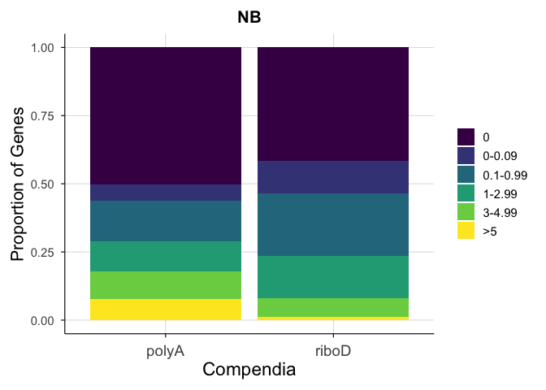
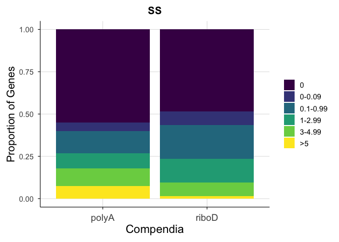
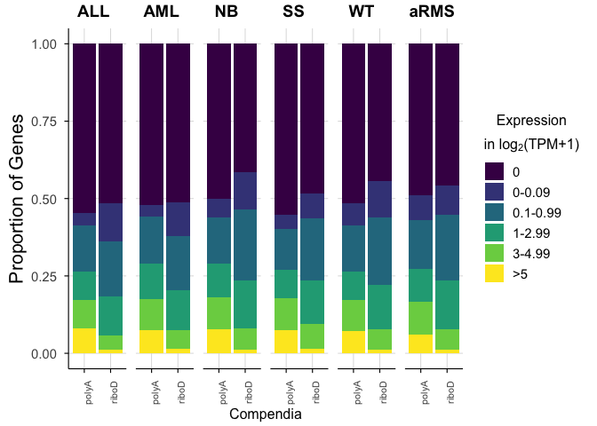

# Fig_1C


## Fig 1C

Stacked bar chart showing the proportion of unique genes expressed at
different log2(TPM+1) levels.

``` r
library(tidyverse)
```

    ── Attaching core tidyverse packages ──────────────────────── tidyverse 2.0.0 ──
    ✔ dplyr     1.1.4     ✔ readr     2.1.5
    ✔ forcats   1.0.1     ✔ stringr   1.5.2
    ✔ ggplot2   4.0.0     ✔ tibble    3.3.0
    ✔ lubridate 1.9.4     ✔ tidyr     1.3.1
    ✔ purrr     1.1.0     
    ── Conflicts ────────────────────────────────────────── tidyverse_conflicts() ──
    ✖ dplyr::filter() masks stats::filter()
    ✖ dplyr::lag()    masks stats::lag()
    ℹ Use the conflicted package (<http://conflicted.r-lib.org/>) to force all conflicts to become errors

``` r
library(patchwork)
library(cowplot)
```


    Attaching package: 'cowplot'

    The following object is masked from 'package:patchwork':

        align_plots

    The following object is masked from 'package:lubridate':

        stamp

``` r
# expression files
SS_polyA_log2tpm1 <- read_tsv("../../input_data/sample_selection/SS_polyA_log2tpm1.tsv")
```

    Rows: 60498 Columns: 16
    ── Column specification ────────────────────────────────────────────────────────
    Delimiter: "\t"
    chr  (1): Gene
    dbl (15): THR39_1373_S01, TCGA-WK-A8XT-01, TH40_2281_S01, THR39_1375_S01, TH...

    ℹ Use `spec()` to retrieve the full column specification for this data.
    ℹ Specify the column types or set `show_col_types = FALSE` to quiet this message.

``` r
SS_riboD_log2tpm1 <- read_tsv("../../input_data/sample_selection/SS_riboD_log2tpm1.tsv")
```

    Rows: 60498 Columns: 16
    ── Column specification ────────────────────────────────────────────────────────
    Delimiter: "\t"
    chr  (1): Gene
    dbl (15): THR51_4556_S01, THR51_4558_S01, THR51_4554_S01, THR24_3992_S01, TH...

    ℹ Use `spec()` to retrieve the full column specification for this data.
    ℹ Specify the column types or set `show_col_types = FALSE` to quiet this message.

``` r
aRMS_polyA_log2tpm1 <- read_tsv("../../input_data/sample_selection/aRMS_polyA_log2tpm1.tsv")
```

    Rows: 60498 Columns: 16
    ── Column specification ────────────────────────────────────────────────────────
    Delimiter: "\t"
    chr  (1): Gene
    dbl (15): THR29_0788_S01, THR29_0775_S01, THR29_0757_S01, THR29_0762_S01, TH...

    ℹ Use `spec()` to retrieve the full column specification for this data.
    ℹ Specify the column types or set `show_col_types = FALSE` to quiet this message.

``` r
aRMS_riboD_log2tpm1 <- read_tsv("../../input_data/sample_selection/aRMS_riboD_log2tpm1.tsv")
```

    Rows: 60498 Columns: 16
    ── Column specification ────────────────────────────────────────────────────────
    Delimiter: "\t"
    chr  (1): Gene
    dbl (15): THR24_3244_S01, THR24_3371_S01, THR24_3181_S01, THR24_3178_S01, TH...

    ℹ Use `spec()` to retrieve the full column specification for this data.
    ℹ Specify the column types or set `show_col_types = FALSE` to quiet this message.

``` r
WT_polyA_log2tpm1 <- read_tsv("../../input_data/sample_selection/WT_polyA_log2tpm1.tsv")
```

    Rows: 60498 Columns: 16
    ── Column specification ────────────────────────────────────────────────────────
    Delimiter: "\t"
    chr  (1): Gene
    dbl (15): TARGET-50-PAJNCZ-01, TARGET-50-PAEBXA-01, TARGET-50-PALERC-01, TAR...

    ℹ Use `spec()` to retrieve the full column specification for this data.
    ℹ Specify the column types or set `show_col_types = FALSE` to quiet this message.

``` r
WT_riboD_log2tpm1 <- read_tsv("../../input_data/sample_selection/WT_riboD_log2tpm1.tsv")
```

    Rows: 60498 Columns: 16
    ── Column specification ────────────────────────────────────────────────────────
    Delimiter: "\t"
    chr  (1): Gene
    dbl (15): THR24_3218_S01, THR24_4194_S01, THR24_4284_S01, THR24_4369_S01, TH...

    ℹ Use `spec()` to retrieve the full column specification for this data.
    ℹ Specify the column types or set `show_col_types = FALSE` to quiet this message.

``` r
NB_polyA_log2tpm1 <- read_tsv("../../input_data/sample_selection/NB_polyA_log2tpm1.tsv")
```

    Rows: 60498 Columns: 16
    ── Column specification ────────────────────────────────────────────────────────
    Delimiter: "\t"
    chr  (1): Gene
    dbl (15): TARGET-30-PASUML-01, TARGET-30-PASEGA-01, TARGET-30-PAPUAR-01, TAR...

    ℹ Use `spec()` to retrieve the full column specification for this data.
    ℹ Specify the column types or set `show_col_types = FALSE` to quiet this message.

``` r
NB_riboD_log2tpm1 <- read_tsv("../../input_data/sample_selection/NB_riboD_log2tpm1.tsv")
```

    Rows: 60498 Columns: 16
    ── Column specification ────────────────────────────────────────────────────────
    Delimiter: "\t"
    chr  (1): Gene
    dbl (15): THR24_4310_S01, THR24_2779_S01, THR24_3516_S01, THR24_4114_S01, TH...

    ℹ Use `spec()` to retrieve the full column specification for this data.
    ℹ Specify the column types or set `show_col_types = FALSE` to quiet this message.

``` r
ALL_polyA_log2tpm1 <- read_tsv("../../input_data/sample_selection/ALL_polyA_log2tpm1.tsv")
```

    Rows: 60498 Columns: 21
    ── Column specification ────────────────────────────────────────────────────────
    Delimiter: "\t"
    chr  (1): Gene
    dbl (20): THR24_1667_S01, THR24_2131_S01, THR24_2119_S01, THR24_1921_S01, TH...

    ℹ Use `spec()` to retrieve the full column specification for this data.
    ℹ Specify the column types or set `show_col_types = FALSE` to quiet this message.

``` r
ALL_riboD_log2tpm1 <- read_tsv("../../input_data/sample_selection/ALL_riboD_log2tpm1.tsv")
```

    Rows: 60498 Columns: 21
    ── Column specification ────────────────────────────────────────────────────────
    Delimiter: "\t"
    chr  (1): Gene
    dbl (20): THR24_4203_S01, THR24_3471_S01, THR24_3688_S01, THR24_4235_S01, TH...

    ℹ Use `spec()` to retrieve the full column specification for this data.
    ℹ Specify the column types or set `show_col_types = FALSE` to quiet this message.

``` r
AML_polyA_log2tpm1 <- read_tsv("../../input_data/sample_selection/AML_polyA_log2tpm1.tsv")
```

    Rows: 60498 Columns: 21
    ── Column specification ────────────────────────────────────────────────────────
    Delimiter: "\t"
    chr  (1): Gene
    dbl (20): TCGA-AB-2889-03, TCGA-AB-2844-03, TCGA-AB-2846-03, TCGA-AB-2881-03...

    ℹ Use `spec()` to retrieve the full column specification for this data.
    ℹ Specify the column types or set `show_col_types = FALSE` to quiet this message.

``` r
AML_riboD_log2tpm1 <- read_tsv("../../input_data/sample_selection/AML_riboD_log2tpm1.tsv")
```

    Rows: 60498 Columns: 21
    ── Column specification ────────────────────────────────────────────────────────
    Delimiter: "\t"
    chr  (1): Gene
    dbl (20): THR24_4050_S01, THR24_4356_S01, THR24_4265_S01, THR24_4263_S01, TH...

    ℹ Use `spec()` to retrieve the full column specification for this data.
    ℹ Specify the column types or set `show_col_types = FALSE` to quiet this message.

``` r
# sample ID files, from correlation_analysis
SS_polyA_list <- read_tsv("../../input_data/sample_selection/SS_polyA_list.tsv")
```

    Rows: 15 Columns: 2
    ── Column specification ────────────────────────────────────────────────────────
    Delimiter: "\t"
    chr (2): term, disease_and_prep

    ℹ Use `spec()` to retrieve the full column specification for this data.
    ℹ Specify the column types or set `show_col_types = FALSE` to quiet this message.

``` r
SS_riboD_list <- read_tsv("../../input_data/sample_selection/SS_riboD_list.tsv")
```

    Rows: 15 Columns: 2
    ── Column specification ────────────────────────────────────────────────────────
    Delimiter: "\t"
    chr (2): term, disease_and_prep

    ℹ Use `spec()` to retrieve the full column specification for this data.
    ℹ Specify the column types or set `show_col_types = FALSE` to quiet this message.

``` r
aRMS_polyA_list <- read_tsv("../../input_data/sample_selection/aRMS_polyA_list.tsv")
```

    Rows: 15 Columns: 2
    ── Column specification ────────────────────────────────────────────────────────
    Delimiter: "\t"
    chr (2): term, disease_and_prep

    ℹ Use `spec()` to retrieve the full column specification for this data.
    ℹ Specify the column types or set `show_col_types = FALSE` to quiet this message.

``` r
aRMS_riboD_list <- read_tsv("../../input_data/sample_selection/aRMS_riboD_list.tsv")
```

    Rows: 15 Columns: 2
    ── Column specification ────────────────────────────────────────────────────────
    Delimiter: "\t"
    chr (2): term, disease_and_prep

    ℹ Use `spec()` to retrieve the full column specification for this data.
    ℹ Specify the column types or set `show_col_types = FALSE` to quiet this message.

``` r
WT_polyA_list <- read_tsv("../../input_data/sample_selection/WT_polyA_list.tsv")
```

    Rows: 15 Columns: 2
    ── Column specification ────────────────────────────────────────────────────────
    Delimiter: "\t"
    chr (2): term, disease_and_prep

    ℹ Use `spec()` to retrieve the full column specification for this data.
    ℹ Specify the column types or set `show_col_types = FALSE` to quiet this message.

``` r
WT_riboD_list <- read_tsv("../../input_data/sample_selection/WT_riboD_list.tsv")
```

    Rows: 15 Columns: 2
    ── Column specification ────────────────────────────────────────────────────────
    Delimiter: "\t"
    chr (2): term, disease_and_prep

    ℹ Use `spec()` to retrieve the full column specification for this data.
    ℹ Specify the column types or set `show_col_types = FALSE` to quiet this message.

``` r
NB_polyA_list <- read_tsv("../../input_data/sample_selection/NB_polyA_list.tsv")
```

    Rows: 15 Columns: 2
    ── Column specification ────────────────────────────────────────────────────────
    Delimiter: "\t"
    chr (2): term, disease_and_prep

    ℹ Use `spec()` to retrieve the full column specification for this data.
    ℹ Specify the column types or set `show_col_types = FALSE` to quiet this message.

``` r
NB_riboD_list <- read_tsv("../../input_data/sample_selection/NB_riboD_list.tsv")
```

    Rows: 15 Columns: 2
    ── Column specification ────────────────────────────────────────────────────────
    Delimiter: "\t"
    chr (2): term, disease_and_prep

    ℹ Use `spec()` to retrieve the full column specification for this data.
    ℹ Specify the column types or set `show_col_types = FALSE` to quiet this message.

``` r
ALL_polyA_list <- read_tsv("../../input_data/sample_selection/ALL_polyA_list.tsv")
```

    Rows: 20 Columns: 2
    ── Column specification ────────────────────────────────────────────────────────
    Delimiter: "\t"
    chr (2): term, disease_and_prep

    ℹ Use `spec()` to retrieve the full column specification for this data.
    ℹ Specify the column types or set `show_col_types = FALSE` to quiet this message.

``` r
ALL_riboD_list <- read_tsv("../../input_data/sample_selection/ALL_riboD_list.tsv")
```

    Rows: 20 Columns: 2
    ── Column specification ────────────────────────────────────────────────────────
    Delimiter: "\t"
    chr (2): term, disease_and_prep

    ℹ Use `spec()` to retrieve the full column specification for this data.
    ℹ Specify the column types or set `show_col_types = FALSE` to quiet this message.

``` r
AML_polyA_list <- read_tsv("../../input_data/sample_selection/AML_polyA_list.tsv")
```

    Rows: 20 Columns: 2
    ── Column specification ────────────────────────────────────────────────────────
    Delimiter: "\t"
    chr (2): term, disease_and_prep

    ℹ Use `spec()` to retrieve the full column specification for this data.
    ℹ Specify the column types or set `show_col_types = FALSE` to quiet this message.

``` r
AML_riboD_list <- read_tsv("../../input_data/sample_selection/AML_riboD_list.tsv")
```

    Rows: 20 Columns: 2
    ── Column specification ────────────────────────────────────────────────────────
    Delimiter: "\t"
    chr (2): term, disease_and_prep

    ℹ Use `spec()` to retrieve the full column specification for this data.
    ℹ Specify the column types or set `show_col_types = FALSE` to quiet this message.

``` r
# Since "Gene" is a column name, it won't match the row names
# use values from the first column ("Gene") as row names
fix_SS_polyA_log2tpm1 <- SS_polyA_log2tpm1 %>%
  remove_rownames %>%
  column_to_rownames(var = "Gene")

fix_SS_riboD_log2tpm1 <- SS_riboD_log2tpm1 %>%
  remove_rownames %>%
  column_to_rownames(var = "Gene")

fix_aRMS_polyA_log2tpm1 <- aRMS_polyA_log2tpm1 %>%
  remove_rownames %>%
  column_to_rownames(var = "Gene")

fix_aRMS_riboD_log2tpm1 <- aRMS_riboD_log2tpm1 %>%
  remove_rownames %>%
  column_to_rownames(var = "Gene")

fix_WT_polyA_log2tpm1 <- WT_polyA_log2tpm1 %>%
  remove_rownames %>%
  column_to_rownames(var = "Gene")

fix_WT_riboD_log2tpm1 <- WT_riboD_log2tpm1 %>%
  remove_rownames %>%
  column_to_rownames(var = "Gene")

fix_NB_polyA_log2tpm1 <- NB_polyA_log2tpm1 %>%
  remove_rownames %>%
  column_to_rownames(var = "Gene")

fix_NB_riboD_log2tpm1 <- NB_riboD_log2tpm1 %>%
  remove_rownames %>%
  column_to_rownames(var = "Gene")

fix_ALL_polyA_log2tpm1 <- ALL_polyA_log2tpm1 %>%
  remove_rownames %>%
  column_to_rownames(var = "Gene")

fix_ALL_riboD_log2tpm1 <- ALL_riboD_log2tpm1 %>%
  remove_rownames %>%
  column_to_rownames(var = "Gene")

fix_AML_polyA_log2tpm1 <- AML_polyA_log2tpm1 %>%
  remove_rownames %>%
  column_to_rownames(var = "Gene")

fix_AML_riboD_log2tpm1 <- AML_riboD_log2tpm1 %>%
  remove_rownames %>%
  column_to_rownames(var = "Gene")

# use values from first column ("th_dataset_id") as row names
fix_SS_polyA_list <- SS_polyA_list %>%
  remove_rownames %>%
  column_to_rownames(var = "term")

fix_SS_riboD_list <- SS_riboD_list %>%
  remove_rownames %>%
  column_to_rownames(var = "term")

fix_aRMS_polyA_list <- aRMS_polyA_list %>%
  remove_rownames %>%
  column_to_rownames(var = "term")

fix_aRMS_riboD_list <- aRMS_riboD_list %>%
  remove_rownames %>%
  column_to_rownames(var = "term")

fix_WT_polyA_list <- WT_polyA_list %>%
  remove_rownames %>%
  column_to_rownames(var = "term")

fix_WT_riboD_list <- WT_riboD_list %>%
  remove_rownames %>%
  column_to_rownames(var = "term")

fix_NB_polyA_list <- NB_polyA_list %>%
  remove_rownames %>%
  column_to_rownames(var = "term")

fix_NB_riboD_list <- NB_riboD_list %>%
  remove_rownames %>%
  column_to_rownames(var = "term")

fix_ALL_polyA_list <- ALL_polyA_list %>%
  remove_rownames %>%
  column_to_rownames(var = "term")

fix_ALL_riboD_list <- ALL_riboD_list %>%
  remove_rownames %>%
  column_to_rownames(var = "term")

fix_AML_polyA_list <- AML_polyA_list %>%
  remove_rownames %>%
  column_to_rownames(var = "term")

fix_AML_riboD_list <- AML_riboD_list %>%
  remove_rownames %>%
  column_to_rownames(var = "term")
```

Defining log2(TPM+1) bins

``` r
expr_bins <- c(0, 1e-10, 0.09, 0.99, 2.99, 4.99, Inf)

expr_labels <- c("0","0-0.09", "0.1-0.99", "1-2.99", "3-4.99", ">5")
```

define gene medians function

``` r
compute_gene_medians <- function(df, disease, compendia) {
  df %>% 
    rowwise() %>% 
    mutate(median_expr = median(c_across(starts_with("T")), na.rm = TRUE)) %>%
    ungroup() %>%
    mutate(
      Disease = disease,
      Compendia = compendia
    ) %>%
    select(Gene, median_expr, Disease, Compendia)
}
```

Compute gene medians

``` r
SS_polyA_med   <- compute_gene_medians(SS_polyA_log2tpm1,   "SS",   "polyA")
SS_riboD_med   <- compute_gene_medians(SS_riboD_log2tpm1,   "SS",   "riboD")
aRMS_polyA_med <- compute_gene_medians(aRMS_polyA_log2tpm1, "aRMS", "polyA")
aRMS_riboD_med <- compute_gene_medians(aRMS_riboD_log2tpm1, "aRMS", "riboD")
WT_polyA_med   <- compute_gene_medians(WT_polyA_log2tpm1,   "WT",   "polyA")
WT_riboD_med   <- compute_gene_medians(WT_riboD_log2tpm1,   "WT",   "riboD")
NB_polyA_med   <- compute_gene_medians(NB_polyA_log2tpm1,   "NB",   "polyA")
NB_riboD_med   <- compute_gene_medians(NB_riboD_log2tpm1,   "NB",   "riboD")
AML_polyA_med   <- compute_gene_medians(AML_polyA_log2tpm1,   "AML",   "polyA")
AML_riboD_med   <- compute_gene_medians(AML_riboD_log2tpm1,   "AML",   "riboD")
ALL_polyA_med   <- compute_gene_medians(ALL_polyA_log2tpm1,   "ALL",   "polyA")
ALL_riboD_med  <- compute_gene_medians(ALL_riboD_log2tpm1,   "ALL",   "riboD")

all_medians <- bind_rows(
  SS_polyA_med, SS_riboD_med,
  aRMS_polyA_med, aRMS_riboD_med,
  WT_polyA_med, WT_riboD_med,
  NB_polyA_med, NB_riboD_med,  
  ALL_polyA_med, ALL_riboD_med,
  AML_riboD_med, AML_polyA_med
  )
```

Bin genes into expression thresholds

``` r
all_medians_bins <- all_medians %>%
  mutate(
    ExprBin = cut(
      median_expr,
      breaks = expr_bins,
      labels = expr_labels,
      include.lowest = TRUE
    )
  )

write_tsv(all_medians_bins, "../../output_data/Fig1C/all_medians_bins.tsv.gz")
```

Compute proportion of genes in each bin per lib prep

``` r
bin_prop <- all_medians_bins %>% 
  group_by(Compendia, ExprBin, Disease) %>%
  summarise(n = n(), .groups = "drop") %>%
  group_by(Disease, Compendia) %>%
  mutate(Proportion = n / sum(n))
write_tsv(bin_prop, "../../output_data/Fig1C/bin_prop.tsv.gz")
```

Custom color theme

``` r
theme_1C <- function(base_size = 14) {
  theme_minimal(base_size = base_size) +
    theme(
      legend.position = "right",
      legend.title = element_blank(),
      panel.grid.major = element_line(color = "grey85", linewidth = 0.3),
      panel.grid.minor = element_blank(),
      axis.line = element_line(color = "black", linewidth = 0.4),
      axis.ticks = element_line(color = "black", linewidth = 0.4),
      strip.text = element_text(face = "bold", size = base_size * 0.9),
      plot.title = element_text(face = "bold", size = base_size * 1.1, hjust = 0.5),
      axis.title.y = element_text(angle = 90, hjust = 0.5, size = 16), 
      axis.title.x = element_text(angle = 0, hjust = 0.5, size = 17), 
      axis.text.x = element_text(angle = 0, hjust = 0.5, size = 14),
      plot.margin = margin(10, 10, 10, 10)
    )
}

scale_fill_compendia <- function() {
  scale_fill_manual(values = c(
    "polyA" = "#E69F00",  # yellow
    "riboD" = "#0072B2"   # blue
  ))
}
scale_color_compendia <- function() {
  scale_color_manual(values = c( 
    "polyA" = "#E69F00", 
    "riboD" = "#0072B2" ))
  }
```

Generate stacked bar plot

``` r
# Get unique diseases
diseasesC <- unique(bin_prop$Disease)

# Generate one plot per disease
Fig1C <- map(diseasesC, function(d) {
  
  dfC <- bin_prop %>% filter(Disease == d)
  
  ggplot(dfC, aes(x = Compendia, y = Proportion, fill = ExprBin)) +
    geom_bar(stat = "identity", position = "stack") +
    scale_fill_viridis_d(
      option = "D", 
      name = expression(atop("Expression", "in log"[2]*"(TPM+1)"))
      ) +
    labs(
      title = paste(d),
      # x = "Library Prep",
      y = "Proportion of Genes",
      fill = "Expression Level"
    ) +
    theme_1C()
})

# Name the plots by disease
names(Fig1C) <- diseasesC
Fig1C
```

    $ALL


    $AML


    $NB




    $SS




    $WT


    $aRMS


Save plot

``` r
# ggsave("/figures/fig1C.png", plot = plots_by_diseaseC, width = 6, height = 4, units = "in", dpi = 300)


ggsave("../../Figures/Fig1C.png", plot = Fig1C$SS)
```

    Saving 7 x 5 in image

``` r
ggsave("../../Figures/Fig1C.tif", plot = Fig1C$SS)
```

    Saving 7 x 5 in image

## Fig S2

``` r
diseases_to_plot <- names(Fig1C)
n <- length(diseases_to_plot)
ncols <- 6
bottom_row <- diseases_to_plot[seq(from = ceiling(n / ncols) * ncols - ncols + 1, to = n)]


plots_subset <- imap(Fig1C[diseases_to_plot], function(p, name) {
  if (!name %in% bottom_row) {
    # hide x-axis on all panels except the last
    p + theme(
      axis.text.x = element_blank(),
      axis.title.x = element_blank(),
      axis.ticks.x = element_blank()
    )
  } else {
    # show x-axis only on the last panel
    p + theme(
      axis.text.x = element_text(angle = 90, hjust = 1, size = 8),
      axis.title.x = element_text(size = 12)
    )
  }
})

combined_figS2 <- wrap_plots(plots_subset, ncol = 6) +
  plot_layout(guides = "collect", axis_titles = "collect", axes = "collect") +
  plot_annotation(
    theme = theme(legend.position = "right")
  ) &
  theme(
    plot.margin = margin(t = 2, b = 2, l = 4, r = 4),
    plot.title = element_text(hjust = 0.35, face = "bold", size = 14),
    legend.title = element_text(size = 12)
  )

combined_figS2
```



``` r
ggsave("../../Figures/FigS2.png", plot = combined_figS2)
```

    Saving 7 x 5 in image

``` r
ggsave("../../Figures/FigS2.tif", plot = combined_figS2)
```

    Saving 7 x 5 in image

Session Info

``` r
sessioninfo::session_info()
```

    ─ Session info ───────────────────────────────────────────────────────────────
     setting  value
     version  R version 4.5.2 (2025-10-31)
     os       macOS Tahoe 26.5
     system   aarch64, darwin20
     ui       X11
     language (EN)
     collate  en_US.UTF-8
     ctype    en_US.UTF-8
     tz       America/Los_Angeles
     date     2026-07-07
     pandoc   3.8.3 @ /Applications/RStudio.app/Contents/Resources/app/quarto/bin/tools/aarch64/ (via rmarkdown)
     quarto   1.9.36 @ /Applications/RStudio.app/Contents/Resources/app/quarto/bin/quarto

    ─ Packages ───────────────────────────────────────────────────────────────────
     package      * version date (UTC) lib source
     bit            4.6.0   2025-03-06 [1] CRAN (R 4.5.0)
     bit64          4.6.0-1 2025-01-16 [1] CRAN (R 4.5.0)
     cli            3.6.5   2025-04-23 [1] CRAN (R 4.5.0)
     cowplot      * 1.2.0   2025-07-07 [1] CRAN (R 4.5.0)
     crayon         1.5.3   2024-06-20 [1] CRAN (R 4.5.0)
     digest         0.6.37  2024-08-19 [1] CRAN (R 4.5.0)
     dplyr        * 1.1.4   2023-11-17 [1] CRAN (R 4.5.0)
     evaluate       1.0.5   2025-08-27 [1] CRAN (R 4.5.0)
     farver         2.1.2   2024-05-13 [1] CRAN (R 4.5.0)
     fastmap        1.2.0   2024-05-15 [1] CRAN (R 4.5.0)
     forcats      * 1.0.1   2025-09-25 [1] CRAN (R 4.5.0)
     generics       0.1.4   2025-05-09 [1] CRAN (R 4.5.0)
     ggplot2      * 4.0.0   2025-09-11 [1] CRAN (R 4.5.0)
     glue           1.8.0   2024-09-30 [1] CRAN (R 4.5.0)
     gtable         0.3.6   2024-10-25 [1] CRAN (R 4.5.0)
     hms            1.1.4   2025-10-17 [1] CRAN (R 4.5.0)
     htmltools      0.5.8.1 2024-04-04 [1] CRAN (R 4.5.0)
     jsonlite       2.0.0   2025-03-27 [1] CRAN (R 4.5.0)
     knitr          1.50    2025-03-16 [1] CRAN (R 4.5.0)
     labeling       0.4.3   2023-08-29 [1] CRAN (R 4.5.0)
     lifecycle      1.0.4   2023-11-07 [1] CRAN (R 4.5.0)
     lubridate    * 1.9.4   2024-12-08 [1] CRAN (R 4.5.0)
     magrittr       2.0.4   2025-09-12 [1] CRAN (R 4.5.0)
     patchwork    * 1.3.2   2025-08-25 [1] CRAN (R 4.5.0)
     pillar         1.11.1  2025-09-17 [1] CRAN (R 4.5.0)
     pkgconfig      2.0.3   2019-09-22 [1] CRAN (R 4.5.0)
     purrr        * 1.1.0   2025-07-10 [1] CRAN (R 4.5.0)
     R6             2.6.1   2025-02-15 [1] CRAN (R 4.5.0)
     ragg           1.5.0   2025-09-02 [1] CRAN (R 4.5.0)
     RColorBrewer   1.1-3   2022-04-03 [1] CRAN (R 4.5.0)
     readr        * 2.1.5   2024-01-10 [1] CRAN (R 4.5.0)
     rlang          1.2.0   2026-04-06 [1] CRAN (R 4.5.2)
     rmarkdown      2.30    2025-09-28 [1] CRAN (R 4.5.0)
     rstudioapi     0.17.1  2024-10-22 [1] CRAN (R 4.5.0)
     S7             0.2.0   2024-11-07 [1] CRAN (R 4.5.0)
     scales         1.4.0   2025-04-24 [1] CRAN (R 4.5.0)
     sessioninfo    1.2.3   2025-02-05 [1] CRAN (R 4.5.0)
     stringi        1.8.7   2025-03-27 [1] CRAN (R 4.5.0)
     stringr      * 1.5.2   2025-09-08 [1] CRAN (R 4.5.0)
     systemfonts    1.3.1   2025-10-01 [1] CRAN (R 4.5.0)
     textshaping    1.0.4   2025-10-10 [1] CRAN (R 4.5.0)
     tibble       * 3.3.0   2025-06-08 [1] CRAN (R 4.5.0)
     tidyr        * 1.3.1   2024-01-24 [1] CRAN (R 4.5.0)
     tidyselect     1.2.1   2024-03-11 [1] CRAN (R 4.5.0)
     tidyverse    * 2.0.0   2023-02-22 [1] CRAN (R 4.5.0)
     timechange     0.3.0   2024-01-18 [1] CRAN (R 4.5.0)
     tzdb           0.5.0   2025-03-15 [1] CRAN (R 4.5.0)
     vctrs          0.6.5   2023-12-01 [1] CRAN (R 4.5.0)
     viridisLite    0.4.2   2023-05-02 [1] CRAN (R 4.5.0)
     vroom          1.6.6   2025-09-19 [1] CRAN (R 4.5.0)
     withr          3.0.2   2024-10-28 [1] CRAN (R 4.5.0)
     xfun           0.55    2025-12-16 [1] CRAN (R 4.5.2)
     yaml           2.3.10  2024-07-26 [1] CRAN (R 4.5.0)

     [1] /Library/Frameworks/R.framework/Versions/4.5-arm64/Resources/library
     * ── Packages attached to the search path.

    ──────────────────────────────────────────────────────────────────────────────
