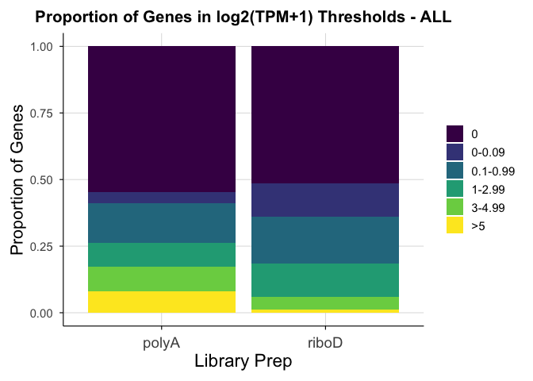
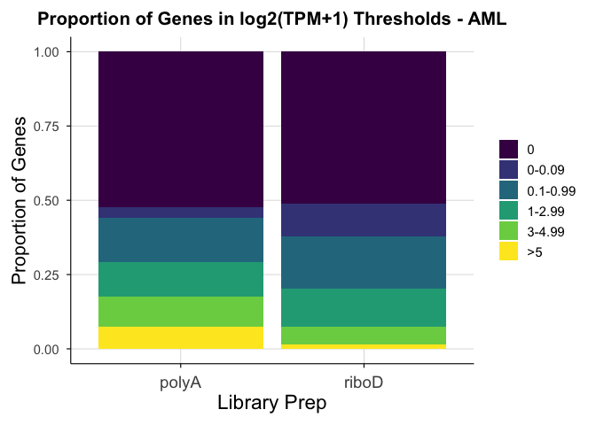

# Fig_1C


## Fig 1C

Stacked bar chart showing the proportion of unique genes expressed at
different log2(TPM+1) levels.

``` r
library(tidyverse)
```

    ── Attaching core tidyverse packages ──────────────────────── tidyverse 2.0.0 ──
    ✔ dplyr     1.2.1     ✔ readr     2.2.0
    ✔ forcats   1.0.1     ✔ stringr   1.6.0
    ✔ ggplot2   4.0.3     ✔ tibble    3.3.1
    ✔ lubridate 1.9.5     ✔ tidyr     1.3.2
    ✔ purrr     1.2.2     
    ── Conflicts ────────────────────────────────────────── tidyverse_conflicts() ──
    ✖ dplyr::filter() masks stats::filter()
    ✖ dplyr::lag()    masks stats::lag()
    ℹ Use the conflicted package (<http://conflicted.r-lib.org/>) to force all conflicts to become errors

``` r
# expression files
SS_aRMS_log2tpm1 <- read_tsv("../input_data/SS_aRMS_log2TPM1_ensembl_TEBA.tsv.gz")
```

    Rows: 60498 Columns: 61
    ── Column specification ────────────────────────────────────────────────────────
    Delimiter: "\t"
    chr  (1): Gene
    dbl (60): THR51_4556_S01, THR51_4558_S01, THR51_4554_S01, THR24_3992_S01, TH...

    ℹ Use `spec()` to retrieve the full column specification for this data.
    ℹ Specify the column types or set `show_col_types = FALSE` to quiet this message.

``` r
WT_NB_log2tpm1 <- read_tsv("../input_data/WT_NB_log2TPM1_ensembl_TEBA.tsv.gz")
```

    Rows: 60498 Columns: 61
    ── Column specification ────────────────────────────────────────────────────────
    Delimiter: "\t"
    chr  (1): Gene
    dbl (60): THR24_3218_S01, THR24_4194_S01, THR24_4284_S01, THR24_4369_S01, TH...

    ℹ Use `spec()` to retrieve the full column specification for this data.
    ℹ Specify the column types or set `show_col_types = FALSE` to quiet this message.

``` r
ALL_AML_log2tpm1 <- read_tsv("../input_data/ALL_AML_log2TPM1_ensembl_TEBA.tsv.gz")
```

    Rows: 60498 Columns: 81
    ── Column specification ────────────────────────────────────────────────────────
    Delimiter: "\t"
    chr  (1): Gene
    dbl (80): THR24_1667_S01, THR24_2131_S01, THR24_2119_S01, THR24_1921_S01, TH...

    ℹ Use `spec()` to retrieve the full column specification for this data.
    ℹ Specify the column types or set `show_col_types = FALSE` to quiet this message.

``` r
# sample ID files, from correlation_analysis
filtered_SS_aRMS_list <- read_tsv("../input_data/filtered_SS_aRMS_list.tsv")
```

    Rows: 60 Columns: 2
    ── Column specification ────────────────────────────────────────────────────────
    Delimiter: "\t"
    chr (2): term, disease_and_prep

    ℹ Use `spec()` to retrieve the full column specification for this data.
    ℹ Specify the column types or set `show_col_types = FALSE` to quiet this message.

``` r
filtered_WT_NB_list <- read_tsv("../input_data/filtered_WT_NB_list.tsv")
```

    Rows: 60 Columns: 2
    ── Column specification ────────────────────────────────────────────────────────
    Delimiter: "\t"
    chr (2): term, disease_and_prep

    ℹ Use `spec()` to retrieve the full column specification for this data.
    ℹ Specify the column types or set `show_col_types = FALSE` to quiet this message.

``` r
filtered_ALL_AML_list <- read_tsv("../input_data/filtered_ALL_AML_list.tsv")
```

    Rows: 80 Columns: 2
    ── Column specification ────────────────────────────────────────────────────────
    Delimiter: "\t"
    chr (2): term, disease_and_prep

    ℹ Use `spec()` to retrieve the full column specification for this data.
    ℹ Specify the column types or set `show_col_types = FALSE` to quiet this message.

``` r
# Since "Gene" is a column name, it won't match the row names
# use values from the first column ("Gene") as row names
fix_SS_aRMS_log2tpm1 <- SS_aRMS_log2tpm1 %>%
  remove_rownames %>%
  column_to_rownames(var = "Gene")

fix_WT_NB_log2tpm1 <- WT_NB_log2tpm1 %>%
  remove_rownames %>%
  column_to_rownames(var = "Gene")

fix_ALL_AML_log2tpm1 <- ALL_AML_log2tpm1 %>%
  remove_rownames %>%
  column_to_rownames(var = "Gene")

# use values from first column ("th_dataset_id") as row names
fix_filtered_SS_aRMS_list <- filtered_SS_aRMS_list %>%
  remove_rownames %>%
  column_to_rownames(var = "term")

fix_filtered_WT_NB_list <- filtered_WT_NB_list %>%
  remove_rownames %>%
  column_to_rownames(var = "term")

fix_filtered_ALL_AML_list <- filtered_ALL_AML_list %>%
  remove_rownames %>%
  column_to_rownames(var = "term")
```

Separating THIDs into disease and lib prep

``` r
# SS polyA
SS_polyA_list <- filtered_SS_aRMS_list %>%
  filter(disease_and_prep %in% c("SS_polyA")) %>% 
  select(term, disease_and_prep)

SS_polyA_expr <- SS_aRMS_log2tpm1 %>%
  select(Gene, all_of(SS_polyA_list$term))

# SS riboD
SS_riboD_list <- filtered_SS_aRMS_list %>%
  filter(disease_and_prep %in% c("SS_riboD")) %>% 
  select(term, disease_and_prep)

SS_riboD_expr <- SS_aRMS_log2tpm1 %>%
  select(Gene, all_of(SS_riboD_list$term))

# aRMS polyA
aRMS_polyA_list <- filtered_SS_aRMS_list %>%
  filter(disease_and_prep %in% c("aRMS_polyA")) %>% 
  select(term, disease_and_prep)

aRMS_polyA_expr <- SS_aRMS_log2tpm1 %>%
  select(Gene, all_of(aRMS_polyA_list$term))

# aRMS riboD
aRMS_riboD_list <- filtered_SS_aRMS_list %>%
  filter(disease_and_prep %in% c("aRMS_riboD")) %>% 
  select(term, disease_and_prep)

aRMS_riboD_expr <- SS_aRMS_log2tpm1 %>%
  select(Gene, all_of(aRMS_riboD_list$term))

# WT polyA
WT_polyA_list <- filtered_WT_NB_list %>%
  filter(disease_and_prep %in% c("WT_polyA")) %>% 
  select(term, disease_and_prep)

WT_polyA_expr <- WT_NB_log2tpm1 %>%
  select(Gene, all_of(WT_polyA_list$term))

# WT riboD 
WT_riboD_list <- filtered_WT_NB_list %>%
  filter(disease_and_prep %in% c("WT_riboD")) %>% 
  select(term, disease_and_prep)

WT_riboD_expr <- WT_NB_log2tpm1 %>%
  select(Gene, all_of(WT_riboD_list$term))

# NB polyA
NB_polyA_list <- filtered_WT_NB_list %>%
  filter(disease_and_prep %in% c("NB_polyA")) %>% 
  select(term, disease_and_prep)

NB_polyA_expr <- WT_NB_log2tpm1 %>%
  select(Gene, all_of(NB_polyA_list$term))

# NB riboD
NB_riboD_list <- filtered_WT_NB_list %>%
  filter(disease_and_prep %in% c("NB_riboD")) %>% 
  select(term, disease_and_prep)

NB_riboD_expr <- WT_NB_log2tpm1 %>%
  select(Gene, all_of(NB_riboD_list$term))

# ALL polyA
ALL_polyA_list <- filtered_ALL_AML_list %>%
  filter(disease_and_prep %in% c("ALL_polyA")) %>% 
  select(term, disease_and_prep)

ALL_polyA_expr <- ALL_AML_log2tpm1 %>%
  select(Gene, all_of(ALL_polyA_list$term))

# ALL riboD
ALL_riboD_list <- filtered_ALL_AML_list %>%
  filter(disease_and_prep %in% c("ALL_riboD")) %>% 
  select(term, disease_and_prep)

ALL_riboD_expr <- ALL_AML_log2tpm1 %>%
  select(Gene, all_of(ALL_riboD_list$term))


# AML polyA
AML_polyA_list <- filtered_ALL_AML_list %>%
  filter(disease_and_prep %in% c("AML_polyA")) %>% 
  select(term, disease_and_prep)

AML_polyA_expr <- ALL_AML_log2tpm1 %>%
  select(Gene, all_of(AML_polyA_list$term))

# AML riboD
AML_riboD_list <- filtered_ALL_AML_list %>%
  filter(disease_and_prep %in% c("AML_riboD")) %>% 
  select(term, disease_and_prep)

AML_riboD_expr <- ALL_AML_log2tpm1 %>%
  select(Gene, all_of(AML_riboD_list$term))
```

Defining log2(TPM+1) bins

``` r
expr_bins <- c(0, 1e-10, 0.09, 0.99, 2.99, 4.99, Inf)

expr_labels <- c("0","0-0.09", "0.1-0.99", "1-2.99", "3-4.99", ">5")
```

define gene medians function

``` r
compute_gene_medians <- function(df, disease, compendia) {
  df %>% 
    rowwise() %>% 
    mutate(median_expr = median(c_across(starts_with("T")), na.rm = TRUE)) %>%
    ungroup() %>%
    mutate(
      Disease = disease,
      Compendia = compendia
    ) %>%
    select(Gene, median_expr, Disease, Compendia)
}
```

Compute gene medians

``` r
SS_polyA_med   <- compute_gene_medians(SS_polyA_expr,   "SS",   "polyA")
SS_riboD_med   <- compute_gene_medians(SS_riboD_expr,   "SS",   "riboD")
aRMS_polyA_med <- compute_gene_medians(aRMS_polyA_expr, "aRMS", "polyA")
aRMS_riboD_med <- compute_gene_medians(aRMS_riboD_expr, "aRMS", "riboD")
WT_polyA_med   <- compute_gene_medians(WT_polyA_expr,   "WT",   "polyA")
WT_riboD_med   <- compute_gene_medians(WT_riboD_expr,   "WT",   "riboD")
NB_polyA_med   <- compute_gene_medians(NB_polyA_expr,   "NB",   "polyA")
NB_riboD_med   <- compute_gene_medians(NB_riboD_expr,   "NB",   "riboD")
AML_polyA_med   <- compute_gene_medians(AML_polyA_expr,   "AML",   "polyA")
AML_riboD_med   <- compute_gene_medians(AML_riboD_expr,   "AML",   "riboD")
ALL_polyA_med   <- compute_gene_medians(ALL_polyA_expr,   "ALL",   "polyA")
ALL_riboD_med  <- compute_gene_medians(ALL_riboD_expr,   "ALL",   "riboD")

all_medians <- bind_rows(
  SS_polyA_med, SS_riboD_med,
  aRMS_polyA_med, aRMS_riboD_med,
  WT_polyA_med, WT_riboD_med,
  NB_polyA_med, NB_riboD_med,  
  ALL_polyA_med, ALL_riboD_med,
  AML_riboD_med, AML_polyA_med
  )
```

Bin genes into expression thresholds

``` r
all_medians_bins <- all_medians %>%
  mutate(
    ExprBin = cut(
      median_expr,
      breaks = expr_bins,
      labels = expr_labels,
      include.lowest = TRUE
    )
  )
```

Compute proportion of genes in each bin per lib prep

``` r
bin_prop <- all_medians_bins %>% 
  group_by(Compendia, ExprBin, Disease) %>%
  summarise(n = n(), .groups = "drop") %>%
  group_by(Disease, Compendia) %>%
  mutate(Proportion = n / sum(n))
```

Custom color theme

``` r
theme_2D <- function(base_size = 14) {
  theme_minimal(base_size = base_size) +
    theme(
      legend.position = "right",
      legend.title = element_blank(),
      panel.grid.major = element_line(color = "grey85", linewidth = 0.3),
      panel.grid.minor = element_blank(),
      axis.line = element_line(color = "black", linewidth = 0.4),
      axis.ticks = element_line(color = "black", linewidth = 0.4),
      strip.text = element_text(face = "bold", size = base_size * 0.9),
      plot.title = element_text(face = "bold", size = base_size * 1.1, hjust = 0.5),
      axis.title.y = element_text(angle = 90, hjust = 0.5, size = 16), 
      axis.title.x = element_text(angle = 0, hjust = 0.5, size = 17), 
      axis.text.x = element_text(angle = 0, hjust = 0.5, size = 14),
      plot.margin = margin(10, 10, 10, 10)
    )
}

scale_fill_compendia <- function() {
  scale_fill_manual(values = c(
    "polyA" = "#E69F00",  # yellow
    "riboD" = "#0072B2"   # blue
  ))
}
scale_color_compendia <- function() {
  scale_color_manual(values = c( 
    "polyA" = "#E69F00", 
    "riboD" = "#0072B2" ))
  }
```

Generate stacked bar plot

``` r
# Get unique diseases
diseasesC <- unique(bin_prop$Disease)

# Generate one plot per disease
plots_by_diseaseC <- map(diseasesC, function(d) {
  
  dfC <- bin_prop %>% filter(Disease == d)
  
  ggplot(dfC, aes(x = Compendia, y = Proportion, fill = ExprBin)) +
    geom_bar(stat = "identity", position = "stack") +
    scale_fill_viridis_d(option = "D") +
    labs(
      title = paste("Proportion of Genes in log2(TPM+1) Thresholds -", d),
      x = "Library Prep",
      y = "Proportion of Genes",
      fill = "Expression Bin"
    ) +
    theme_2D()
})

# Name the plots by disease
names(plots_by_diseaseC) <- diseasesC
plots_by_diseaseC
```

    $ALL




    $AML




    $NB


    $SS


    $WT


    $aRMS


Save plot

``` r
# ggsave("/figures/fig1C.png", plot = plots_by_diseaseC, width = 6, height = 4, units = "in", dpi = 300)
```

Session Info

``` r
sessioninfo::session_info()
```

    ─ Session info ───────────────────────────────────────────────────────────────
     setting  value
     version  R version 4.5.2 (2025-10-31)
     os       macOS Tahoe 26.5
     system   aarch64, darwin20
     ui       X11
     language (EN)
     collate  en_US.UTF-8
     ctype    en_US.UTF-8
     tz       America/Los_Angeles
     date     2026-06-08
     pandoc   3.8.3 @ /Applications/RStudio.app/Contents/Resources/app/quarto/bin/tools/aarch64/ (via rmarkdown)
     quarto   1.9.36 @ /Applications/RStudio.app/Contents/Resources/app/quarto/bin/quarto

    ─ Packages ───────────────────────────────────────────────────────────────────
     ! package      * version date (UTC) lib source
     P bit            4.6.0   2025-03-06 [?] RSPM
     P bit64          4.8.0   2026-04-21 [?] RSPM
     P cli            3.6.5   2025-04-23 [?] RSPM
     P crayon         1.5.3   2024-06-20 [?] RSPM
     P digest         0.6.37  2024-08-19 [?] RSPM
     P dplyr        * 1.2.1   2026-04-03 [?] RSPM
     P evaluate       1.0.5   2025-08-27 [?] RSPM
     P farver         2.1.2   2024-05-13 [?] RSPM
     P fastmap        1.2.0   2024-05-15 [?] RSPM
     P forcats      * 1.0.1   2025-09-25 [?] RSPM
     P generics       0.1.4   2025-05-09 [?] RSPM
     P ggplot2      * 4.0.3   2026-04-22 [?] RSPM
     P glue           1.8.0   2024-09-30 [?] RSPM
     P gtable         0.3.6   2024-10-25 [?] RSPM
     P hms            1.1.4   2025-10-17 [?] RSPM
     P htmltools      0.5.8.1 2024-04-04 [?] RSPM
     P jsonlite       2.0.0   2025-03-27 [?] RSPM
     P knitr          1.50    2025-03-16 [?] RSPM
     P labeling       0.4.3   2023-08-29 [?] RSPM
     P lifecycle      1.0.5   2026-01-08 [?] RSPM
     P lubridate    * 1.9.5   2026-02-04 [?] RSPM
     P magrittr       2.0.5   2026-04-04 [?] RSPM
     P pillar         1.11.1  2025-09-17 [?] RSPM
     P pkgconfig      2.0.3   2019-09-22 [?] RSPM
     P purrr        * 1.2.2   2026-04-10 [?] RSPM
     P R6             2.6.1   2025-02-15 [?] RSPM
     P RColorBrewer   1.1-3   2022-04-03 [?] RSPM
     P readr        * 2.2.0   2026-02-19 [?] RSPM
       renv           1.1.5   2025-07-24 [1] CRAN (R 4.5.0)
     P rlang          1.2.0   2026-04-06 [?] RSPM
     P rmarkdown      2.30    2025-09-28 [?] RSPM
     P rstudioapi     0.18.0  2026-01-16 [?] RSPM
     P S7             0.2.2   2026-04-22 [?] RSPM
     P scales         1.4.0   2025-04-24 [?] RSPM
     P sessioninfo    1.2.3   2025-02-05 [?] CRAN (R 4.5.0)
     P stringi        1.8.7   2025-03-27 [?] RSPM
     P stringr      * 1.6.0   2025-11-04 [?] RSPM
     P tibble       * 3.3.1   2026-01-11 [?] RSPM
     P tidyr        * 1.3.2   2025-12-19 [?] RSPM
     P tidyselect     1.2.1   2024-03-11 [?] RSPM
     P tidyverse    * 2.0.0   2023-02-22 [?] RSPM
     P timechange     0.4.0   2026-01-29 [?] RSPM
     P tzdb           0.5.0   2025-03-15 [?] RSPM
     P vctrs          0.7.3   2026-04-11 [?] RSPM
     P viridisLite    0.4.3   2026-02-04 [?] RSPM
     P vroom          1.7.1   2026-03-31 [?] RSPM
     P withr          3.0.2   2024-10-28 [?] RSPM
     P xfun           0.55    2025-12-16 [?] CRAN (R 4.5.2)
     P yaml           2.3.10  2024-07-26 [?] RSPM

     [1] /Users/maryke/Documents/Treehouse/Lab_Notebooks/transcript_enrichment_bias_assessment/Fig_1/renv/library/macos/R-4.5/aarch64-apple-darwin20
     [2] /Users/maryke/Library/Caches/org.R-project.R/R/renv/sandbox/macos/R-4.5/aarch64-apple-darwin20/4cd76b74

     * ── Packages attached to the search path.
     P ── Loaded and on-disk path mismatch.

    ──────────────────────────────────────────────────────────────────────────────
