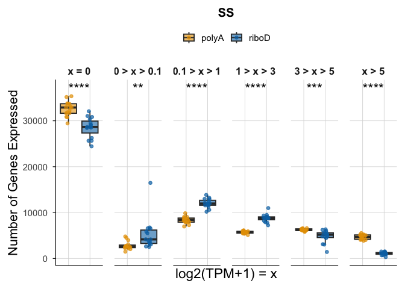
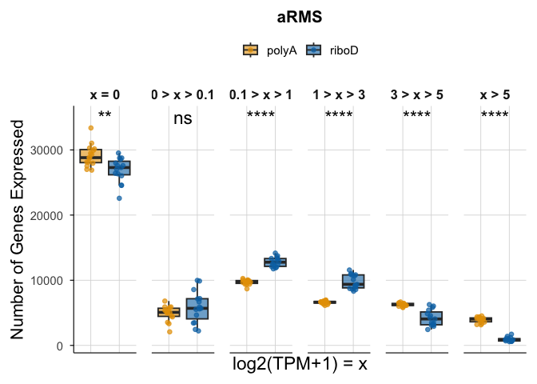
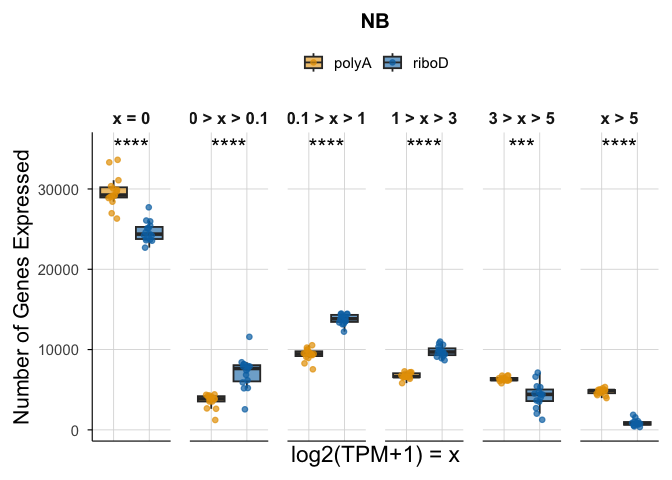
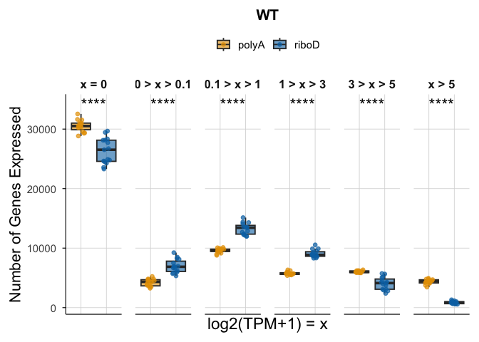
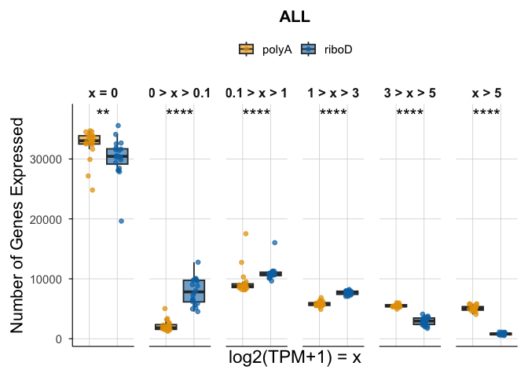
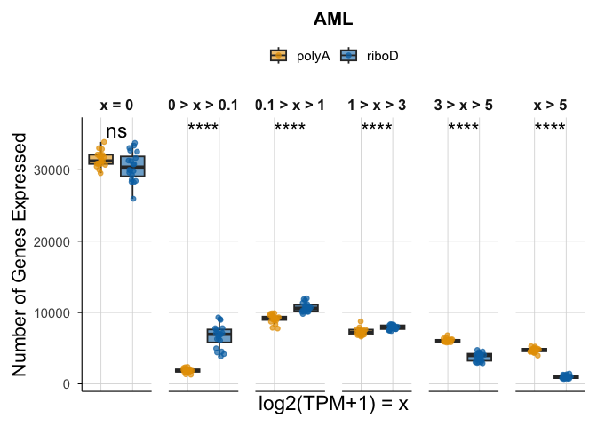
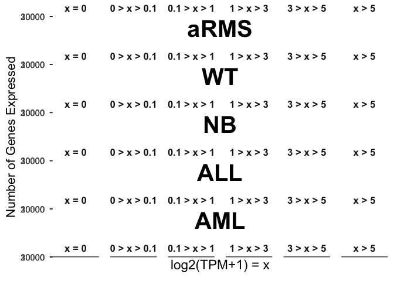

# Fig1D


## Fig 1D

Boxplot showing the number of unique genes expressed at increasing
log2(TPM+1) levels.

``` r
library(tidyverse)
```

    ── Attaching core tidyverse packages ──────────────────────── tidyverse 2.0.0 ──
    ✔ dplyr     1.1.4     ✔ readr     2.1.5
    ✔ forcats   1.0.1     ✔ stringr   1.5.2
    ✔ ggplot2   4.0.0     ✔ tibble    3.3.0
    ✔ lubridate 1.9.4     ✔ tidyr     1.3.1
    ✔ purrr     1.1.0     
    ── Conflicts ────────────────────────────────────────── tidyverse_conflicts() ──
    ✖ dplyr::filter() masks stats::filter()
    ✖ dplyr::lag()    masks stats::lag()
    ℹ Use the conflicted package (<http://conflicted.r-lib.org/>) to force all conflicts to become errors

``` r
library(patchwork)
library(cowplot)
```


    Attaching package: 'cowplot'

    The following object is masked from 'package:patchwork':

        align_plots

    The following object is masked from 'package:lubridate':

        stamp

``` r
# expression files
SS_polyA_log2tpm1 <- read_tsv("../../input_data/sample_selection/SS_polyA_log2tpm1.tsv")
```

    Rows: 60498 Columns: 16
    ── Column specification ────────────────────────────────────────────────────────
    Delimiter: "\t"
    chr  (1): Gene
    dbl (15): THR39_1373_S01, TCGA-WK-A8XT-01, TH40_2281_S01, THR39_1375_S01, TH...

    ℹ Use `spec()` to retrieve the full column specification for this data.
    ℹ Specify the column types or set `show_col_types = FALSE` to quiet this message.

``` r
SS_riboD_log2tpm1 <- read_tsv("../../input_data/sample_selection/SS_riboD_log2tpm1.tsv")
```

    Rows: 60498 Columns: 16
    ── Column specification ────────────────────────────────────────────────────────
    Delimiter: "\t"
    chr  (1): Gene
    dbl (15): THR51_4556_S01, THR51_4558_S01, THR51_4554_S01, THR24_3992_S01, TH...

    ℹ Use `spec()` to retrieve the full column specification for this data.
    ℹ Specify the column types or set `show_col_types = FALSE` to quiet this message.

``` r
aRMS_polyA_log2tpm1 <- read_tsv("../../input_data/sample_selection/aRMS_polyA_log2tpm1.tsv")
```

    Rows: 60498 Columns: 16
    ── Column specification ────────────────────────────────────────────────────────
    Delimiter: "\t"
    chr  (1): Gene
    dbl (15): THR29_0788_S01, THR29_0775_S01, THR29_0757_S01, THR29_0762_S01, TH...

    ℹ Use `spec()` to retrieve the full column specification for this data.
    ℹ Specify the column types or set `show_col_types = FALSE` to quiet this message.

``` r
aRMS_riboD_log2tpm1 <- read_tsv("../../input_data/sample_selection/aRMS_riboD_log2tpm1.tsv")
```

    Rows: 60498 Columns: 16
    ── Column specification ────────────────────────────────────────────────────────
    Delimiter: "\t"
    chr  (1): Gene
    dbl (15): THR24_3244_S01, THR24_3371_S01, THR24_3181_S01, THR24_3178_S01, TH...

    ℹ Use `spec()` to retrieve the full column specification for this data.
    ℹ Specify the column types or set `show_col_types = FALSE` to quiet this message.

``` r
WT_polyA_log2tpm1 <- read_tsv("../../input_data/sample_selection/WT_polyA_log2tpm1.tsv")
```

    Rows: 60498 Columns: 16
    ── Column specification ────────────────────────────────────────────────────────
    Delimiter: "\t"
    chr  (1): Gene
    dbl (15): TARGET-50-PAJNCZ-01, TARGET-50-PAEBXA-01, TARGET-50-PALERC-01, TAR...

    ℹ Use `spec()` to retrieve the full column specification for this data.
    ℹ Specify the column types or set `show_col_types = FALSE` to quiet this message.

``` r
WT_riboD_log2tpm1 <- read_tsv("../../input_data/sample_selection/WT_riboD_log2tpm1.tsv")
```

    Rows: 60498 Columns: 16
    ── Column specification ────────────────────────────────────────────────────────
    Delimiter: "\t"
    chr  (1): Gene
    dbl (15): THR24_3218_S01, THR24_4194_S01, THR24_4284_S01, THR24_4369_S01, TH...

    ℹ Use `spec()` to retrieve the full column specification for this data.
    ℹ Specify the column types or set `show_col_types = FALSE` to quiet this message.

``` r
NB_polyA_log2tpm1 <- read_tsv("../../input_data/sample_selection/NB_polyA_log2tpm1.tsv")
```

    Rows: 60498 Columns: 16
    ── Column specification ────────────────────────────────────────────────────────
    Delimiter: "\t"
    chr  (1): Gene
    dbl (15): TARGET-30-PASUML-01, TARGET-30-PASEGA-01, TARGET-30-PAPUAR-01, TAR...

    ℹ Use `spec()` to retrieve the full column specification for this data.
    ℹ Specify the column types or set `show_col_types = FALSE` to quiet this message.

``` r
NB_riboD_log2tpm1 <- read_tsv("../../input_data/sample_selection/NB_riboD_log2tpm1.tsv")
```

    Rows: 60498 Columns: 16
    ── Column specification ────────────────────────────────────────────────────────
    Delimiter: "\t"
    chr  (1): Gene
    dbl (15): THR24_4310_S01, THR24_2779_S01, THR24_3516_S01, THR24_4114_S01, TH...

    ℹ Use `spec()` to retrieve the full column specification for this data.
    ℹ Specify the column types or set `show_col_types = FALSE` to quiet this message.

``` r
ALL_polyA_log2tpm1 <- read_tsv("../../input_data/sample_selection/ALL_polyA_log2tpm1.tsv")
```

    Rows: 60498 Columns: 21
    ── Column specification ────────────────────────────────────────────────────────
    Delimiter: "\t"
    chr  (1): Gene
    dbl (20): THR24_1667_S01, THR24_2131_S01, THR24_2119_S01, THR24_1921_S01, TH...

    ℹ Use `spec()` to retrieve the full column specification for this data.
    ℹ Specify the column types or set `show_col_types = FALSE` to quiet this message.

``` r
ALL_riboD_log2tpm1 <- read_tsv("../../input_data/sample_selection/ALL_riboD_log2tpm1.tsv")
```

    Rows: 60498 Columns: 21
    ── Column specification ────────────────────────────────────────────────────────
    Delimiter: "\t"
    chr  (1): Gene
    dbl (20): THR24_4203_S01, THR24_3471_S01, THR24_3688_S01, THR24_4235_S01, TH...

    ℹ Use `spec()` to retrieve the full column specification for this data.
    ℹ Specify the column types or set `show_col_types = FALSE` to quiet this message.

``` r
AML_polyA_log2tpm1 <- read_tsv("../../input_data/sample_selection/AML_polyA_log2tpm1.tsv")
```

    Rows: 60498 Columns: 21
    ── Column specification ────────────────────────────────────────────────────────
    Delimiter: "\t"
    chr  (1): Gene
    dbl (20): TCGA-AB-2889-03, TCGA-AB-2844-03, TCGA-AB-2846-03, TCGA-AB-2881-03...

    ℹ Use `spec()` to retrieve the full column specification for this data.
    ℹ Specify the column types or set `show_col_types = FALSE` to quiet this message.

``` r
AML_riboD_log2tpm1 <- read_tsv("../../input_data/sample_selection/AML_riboD_log2tpm1.tsv")
```

    Rows: 60498 Columns: 21
    ── Column specification ────────────────────────────────────────────────────────
    Delimiter: "\t"
    chr  (1): Gene
    dbl (20): THR24_4050_S01, THR24_4356_S01, THR24_4265_S01, THR24_4263_S01, TH...

    ℹ Use `spec()` to retrieve the full column specification for this data.
    ℹ Specify the column types or set `show_col_types = FALSE` to quiet this message.

``` r
# sample ID files, from correlation_analysis
SS_polyA_list <- read_tsv("../../input_data/sample_selection/SS_polyA_list.tsv")
```

    Rows: 15 Columns: 2
    ── Column specification ────────────────────────────────────────────────────────
    Delimiter: "\t"
    chr (2): term, disease_and_prep

    ℹ Use `spec()` to retrieve the full column specification for this data.
    ℹ Specify the column types or set `show_col_types = FALSE` to quiet this message.

``` r
SS_riboD_list <- read_tsv("../../input_data/sample_selection/SS_riboD_list.tsv")
```

    Rows: 15 Columns: 2
    ── Column specification ────────────────────────────────────────────────────────
    Delimiter: "\t"
    chr (2): term, disease_and_prep

    ℹ Use `spec()` to retrieve the full column specification for this data.
    ℹ Specify the column types or set `show_col_types = FALSE` to quiet this message.

``` r
aRMS_polyA_list <- read_tsv("../../input_data/sample_selection/aRMS_polyA_list.tsv")
```

    Rows: 15 Columns: 2
    ── Column specification ────────────────────────────────────────────────────────
    Delimiter: "\t"
    chr (2): term, disease_and_prep

    ℹ Use `spec()` to retrieve the full column specification for this data.
    ℹ Specify the column types or set `show_col_types = FALSE` to quiet this message.

``` r
aRMS_riboD_list <- read_tsv("../../input_data/sample_selection/aRMS_riboD_list.tsv")
```

    Rows: 15 Columns: 2
    ── Column specification ────────────────────────────────────────────────────────
    Delimiter: "\t"
    chr (2): term, disease_and_prep

    ℹ Use `spec()` to retrieve the full column specification for this data.
    ℹ Specify the column types or set `show_col_types = FALSE` to quiet this message.

``` r
WT_polyA_list <- read_tsv("../../input_data/sample_selection/WT_polyA_list.tsv")
```

    Rows: 15 Columns: 2
    ── Column specification ────────────────────────────────────────────────────────
    Delimiter: "\t"
    chr (2): term, disease_and_prep

    ℹ Use `spec()` to retrieve the full column specification for this data.
    ℹ Specify the column types or set `show_col_types = FALSE` to quiet this message.

``` r
WT_riboD_list <- read_tsv("../../input_data/sample_selection/WT_riboD_list.tsv")
```

    Rows: 15 Columns: 2
    ── Column specification ────────────────────────────────────────────────────────
    Delimiter: "\t"
    chr (2): term, disease_and_prep

    ℹ Use `spec()` to retrieve the full column specification for this data.
    ℹ Specify the column types or set `show_col_types = FALSE` to quiet this message.

``` r
NB_polyA_list <- read_tsv("../../input_data/sample_selection/NB_polyA_list.tsv")
```

    Rows: 15 Columns: 2
    ── Column specification ────────────────────────────────────────────────────────
    Delimiter: "\t"
    chr (2): term, disease_and_prep

    ℹ Use `spec()` to retrieve the full column specification for this data.
    ℹ Specify the column types or set `show_col_types = FALSE` to quiet this message.

``` r
NB_riboD_list <- read_tsv("../../input_data/sample_selection/NB_riboD_list.tsv")
```

    Rows: 15 Columns: 2
    ── Column specification ────────────────────────────────────────────────────────
    Delimiter: "\t"
    chr (2): term, disease_and_prep

    ℹ Use `spec()` to retrieve the full column specification for this data.
    ℹ Specify the column types or set `show_col_types = FALSE` to quiet this message.

``` r
ALL_polyA_list <- read_tsv("../../input_data/sample_selection/ALL_polyA_list.tsv")
```

    Rows: 20 Columns: 2
    ── Column specification ────────────────────────────────────────────────────────
    Delimiter: "\t"
    chr (2): term, disease_and_prep

    ℹ Use `spec()` to retrieve the full column specification for this data.
    ℹ Specify the column types or set `show_col_types = FALSE` to quiet this message.

``` r
ALL_riboD_list <- read_tsv("../../input_data/sample_selection/ALL_riboD_list.tsv")
```

    Rows: 20 Columns: 2
    ── Column specification ────────────────────────────────────────────────────────
    Delimiter: "\t"
    chr (2): term, disease_and_prep

    ℹ Use `spec()` to retrieve the full column specification for this data.
    ℹ Specify the column types or set `show_col_types = FALSE` to quiet this message.

``` r
AML_polyA_list <- read_tsv("../../input_data/sample_selection/AML_polyA_list.tsv")
```

    Rows: 20 Columns: 2
    ── Column specification ────────────────────────────────────────────────────────
    Delimiter: "\t"
    chr (2): term, disease_and_prep

    ℹ Use `spec()` to retrieve the full column specification for this data.
    ℹ Specify the column types or set `show_col_types = FALSE` to quiet this message.

``` r
AML_riboD_list <- read_tsv("../../input_data/sample_selection/AML_riboD_list.tsv")
```

    Rows: 20 Columns: 2
    ── Column specification ────────────────────────────────────────────────────────
    Delimiter: "\t"
    chr (2): term, disease_and_prep

    ℹ Use `spec()` to retrieve the full column specification for this data.
    ℹ Specify the column types or set `show_col_types = FALSE` to quiet this message.

Counting Genes above log2(TPM+1) Thresholds

``` r
bins <- c(0, 1e-10, 0.09, 0.99, 2.99, 4.99, Inf)

bin_labels <- c("0","0-0.09", "0.1-0.99", "1-2.99", "3-4.99", ">5")

count_genes_bins <- function(df, disease, compendia, bins, bin_labels) {
  df_long <- df %>%
    pivot_longer(cols = starts_with("T"), names_to = "Sample", values_to = "logTPM") %>%
    mutate(Bin = cut(logTPM, breaks = bins, labels = bin_labels, include.lowest = TRUE)) %>%
    group_by(Sample, Bin) %>%
    summarise(Count = n(), .groups = "drop") %>%
    mutate(Disease = disease, Compendia = compendia)
  
  return(df_long)
}
```

``` r
SS_polyA_counts   <- count_genes_bins(SS_polyA_log2tpm1,   "SS",   "polyA", bins, bin_labels)
SS_riboD_counts   <- count_genes_bins(SS_riboD_log2tpm1,   "SS",   "riboD", bins, bin_labels)
aRMS_polyA_counts <- count_genes_bins(aRMS_polyA_log2tpm1, "aRMS", "polyA", bins, bin_labels)
aRMS_riboD_counts <- count_genes_bins(aRMS_riboD_log2tpm1, "aRMS", "riboD", bins, bin_labels)
WT_polyA_counts <- count_genes_bins(WT_polyA_log2tpm1, "WT", "polyA", bins, bin_labels)
WT_riboD_counts <- count_genes_bins(WT_riboD_log2tpm1, "WT", "riboD", bins, bin_labels)
NB_polyA_counts <- count_genes_bins(NB_polyA_log2tpm1, "NB", "polyA", bins, bin_labels)
NB_riboD_counts <- count_genes_bins(NB_riboD_log2tpm1, "NB", "riboD", bins, bin_labels)
ALL_polyA_counts <- count_genes_bins(ALL_polyA_log2tpm1, "ALL", "polyA", bins, bin_labels)
ALL_riboD_counts <- count_genes_bins(ALL_riboD_log2tpm1, "ALL", "riboD", bins, bin_labels)
AML_polyA_counts <- count_genes_bins(AML_polyA_log2tpm1, "AML", "polyA", bins, bin_labels)
AML_riboD_counts <- count_genes_bins(AML_riboD_log2tpm1, "AML", "riboD", bins, bin_labels)

combined_counts <- bind_rows(
  SS_polyA_counts, 
  SS_riboD_counts,
  aRMS_polyA_counts, 
  aRMS_riboD_counts, 
  NB_riboD_counts, 
  NB_polyA_counts, 
  WT_riboD_counts, 
  WT_polyA_counts,  
  ALL_riboD_counts, 
  ALL_polyA_counts, 
  AML_riboD_counts, 
  AML_polyA_counts)
```

Custom theme

``` r
theme_1d <- function(base_size = 14) {
  theme_minimal(base_size = base_size) +
    theme(
      legend.position = "top",
      legend.title = element_blank(),
      panel.grid.major = element_line(color = "grey85", linewidth = 0.3),
      panel.grid.minor = element_blank(),
      axis.line = element_line(color = "black", linewidth = 0.4),
      axis.ticks = element_line(color = "black", linewidth = 0.4),
      strip.text = element_text(face = "bold", size = base_size * 0.9),
      plot.title = element_text(face = "bold", size = base_size * 1.1, hjust = 0.5),
      axis.title.y = element_text(angle = 90, hjust = 0.5, size = 16),
      axis.title.x = element_text(angle = 0, hjust = 0.5, size = 17),
      axis.text.x = element_text(angle = 0, hjust = 0.5, size = 14),
      plot.margin = margin(10, 10, 10, 10)
    )
}

scale_fill_compendia <- function() {
  scale_fill_manual(values = c(
    "polyA" = "#E69F00",  # yellow
    "riboD" = "#0072B2"   # blue
  ))
}
scale_color_compendia <- function() {
  scale_color_manual(values = c(
    "polyA" = "#E69F00",
    "riboD" = "#0072B2" ))
  }
```

Function for applying statistical test to each sample

``` r
run_bin_stats <- function(polyA_df, riboD_df, disease_name) {
  
  # Get all bins present in either dataset
  bins <- union(unique(polyA_df$Bin), unique(riboD_df$Bin))
  
  results <- lapply(bins, function(b) {
    
    poly_counts <- polyA_df %>% filter(Bin == b) %>% pull(Count)
    ribo_counts <- riboD_df %>% filter(Bin == b) %>% pull(Count)
    
    # Skip bins with too few values
    if (length(poly_counts) < 3 | length(ribo_counts) < 3) {
      return(
        tibble(
          Disease = disease_name,
          Bin = b,
          Shapiro_polyA_p = NA,
          Shapiro_riboD_p = NA,
          VarTest_p = NA,
          TTest_p = NA
        )
      )
    }
    
    tibble(
      Disease = disease_name,
      Bin = b,
      Shapiro_polyA_p = shapiro.test(poly_counts)$p.value,
      Shapiro_riboD_p = shapiro.test(ribo_counts)$p.value,
      VarTest_p = var.test(poly_counts, ribo_counts)$p.value,
      TTest_p = t.test(poly_counts, ribo_counts, var.equal = TRUE)$p.value
    )
  })
  
  bind_rows(results)
}
```

``` r
stats_SS   <- run_bin_stats(SS_polyA_counts,   SS_riboD_counts,   "SS")
stats_aRMS <- run_bin_stats(aRMS_polyA_counts, aRMS_riboD_counts, "aRMS")
stats_WT   <- run_bin_stats(WT_polyA_counts,   WT_riboD_counts,   "WT")
stats_NB   <- run_bin_stats(NB_polyA_counts,   NB_riboD_counts,   "NB")
stats_ALL  <- run_bin_stats(ALL_polyA_counts,   ALL_riboD_counts,   "ALL")
stats_AML  <- run_bin_stats(AML_polyA_counts,   AML_riboD_counts,   "AML")
```

Summarized stats for each disease, bin, and test

``` r
all_stats <- bind_rows(stats_SS, stats_aRMS, stats_WT, stats_NB, stats_ALL, stats_AML)
print(all_stats)
```

    # A tibble: 36 × 6
       Disease Bin      Shapiro_polyA_p Shapiro_riboD_p    VarTest_p  TTest_p
       <chr>   <fct>              <dbl>           <dbl>        <dbl>    <dbl>
     1 SS      0                 0.916         0.449    0.284        3.88e- 6
     2 SS      0-0.09            0.0299        0.000133 0.0000129    1.52e- 2
     3 SS      0.1-0.99          0.966         0.950    0.328        2.73e-12
     4 SS      1-2.99            0.897         0.189    0.000133     1.54e-13
     5 SS      3-4.99            0.616         0.0473   0.0000000756 3.31e- 4
     6 SS      >5                0.205         0.487    0.106        2.18e-19
     7 aRMS    0                 0.329         0.376    0.705        2.15e- 3
     8 aRMS    0-0.09            0.354         0.593    0.0121       1.67e- 1
     9 aRMS    0.1-0.99          0.189         0.500    0.0187       2.31e-14
    10 aRMS    1-2.99            0.937         0.0934   0.000000776  9.67e-12
    # ℹ 26 more rows

selecting correct test

``` r
choose_test <- function(poly, ribo) {
  
  # Need at least 3 values for Shapiro
  if (length(poly) < 3 | length(ribo) < 3) {
    return(list(p_value = NA_real_, test_used = "insufficient_data"))
  }
  
  # Shapiro tests for Normality
  # Less than 0.05 (Not normal)
#If both groups are normally distributed = proceed to variance testing
#If either group is non‑normal = skip parametric tests and use Mann–Whitney U

  p_norm_poly  <- shapiro.test(poly)$p.value
  p_norm_ribo  <- shapiro.test(ribo)$p.value
  
  poly_normal <- p_norm_poly  > 0.05
  ribo_normal <- p_norm_ribo  > 0.05
  
  # Both normal → variance test
  #If variances are equal → use Student’s t‑test
  #If variances differ → use Welch’s t‑test
  
  if (poly_normal & ribo_normal) {
    
    p_var <- var.test(poly, ribo)$p.value
    equal_var <- p_var > 0.05
    
    # Normal + equal variance → Student t-test
    if (equal_var) {
      return(list(
        p_value = t.test(poly, ribo, var.equal = TRUE)$p.value,
        test_used = "student_t"
      ))
    }
    
    # Normal + unequal variance → Welch t-test
    else {
      return(list(
        p_value = t.test(poly, ribo, var.equal = FALSE)$p.value,
        test_used = "welch_t"
      ))
    }
  }
  
  # Non-normal → Mann–Whitney U test
  return(list(
    p_value = wilcox.test(poly, ribo, exact = FALSE)$p.value,
    test_used = "mann_whitney"
  ))
}
```

P-value to significance star

``` r
p_to_stars <- function(p) {
  sapply(p, function(x) {
    if (is.na(x)) return("NA")
    if (x < 0.0001) return("****")
    if (x < 0.001)  return("***")
    if (x < 0.01)   return("**")
    if (x < 0.05)   return("*")
    "ns"
  })
}
```

``` r
compute_bin_significance <- function(df) {
  
  # Clean and dedupe
  df_clean <- df %>%
    select(Disease, Bin, Compendia, Count) %>%
    distinct()
  
  # Collapse to one row per Disease × Bin × Compendia
  df_collapsed <- df_clean %>%
    group_by(Disease, Bin, Compendia) %>%
    summarise(Count = list(Count), .groups = "drop")
  
  # Pivot to wide: polyA and riboD columns
  df_wide <- df_collapsed %>%
    tidyr::pivot_wider(
      names_from = Compendia,
      values_from = Count
    )
  
  # Apply statistical test
  df_results <- df_wide %>%
    rowwise() %>%
    mutate(
      test = list(choose_test(unlist(polyA), unlist(riboD))),
      p_value = test$p_value,
      test_used = test$test_used
    ) %>%
    ungroup() %>%
    select(-test)
  
  # ---- Benjamini–Hochberg FDR correction ----
  df_results_FDR <- df_results %>%
    group_by(Disease) %>%
    mutate(padj = p.adjust(p_value, method = "BH")) %>%
    ungroup() %>%
    mutate(stars_adj = p_to_stars(padj))
  
  df_results_FDR
}
```

``` r
sig_bins_SS <- compute_bin_significance(SS_polyA_counts %>% 
                                          mutate(Compendia="polyA") %>% 
                                          bind_rows(SS_riboD_counts %>% 
                                                      mutate(Compendia="riboD")))

sig_bins_aRMS <- compute_bin_significance(aRMS_polyA_counts %>% 
                                            mutate(Compendia="polyA") %>% 
                                            bind_rows(aRMS_riboD_counts %>% 
                                                        mutate(Compendia="riboD")))

sig_bins_WT <- compute_bin_significance(WT_polyA_counts %>% 
                                          mutate(Compendia="polyA") %>% 
                                          bind_rows(WT_riboD_counts %>% 
                                                      mutate(Compendia="riboD")))

sig_bins_NB <- compute_bin_significance(NB_polyA_counts %>% 
                                          mutate(Compendia="polyA") %>% 
                                          bind_rows(NB_riboD_counts %>% 
                                                      mutate(Compendia="riboD")))

sig_bins_ALL <- compute_bin_significance(ALL_polyA_counts %>%
                                           mutate(Compendia="polyA") %>%
                                           bind_rows(ALL_riboD_counts %>%
                                                       mutate(Compendia="riboD")))

sig_bins_AML <- compute_bin_significance(AML_polyA_counts %>%
                                           mutate(Compendia="polyA") %>%
                                           bind_rows(AML_riboD_counts %>%
                                                       mutate(Compendia="riboD")))
sig_bins_all <- bind_rows(
  sig_bins_SS,
  sig_bins_aRMS,
  sig_bins_WT,
  sig_bins_NB,
  sig_bins_ALL,
  sig_bins_AML
)
sig_bins_all
```

| Disease | Bin | polyA | riboD | p_value | test_used | padj | stars_adj |
|:---|:---|:---|:---|---:|:---|---:|:---|
| SS | 0 | 33789, 32181, 31665, 29434, 30858, 35356, 31616, 35184, 33711, 33097, 33719, 32945, 31819, 30787, 32896 | 31043, 28649, 25653, 26258, 32072, 29132, 24438, 25651, 28433, 29532, 30351, 29087, 28520, 28656, 30826 | 0.0000039 | student_t | 0.0000058 | \*\*\*\* |
| SS | 0-0.09 | 2777, 3993, 3093, 4508, 4812, 2505, 2542, 1499, 2194, 2439, 2610, 2295, 2601, 2701, 2049 | 5857, 2632, 6553, 4169, 6573, 6763, 16476, 5513, 4183, 3391, 3851, 3180, 3566, 2516, 3077 | 0.0014041 | mann_whitney | 0.0014041 | \*\* |
| SS | 0.1-0.99 | 8034, 8635, 9054, 9865, 9073, 7275, 8623, 6985, 7886, 8400, 7896, 8235, 8758, 8879, 7952 | 11577, 12109, 13227, 12902, 10196, 11311, 10597, 13854, 12997, 11843, 11862, 11615, 12455, 11974, 12032 | 0.0000000 | student_t | 0.0000000 | \*\*\*\* |
| SS | 1-2.99 | 5636, 5773, 5678, 5925, 5493, 5132, 6010, 5480, 5575, 5757, 5389, 5754, 6102, 6127, 5921 | 8203, 9355, 8714, 10987, 7897, 7782, 7245, 8752, 8884, 9112, 8802, 9026, 8931, 9498, 8811 | 0.0000000 | welch_t | 0.0000000 | \*\*\*\* |
| SS | 3-4.99 | 6092, 6036, 5797, 6572, 6203, 6212, 6468, 6371, 5929, 6119, 6210, 6218, 6517, 6465, 6600 | 3116, 6232, 5306, 5182, 3041, 4454, 1433, 5551, 4854, 5374, 4692, 6057, 5666, 6351, 4799 | 0.0001603 | mann_whitney | 0.0001924 | \*\*\* |
| SS | \>5 | 4170, 3880, 5211, 4194, 4059, 4018, 5239, 4979, 5203, 4686, 4674, 5051, 4701, 5539, 5080 | 702, 1521, 1045, 1000, 719, 1056, 309, 1177, 1147, 1246, 940, 1533, 1360, 1503, 953 | 0.0000000 | student_t | 0.0000000 | \*\*\*\* |
| aRMS | 0 | 28128, 30288, 28142, 28776, 27008, 26901, 30161, 27967, 29471, 29316, 27523, 29950, 28815, 33375, 31028 | 28770, 24587, 27602, 28547, 29518, 26325, 27295, 27035, 28764, 26039, 27621, 24553, 27975, 22578, 26413 | 0.0021496 | student_t | 0.0025795 | \*\* |
| aRMS | 0-0.09 | 5198, 3533, 6806, 5071, 5907, 5806, 4380, 5909, 5599, 5056, 5358, 4534, 4952, 3331, 2083 | 7142, 5602, 5693, 2227, 4658, 5534, 6684, 3485, 7186, 5878, 2450, 9882, 8568, 9976, 3433 | 0.1709048 | welch_t | 0.1709048 | ns |
| aRMS | 0.1-0.99 | 9878, 9650, 9685, 9660, 10267, 10054, 9716, 9927, 9340, 9714, 10062, 9390, 9393, 8686, 9970 | 11890, 13322, 12891, 12013, 12163, 12768, 13535, 12530, 12364, 13750, 11753, 13286, 12089, 14163, 13340 | 0.0000000 | welch_t | 0.0000000 | \*\*\*\* |
| aRMS | 1-2.99 | 6474, 6814, 6655, 6333, 6674, 6789, 6517, 6589, 6535, 6968, 6638, 6267, 6698, 6141, 6915 | 8319, 9230, 9376, 10678, 8631, 10803, 9170, 10929, 8575, 10834, 11017, 8930, 8729, 10104, 11572 | 0.0000000 | welch_t | 0.0000000 | \*\*\*\* |
| aRMS | 3-4.99 | 6669, 6300, 6008, 6390, 6496, 6420, 6141, 6159, 5889, 6115, 6536, 6191, 6268, 5808, 6456 | 3491, 6039, 4060, 5829, 4569, 4246, 3166, 5413, 2932, 3386, 6264, 3169, 2441, 3097, 4857 | 0.0000138 | welch_t | 0.0000207 | \*\*\*\* |
| aRMS | \>5 | 4151, 3913, 3202, 4268, 4146, 4528, 3583, 3947, 3664, 3329, 4381, 4166, 4372, 3157, 4046 | 886, 1718, 876, 1204, 959, 822, 648, 1106, 677, 611, 1393, 678, 696, 580, 883 | 0.0000034 | mann_whitney | 0.0000068 | \*\*\*\* |
| WT | 0 | 31535, 30498, 32548, 31043, 30365, 29298, 30520, 30971, 30204, 31633, 29593, 28842, 30521, 29356, 30924 | 28145, 29446, 24529, 23292, 28131, 27724, 26722, 26529, 29668, 24633, 24910, 28356, 23569, 24789, 24270 | 0.0000013 | welch_t | 0.0000015 | \*\*\*\* |
| WT | 0-0.09 | 4267, 4681, 3754, 3563, 4333, 4827, 3255, 3495, 4819, 3985, 5236, 4694, 4351, 4542, 3545 | 6867, 6610, 6923, 7492, 5713, 6162, 6981, 9240, 5991, 5839, 8488, 8270, 6681, 8124, 5334 | 0.0000000 | welch_t | 0.0000001 | \*\*\*\* |
| WT | 0.1-0.99 | 9140, 9551, 8792, 9494, 9459, 10106, 9945, 9799, 9728, 8950, 9836, 10063, 9442, 9814, 9562 | 12384, 12183, 13550, 15131, 12677, 13426, 12877, 12309, 11971, 14094, 13509, 12014, 14373, 14301, 13537 | 0.0000000 | welch_t | 0.0000000 | \*\*\*\* |
| WT | 1-2.99 | 5557, 6344, 5699, 5765, 5563, 5646, 5630, 6230, 5387, 5748, 5484, 5893, 5996, 5731, 5789 | 8303, 8675, 9290, 9057, 8880, 9498, 8616, 8646, 8342, 9885, 8610, 8865, 8817, 9909, 10547 | 0.0000000 | welch_t | 0.0000000 | \*\*\*\* |
| WT | 3-4.99 | 5871, 5978, 5946, 6207, 6124, 6118, 6210, 5913, 6006, 5836, 6214, 5867, 6353, 5864 | 3938, 2950, 5122, 4536, 4248, 3094, 4296, 3081, 3748, 5078, 4122, 2391, 5739, 2809, 5647 | 0.0000033 | welch_t | 0.0000033 | \*\*\*\* |
| WT | \>5 | 4128, 3446, 3759, 4426, 4654, 4503, 4938, 4090, 4354, 4176, 4513, 4792, 4321, 4702, 4814 | 861, 634, 1084, 990, 849, 594, 1006, 693, 778, 969, 859, 602, 1319, 566, 1163 | 0.0000000 | welch_t | 0.0000000 | \*\*\*\* |
| NB | 0 | 33631, 26315, 29160, 28415, 29242, 30349, 26974, 29132, 29907, 30065, 31089, 29010, 29661, 28870, 33316 | 24377, 22694, 25966, 25434, 27715, 24611, 23697, 23556, 26072, 24220, 23835, 25096, 24222, 25114, 23610 | 0.0000000 | student_t | 0.0000000 | \*\*\*\* |
| NB | 0-0.09 | 1231, 4419, 3540, 3721, 4151, 4035, 4284, 3529, 3859, 3948, 2623, 4242, 3836, 4369, 2676 | 6174, 5903, 5215, 7644, 7400, 7887, 7954, 7900, 8178, 11586, 5173, 6857, 8419, 2559, 8162 | 0.0000481 | mann_whitney | 0.0000577 | \*\*\*\* |
| NB | 0.1-0.99 | 7544, 10540, 9612, 9958, 9545, 9072, 10245, 10011, 9304, 8955, 9459, 9449, 9363, 9529, 8286 | 13972, 13784, 13530, 13516, 12231, 14429, 13828, 14459, 13911, 14404, 14238, 13200, 13370, 13145, 14480 | 0.0000000 | student_t | 0.0000000 | \*\*\*\* |
| NB | 1-2.99 | 7100, 7162, 6597, 7002, 6669, 6582, 7286, 6570, 6359, 6633, 7187, 6543, 6536, 6788, 5819 | 9573, 9627, 10603, 9209, 8913, 10330, 9776, 9398, 9881, 8673, 10781, 9698, 9107, 10993, 9983 | 0.0000000 | welch_t | 0.0000000 | \*\*\*\* |
| NB | 3-4.99 | 6778, 6725, 6404, 6502, 6171, 5803, 6754, 6230, 6150, 6278, 6186, 6271, 6156, 6435, 6073 | 5315, 6617, 4419, 4035, 3513, 2704, 4432, 4405, 2022, 1261, 5421, 4741, 4523, 7132, 3656 | 0.0001594 | welch_t | 0.0001594 | \*\*\* |
| NB | \>5 | 4214, 5337, 5185, 4900, 4720, 4657, 4955, 5026, 4919, 4619, 3954, 4983, 4946, 4507, 4328 | 1087, 1873, 765, 660, 726, 537, 811, 780, 434, 354, 1050, 906, 857, 1555, 607 | 0.0000000 | student_t | 0.0000000 | \*\*\*\* |
| ALL | 0 | 34706, 27168, 34516, 33874, 32546, 32524, 29920, 33684, 33907, 33557, 33310, 32955, 31630, 32787, 24819, 33053, 33022, 34554, 33956, 32407 | 30418, 31642, 31846, 35573, 31429, 30293, 30467, 34105, 32535, 30529, 32659, 31526, 28191, 28035, 27875, 28456, 19637, 29868, 29381, 30269 | 0.0033362 | mann_whitney | 0.0033362 | \*\* |
| ALL | 0-0.09 | 2133, 5040, 1653, 3374, 1665, 1815, 3203, 1516, 1798, 1578, 1460, 1242, 1867, 2282, 2598, 2098, 2204, 1410, 1483, 2708 | 8016, 5889, 6529, 5611, 5133, 9635, 7625, 6233, 6574, 7249, 4534, 4975, 9922, 9998, 9781, 10045, 12766, 8824, 9025, 9748 | 0.0000001 | mann_whitney | 0.0000001 | \*\*\*\* |
| ALL | 0.1-0.99 | 8575, 12735, 8507, 8163, 9137, 8987, 10314, 8443, 8581, 8818, 8844, 8561, 9522, 8720, 17526, 8811, 8780, 8188, 8223, 9236 | 10697, 10721, 10787, 9642, 11234, 10991, 10742, 10115, 10164, 10519, 10650, 10791, 10539, 11143, 11099, 11264, 16035, 11282, 10905, 10144 | 0.0000230 | mann_whitney | 0.0000276 | \*\*\*\* |
| ALL | 1-2.99 | 5378, 5521, 5532, 4912, 6204, 5924, 6439, 5710, 5646, 6127, 5989, 6859, 6279, 5552, 5826, 5805, 5566, 5927, 5770, 5667 | 7667, 7762, 7593, 7086, 8217, 7289, 7782, 7074, 7484, 8000, 7820, 7981, 7301, 8024, 7938, 7775, 7448, 7936, 7903, 7285 | 0.0000000 | student_t | 0.0000000 | \*\*\*\* |
| ALL | 3-4.99 | 4938, 5404, 5343, 5399, 5676, 5449, 6012, 5313, 5263, 5424, 5809, 5782, 5491, 5348, 5672, 5640, 5614, 5327, 5547, 5975 | 2862, 3502, 2960, 1992, 3563, 1732, 3064, 2300, 2950, 3399, 3778, 4107, 3449, 2570, 3080, 2314, 3562, 2008, 2587, 2403 | 0.0000000 | welch_t | 0.0000000 | \*\*\*\* |
| ALL | \>5 | 4768, 4630, 4947, 4776, 5270, 5799, 4610, 5832, 5303, 4994, 5086, 5099, 5709, 5809, 4057, 5091, 5312, 5092, 5519, 4505 | 838, 982, 783, 594, 922, 558, 818, 671, 791, 802, 1057, 1118, 1096, 728, 725, 644, 1050, 580, 697, 649 | 0.0000000 | welch_t | 0.0000000 | \*\*\*\* |
| AML | 0 | 30017, 32119, 30828, 30915, 30711, 32137, 31664, 32911, 31281, 31237, 32161, 30837, 31877, 31154, 33920, 30879, 33051, 29539, 30478, 31793 | 33783, 29910, 29267, 30775, 31237, 31666, 32552, 32703, 30805, 33075, 33404, 28623, 29845, 28443, 28312, 31306, 29614, 28270, 30003, 25945 | 0.0621078 | welch_t | 0.0621078 | ns |
| AML | 0-0.09 | 1654, 1981, 2326, 2029, 1834, 1680, 1805, 1565, 1872, 1752, 2048, 2364, 2056, 1858, 1281, 2225, 1330, 1682, 1952, 1820 | 4524, 4400, 6329, 6085, 7133, 7094, 4174, 6280, 6942, 4964, 3832, 6677, 6939, 7792, 9306, 7780, 7079, 8966, 7555, 9075 | 0.0000000 | welch_t | 0.0000000 | \*\*\*\* |
| AML | 0.1-0.99 | 9543, 8856, 9883, 9378, 9321, 8709, 9026, 8329, 9102, 8977, 9028, 9908, 8988, 9254, 7743, 9821, 7854, 9379, 9601, 9232 | 10103, 11872, 11038, 10288, 10387, 10483, 10699, 10109, 10910, 9797, 10110, 11743, 10581, 10634, 10834, 10088, 11360, 11180, 10323, 11979 | 0.0000000 | student_t | 0.0000000 | \*\*\*\* |
| AML | 1-2.99 | 7894, 6833, 6942, 7311, 7592, 6828, 7128, 6880, 7347, 7315, 6793, 6626, 6902, 7615, 7398, 7094, 7599, 8742, 7629, 6907 | 7950, 8365, 8190, 7752, 7398, 7660, 7998, 7808, 8130, 7445, 8046, 8278, 8083, 7667, 8287, 7499, 8209, 7740, 7547, 8307 | 0.0000310 | mann_whitney | 0.0000372 | \*\*\*\* |
| AML | 3-4.99 | 6446, 6099, 5899, 6056, 6222, 5887, 5894, 5846, 6121, 6002, 6109, 5953, 5780, 6057, 6194, 5919, 6157, 6805, 6355, 5835 | 3296, 4740, 4455, 4257, 3416, 2872, 4050, 2926, 3008, 3939, 4012, 4223, 3987, 4529, 3027, 3034, 3448, 3518, 4100, 4220 | 0.0000001 | mann_whitney | 0.0000001 | \*\*\*\* |
| AML | \>5 | 4944, 4610, 4620, 4809, 4818, 5257, 4981, 4967, 4775, 5215, 4359, 4810, 4895, 4560, 3962, 4507, 4351, 4483, 4911 | 842, 1211, 1219, 1341, 927, 723, 1025, 672, 703, 1278, 1094, 954, 1063, 1433, 732, 791, 788, 824, 970, 972 | 0.0000000 | student_t | 0.0000000 | \*\*\*\* |

``` r
facet_labels <- c(
  "0" = "x = 0",
  "0-0.09" = "0 > x > 0.1",
  "0.1-0.99" = "0.1 > x > 1",
  "1-2.99" = "1 > x > 3",
  "3-4.99" = "3 > x > 5",
  ">5" = "x > 5"
)

# Custom colors
compendia_colors <- c(polyA = "#E69F00", riboD = "#0072B2")
    "polyA" = "#E69F00"  # yellow
    "riboD" = "#0072B2"   # blue


# List of diseases
diseases <- unique(combined_counts$Disease)

max_y <- max(combined_counts$Count, na.rm = TRUE)
```

Plot with sig stars

``` r
plots_by_disease_1D <- map(diseases, function(d) {

  df <- combined_counts %>% filter(Disease == d)

  # SIGNIFICANCE STARS FOR EACH DISEASE 
  sig_df <- sig_bins_all %>%
    filter(Disease == d) %>%
    select(Bin, stars_adj)

  # y-position for stars
  y_star <- max(df$Count, na.rm = TRUE) * 1.05

  ggplot(df, aes(x = Compendia, y = Count, fill = Compendia)) +
    geom_boxplot(outlier.shape = NA, alpha = 0.6,
                 position = position_dodge(width = 0.8)) +
    geom_jitter(aes(color = Compendia),
                position = position_jitter(width = 0.15),
                size = 1.5, alpha = 0.7) +

    # ---- ADD STARS ABOVE EACH FACET ----
    geom_text(
      data = sig_df,
      aes(x = 1.5, y = y_star, label = stars_adj),   # x = 1.5 centers between polyA/riboD
      inherit.aes = FALSE,
      size = 6
    ) +

    facet_grid(. ~ Bin, labeller = labeller(Bin = facet_labels)) +
    scale_fill_compendia() +
    scale_color_compendia() +
#    coord_cartesian(ylim = c(0, y_star * 1.1)) +
    labs(
      title = paste(d),
      x = "log2(TPM+1) = x",
      y = "Number of Genes Expressed"
    ) +
    theme_minimal() +
    theme_1d() +
    theme(
      strip.background = element_blank(),
      axis.text.x = element_blank(),
      axis.ticks.x = element_blank(),
      panel.spacing.x = unit(1, "lines")
    )
})
names(plots_by_disease_1D) <- diseases

plots_by_disease_1D
```

    $SS




    $aRMS




    $NB




    $WT




    $ALL




    $AML



``` r
ggsave("../../Figures/Fig1D.png", plot = plots_by_disease_1D$SS)
```

    Saving 7 x 5 in image

``` r
ggsave("../../Figures/Fig1D.tif", plot = plots_by_disease_1D$SS)
```

    Saving 7 x 5 in image

## **Fig S3**

``` r
SS <- plots_by_disease_1D$SS
aRMS <- plots_by_disease_1D$aRMS
WT <- plots_by_disease_1D$WT
NB <- plots_by_disease_1D$NB
ALL <- plots_by_disease_1D$ALL
AML <- plots_by_disease_1D$AML

FigS3 <- wrap_plots(SS, aRMS, WT, NB, ALL, AML, ncol = 1) +
  plot_layout(guides = "collect", axis_titles = "collect", axes = "collect") +
  plot_annotation(
    theme = theme(legend.position = "bottom")
  ) &
  theme(
    plot.margin = margin(t = 2, b = 2, l = 4, r = 4),
    plot.title = element_text(face = "bold", size = 30),
    legend.title = element_text(size = 25)
  )
FigS3
```



``` r
ggsave("../../Figures/FigS3.png", FigS3, width = 20, height = 36, dpi = 500)
ggsave("../../Figures/FigS3.tif", FigS3, width = 20, height = 36, dpi = 500)
```

Session Info

``` r
sessioninfo::session_info()
```

    ─ Session info ───────────────────────────────────────────────────────────────
     setting  value
     version  R version 4.5.2 (2025-10-31)
     os       macOS Tahoe 26.5
     system   aarch64, darwin20
     ui       X11
     language (EN)
     collate  en_US.UTF-8
     ctype    en_US.UTF-8
     tz       America/Los_Angeles
     date     2026-06-23
     pandoc   3.8.3 @ /Applications/RStudio.app/Contents/Resources/app/quarto/bin/tools/aarch64/ (via rmarkdown)
     quarto   1.9.36 @ /Applications/RStudio.app/Contents/Resources/app/quarto/bin/quarto

    ─ Packages ───────────────────────────────────────────────────────────────────
     package      * version date (UTC) lib source
     bit            4.6.0   2025-03-06 [1] CRAN (R 4.5.0)
     bit64          4.6.0-1 2025-01-16 [1] CRAN (R 4.5.0)
     cli            3.6.5   2025-04-23 [1] CRAN (R 4.5.0)
     cowplot      * 1.2.0   2025-07-07 [1] CRAN (R 4.5.0)
     crayon         1.5.3   2024-06-20 [1] CRAN (R 4.5.0)
     digest         0.6.37  2024-08-19 [1] CRAN (R 4.5.0)
     dplyr        * 1.1.4   2023-11-17 [1] CRAN (R 4.5.0)
     evaluate       1.0.5   2025-08-27 [1] CRAN (R 4.5.0)
     farver         2.1.2   2024-05-13 [1] CRAN (R 4.5.0)
     fastmap        1.2.0   2024-05-15 [1] CRAN (R 4.5.0)
     forcats      * 1.0.1   2025-09-25 [1] CRAN (R 4.5.0)
     generics       0.1.4   2025-05-09 [1] CRAN (R 4.5.0)
     ggplot2      * 4.0.0   2025-09-11 [1] CRAN (R 4.5.0)
     glue           1.8.0   2024-09-30 [1] CRAN (R 4.5.0)
     gtable         0.3.6   2024-10-25 [1] CRAN (R 4.5.0)
     hms            1.1.4   2025-10-17 [1] CRAN (R 4.5.0)
     htmltools      0.5.8.1 2024-04-04 [1] CRAN (R 4.5.0)
     jsonlite       2.0.0   2025-03-27 [1] CRAN (R 4.5.0)
     knitr          1.50    2025-03-16 [1] CRAN (R 4.5.0)
     labeling       0.4.3   2023-08-29 [1] CRAN (R 4.5.0)
     lifecycle      1.0.4   2023-11-07 [1] CRAN (R 4.5.0)
     lubridate    * 1.9.4   2024-12-08 [1] CRAN (R 4.5.0)
     magrittr       2.0.4   2025-09-12 [1] CRAN (R 4.5.0)
     patchwork    * 1.3.2   2025-08-25 [1] CRAN (R 4.5.0)
     pillar         1.11.1  2025-09-17 [1] CRAN (R 4.5.0)
     pkgconfig      2.0.3   2019-09-22 [1] CRAN (R 4.5.0)
     purrr        * 1.1.0   2025-07-10 [1] CRAN (R 4.5.0)
     R6             2.6.1   2025-02-15 [1] CRAN (R 4.5.0)
     ragg           1.5.0   2025-09-02 [1] CRAN (R 4.5.0)
     RColorBrewer   1.1-3   2022-04-03 [1] CRAN (R 4.5.0)
     readr        * 2.1.5   2024-01-10 [1] CRAN (R 4.5.0)
     rlang          1.2.0   2026-04-06 [1] CRAN (R 4.5.2)
     rmarkdown      2.30    2025-09-28 [1] CRAN (R 4.5.0)
     rstudioapi     0.17.1  2024-10-22 [1] CRAN (R 4.5.0)
     S7             0.2.0   2024-11-07 [1] CRAN (R 4.5.0)
     scales         1.4.0   2025-04-24 [1] CRAN (R 4.5.0)
     sessioninfo    1.2.3   2025-02-05 [1] CRAN (R 4.5.0)
     stringi        1.8.7   2025-03-27 [1] CRAN (R 4.5.0)
     stringr      * 1.5.2   2025-09-08 [1] CRAN (R 4.5.0)
     systemfonts    1.3.1   2025-10-01 [1] CRAN (R 4.5.0)
     textshaping    1.0.4   2025-10-10 [1] CRAN (R 4.5.0)
     tibble       * 3.3.0   2025-06-08 [1] CRAN (R 4.5.0)
     tidyr        * 1.3.1   2024-01-24 [1] CRAN (R 4.5.0)
     tidyselect     1.2.1   2024-03-11 [1] CRAN (R 4.5.0)
     tidyverse    * 2.0.0   2023-02-22 [1] CRAN (R 4.5.0)
     timechange     0.3.0   2024-01-18 [1] CRAN (R 4.5.0)
     tzdb           0.5.0   2025-03-15 [1] CRAN (R 4.5.0)
     utf8           1.2.6   2025-06-08 [1] CRAN (R 4.5.0)
     vctrs          0.6.5   2023-12-01 [1] CRAN (R 4.5.0)
     vroom          1.6.6   2025-09-19 [1] CRAN (R 4.5.0)
     withr          3.0.2   2024-10-28 [1] CRAN (R 4.5.0)
     xfun           0.55    2025-12-16 [1] CRAN (R 4.5.2)
     yaml           2.3.10  2024-07-26 [1] CRAN (R 4.5.0)

     [1] /Library/Frameworks/R.framework/Versions/4.5-arm64/Resources/library
     * ── Packages attached to the search path.

    ──────────────────────────────────────────────────────────────────────────────
