# Fig1E_F


## Fig 1E

Boxplot showing expression level of HIST1H1B, a nonpolyadenylated
histone subunit gene.

Boxplot showing expression of average median ratio gene, calculated as
the median expression level in PolyA samples divided by the median
expression level in RiboD samples

``` r
library(tidyverse)
```

    ── Attaching core tidyverse packages ──────────────────────── tidyverse 2.0.0 ──
    ✔ dplyr     1.1.4     ✔ readr     2.1.5
    ✔ forcats   1.0.1     ✔ stringr   1.5.2
    ✔ ggplot2   4.0.0     ✔ tibble    3.3.0
    ✔ lubridate 1.9.4     ✔ tidyr     1.3.1
    ✔ purrr     1.1.0     
    ── Conflicts ────────────────────────────────────────── tidyverse_conflicts() ──
    ✖ dplyr::filter() masks stats::filter()
    ✖ dplyr::lag()    masks stats::lag()
    ℹ Use the conflicted package (<http://conflicted.r-lib.org/>) to force all conflicts to become errors

``` r
library(patchwork)
library(cowplot)
```


    Attaching package: 'cowplot'

    The following object is masked from 'package:patchwork':

        align_plots

    The following object is masked from 'package:lubridate':

        stamp

``` r
library(scales)
```


    Attaching package: 'scales'

    The following object is masked from 'package:purrr':

        discard

    The following object is masked from 'package:readr':

        col_factor

``` r
# expression files
SS_polyA_log2tpm1 <- read_tsv("../../input_data/sample_selection/SS_polyA_log2tpm1.tsv")
```

    Rows: 60498 Columns: 16
    ── Column specification ────────────────────────────────────────────────────────
    Delimiter: "\t"
    chr  (1): Gene
    dbl (15): THR39_1373_S01, TCGA-WK-A8XT-01, TH40_2281_S01, THR39_1375_S01, TH...

    ℹ Use `spec()` to retrieve the full column specification for this data.
    ℹ Specify the column types or set `show_col_types = FALSE` to quiet this message.

``` r
SS_riboD_log2tpm1 <- read_tsv("../../input_data/sample_selection/SS_riboD_log2tpm1.tsv")
```

    Rows: 60498 Columns: 16
    ── Column specification ────────────────────────────────────────────────────────
    Delimiter: "\t"
    chr  (1): Gene
    dbl (15): THR51_4556_S01, THR51_4558_S01, THR51_4554_S01, THR24_3992_S01, TH...

    ℹ Use `spec()` to retrieve the full column specification for this data.
    ℹ Specify the column types or set `show_col_types = FALSE` to quiet this message.

``` r
aRMS_polyA_log2tpm1 <- read_tsv("../../input_data/sample_selection/aRMS_polyA_log2tpm1.tsv")
```

    Rows: 60498 Columns: 16
    ── Column specification ────────────────────────────────────────────────────────
    Delimiter: "\t"
    chr  (1): Gene
    dbl (15): THR29_0788_S01, THR29_0775_S01, THR29_0757_S01, THR29_0762_S01, TH...

    ℹ Use `spec()` to retrieve the full column specification for this data.
    ℹ Specify the column types or set `show_col_types = FALSE` to quiet this message.

``` r
aRMS_riboD_log2tpm1 <- read_tsv("../../input_data/sample_selection/aRMS_riboD_log2tpm1.tsv")
```

    Rows: 60498 Columns: 16
    ── Column specification ────────────────────────────────────────────────────────
    Delimiter: "\t"
    chr  (1): Gene
    dbl (15): THR24_3244_S01, THR24_3371_S01, THR24_3181_S01, THR24_3178_S01, TH...

    ℹ Use `spec()` to retrieve the full column specification for this data.
    ℹ Specify the column types or set `show_col_types = FALSE` to quiet this message.

``` r
WT_polyA_log2tpm1 <- read_tsv("../../input_data/sample_selection/WT_polyA_log2tpm1.tsv")
```

    Rows: 60498 Columns: 16
    ── Column specification ────────────────────────────────────────────────────────
    Delimiter: "\t"
    chr  (1): Gene
    dbl (15): TARGET-50-PAJNCZ-01, TARGET-50-PAEBXA-01, TARGET-50-PALERC-01, TAR...

    ℹ Use `spec()` to retrieve the full column specification for this data.
    ℹ Specify the column types or set `show_col_types = FALSE` to quiet this message.

``` r
WT_riboD_log2tpm1 <- read_tsv("../../input_data/sample_selection/WT_riboD_log2tpm1.tsv")
```

    Rows: 60498 Columns: 16
    ── Column specification ────────────────────────────────────────────────────────
    Delimiter: "\t"
    chr  (1): Gene
    dbl (15): THR24_3218_S01, THR24_4194_S01, THR24_4284_S01, THR24_4369_S01, TH...

    ℹ Use `spec()` to retrieve the full column specification for this data.
    ℹ Specify the column types or set `show_col_types = FALSE` to quiet this message.

``` r
NB_polyA_log2tpm1 <- read_tsv("../../input_data/sample_selection/NB_polyA_log2tpm1.tsv")
```

    Rows: 60498 Columns: 16
    ── Column specification ────────────────────────────────────────────────────────
    Delimiter: "\t"
    chr  (1): Gene
    dbl (15): TARGET-30-PASUML-01, TARGET-30-PASEGA-01, TARGET-30-PAPUAR-01, TAR...

    ℹ Use `spec()` to retrieve the full column specification for this data.
    ℹ Specify the column types or set `show_col_types = FALSE` to quiet this message.

``` r
NB_riboD_log2tpm1 <- read_tsv("../../input_data/sample_selection/NB_riboD_log2tpm1.tsv")
```

    Rows: 60498 Columns: 16
    ── Column specification ────────────────────────────────────────────────────────
    Delimiter: "\t"
    chr  (1): Gene
    dbl (15): THR24_4310_S01, THR24_2779_S01, THR24_3516_S01, THR24_4114_S01, TH...

    ℹ Use `spec()` to retrieve the full column specification for this data.
    ℹ Specify the column types or set `show_col_types = FALSE` to quiet this message.

``` r
ALL_polyA_log2tpm1 <- read_tsv("../../input_data/sample_selection/ALL_polyA_log2tpm1.tsv")
```

    Rows: 60498 Columns: 21
    ── Column specification ────────────────────────────────────────────────────────
    Delimiter: "\t"
    chr  (1): Gene
    dbl (20): THR24_1667_S01, THR24_2131_S01, THR24_2119_S01, THR24_1921_S01, TH...

    ℹ Use `spec()` to retrieve the full column specification for this data.
    ℹ Specify the column types or set `show_col_types = FALSE` to quiet this message.

``` r
ALL_riboD_log2tpm1 <- read_tsv("../../input_data/sample_selection/ALL_riboD_log2tpm1.tsv")
```

    Rows: 60498 Columns: 21
    ── Column specification ────────────────────────────────────────────────────────
    Delimiter: "\t"
    chr  (1): Gene
    dbl (20): THR24_4203_S01, THR24_3471_S01, THR24_3688_S01, THR24_4235_S01, TH...

    ℹ Use `spec()` to retrieve the full column specification for this data.
    ℹ Specify the column types or set `show_col_types = FALSE` to quiet this message.

``` r
AML_polyA_log2tpm1 <- read_tsv("../../input_data/sample_selection/AML_polyA_log2tpm1.tsv")
```

    Rows: 60498 Columns: 21
    ── Column specification ────────────────────────────────────────────────────────
    Delimiter: "\t"
    chr  (1): Gene
    dbl (20): TCGA-AB-2889-03, TCGA-AB-2844-03, TCGA-AB-2846-03, TCGA-AB-2881-03...

    ℹ Use `spec()` to retrieve the full column specification for this data.
    ℹ Specify the column types or set `show_col_types = FALSE` to quiet this message.

``` r
AML_riboD_log2tpm1 <- read_tsv("../../input_data/sample_selection/AML_riboD_log2tpm1.tsv")
```

    Rows: 60498 Columns: 21
    ── Column specification ────────────────────────────────────────────────────────
    Delimiter: "\t"
    chr  (1): Gene
    dbl (20): THR24_4050_S01, THR24_4356_S01, THR24_4265_S01, THR24_4263_S01, TH...

    ℹ Use `spec()` to retrieve the full column specification for this data.
    ℹ Specify the column types or set `show_col_types = FALSE` to quiet this message.

``` r
# sample ID files, from correlation_analysis
SS_polyA_list <- read_tsv("../../input_data/sample_selection/SS_polyA_list.tsv")
```

    Rows: 15 Columns: 2
    ── Column specification ────────────────────────────────────────────────────────
    Delimiter: "\t"
    chr (2): term, disease_and_prep

    ℹ Use `spec()` to retrieve the full column specification for this data.
    ℹ Specify the column types or set `show_col_types = FALSE` to quiet this message.

``` r
SS_riboD_list <- read_tsv("../../input_data/sample_selection/SS_riboD_list.tsv")
```

    Rows: 15 Columns: 2
    ── Column specification ────────────────────────────────────────────────────────
    Delimiter: "\t"
    chr (2): term, disease_and_prep

    ℹ Use `spec()` to retrieve the full column specification for this data.
    ℹ Specify the column types or set `show_col_types = FALSE` to quiet this message.

``` r
aRMS_polyA_list <- read_tsv("../../input_data/sample_selection/aRMS_polyA_list.tsv")
```

    Rows: 15 Columns: 2
    ── Column specification ────────────────────────────────────────────────────────
    Delimiter: "\t"
    chr (2): term, disease_and_prep

    ℹ Use `spec()` to retrieve the full column specification for this data.
    ℹ Specify the column types or set `show_col_types = FALSE` to quiet this message.

``` r
aRMS_riboD_list <- read_tsv("../../input_data/sample_selection/aRMS_riboD_list.tsv")
```

    Rows: 15 Columns: 2
    ── Column specification ────────────────────────────────────────────────────────
    Delimiter: "\t"
    chr (2): term, disease_and_prep

    ℹ Use `spec()` to retrieve the full column specification for this data.
    ℹ Specify the column types or set `show_col_types = FALSE` to quiet this message.

``` r
WT_polyA_list <- read_tsv("../../input_data/sample_selection/WT_polyA_list.tsv")
```

    Rows: 15 Columns: 2
    ── Column specification ────────────────────────────────────────────────────────
    Delimiter: "\t"
    chr (2): term, disease_and_prep

    ℹ Use `spec()` to retrieve the full column specification for this data.
    ℹ Specify the column types or set `show_col_types = FALSE` to quiet this message.

``` r
WT_riboD_list <- read_tsv("../../input_data/sample_selection/WT_riboD_list.tsv")
```

    Rows: 15 Columns: 2
    ── Column specification ────────────────────────────────────────────────────────
    Delimiter: "\t"
    chr (2): term, disease_and_prep

    ℹ Use `spec()` to retrieve the full column specification for this data.
    ℹ Specify the column types or set `show_col_types = FALSE` to quiet this message.

``` r
NB_polyA_list <- read_tsv("../../input_data/sample_selection/NB_polyA_list.tsv")
```

    Rows: 15 Columns: 2
    ── Column specification ────────────────────────────────────────────────────────
    Delimiter: "\t"
    chr (2): term, disease_and_prep

    ℹ Use `spec()` to retrieve the full column specification for this data.
    ℹ Specify the column types or set `show_col_types = FALSE` to quiet this message.

``` r
NB_riboD_list <- read_tsv("../../input_data/sample_selection/NB_riboD_list.tsv")
```

    Rows: 15 Columns: 2
    ── Column specification ────────────────────────────────────────────────────────
    Delimiter: "\t"
    chr (2): term, disease_and_prep

    ℹ Use `spec()` to retrieve the full column specification for this data.
    ℹ Specify the column types or set `show_col_types = FALSE` to quiet this message.

``` r
ALL_polyA_list <- read_tsv("../../input_data/sample_selection/ALL_polyA_list.tsv")
```

    Rows: 20 Columns: 2
    ── Column specification ────────────────────────────────────────────────────────
    Delimiter: "\t"
    chr (2): term, disease_and_prep

    ℹ Use `spec()` to retrieve the full column specification for this data.
    ℹ Specify the column types or set `show_col_types = FALSE` to quiet this message.

``` r
ALL_riboD_list <- read_tsv("../../input_data/sample_selection/ALL_riboD_list.tsv")
```

    Rows: 20 Columns: 2
    ── Column specification ────────────────────────────────────────────────────────
    Delimiter: "\t"
    chr (2): term, disease_and_prep

    ℹ Use `spec()` to retrieve the full column specification for this data.
    ℹ Specify the column types or set `show_col_types = FALSE` to quiet this message.

``` r
AML_polyA_list <- read_tsv("../../input_data/sample_selection/AML_polyA_list.tsv")
```

    Rows: 20 Columns: 2
    ── Column specification ────────────────────────────────────────────────────────
    Delimiter: "\t"
    chr (2): term, disease_and_prep

    ℹ Use `spec()` to retrieve the full column specification for this data.
    ℹ Specify the column types or set `show_col_types = FALSE` to quiet this message.

``` r
AML_riboD_list <- read_tsv("../../input_data/sample_selection/AML_riboD_list.tsv")
```

    Rows: 20 Columns: 2
    ── Column specification ────────────────────────────────────────────────────────
    Delimiter: "\t"
    chr (2): term, disease_and_prep

    ℹ Use `spec()` to retrieve the full column specification for this data.
    ℹ Specify the column types or set `show_col_types = FALSE` to quiet this message.

``` r
# to convert EnsemblIDs to HugoIDs
gene_names <- read.table("../../input_data/EnsGeneID_Hugo_Observed_Conversions.txt",
header = TRUE, sep = "\t", stringsAsFactors = FALSE )
```

Convert EnsemblIDs to HugoIDs

``` r
convert_to_hugo <- function(df) {
  df %>%
    left_join(gene_names, by = c("Gene" = "EnsGeneID")) %>%
    mutate(Gene = ifelse(!is.na(HugoID), HugoID, Gene)) %>%
    select(-HugoID)
}
```

Finding median expression genes

``` r
# Find gene medians in polyA SS
SS_polyA_medians <- SS_polyA_log2tpm1 %>%
  rowwise() %>%
  mutate(SS_polyA_median = median(c_across(starts_with("T")), na.rm = TRUE)) %>%
  ungroup() %>%
  select(Gene, SS_polyA_median)

# Find gene medians in riboD SS
SS_riboD_medians <- SS_riboD_log2tpm1 %>%
  rowwise() %>%
  mutate(SS_riboD_median = median(c_across(starts_with("T")), na.rm = TRUE)) %>%
  ungroup() %>%
  select(Gene, SS_riboD_median)

# Join and compute ratio (polyA median/riboD median)
SS_gene_medians <- SS_polyA_medians %>%
  inner_join(SS_riboD_medians, by = "Gene") %>%
  mutate(SS_median_ratio = SS_polyA_median / SS_riboD_median)

# Filter out genes with no expression
SS_gene_medians_filtered <- SS_gene_medians %>%
  filter(SS_polyA_median > 0 & SS_riboD_median > 0)

# Recompute median ratio value
SS_median_ratio_val <- median(SS_gene_medians_filtered$SS_median_ratio, na.rm = TRUE)

# Find gene closest to that median ratio
SS_most_average_gene <- SS_gene_medians_filtered %>%
  mutate(dist = abs(SS_median_ratio - SS_median_ratio_val)) %>%
  arrange(dist) %>%
  slice(1)  

SS_most_average_gene_hugo <- SS_most_average_gene %>%
  convert_to_hugo()
SS_most_average_gene_hugo
```

| Gene  | SS_polyA_median | SS_riboD_median | SS_median_ratio |  dist |
|:------|----------------:|----------------:|----------------:|------:|
| MTMR2 |        4.797532 |        2.954196 |        1.623972 | 5e-07 |

``` r
write_tsv(SS_most_average_gene_hugo, "../../output_data/Fig1E_F/SS_most_average_gene_hugo.tsv.gz")
```

``` r
# Find gene medians in polyA aRMS
aRMS_polyA_medians <- aRMS_polyA_log2tpm1 %>%
  rowwise() %>%
  mutate(aRMS_polyA_median = median(c_across(starts_with("T")), na.rm = TRUE)) %>%
  ungroup() %>%
  select(Gene, aRMS_polyA_median)

# Find gene medians in riboD aRMS
aRMS_riboD_medians <- aRMS_riboD_log2tpm1 %>%
  rowwise() %>%
  mutate(aRMS_riboD_median = median(c_across(starts_with("T")), na.rm = TRUE)) %>%
  ungroup() %>%
  select(Gene, aRMS_riboD_median)

# Join and compute ratio (polyA median/riboD median)
aRMS_gene_medians <- aRMS_polyA_medians %>%
  inner_join(aRMS_riboD_medians, by = "Gene") %>%
  mutate(aRMS_median_ratio = aRMS_polyA_median / aRMS_riboD_median)

# Filter out genes with no or near-zero expression
aRMS_gene_medians_filtered <- aRMS_gene_medians %>%
  filter(aRMS_polyA_median > 0 & aRMS_riboD_median > 0)

# Recompute median ratio value
aRMS_median_ratio_val <- median(aRMS_gene_medians_filtered$aRMS_median_ratio, na.rm = TRUE)

# Find gene closest to that median ratio
aRMS_most_average_gene <- aRMS_gene_medians_filtered %>%
  mutate(dist = abs(aRMS_median_ratio - aRMS_median_ratio_val)) %>%  # computes how far each gene’s ratio is from overall median
  arrange(dist) %>%
  slice(1)   # Isolates gene closest to ave median ration

aRMS_most_average_gene_hugo <- aRMS_most_average_gene %>%
  convert_to_hugo()
aRMS_most_average_gene_hugo
```

| Gene  | aRMS_polyA_median | aRMS_riboD_median | aRMS_median_ratio | dist |
|:------|------------------:|------------------:|------------------:|-----:|
| TM2D1 |           5.01078 |          3.065228 |          1.634717 |    0 |

``` r
# Find gene medians in polyA WT
WT_polyA_medians <- WT_polyA_log2tpm1 %>%
  rowwise() %>%
  mutate(WT_polyA_median = median(c_across(starts_with("T")), na.rm = TRUE)) %>%
  ungroup() %>%
  select(Gene, WT_polyA_median)

# Find gene medians in riboD WT
WT_riboD_medians <- WT_riboD_log2tpm1 %>%
  rowwise() %>%
  mutate(WT_riboD_median = median(c_across(starts_with("T")), na.rm = TRUE)) %>%
  ungroup() %>%
  select(Gene, WT_riboD_median)

# Join and compute ratio (polyA median/riboD median)
WT_gene_medians <- WT_polyA_medians %>%
  inner_join(WT_riboD_medians, by = "Gene") %>%
  mutate(WT_median_ratio = WT_polyA_median / WT_riboD_median)

# Filter out genes with no or near-zero expression
WT_gene_medians_filtered <- WT_gene_medians %>%
  filter(WT_polyA_median > 0 & WT_riboD_median > 0)

# Recompute median ratio value
WT_median_ratio_val <- median(WT_gene_medians_filtered$WT_median_ratio, na.rm = TRUE)

# Find gene closest to that median ratio
WT_most_average_gene <- WT_gene_medians_filtered %>%
  mutate(dist = abs(WT_median_ratio - WT_median_ratio_val)) %>%
  arrange(dist) %>%
  slice(1)         # Isolates gene closest to ave median ration

WT_most_average_gene_hugo <- WT_most_average_gene %>%
  convert_to_hugo()
WT_most_average_gene_hugo
```

| Gene  | WT_polyA_median | WT_riboD_median | WT_median_ratio |     dist |
|:------|----------------:|----------------:|----------------:|---------:|
| SYPL1 |        6.028748 |        3.587365 |         1.68055 | 4.04e-05 |

``` r
# Find gene medians in polyA NB
NB_polyA_medians <- NB_polyA_log2tpm1 %>%
  rowwise() %>%
  mutate(NB_polyA_median = median(c_across(starts_with("T")), na.rm = TRUE)) %>%
  ungroup() %>%
  select(Gene, NB_polyA_median)

# Find gene medians in riboD NB
NB_riboD_medians <- NB_riboD_log2tpm1 %>%
  rowwise() %>%
  mutate(NB_riboD_median = median(c_across(starts_with("T")), na.rm = TRUE)) %>%
  ungroup() %>%
  select(Gene, NB_riboD_median)

# Join and compute ratio (polyA median/riboD median)
NB_gene_medians <- NB_polyA_medians %>%
  inner_join(NB_riboD_medians, by = "Gene") %>%
  mutate(NB_median_ratio = NB_polyA_median / NB_riboD_median)

# Filter out genes with no or near-zero expression
NB_gene_medians_filtered <- NB_gene_medians %>%
  filter(NB_polyA_median > 0 & NB_riboD_median > 0)

# Recompute median ratio value
NB_median_ratio_val <- median(NB_gene_medians_filtered$NB_median_ratio, na.rm = TRUE)

# Find gene closest to that median ratio
NB_most_average_gene <- NB_gene_medians_filtered %>%
  mutate(dist = abs(NB_median_ratio - NB_median_ratio_val)) %>%  # computes how far each gene’s ratio is from overall median
  arrange(dist) %>%
  slice(1)         # Isolates gene closest to ave median ration

NB_most_average_gene_hugo <- NB_most_average_gene %>%
  convert_to_hugo()
NB_most_average_gene_hugo
```

| Gene   | NB_polyA_median | NB_riboD_median | NB_median_ratio |     dist |
|:-------|----------------:|----------------:|----------------:|---------:|
| CCDC64 |        5.667639 |        3.228049 |        1.755747 | 5.88e-05 |

``` r
# Find gene medians in polyA ALL
ALL_polyA_medians <- ALL_polyA_log2tpm1 %>%
  rowwise() %>%
  mutate(ALL_polyA_median = median(c_across(starts_with("T")), na.rm = TRUE)) %>%
  ungroup() %>%
  select(Gene, ALL_polyA_median)

# Find gene medians in riboD ALL
ALL_riboD_medians <- ALL_riboD_log2tpm1 %>%
  rowwise() %>%
  mutate(ALL_riboD_median = median(c_across(starts_with("T")), na.rm = TRUE)) %>%
  ungroup() %>%
  select(Gene, ALL_riboD_median)

# Join and compute ratio (polyA median/riboD median)
ALL_gene_medians <- ALL_polyA_medians %>%
  inner_join(ALL_riboD_medians, by = "Gene") %>%
  mutate(ALL_median_ratio = ALL_polyA_median / ALL_riboD_median)

# Filter out genes with no or near-zero expression
ALL_gene_medians_filtered <- ALL_gene_medians %>%
  filter(ALL_polyA_median > 0 & ALL_riboD_median > 0)

# Recompute median ratio value
ALL_median_ratio_val <- median(ALL_gene_medians_filtered$ALL_median_ratio, na.rm = TRUE)

# Find gene closest to that median ratio
ALL_most_average_gene <- ALL_gene_medians_filtered %>%
  mutate(dist = abs(ALL_median_ratio - ALL_median_ratio_val)) %>%  # computes how far each gene’s ratio is from overall median
  arrange(dist) %>%
  slice(1)         # Isolates gene closest to ave median ration

ALL_most_average_gene_hugo <- ALL_most_average_gene %>%
  convert_to_hugo()
ALL_most_average_gene_hugo
```

| Gene | ALL_polyA_median | ALL_riboD_median | ALL_median_ratio |    dist |
|:-----|-----------------:|-----------------:|-----------------:|--------:|
| XPO5 |          5.28429 |         2.122672 |         2.489452 | 1.3e-05 |

``` r
# Find gene medians in polyA AML
AML_polyA_medians <- AML_polyA_log2tpm1 %>%
  rowwise() %>%
  mutate(AML_polyA_median = median(c_across(starts_with("T")), na.rm = TRUE)) %>%
  ungroup() %>%
  select(Gene, AML_polyA_median)

# Find gene medians in riboD AML
AML_riboD_medians <- AML_riboD_log2tpm1 %>%
  rowwise() %>%
  mutate(AML_riboD_median = median(c_across(starts_with("T")), na.rm = TRUE)) %>%
  ungroup() %>%
  select(Gene, AML_riboD_median)

# Join and compute ratio (polyA median/riboD median)
AML_gene_medians <- AML_polyA_medians %>%
  inner_join(AML_riboD_medians, by = "Gene") %>%
  mutate(AML_median_ratio = AML_polyA_median / AML_riboD_median)

# Filter out genes with no or near-zero expression
AML_gene_medians_filtered <- AML_gene_medians %>%
  filter(AML_polyA_median > 1 & AML_riboD_median > 0.9)

# Recompute median ratio value
AML_median_ratio_val <- median(AML_gene_medians_filtered$AML_median_ratio, na.rm = TRUE)

# Find gene closest to that median ratio
AML_most_average_gene <- AML_gene_medians_filtered %>%
  mutate(dist = abs(AML_median_ratio - AML_median_ratio_val)) %>%  # computes how far each gene’s ratio is from overall median
  arrange(dist) %>%
  slice(1)         # Isolates gene closest to ave median ration

AML_most_average_gene_hugo <- AML_most_average_gene %>%
  convert_to_hugo()
AML_most_average_gene_hugo
```

| Gene | AML_polyA_median | AML_riboD_median | AML_median_ratio |     dist |
|:-----|-----------------:|-----------------:|-----------------:|---------:|
| EML3 |         5.895521 |         3.329959 |         1.770449 | 7.04e-05 |

Converting expression to hugoIDs

``` r
# SS
SS_polyA_expression_hugo <- SS_polyA_log2tpm1 %>%
  convert_to_hugo()

SS_riboD_expression_hugo <- SS_riboD_log2tpm1 %>%
  convert_to_hugo()

SS_gene_medians_hugo <- SS_gene_medians %>%
  convert_to_hugo()

# aRMS
aRMS_polyA_expression_hugo <- aRMS_polyA_log2tpm1 %>%
  convert_to_hugo() 

aRMS_riboD_expression_hugo <- aRMS_riboD_log2tpm1 %>%
  convert_to_hugo()

aRMS_gene_median_hugo <- aRMS_gene_medians %>%
  convert_to_hugo()

# WT
WT_polyA_expression_hugo <- WT_polyA_log2tpm1 %>%
  convert_to_hugo()

WT_riboD_expression_hugo <- WT_riboD_log2tpm1 %>%
  convert_to_hugo()

WT_gene_medians_hugo <- WT_gene_medians %>%
  convert_to_hugo()

# NB
NB_polyA_expression_hugo <- NB_polyA_log2tpm1 %>%
  convert_to_hugo()

NB_riboD_expression_hugo <- NB_riboD_log2tpm1 %>%
  convert_to_hugo()

NB_gene_medians_hugo <- NB_gene_medians %>%
  convert_to_hugo()

# ALL
ALL_polyA_expression_hugo <- ALL_polyA_log2tpm1 %>%
  convert_to_hugo()

ALL_riboD_expression_hugo <- ALL_riboD_log2tpm1 %>%
  convert_to_hugo()

ALL_gene_medians_hugo <- ALL_gene_medians %>%
  convert_to_hugo()

# AML
AML_polyA_expression_hugo <- AML_polyA_log2tpm1 %>%
  convert_to_hugo()

AML_riboD_expression_hugo <- AML_riboD_log2tpm1 %>%
  convert_to_hugo()

AML_gene_medians_hugo <- AML_gene_medians %>%
  convert_to_hugo()
```

Filtering for HIST1H1B, a non-polyadenylated gene

``` r
H1B_SS_polyA_expression <- SS_polyA_expression_hugo %>%
   filter(Gene == "HIST1H1B") 

H1B_SS_riboD_expression <- SS_riboD_expression_hugo %>%
   filter(Gene == "HIST1H1B") 

H1B_aRMS_polyA_expression <- aRMS_polyA_expression_hugo %>%
   filter(Gene == "HIST1H1B")

H1B_aRMS_riboD_expression <- aRMS_riboD_expression_hugo %>%
   filter(Gene == "HIST1H1B") 

H1B_WT_polyA_expression <- WT_polyA_expression_hugo %>%
   filter(Gene == "HIST1H1B")

H1B_WT_riboD_expression <- WT_riboD_expression_hugo %>%
   filter(Gene == "HIST1H1B") 

H1B_NB_polyA_expression <- NB_polyA_expression_hugo %>%
   filter(Gene == "HIST1H1B")

H1B_NB_riboD_expression <- NB_riboD_expression_hugo %>%
   filter(Gene == "HIST1H1B") 

H1B_ALL_polyA_expression <- ALL_polyA_expression_hugo %>%
   filter(Gene == "HIST1H1B")

H1B_ALL_riboD_expression <- ALL_riboD_expression_hugo %>%
   filter(Gene == "HIST1H1B") 

H1B_AML_polyA_expression <- AML_polyA_expression_hugo %>%
   filter(Gene == "HIST1H1B")

H1B_AML_riboD_expression <- AML_riboD_expression_hugo %>%
   filter(Gene == "HIST1H1B") 
```

Filtering for most averagely expressed gene

``` r
#SS Most Average Expressed gene
avg_SS_polyA_expression <- SS_polyA_expression_hugo %>%
   filter(Gene == SS_most_average_gene_hugo$Gene) 

avg_SS_riboD_expression <- SS_riboD_expression_hugo %>%
   filter(Gene == SS_most_average_gene_hugo$Gene)

#aRMS Most Average Expressed gene
avg_aRMS_riboD_expression <- aRMS_riboD_expression_hugo %>%
   filter(Gene == aRMS_most_average_gene_hugo$Gene)

avg_aRMS_polyA_expression <- aRMS_polyA_expression_hugo %>%
   filter(Gene == aRMS_most_average_gene_hugo$Gene)

#WT Most Average Expressed gene 
avg_WT_riboD_expression <- WT_riboD_expression_hugo %>%
   filter(Gene == WT_most_average_gene_hugo$Gene)

avg_WT_polyA_expression <- WT_polyA_expression_hugo %>%
   filter(Gene == WT_most_average_gene_hugo$Gene)

#NB Most Average Expressed gene
avg_NB_riboD_expression <- NB_riboD_expression_hugo %>%
   filter(Gene == NB_most_average_gene_hugo$Gene)

avg_NB_polyA_expression <- NB_polyA_expression_hugo %>%
   filter(Gene == NB_most_average_gene_hugo$Gene)

#ALL Most Average Expressed gene
avg_ALL_riboD_expression <- ALL_riboD_expression_hugo %>%
   filter(Gene == ALL_most_average_gene_hugo$Gene)

avg_ALL_polyA_expression <- ALL_polyA_expression_hugo %>%
   filter(Gene == ALL_most_average_gene_hugo$Gene)

#AML Most Average Expressed gene
avg_AML_riboD_expression <- AML_riboD_expression_hugo %>%
   filter(Gene == AML_most_average_gene_hugo$Gene)

avg_AML_polyA_expression <- AML_polyA_expression_hugo %>%
   filter(Gene == AML_most_average_gene_hugo$Gene)
```

Reformatting HIST1H1B data

``` r
H1B_SS_polyA_long <- H1B_SS_polyA_expression %>%
  pivot_longer(-Gene, names_to = "TH_ID", values_to = "Expression") %>%
  mutate(Disease = "SS", Compendia = "polyA", Gene = "HIST1H1B")

H1B_SS_riboD_long <- H1B_SS_riboD_expression %>%
  pivot_longer(-Gene, names_to = "TH_ID", values_to = "Expression") %>%
  mutate(Disease = "SS", Compendia = "riboD", Gene = "HIST1H1B")

H1B_aRMS_polyA_long <- H1B_aRMS_polyA_expression %>%
  pivot_longer(-Gene, names_to = "TH_ID", values_to = "Expression") %>%
  mutate(Disease = "aRMS", Compendia = "polyA", Gene = "HIST1H1B")

H1B_aRMS_riboD_long <- H1B_aRMS_riboD_expression %>%
  pivot_longer(-Gene, names_to = "TH_ID", values_to = "Expression") %>%
  mutate(Disease = "aRMS", Compendia = "riboD", Gene = "HIST1H1B")

H1B_WT_polyA_long <- H1B_WT_polyA_expression %>%
  pivot_longer(-Gene, names_to = "TH_ID", values_to = "Expression") %>%
  mutate(Disease = "WT", Compendia = "polyA", Gene = "HIST1H1B")

H1B_WT_riboD_long <- H1B_WT_riboD_expression %>%
  pivot_longer(-Gene, names_to = "TH_ID", values_to = "Expression") %>%
  mutate(Disease = "WT", Compendia = "riboD", Gene = "HIST1H1B")

H1B_NB_polyA_long <- H1B_NB_polyA_expression %>%
  pivot_longer(-Gene, names_to = "TH_ID", values_to = "Expression") %>%
  mutate(Disease = "NB", Compendia = "polyA", Gene = "HIST1H1B")

H1B_NB_riboD_long <- H1B_NB_riboD_expression %>%
  pivot_longer(-Gene, names_to = "TH_ID", values_to = "Expression") %>%
  mutate(Disease = "NB", Compendia = "riboD", Gene = "HIST1H1B")

H1B_ALL_polyA_long <- H1B_ALL_polyA_expression %>%
  pivot_longer(-Gene, names_to = "TH_ID", values_to = "Expression") %>%
  mutate(Disease = "ALL", Compendia = "polyA", Gene = "HIST1H1B")

H1B_ALL_riboD_long <- H1B_ALL_riboD_expression %>%
  pivot_longer(-Gene, names_to = "TH_ID", values_to = "Expression") %>%
  mutate(Disease = "ALL", Compendia = "riboD", Gene = "HIST1H1B")

H1B_AML_polyA_long <- H1B_AML_polyA_expression %>%
  pivot_longer(-Gene, names_to = "TH_ID", values_to = "Expression") %>%
  mutate(Disease = "AML", Compendia = "polyA", Gene = "HIST1H1B")

H1B_AML_riboD_long <- H1B_AML_riboD_expression %>%
  pivot_longer(-Gene, names_to = "TH_ID", values_to = "Expression") %>%
  mutate(Disease = "AML", Compendia = "riboD", Gene = "HIST1H1B")
```

Reformatting avg gene

``` r
# SS polyA 
avg_SS_polyA_long <- avg_SS_polyA_expression %>%
  pivot_longer(-Gene, names_to = "TH_ID", values_to = "Expression") %>%
  mutate(Disease = "SS", Compendia = "polyA", Gene = Gene)

# SS riboD
avg_SS_riboD_long <- avg_SS_riboD_expression %>%
  pivot_longer(-Gene, names_to = "TH_ID", values_to = "Expression") %>%
  mutate(Disease = "SS", Compendia = "riboD", Gene = Gene)

# aRMS polyA
avg_aRMS_polyA_long <- avg_aRMS_polyA_expression %>%
  pivot_longer(-Gene, names_to = "TH_ID", values_to = "Expression") %>%
  mutate(Disease = "aRMS", Compendia = "polyA", Gene = Gene)

# aRMS riboD
avg_aRMS_riboD_long <- avg_aRMS_riboD_expression %>%
  pivot_longer(-Gene, names_to = "TH_ID", values_to = "Expression") %>%
  mutate(Disease = "aRMS", Compendia = "riboD", Gene = Gene)

#NB polyA
avg_NB_polyA_long <- avg_NB_polyA_expression %>%
  pivot_longer(-Gene, names_to = "TH_ID", values_to = "Expression") %>%
  mutate(Disease = "NB", Compendia = "polyA", Gene = Gene)

#NB riboD
avg_NB_riboD_long <- avg_NB_riboD_expression %>%
  pivot_longer(-Gene, names_to = "TH_ID", values_to = "Expression") %>%
  mutate(Disease = "NB", Compendia = "riboD", Gene = Gene)

#WT polyA
avg_WT_polyA_long <- avg_WT_polyA_expression %>%
  pivot_longer(-Gene, names_to = "TH_ID", values_to = "Expression") %>%
  mutate(Disease = "WT", Compendia = "polyA", Gene = Gene)

#WT riboD
avg_WT_riboD_long <- avg_WT_riboD_expression %>%
  pivot_longer(-Gene, names_to = "TH_ID", values_to = "Expression") %>%
  mutate(Disease = "WT", Compendia = "riboD", Gene = Gene)

#AML polyA
avg_AML_polyA_long <- avg_AML_polyA_expression %>%
  pivot_longer(-Gene, names_to = "TH_ID", values_to = "Expression") %>%
  mutate(Disease = "AML", Compendia = "polyA", Gene = Gene)

#AML riboD
avg_AML_riboD_long <- avg_AML_riboD_expression %>%
  pivot_longer(-Gene, names_to = "TH_ID", values_to = "Expression") %>%
  mutate(Disease = "AML", Compendia = "riboD", Gene = Gene)

#ALL polyA
avg_ALL_polyA_long <- avg_ALL_polyA_expression %>%
  pivot_longer(-Gene, names_to = "TH_ID", values_to = "Expression") %>%
  mutate(Disease = "ALL", Compendia = "polyA", Gene = Gene)

#ALL riboD
avg_ALL_riboD_long <- avg_ALL_riboD_expression %>%
  pivot_longer(-Gene, names_to = "TH_ID", values_to = "Expression") %>%
  mutate(Disease = "ALL", Compendia = "riboD", Gene = Gene)
```

Combining dataframes

``` r
combined_long <- bind_rows(

  # -------------------------
  # HIST1H1B — SS, aRMS, WT, NB, ALL, AML
  # -------------------------
  H1B_SS_polyA_long %>%
    mutate(Disease = "SS"),
  H1B_SS_riboD_long %>%
    mutate(Disease = "SS"),
  
  H1B_aRMS_polyA_long %>%
    mutate(Disease = "aRMS"),
  H1B_aRMS_riboD_long %>%
    mutate(Disease = "aRMS"),
  
  H1B_WT_polyA_long %>%
    mutate(Disease = "WT"),
  H1B_WT_riboD_long %>%
    mutate(Disease = "WT"),
  
  H1B_NB_polyA_long %>%
    mutate(Disease = "NB"),
  H1B_NB_riboD_long %>%
    mutate(Disease = "NB"),
  
  H1B_ALL_polyA_long %>%
    mutate(Disease = "ALL"),
  H1B_ALL_riboD_long %>%
    mutate(Disease = "ALL"),
  
  H1B_AML_polyA_long %>%
    mutate(Disease = "AML"),
  H1B_AML_riboD_long %>%
    mutate(Disease = "AML"),
   # -------------------------
  # Median-ratio genes (SS, aRMS, WT, NB, ALL, AML)
  # -------------------------
  avg_SS_polyA_long %>%
    mutate(Disease = "SS"),
  avg_SS_riboD_long %>%
    mutate(Disease = "SS"),

  avg_aRMS_polyA_long %>%
    mutate(Disease = "aRMS"),
  avg_aRMS_riboD_long %>%
    mutate(Disease = "aRMS"),

  avg_WT_polyA_long %>%
    mutate(Disease = "WT"),
  avg_WT_riboD_long %>%
    mutate(Disease = "WT"),

  avg_NB_polyA_long %>%
    mutate(Disease = "NB"),
  avg_NB_riboD_long %>%
    mutate(Disease = "NB"),
  
  avg_ALL_polyA_long %>%
    mutate(Disease = "ALL"),
  avg_ALL_riboD_long %>%
    mutate(Disease = "ALL"),
  
  avg_AML_polyA_long %>%
    mutate(Disease = "AML"),
  avg_AML_riboD_long %>%
    mutate(Disease = "AML"),
)
write_tsv(combined_long, "../../output_data/Fig1E_F/combined_long.tsv.gz")
```

Custom color theme

``` r
color_theme <- function(base_size = 14) {
  theme_minimal(base_size = base_size) +
    theme(
      legend.position = "top",
      legend.title = element_blank(),
      panel.grid.major = element_line(color = "grey85", linewidth = 0.3),
      panel.grid.minor = element_blank(),
      axis.line = element_line(color = "black", linewidth = 0.4),
      axis.ticks = element_line(color = "black", linewidth = 0.4),
      strip.text = element_text(face = "bold", size = base_size * 0.9),
      plot.title = element_text(face = "bold", size = base_size * 1.1, hjust = 0.5),
      axis.title.y = element_text(angle = 90, hjust = 0.5, size = 16), 
      axis.title.x = element_text(angle = 0, hjust = 0.5, size = 17), 
      axis.text.x = element_text(angle = 0, hjust = 0.5, size = 14),
      plot.margin = margin(10, 10, 10, 10)
    )
}

scale_fill_compendia <- function() {
  scale_fill_manual(values = c(
    "riboD" = "#E69F00",  # yellow
    "polyA" = "#0072B2"   # blue
  ))
}
scale_color_compendia <- function() {
  scale_color_manual(values = c( 
    "riboD" = "#E69F00", 
    "polyA" = "#0072B2" ))
  }
```

``` r
# Map of median-ratio genes
median_gene_map <- list(
  SS      = SS_most_average_gene_hugo$Gene,
  aRMS    = aRMS_most_average_gene_hugo$Gene,
  WT      = WT_most_average_gene_hugo$Gene,
  NB      = NB_most_average_gene_hugo$Gene,
  ALL     = ALL_most_average_gene_hugo$Gene,
  AML     = AML_most_average_gene_hugo$Gene
)
median_gene_map_df <- as.data.frame(median_gene_map)

#write_tsv(median_gene_map_df, "../../output_data/Fig1E_F/median_gene_map_df.tsv.gz")

diseases <- unique(combined_long$Disease)
```

Statistical test for significance

``` r
choose_test <- function(poly, ribo) {
  
  # Shapiro tests
  p_norm_poly  <- shapiro.test(poly)$p.value
  p_norm_ribo  <- shapiro.test(ribo)$p.value
  
  poly_normal <- p_norm_poly  > 0.05
  ribo_normal <- p_norm_ribo  > 0.05
  
  # Both normal → variance test
  if (poly_normal & ribo_normal) {
    
    p_var <- var.test(poly, ribo)$p.value
    equal_var <- p_var > 0.05
    
    # Normal + equal variance → Student t-test
    if (equal_var) {
      return(list(
        p_value = t.test(poly, ribo, var.equal = TRUE)$p.value,
        test_used = "student_t"
      ))
    }
    
    # Normal + unequal variance → Welch t-test
    else {
      return(list(
        p_value = t.test(poly, ribo, var.equal = FALSE)$p.value,
        test_used = "welch_t"
      ))
    }
  }
  
  # Non-normal → Mann–Whitney U test
  return(list(
    p_value = wilcox.test(poly, ribo, exact = FALSE)$p.value,
    test_used = "mann_whitney"
  ))
}
```

Assigning P-value to significance star

``` r
p_to_stars <- function(p) 
{ vapply(p, function(x) 
{ if (is.na(x)) return("NA") 
  if (x < 0.0001) return("****") 
  if (x < 0.001) return("***") 
  if (x < 0.01) return("**") 
  if (x < 0.05) return("*") 
  "ns" 
  }, FUN.VALUE = character(1)) }
```

Applying to data

``` r
compute_significance_table <- function(df) {
  
  # 1. Clean and deduplicate input
  df_clean <- df %>%
    select(Disease, Gene, Compendia, Expression) %>%
    distinct()
  
  # 2. Collapse to one row per Disease × Gene × Compendia
  df_collapsed <- df_clean %>%
    group_by(Disease, Gene, Compendia) %>%
    summarise(Expression = list(Expression), .groups = "drop")
  
  # 3. Pivot to wide: polyA and riboD in separate columns
  df_wide <- df_collapsed %>%
    tidyr::pivot_wider(
      names_from = Compendia,
      values_from = Expression
    )
  
  # 4. Apply statistical test to each row
  df_results <- df_wide %>%
    rowwise() %>%
    mutate(
      # wrap the returned list so mutate() treats it as a single object
      test = list(choose_test(unlist(polyA), unlist(riboD))),
      p_value = test$p_value,
      test_used = test$test_used,
      stars = p_to_stars(p_value)
    ) %>%
    ungroup() %>%
    select(-test)
  
    # Benjamini–Hochberg FDR correction
  df_results2 <- df_results %>%
    group_by(Disease) %>%
    mutate(padj = p.adjust(p_value, method = "BH")) %>%
    ungroup() %>%
    mutate(stars_adj = p_to_stars(padj))
  
  df_results2
}


sig_results <- compute_significance_table(combined_long)
write_tsv(sig_results, "../../output_data/Fig1E_F/sig_results.tsv.gz")

sig_results
```

| Disease | Gene | polyA | riboD | p_value | test_used | stars | padj | stars_adj |
|:---|:---|:---|:---|---:|:---|:---|---:|:---|
| ALL | HIST1H1B | 0.4854268, 0.1763228, 0.0000000, 0.7136958, 0.9030383, 0.5753123, 0.3219281, 3.5668152, 3.1953476, 0.6415460, 3.0959244, 1.3840498, 0.4436067, 0.6690268, 0.7824086, 3.2570106, 1.9068906, 1.0000000 | 7.499368, 7.899659, 7.974415, 6.757157, 6.547974, 7.524189, 6.972922, 7.657497, 6.785681, 8.443441, 7.566130, 8.312611, 7.493855, 7.279750, 7.029232, 7.887099, 7.563463, 7.077884, 6.657640, 6.593802 | 2.00e-07 | mann_whitney | \*\*\*\* | 2.00e-07 | \*\*\*\* |
| ALL | XPO5 | 5.447579, 4.785027, 4.890933, 5.489928, 5.286512, 5.469235, 5.282069, 4.614710, 5.418190, 4.861955, 4.694323, 5.549669, 5.392317, 5.855242, 4.859473, 5.761019, 5.137504, 5.384395, 5.056584, 5.187451 | 1.678072, 2.257011, 2.400538, 1.752749, 2.358959, 2.336283, 2.035624, 2.389567, 2.032101, 2.189034, 2.121015, 2.622930, 1.970854, 2.182692, 2.025029, 1.769772, 2.244887, 2.124328, 1.782409 | 0.00e+00 | student_t | \*\*\*\* | 0.00e+00 | \*\*\*\* |
| AML | EML3 | 5.421920, 5.820926, 5.648427, 5.876250, 5.752488, 5.950892, 5.330182, 5.914792, 6.077208, 5.600517, 5.498247, 6.350671, 6.094450, 6.376948, 5.727661, 6.108148, 5.389210, 5.928365, 5.952564, 6.134465 | 3.026800, 4.209453, 3.144046, 3.001802, 3.246408, 3.823749, 3.872829, 3.285402, 3.582556, 4.137504, 2.865919, 4.156235, 3.371559, 3.221877, 2.899176, 3.928844, 3.288359, 3.913608, 3.500802, 2.887525 | 0.00e+00 | student_t | \*\*\*\* | 0.00e+00 | \*\*\*\* |
| AML | HIST1H1B | 0.1244596, 0.4437205, 0.6136316, 0.8156711, 0.0000000, 0.1376322, 0.2631601, 0.4006362, 1.2869577, 0.2389150, 0.2510757, 0.9108029, 1.0566703, 0.2017566, 0.4542836, 1.0635974, 0.3674849, 0.1636298 | 7.762017, 7.537917, 7.451294, 8.303507, 5.789990, 6.708877, 6.950702, 7.079058, 8.038645, 7.425258, 7.743959, 7.729417, 6.226316, 6.221490, 6.068456, 7.161888, 7.567652, 6.010780, 7.687761, 6.452530 | 0.00e+00 | welch_t | \*\*\*\* | 0.00e+00 | \*\*\*\* |
| NB | CCDC64 | 4.250962, 5.667639, 5.997046, 5.333400, 5.722461, 4.979527, 5.579268, 6.195898, 5.974999, 5.705686, 5.910760, 4.782449, 5.346567, 4.908316, 6.692405 | 3.228049, 3.698218, 3.001802, 3.533563, 3.471187, 3.195348, 3.549669, 2.400538, 1.669027, 2.643856, 4.671859, 3.381283, 3.638074, 3.125982, 1.773996 | 0.00e+00 | student_t | \*\*\*\* | 0.00e+00 | \*\*\*\* |
| NB | HIST1H1B | 0.04278404, 0.73994064, 0.13763218, 0.29878223, 0.51612818, 0.11116746, 0.55591464, 0.00000000, 0.45428360, 0.66001219, 0.18916444, 0.07052473, 0.21424465, 0.38968015, 0.09774809 | 4.866413, 4.683696, 5.180307, 6.172528, 4.809929, 3.408712, 3.589763, 7.021924, 5.826040, 3.648465, 4.938756, 6.137913, 3.875780, 2.378512, 3.153805 | 0.00e+00 | welch_t | \*\*\*\* | 0.00e+00 | \*\*\*\* |
| SS | HIST1H1B | 0.18903382, 0.05672351, 0.48542683, 0.07038933, 0.00000000, 0.21424463, 0.95605665, 0.08406426, 0.08420307, 0.42223300 | 5.480911, 4.917432, 5.080231, 4.204767, 3.982765, 5.044831, 5.594549, 3.760221, 5.142413, 1.469886, 6.399171, 6.007644, 4.563158, 6.052677, 2.558268 | 3.59e-05 | mann_whitney | \*\*\*\* | 3.59e-05 | \*\*\*\* |
| SS | MTMR2 | 4.370164, 4.472532, 4.458776, 4.869871, 4.771357, 4.832883, 4.823749, 5.116448, 5.057450, 4.797532, 4.689858, 4.841973, 3.653083, 4.622930, 4.927896 | 3.344828, 3.496974, 3.235727, 3.217231, 3.442280, 2.914565, 2.435629, 2.639232, 2.992768, 2.965323, 1.903038, 2.811471, 2.954196, 2.757023, 1.220330 | 3.40e-06 | mann_whitney | \*\*\*\* | 6.80e-06 | \*\*\*\* |
| WT | HIST1H1B | 1.7355312, 0.3449496, 1.4751447, 1.5110093, 1.3449054, 1.5310872, 0.5559146, 1.7398738, 1.9411447, 2.0976171, 1.5509181, 2.0250578, 1.6508209, 1.7866591 | 7.276962, 7.303141, 8.023810, 7.387845, 7.817879, 7.113117, 8.372647, 7.557042, 8.135453, 7.485185, 8.715585, 7.308248, 6.970509, 7.379292, 8.057342 | 5.10e-06 | mann_whitney | \*\*\*\* | 5.10e-06 | \*\*\*\* |
| WT | SYPL1 | 5.905253, 5.808943, 6.436934, 6.170353, 5.358566, 6.251149, 6.023431, 5.721971, 7.211061, 5.536103, 6.359660, 5.872318, 6.028748, 6.511882, 6.706369 | 4.025029, 3.099295, 3.587365, 3.084064, 2.935460, 3.132577, 3.169925, 3.716991, 2.669027, 4.016140, 3.092546, 3.755956, 4.202418, 3.788686, 4.265287 | 0.00e+00 | student_t | \*\*\*\* | 0.00e+00 | \*\*\*\* |
| aRMS | HIST1H1B | 0.13750352, 0.65076456, 0.59454855, 2.45680615, 0.23878686, 0.09761080, 0.08406426, 1.46988598, 0.94110631, 0.54596837, 1.01435529, 0.41142625, 0.16349873, 0.22650853 | 6.483655, 8.466219, 5.283551, 9.088550, 6.588265, 7.465158, 7.260120, 6.940519, 4.895303, 8.416375, 6.124121, 4.242603, 7.101398, 5.907852, 8.798115 | 5.10e-06 | mann_whitney | \*\*\*\* | 5.10e-06 | \*\*\*\* |
| aRMS | TM2D1 | 5.010780, 4.244126, 4.599318, 4.748461, 5.377124, 5.503985, 5.365623, 5.294988, 4.625270, 5.261531, 4.914565, 4.349082, 5.029011, 4.154616, 5.081936 | 3.590961, 2.538538, 3.340562, 3.482848, 3.928844, 3.292782, 2.691534, 3.704872, 3.065228, 4.569856, 2.931683, 2.963474, 2.531069, 2.957915, 2.965323 | 0.00e+00 | student_t | \*\*\*\* | 0.00e+00 | \*\*\*\* |

Apply stars to figures

``` r
Fig1E_SS <- map(diseases, function(d) {

  median_gene <- median_gene_map[[d]]

  # HIST1H1B expression
  df_h1b <- combined_long %>%
    filter(Disease == d, Gene == "HIST1H1B") %>%
    mutate(PlotType = "HIST1H1B (PolyA-)")

  # Median-ratio gene expression
  df_median <- combined_long %>%
    filter(Disease == d, Gene == median_gene) %>%
    mutate(PlotType = "Median Ratio Gene (PolyA+)")

  # Combine
  df_combined <- bind_rows(df_h1b, df_median)

  # SIGNIFICANCE STARS
  star_df <- tibble(
    Disease = d,
    Gene = c("HIST1H1B", median_gene),
    PlotType = c("HIST1H1B (PolyA-)", "Median Ratio Gene (PolyA+)"),
    stars_adj = sig_results %>%
      filter(Disease == d, Gene %in% c("HIST1H1B", median_gene)) %>%
      arrange(match(Gene, c("HIST1H1B", median_gene))) %>%
      pull(stars_adj)
  )

  # y-position for stars (slightly above max)
  y_star <- max(df_combined$Expression, na.rm = TRUE) * 1.05

  ggplot(df_combined, aes(x = Gene, y = Expression, fill = Compendia)) +
    geom_boxplot(
      alpha = 0.7,
      position = position_dodge(width = 0.8),
      outlier.shape = NA,
      linewidth = 0.4
    ) +
    geom_jitter(
      aes(color = Compendia),
      position = position_jitterdodge(jitter.width = 0.2,
                                      dodge.width = 0.8),
      size = 1.2,
      alpha = 0.6
    ) +
    # ADD STARS
    geom_text(
      data = star_df,
      aes(x = Gene, y = y_star, label = stars_adj),
      inherit.aes = FALSE,
      size = 12
    ) +
    scale_fill_compendia() +
    scale_color_compendia() +
    coord_cartesian(ylim = c(0, 10)) +
    facet_wrap(~ PlotType, ncol = 2, scales = "free_x") +
    labs(
      title = paste(d),
      x = NULL,
      y = "Expression log2(TPM+1)"
    ) +
    color_theme() +
    theme(
      axis.title.y = element_text(size = 20),
      axis.text.y = element_text(size = 14),
      axis.text.x = element_text(size = 20),
      strip.text = element_blank(),
      plot.title = element_text(vjust = -2),
      legend.position = "bottom",
      legend.text = element_text(size = 16),       # <-- label text size
      legend.title = element_text(size = 18),      # <-- title text size
      legend.key.size = unit(1, "cm"), # <-- box/key size
      legend.margin = margin(t = -2) 
    ) 
})
Fig1E_SS[[1]]
```

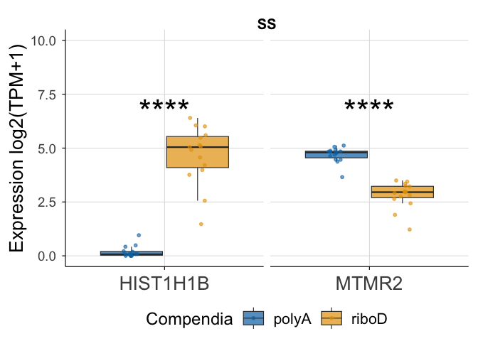

``` r
ggsave("../../Figures/Fig1E.png", plot = Fig1E_SS[[1]])
```

    Saving 7 x 5 in image

``` r
ggsave("../../Figures/Fig1E.tif", plot = Fig1E_SS[[1]])
```

    Saving 7 x 5 in image

``` r
saveRDS(Fig1E_SS[[1]],"../../Figures/Fig1E.rds")
```

``` r
Fig1E <- map(diseases, function(d) {

  median_gene <- median_gene_map[[d]]

  # HIST1H1B expression
  df_h1b <- combined_long %>%
    filter(Disease == d, Gene == "HIST1H1B") %>%
    mutate(PlotType = "HIST1H1B (PolyA-)")

  # Median-ratio gene expression
  df_median <- combined_long %>%
    filter(Disease == d, Gene == median_gene) %>%
    mutate(PlotType = "Median Ratio Gene (PolyA+)")

  # Combine
  df_combined <- bind_rows(df_h1b, df_median)

  # SIGNIFICANCE STARS
  star_df <- tibble(
    Disease = d,
    Gene = c("HIST1H1B", median_gene),
    PlotType = c("HIST1H1B (PolyA-)", "Median Ratio Gene (PolyA+)"),
    stars_adj = sig_results %>%
      filter(Disease == d, Gene %in% c("HIST1H1B", median_gene)) %>%
      arrange(match(Gene, c("HIST1H1B", median_gene))) %>%
      pull(stars_adj)
  )

  # y-position for stars (slightly above max)
  y_star <- max(df_combined$Expression, na.rm = TRUE) * 1.05

  ggplot(df_combined, aes(x = Gene, y = Expression, fill = Compendia)) +
    geom_boxplot(
      alpha = 0.7,
      position = position_dodge(width = 0.8),
      outlier.shape = NA,
      linewidth = 0.4
    ) +
    geom_jitter(
      aes(color = Compendia),
      position = position_jitterdodge(jitter.width = 0.2,
                                      dodge.width = 0.8),
      size = 1.2,
      alpha = 0.6
    ) +
    # ADD STARS
    geom_text(
      data = star_df,
      aes(x = Gene, y = y_star, label = stars_adj),
      inherit.aes = FALSE,
      size = 12
    ) +
    scale_fill_compendia() +
    scale_color_compendia() +
    coord_cartesian(ylim = c(0, 10)) +
    facet_wrap(~ PlotType, ncol = 2, scales = "free_x") +
    labs(
      title = paste(d),
      x = NULL,
      y = "Expression log2(TPM+1)"
    ) +
    color_theme() +
    theme(
      axis.title.y = element_text(size = 32),
      axis.text.y = element_text(size = 28),
      axis.text.x = element_text(size = 28),
      strip.text = element_blank(),
      plot.title = element_text(vjust = -2),
      legend.text = element_text(size = 26),       # <-- label text size
      legend.title = element_text(size = 26),      # <-- title text size
      legend.key.size = unit(2, "cm") # <-- box/key size
    )
})
Fig1E
```

    [[1]]

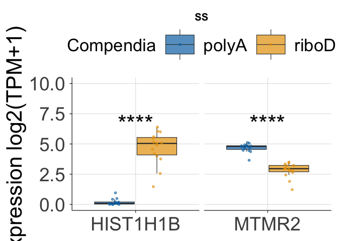


    [[2]]

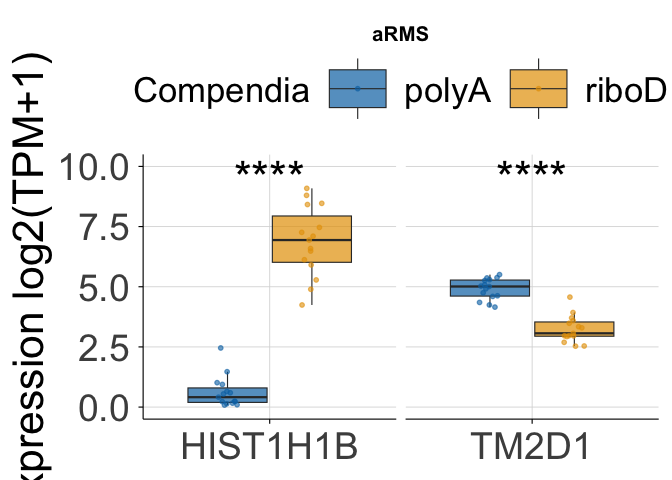


    [[3]]

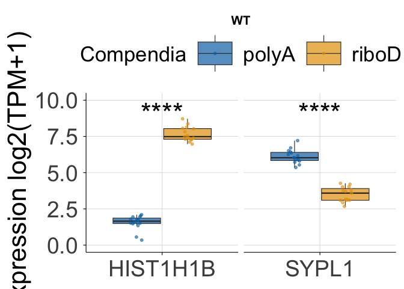


    [[4]]

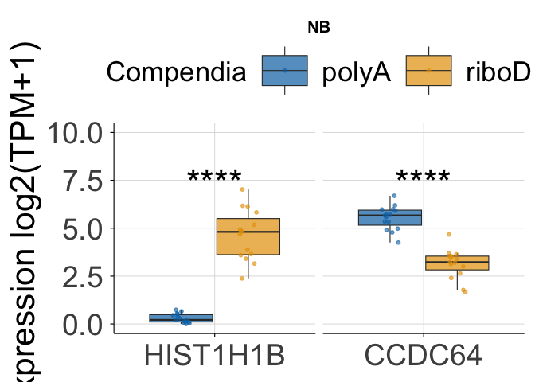


    [[5]]

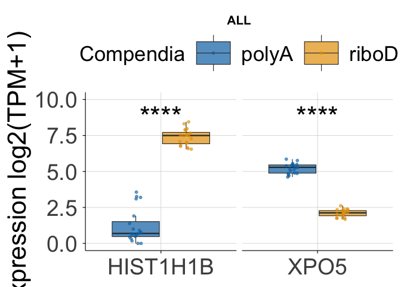


    [[6]]

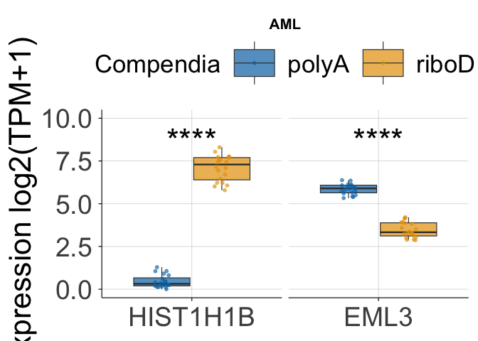

## Fig S4

``` r
SS <- Fig1E[[1]]
aRMS <- Fig1E[[2]]
WT <- Fig1E[[3]]
NB <- Fig1E[[4]]
ALL <- Fig1E[[5]]
AML <- Fig1E[[6]]

FigS4 <- wrap_plots(SS, aRMS, WT, NB, ALL, AML, ncol = 1) +
  plot_layout(guides = "collect", axis_titles = "collect", axes = "collect") +
  plot_annotation(
    theme = theme(legend.position = "bottom")
  ) &
  theme(
    plot.margin = margin(t = 2, b = 2, l = 4, r = 4),
    plot.title = element_text(face = "bold", size = 30)
  )
FigS4
```

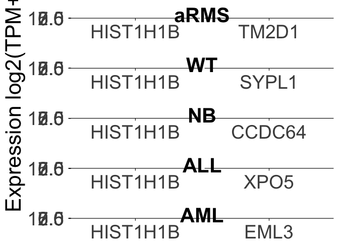

``` r
ggsave("../../Figures/FigS4.png", FigS4, width = 20, height = 30, dpi = 300)
ggsave("../../Figures/FigS4.tif", FigS4, width = 20, height = 30, dpi = 300)
```

## Fig 1F

Histogram of median ratio distributions, calculated as the median
expression level in PolyA samples divided by the median expression level
in RiboD samples

``` r
ss_ratios <- SS_gene_medians %>%
  select(Gene, Ratio = SS_median_ratio) %>%
  mutate(Disease = "SS")
write_tsv(ss_ratios, "../../output_data/Fig1E_F/ss_ratios.tsv.gz")


arms_ratios <- aRMS_gene_medians %>%
  select(Gene = Gene, Ratio = aRMS_median_ratio) %>%
  mutate(Disease = "aRMS")

wt_ratios <- WT_gene_medians %>%
  select(Gene, Ratio = WT_median_ratio) %>%
  mutate(Disease = "WT")

nb_ratios <- NB_gene_medians %>%
  select(Gene = Gene, Ratio = NB_median_ratio) %>%
  mutate(Disease = "NB")

all_ratios <- ALL_gene_medians %>%
  select(Gene = Gene, Ratio = ALL_median_ratio) %>%
  mutate(Disease = "ALL")

aml_ratios <- AML_gene_medians %>%
  select(Gene = Gene, Ratio = AML_median_ratio) %>%
  mutate(Disease = "AML")

#Combining median ratios
ratio_df <- bind_rows(ss_ratios, arms_ratios, wt_ratios, nb_ratios, aml_ratios, all_ratios)
```

``` r
theme_Fig1F <- function(base_size = 14) {
  theme_minimal(base_size = base_size) +
    theme(
      legend.position = "top",
      legend.title = element_blank(),
      panel.grid.major = element_line(color = "grey85", linewidth = 0.3),
      panel.grid.minor = element_blank(),
      axis.line = element_line(color = "black", linewidth = 0.4),
      axis.ticks = element_line(color = "black", linewidth = 0.4),
      strip.text = element_text(face = "bold", size = base_size * 0.9),
      plot.title = element_text(face = "bold", size = base_size * 1.1, hjust = 0.5),
      axis.title.y = element_text(angle = 90, hjust = 0.5, size = 15), 
      plot.margin = margin(10, 10, 10, 10)
    )
}
```

``` r
SS_HIST1H1B <- SS_gene_medians_hugo %>%
  filter(Gene %in% c("HIST1H1B"))
write_tsv(SS_HIST1H1B, "../../output_data/Fig1E_F/SS_HIST1H1B.tsv.gz")

aRMS_HIST1H1B <- aRMS_gene_median_hugo %>%
  filter(Gene %in% c("HIST1H1B"))

WT_HIST1H1B <- WT_gene_medians_hugo %>%
  filter(Gene %in% c("HIST1H1B"))

NB_HIST1H1B <- NB_gene_medians_hugo %>%
  filter(Gene %in% c("HIST1H1B"))

AML_HIST1H1B <- AML_gene_medians_hugo %>%
  filter(Gene %in% c("HIST1H1B"))

ALL_HIST1H1B <- ALL_gene_medians_hugo %>%
  filter(Gene %in% c("HIST1H1B"))
```

x = “Median expression ratio”,

y = “Number of genes expressed”

``` r
# Fig1F - SS standalone
Fig1F <- ggplot(ss_ratios, aes(x = Ratio)) +
  geom_histogram(binwidth = 0.1, alpha = 0.6, position = "identity") +
  
  geom_vline(xintercept = SS_most_average_gene_hugo$SS_median_ratio, color = "#0072B2", linetype = "dashed", linewidth = 2) +
  
  geom_text(aes(x = 2.5, y = 2000, label = SS_most_average_gene_hugo$Gene), angle = 0, vjust = -0.4, hjust = 0.3, color = "#0072B2", size = 8) +
  
  geom_vline(xintercept = SS_HIST1H1B$SS_median_ratio, color = "#E69F00", linetype = "dashed", linewidth = 2) +
  
  geom_text(aes(x = 0.9, y = 2000, label = SS_HIST1H1B$Gene), angle = 0, vjust = -5, hjust = 0.2, color = "#E69F00", size = 8) +
  
  coord_cartesian(xlim = c(0, 10), ylim = c(0, 6000)) +
  labs(
    title = "SS",
    x = "Median expression ratio",
    y = "Number of genes measured"
  ) +
  scale_y_continuous(
    labels = label_comma(scale = 1e-3, suffix = "k")
  ) +
  theme_Fig1F() +
      theme(
      axis.title.y = element_text(size = 22),
      axis.title.x = element_text(size = 22),
      axis.text.y = element_text(size = 18),
      axis.text.x = element_text(size = 18),
      strip.text = element_blank(),
      plot.title = element_text(vjust = -2)
    )

Fig1F
```

    Warning in geom_text(aes(x = 2.5, y = 2000, label = SS_most_average_gene_hugo$Gene), : All aesthetics have length 1, but the data has 60498 rows.
    ℹ Please consider using `annotate()` or provide this layer with data containing
      a single row.

    Warning in geom_text(aes(x = 0.9, y = 2000, label = SS_HIST1H1B$Gene), angle = 0, : All aesthetics have length 1, but the data has 60498 rows.
    ℹ Please consider using `annotate()` or provide this layer with data containing
      a single row.

    Warning: Removed 29257 rows containing non-finite outside the scale range
    (`stat_bin()`).

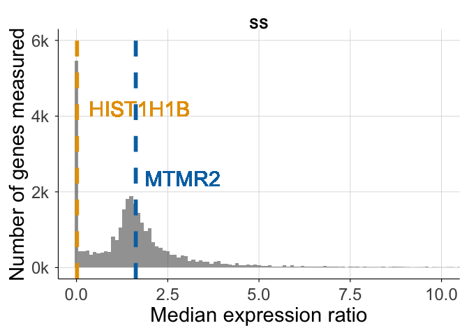

``` r
ggsave("../../Figures/Fig1F.png", plot = Fig1F)
```

    Saving 7 x 5 in image

    Warning in geom_text(aes(x = 2.5, y = 2000, label = SS_most_average_gene_hugo$Gene), : All aesthetics have length 1, but the data has 60498 rows.
    ℹ Please consider using `annotate()` or provide this layer with data containing
      a single row.

    Warning in geom_text(aes(x = 0.9, y = 2000, label = SS_HIST1H1B$Gene), angle = 0, : All aesthetics have length 1, but the data has 60498 rows.
    ℹ Please consider using `annotate()` or provide this layer with data containing
      a single row.

    Warning: Removed 29257 rows containing non-finite outside the scale range
    (`stat_bin()`).

``` r
ggsave("../../Figures/Fig1F.tif", plot = Fig1F)
```

    Saving 7 x 5 in image

    Warning in geom_text(aes(x = 2.5, y = 2000, label = SS_most_average_gene_hugo$Gene), : All aesthetics have length 1, but the data has 60498 rows.
    ℹ Please consider using `annotate()` or provide this layer with data containing
      a single row.

    Warning in geom_text(aes(x = 0.9, y = 2000, label = SS_HIST1H1B$Gene), angle = 0, : All aesthetics have length 1, but the data has 60498 rows.
    ℹ Please consider using `annotate()` or provide this layer with data containing
      a single row.

    Warning: Removed 29257 rows containing non-finite outside the scale range
    (`stat_bin()`).

``` r
saveRDS(Fig1F, "../../Figures/Fig1F.rds")
```

``` r
Fig1F_aRMS <- ggplot(arms_ratios, aes(x = Ratio)) +
  geom_histogram(binwidth = 0.1, alpha = 0.6, position = "identity") +
  geom_vline(xintercept = aRMS_most_average_gene_hugo$aRMS_median_ratio, color = "#0072B2", linetype = "dashed", linewidth = 2) +
  
  geom_text(aes(x = 2.5, y = 2000, label = aRMS_most_average_gene_hugo$Gene), angle = 0, vjust = -0.5, color = "#0072B2", size = 10) +
  
  geom_vline(xintercept = aRMS_HIST1H1B$aRMS_median_ratio, color = "#E69F00", linetype = "dashed", linewidth = 2) +
  
  geom_text(aes(x = 0.9, y = 2000, label = aRMS_HIST1H1B$Gene), angle = 0, vjust = -0.5, color = "#E69F00", size = 10) +
  coord_cartesian(xlim = c(0, 10), ylim = c(0, 6000)) +
  labs(
    title = "aRMS",
    x = "Median expression ratio",
    y = "Number of genes measured"
  ) +
  scale_y_continuous(
    labels = label_comma(scale = 1e-3, suffix = "k")
  ) +
  theme_Fig1F() +
      theme(
      axis.title.y = element_text(size = 32),
      axis.title.x = element_text(size = 32),
      axis.text.y = element_text(size = 28),
      axis.text.x = element_text(size = 28),
      strip.text = element_blank(),
      plot.title = element_text(vjust = -2)
    )

Fig1F_aRMS
```

    Warning in geom_text(aes(x = 2.5, y = 2000, label = aRMS_most_average_gene_hugo$Gene), : All aesthetics have length 1, but the data has 60498 rows.
    ℹ Please consider using `annotate()` or provide this layer with data containing
      a single row.

    Warning in geom_text(aes(x = 0.9, y = 2000, label = aRMS_HIST1H1B$Gene), : All aesthetics have length 1, but the data has 60498 rows.
    ℹ Please consider using `annotate()` or provide this layer with data containing
      a single row.

    Warning: Removed 27707 rows containing non-finite outside the scale range
    (`stat_bin()`).

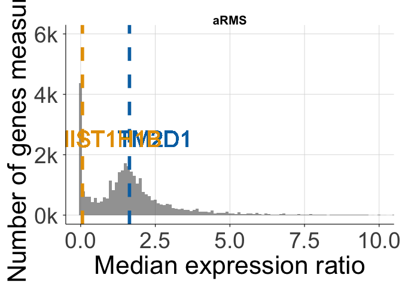

``` r
Fig1F_SS <- ggplot(ss_ratios, aes(x = Ratio)) +
  geom_histogram(binwidth = 0.1, alpha = 0.6, position = "identity") +
  
  geom_vline(xintercept = SS_most_average_gene_hugo$SS_median_ratio, color = "#0072B2", linetype = "dashed", linewidth = 2) +
  
  geom_text(aes(x = 2.5, y = 2000, label = SS_most_average_gene_hugo$Gene), angle = 0, vjust = -0.5, color = "#0072B2", size = 10) +
  
  geom_vline(xintercept = SS_HIST1H1B$SS_median_ratio, color = "#E69F00", linetype = "dashed", linewidth = 2) +
  
  geom_text(aes(x = 0.9, y = 2000, label = SS_HIST1H1B$Gene), angle = 0, vjust = -0.5, color = "#E69F00", size = 10) +
  
  coord_cartesian(xlim = c(0, 10), ylim = c(0, 6000)) +
  labs(
    title = "SS",
    x = "Median expression ratio",
    y = "Number of genes measured"
  ) +
  scale_y_continuous(
    labels = label_comma(scale = 1e-3, suffix = "k")
  ) +
  theme_Fig1F() +
      theme(
      axis.title.y = element_text(size = 32),
      axis.title.x = element_text(size = 32),
      axis.text.y = element_text(size = 28),
      axis.text.x = element_text(size = 28),
      strip.text = element_blank(),
      plot.title = element_text(vjust = -2)
    )

Fig1F_SS
```

    Warning in geom_text(aes(x = 2.5, y = 2000, label = SS_most_average_gene_hugo$Gene), : All aesthetics have length 1, but the data has 60498 rows.
    ℹ Please consider using `annotate()` or provide this layer with data containing
      a single row.

    Warning in geom_text(aes(x = 0.9, y = 2000, label = SS_HIST1H1B$Gene), angle = 0, : All aesthetics have length 1, but the data has 60498 rows.
    ℹ Please consider using `annotate()` or provide this layer with data containing
      a single row.

    Warning: Removed 29257 rows containing non-finite outside the scale range
    (`stat_bin()`).

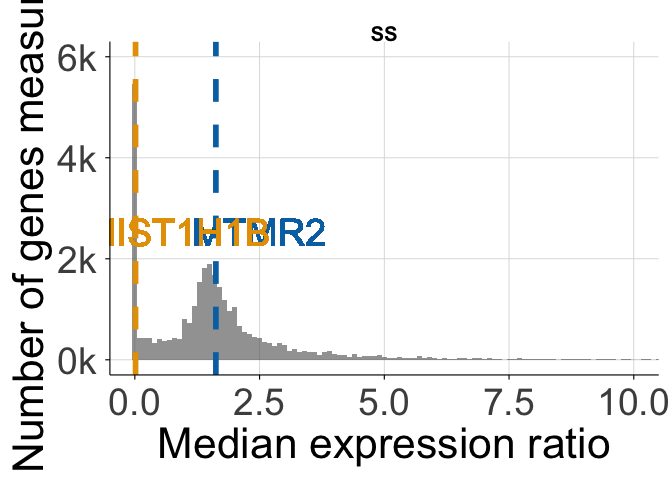

``` r
Fig1F_WT <- ggplot(wt_ratios, aes(x = Ratio)) +
  geom_histogram(binwidth = 0.1, alpha = 0.6, position = "identity") +
  
  geom_vline(xintercept = WT_most_average_gene_hugo$WT_median_ratio, color = "#0072B2", linetype = "dashed", linewidth = 2) +
  
  geom_text(aes(x = 2.5, y = 2000, label = WT_most_average_gene_hugo$Gene), angle = 0, vjust = -0.5, color = "#0072B2", size = 10) +
  
  geom_vline(xintercept = WT_HIST1H1B$WT_median_ratio, color = "#E69F00", linetype = "dashed", linewidth = 2) +
  
  geom_text(aes(x = 0.9, y = 2000, label = WT_HIST1H1B$Gene), angle = 0, vjust = -0.5, color = "#E69F00", size = 10) +
  
  coord_cartesian(xlim = c(0, 10), ylim = c(0, 6000)) +
  labs(
    title = "WT",
    x = "Median expression ratio",
    y = "Number of genes measured"
  ) +
  scale_y_continuous(
    labels = label_comma(scale = 1e-3, suffix = "k")
  ) +
  theme_Fig1F() +
      theme(
      axis.title.y = element_text(size = 32),
      axis.title.x = element_text(size = 32),
      axis.text.y = element_text(size = 28),
      axis.text.x = element_text(size = 28),
      strip.text = element_blank(),
      plot.title = element_text(vjust = -2)
    )

Fig1F_WT
```

    Warning in geom_text(aes(x = 2.5, y = 2000, label = WT_most_average_gene_hugo$Gene), : All aesthetics have length 1, but the data has 60498 rows.
    ℹ Please consider using `annotate()` or provide this layer with data containing
      a single row.

    Warning in geom_text(aes(x = 0.9, y = 2000, label = WT_HIST1H1B$Gene), angle = 0, : All aesthetics have length 1, but the data has 60498 rows.
    ℹ Please consider using `annotate()` or provide this layer with data containing
      a single row.

    Warning: Removed 26797 rows containing non-finite outside the scale range
    (`stat_bin()`).

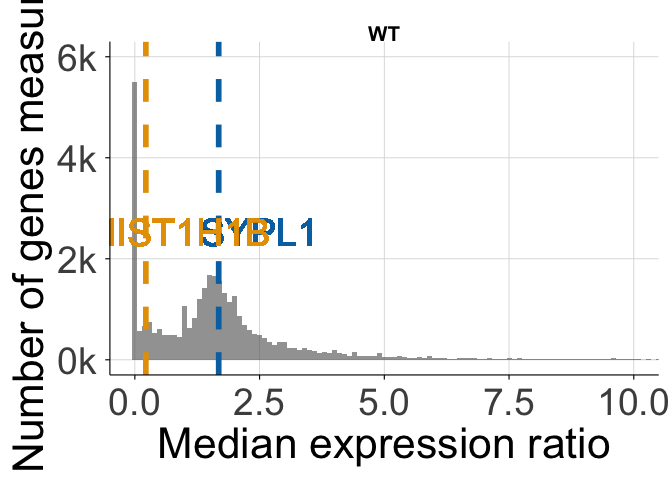

``` r
Fig1F_NB <- ggplot(nb_ratios, aes(x = Ratio)) +
  geom_histogram(binwidth = 0.1, alpha = 0.6, position = "identity") +
  
  geom_vline(xintercept = NB_most_average_gene_hugo$NB_median_ratio, color = "#0072B2", linetype = "dashed", linewidth = 2) +
  
  geom_text(aes(x = 2.5, y = 2000, label = NB_most_average_gene_hugo$Gene), angle = 0, vjust = -0.5, color = "#0072B2", size = 10) +
  
  geom_vline(xintercept = NB_HIST1H1B$NB_median_ratio, color = "#E69F00", linetype = "dashed", linewidth = 2) +
  
  geom_text(aes(x = 0.9, y = 2000, label = NB_HIST1H1B$Gene), angle = 0, vjust = -0.5, color = "#E69F00", size = 10) +
  
  coord_cartesian(xlim = c(0, 10), ylim = c(0, 6000)) +
  labs(
    title = "NB",
    x = "Median expression ratio",
    y = "Number of genes measured"
  ) +
  scale_y_continuous(
    labels = label_comma(scale = 1e-3, suffix = "k")
  ) +
  theme_Fig1F() +
      theme(
      axis.title.y = element_text(size = 32),
      axis.title.x = element_text(size = 32),
      axis.text.y = element_text(size = 28),
      axis.text.x = element_text(size = 28),
      strip.text = element_blank(),
      plot.title = element_text(vjust = -2)
    )

Fig1F_NB
```

    Warning in geom_text(aes(x = 2.5, y = 2000, label = NB_most_average_gene_hugo$Gene), : All aesthetics have length 1, but the data has 60498 rows.
    ℹ Please consider using `annotate()` or provide this layer with data containing
      a single row.

    Warning in geom_text(aes(x = 0.9, y = 2000, label = NB_HIST1H1B$Gene), angle = 0, : All aesthetics have length 1, but the data has 60498 rows.
    ℹ Please consider using `annotate()` or provide this layer with data containing
      a single row.

    Warning: Removed 25112 rows containing non-finite outside the scale range
    (`stat_bin()`).

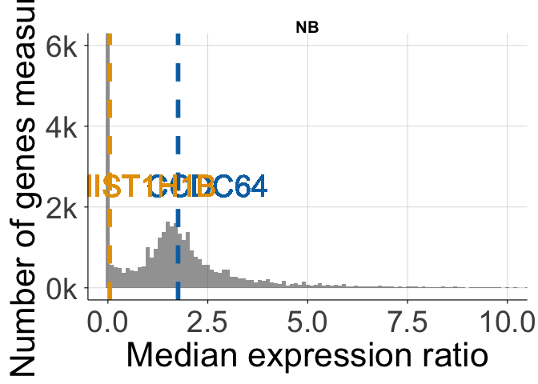

``` r
Fig1F_ALL <- ggplot(all_ratios, aes(x = Ratio)) +
  geom_histogram(binwidth = 0.1, alpha = 0.6, position = "identity") +
  
  geom_vline(xintercept = ALL_most_average_gene_hugo$ALL_median_ratio, color = "#0072B2", linetype = "dashed", linewidth = 2) +
  
  geom_text(aes(x = 2.5, y = 2000, label = ALL_most_average_gene_hugo$Gene), angle = 0, vjust = -0.5, color = "#0072B2", size = 10) +
  
  geom_vline(xintercept = ALL_HIST1H1B$AML_median_ratio, color = "#E69F00", linetype = "dashed", linewidth = 2) +
  
  geom_text(aes(x = 0.9, y = 2000, label = ALL_HIST1H1B$Gene), angle = 0, vjust = -0.5, color = "#E69F00", size = 10) +
  
  coord_cartesian(xlim = c(0, 10), ylim = c(0, 6000)) +
  labs(
    title = "ALL",
    x = "Median expression ratio",
    y = "Number of genes measured"
  ) +
  scale_y_continuous(
    labels = label_comma(scale = 1e-3, suffix = "k")
  ) +
  theme_Fig1F() +
      theme(
      axis.title.y = element_text(size = 32),
      axis.title.x = element_text(size = 32),
      axis.text.y = element_text(size = 28),
      axis.text.x = element_text(size = 28),
      strip.text = element_blank(),
      plot.title = element_text(vjust = -2)
    )
```

    Warning: Unknown or uninitialised column: `AML_median_ratio`.

``` r
Fig1F_ALL
```

    Warning in geom_text(aes(x = 2.5, y = 2000, label = ALL_most_average_gene_hugo$Gene), : All aesthetics have length 1, but the data has 60498 rows.
    ℹ Please consider using `annotate()` or provide this layer with data containing
      a single row.

    Warning in geom_text(aes(x = 0.9, y = 2000, label = ALL_HIST1H1B$Gene), : All aesthetics have length 1, but the data has 60498 rows.
    ℹ Please consider using `annotate()` or provide this layer with data containing
      a single row.

    Warning: Removed 31150 rows containing non-finite outside the scale range
    (`stat_bin()`).

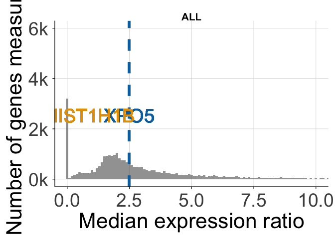

``` r
Fig1F_AML <- ggplot(aml_ratios, aes(x = Ratio)) +
  geom_histogram(binwidth = 0.1, alpha = 0.6, position = "identity") +
  
  geom_vline(xintercept = AML_most_average_gene_hugo$AML_median_ratio, color = "#0072B2", linetype = "dashed", linewidth = 2) +
  
  geom_text(aes(x = 2.5, y = 2000, label = AML_most_average_gene_hugo$Gene), angle = 0, vjust = -0.5, color = "#0072B2", size = 10) +
  
  geom_vline(xintercept = AML_HIST1H1B$AML_median_ratio, color = "#E69F00", linetype = "dashed", linewidth = 2) +
  
  geom_text(aes(x = 0.9, y = 2000, label = AML_HIST1H1B$Gene), angle = 0, vjust = -0.5, color = "#E69F00", size = 10) +
  
  coord_cartesian(xlim = c(0, 10), ylim = c(0, 6000)) +
  labs(
   title = "AML",
    x = "Median expression ratio",
    y = "Number of genes measured"
  ) +
  scale_y_continuous(
    labels = label_comma(scale = 1e-3, suffix = "k")
  ) +
  theme_Fig1F() +
      theme(
      axis.title.y = element_text(size = 32),
      axis.title.x = element_text(size = 32),
      axis.text.y = element_text(size = 28),
      axis.text.x = element_text(size = 28),
      strip.text = element_blank(),
      plot.title = element_text(vjust = -2)
    )

Fig1F_AML
```

    Warning in geom_text(aes(x = 2.5, y = 2000, label = AML_most_average_gene_hugo$Gene), : All aesthetics have length 1, but the data has 60498 rows.
    ℹ Please consider using `annotate()` or provide this layer with data containing
      a single row.

    Warning in geom_text(aes(x = 0.9, y = 2000, label = AML_HIST1H1B$Gene), : All aesthetics have length 1, but the data has 60498 rows.
    ℹ Please consider using `annotate()` or provide this layer with data containing
      a single row.

    Warning: Removed 30953 rows containing non-finite outside the scale range
    (`stat_bin()`).

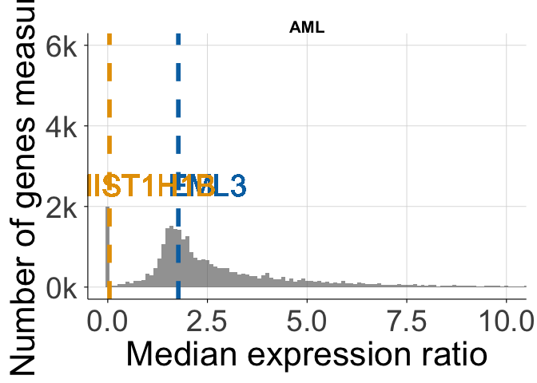

## Fig S5

``` r
FigS5 <- wrap_plots(Fig1F_SS, Fig1F_aRMS, Fig1F_WT, Fig1F_NB, Fig1F_ALL, Fig1F_AML, ncol = 1) +
  plot_layout(guides = "collect", axis_titles = "collect", axes = "collect") +
  plot_annotation(
    theme = theme(legend.position = "bottom")
  ) &
  theme(
    plot.margin = margin(t = 2, b = 2, l = 4, r = 4),
    plot.title = element_text(face = "bold", size = 30),
    legend.title = NULL
  )
FigS5
```

    Warning in geom_text(aes(x = 2.5, y = 2000, label = SS_most_average_gene_hugo$Gene), : All aesthetics have length 1, but the data has 60498 rows.
    ℹ Please consider using `annotate()` or provide this layer with data containing
      a single row.

    Warning in geom_text(aes(x = 0.9, y = 2000, label = SS_HIST1H1B$Gene), angle = 0, : All aesthetics have length 1, but the data has 60498 rows.
    ℹ Please consider using `annotate()` or provide this layer with data containing
      a single row.

    Warning: Removed 29257 rows containing non-finite outside the scale range
    (`stat_bin()`).

    Warning in geom_text(aes(x = 2.5, y = 2000, label = aRMS_most_average_gene_hugo$Gene), : All aesthetics have length 1, but the data has 60498 rows.
    ℹ Please consider using `annotate()` or provide this layer with data containing
      a single row.

    Warning in geom_text(aes(x = 0.9, y = 2000, label = aRMS_HIST1H1B$Gene), : All aesthetics have length 1, but the data has 60498 rows.
    ℹ Please consider using `annotate()` or provide this layer with data containing
      a single row.

    Warning: Removed 27707 rows containing non-finite outside the scale range
    (`stat_bin()`).

    Warning in geom_text(aes(x = 2.5, y = 2000, label = WT_most_average_gene_hugo$Gene), : All aesthetics have length 1, but the data has 60498 rows.
    ℹ Please consider using `annotate()` or provide this layer with data containing
      a single row.

    Warning in geom_text(aes(x = 0.9, y = 2000, label = WT_HIST1H1B$Gene), angle = 0, : All aesthetics have length 1, but the data has 60498 rows.
    ℹ Please consider using `annotate()` or provide this layer with data containing
      a single row.

    Warning: Removed 26797 rows containing non-finite outside the scale range
    (`stat_bin()`).

    Warning in geom_text(aes(x = 2.5, y = 2000, label = NB_most_average_gene_hugo$Gene), : All aesthetics have length 1, but the data has 60498 rows.
    ℹ Please consider using `annotate()` or provide this layer with data containing
      a single row.

    Warning in geom_text(aes(x = 0.9, y = 2000, label = NB_HIST1H1B$Gene), angle = 0, : All aesthetics have length 1, but the data has 60498 rows.
    ℹ Please consider using `annotate()` or provide this layer with data containing
      a single row.

    Warning: Removed 25112 rows containing non-finite outside the scale range
    (`stat_bin()`).

    Warning in geom_text(aes(x = 2.5, y = 2000, label = ALL_most_average_gene_hugo$Gene), : All aesthetics have length 1, but the data has 60498 rows.
    ℹ Please consider using `annotate()` or provide this layer with data containing
      a single row.

    Warning in geom_text(aes(x = 0.9, y = 2000, label = ALL_HIST1H1B$Gene), : All aesthetics have length 1, but the data has 60498 rows.
    ℹ Please consider using `annotate()` or provide this layer with data containing
      a single row.

    Warning: Removed 31150 rows containing non-finite outside the scale range
    (`stat_bin()`).

    Warning in geom_text(aes(x = 2.5, y = 2000, label = AML_most_average_gene_hugo$Gene), : All aesthetics have length 1, but the data has 60498 rows.
    ℹ Please consider using `annotate()` or provide this layer with data containing
      a single row.

    Warning in geom_text(aes(x = 0.9, y = 2000, label = AML_HIST1H1B$Gene), : All aesthetics have length 1, but the data has 60498 rows.
    ℹ Please consider using `annotate()` or provide this layer with data containing
      a single row.

    Warning: Removed 30953 rows containing non-finite outside the scale range
    (`stat_bin()`).

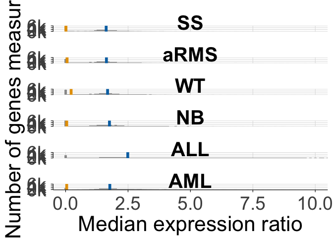

``` r
ggsave("../../Figures/FigS5.png", FigS5, width = 20, height = 30, dpi = 300)
```

    Warning in geom_text(aes(x = 2.5, y = 2000, label = SS_most_average_gene_hugo$Gene), : All aesthetics have length 1, but the data has 60498 rows.
    ℹ Please consider using `annotate()` or provide this layer with data containing
      a single row.

    Warning in geom_text(aes(x = 0.9, y = 2000, label = SS_HIST1H1B$Gene), angle = 0, : All aesthetics have length 1, but the data has 60498 rows.
    ℹ Please consider using `annotate()` or provide this layer with data containing
      a single row.

    Warning: Removed 29257 rows containing non-finite outside the scale range
    (`stat_bin()`).

    Warning in geom_text(aes(x = 2.5, y = 2000, label = aRMS_most_average_gene_hugo$Gene), : All aesthetics have length 1, but the data has 60498 rows.
    ℹ Please consider using `annotate()` or provide this layer with data containing
      a single row.

    Warning in geom_text(aes(x = 0.9, y = 2000, label = aRMS_HIST1H1B$Gene), : All aesthetics have length 1, but the data has 60498 rows.
    ℹ Please consider using `annotate()` or provide this layer with data containing
      a single row.

    Warning: Removed 27707 rows containing non-finite outside the scale range
    (`stat_bin()`).

    Warning in geom_text(aes(x = 2.5, y = 2000, label = WT_most_average_gene_hugo$Gene), : All aesthetics have length 1, but the data has 60498 rows.
    ℹ Please consider using `annotate()` or provide this layer with data containing
      a single row.

    Warning in geom_text(aes(x = 0.9, y = 2000, label = WT_HIST1H1B$Gene), angle = 0, : All aesthetics have length 1, but the data has 60498 rows.
    ℹ Please consider using `annotate()` or provide this layer with data containing
      a single row.

    Warning: Removed 26797 rows containing non-finite outside the scale range
    (`stat_bin()`).

    Warning in geom_text(aes(x = 2.5, y = 2000, label = NB_most_average_gene_hugo$Gene), : All aesthetics have length 1, but the data has 60498 rows.
    ℹ Please consider using `annotate()` or provide this layer with data containing
      a single row.

    Warning in geom_text(aes(x = 0.9, y = 2000, label = NB_HIST1H1B$Gene), angle = 0, : All aesthetics have length 1, but the data has 60498 rows.
    ℹ Please consider using `annotate()` or provide this layer with data containing
      a single row.

    Warning: Removed 25112 rows containing non-finite outside the scale range
    (`stat_bin()`).

    Warning in geom_text(aes(x = 2.5, y = 2000, label = ALL_most_average_gene_hugo$Gene), : All aesthetics have length 1, but the data has 60498 rows.
    ℹ Please consider using `annotate()` or provide this layer with data containing
      a single row.

    Warning in geom_text(aes(x = 0.9, y = 2000, label = ALL_HIST1H1B$Gene), : All aesthetics have length 1, but the data has 60498 rows.
    ℹ Please consider using `annotate()` or provide this layer with data containing
      a single row.

    Warning: Removed 31150 rows containing non-finite outside the scale range
    (`stat_bin()`).

    Warning in geom_text(aes(x = 2.5, y = 2000, label = AML_most_average_gene_hugo$Gene), : All aesthetics have length 1, but the data has 60498 rows.
    ℹ Please consider using `annotate()` or provide this layer with data containing
      a single row.

    Warning in geom_text(aes(x = 0.9, y = 2000, label = AML_HIST1H1B$Gene), : All aesthetics have length 1, but the data has 60498 rows.
    ℹ Please consider using `annotate()` or provide this layer with data containing
      a single row.

    Warning: Removed 30953 rows containing non-finite outside the scale range
    (`stat_bin()`).

``` r
ggsave("../../Figures/FigS5.tif", FigS5, width = 20, height = 30, dpi = 300)
```

    Warning in geom_text(aes(x = 2.5, y = 2000, label = SS_most_average_gene_hugo$Gene), : All aesthetics have length 1, but the data has 60498 rows.
    ℹ Please consider using `annotate()` or provide this layer with data containing
      a single row.

    Warning in geom_text(aes(x = 0.9, y = 2000, label = SS_HIST1H1B$Gene), angle = 0, : All aesthetics have length 1, but the data has 60498 rows.
    ℹ Please consider using `annotate()` or provide this layer with data containing
      a single row.

    Warning: Removed 29257 rows containing non-finite outside the scale range
    (`stat_bin()`).

    Warning in geom_text(aes(x = 2.5, y = 2000, label = aRMS_most_average_gene_hugo$Gene), : All aesthetics have length 1, but the data has 60498 rows.
    ℹ Please consider using `annotate()` or provide this layer with data containing
      a single row.

    Warning in geom_text(aes(x = 0.9, y = 2000, label = aRMS_HIST1H1B$Gene), : All aesthetics have length 1, but the data has 60498 rows.
    ℹ Please consider using `annotate()` or provide this layer with data containing
      a single row.

    Warning: Removed 27707 rows containing non-finite outside the scale range
    (`stat_bin()`).

    Warning in geom_text(aes(x = 2.5, y = 2000, label = WT_most_average_gene_hugo$Gene), : All aesthetics have length 1, but the data has 60498 rows.
    ℹ Please consider using `annotate()` or provide this layer with data containing
      a single row.

    Warning in geom_text(aes(x = 0.9, y = 2000, label = WT_HIST1H1B$Gene), angle = 0, : All aesthetics have length 1, but the data has 60498 rows.
    ℹ Please consider using `annotate()` or provide this layer with data containing
      a single row.

    Warning: Removed 26797 rows containing non-finite outside the scale range
    (`stat_bin()`).

    Warning in geom_text(aes(x = 2.5, y = 2000, label = NB_most_average_gene_hugo$Gene), : All aesthetics have length 1, but the data has 60498 rows.
    ℹ Please consider using `annotate()` or provide this layer with data containing
      a single row.

    Warning in geom_text(aes(x = 0.9, y = 2000, label = NB_HIST1H1B$Gene), angle = 0, : All aesthetics have length 1, but the data has 60498 rows.
    ℹ Please consider using `annotate()` or provide this layer with data containing
      a single row.

    Warning: Removed 25112 rows containing non-finite outside the scale range
    (`stat_bin()`).

    Warning in geom_text(aes(x = 2.5, y = 2000, label = ALL_most_average_gene_hugo$Gene), : All aesthetics have length 1, but the data has 60498 rows.
    ℹ Please consider using `annotate()` or provide this layer with data containing
      a single row.

    Warning in geom_text(aes(x = 0.9, y = 2000, label = ALL_HIST1H1B$Gene), : All aesthetics have length 1, but the data has 60498 rows.
    ℹ Please consider using `annotate()` or provide this layer with data containing
      a single row.

    Warning: Removed 31150 rows containing non-finite outside the scale range
    (`stat_bin()`).

    Warning in geom_text(aes(x = 2.5, y = 2000, label = AML_most_average_gene_hugo$Gene), : All aesthetics have length 1, but the data has 60498 rows.
    ℹ Please consider using `annotate()` or provide this layer with data containing
      a single row.

    Warning in geom_text(aes(x = 0.9, y = 2000, label = AML_HIST1H1B$Gene), : All aesthetics have length 1, but the data has 60498 rows.
    ℹ Please consider using `annotate()` or provide this layer with data containing
      a single row.

    Warning: Removed 30953 rows containing non-finite outside the scale range
    (`stat_bin()`).

Session Info

``` r
sessioninfo::session_info()
```

    ─ Session info ───────────────────────────────────────────────────────────────
     setting  value
     version  R version 4.5.2 (2025-10-31)
     os       macOS Tahoe 26.5
     system   aarch64, darwin20
     ui       X11
     language (EN)
     collate  en_US.UTF-8
     ctype    en_US.UTF-8
     tz       America/Los_Angeles
     date     2026-07-07
     pandoc   3.8.3 @ /Applications/RStudio.app/Contents/Resources/app/quarto/bin/tools/aarch64/ (via rmarkdown)
     quarto   1.9.36 @ /Applications/RStudio.app/Contents/Resources/app/quarto/bin/quarto

    ─ Packages ───────────────────────────────────────────────────────────────────
     package      * version date (UTC) lib source
     bit            4.6.0   2025-03-06 [1] CRAN (R 4.5.0)
     bit64          4.6.0-1 2025-01-16 [1] CRAN (R 4.5.0)
     cli            3.6.5   2025-04-23 [1] CRAN (R 4.5.0)
     cowplot      * 1.2.0   2025-07-07 [1] CRAN (R 4.5.0)
     crayon         1.5.3   2024-06-20 [1] CRAN (R 4.5.0)
     digest         0.6.37  2024-08-19 [1] CRAN (R 4.5.0)
     dplyr        * 1.1.4   2023-11-17 [1] CRAN (R 4.5.0)
     evaluate       1.0.5   2025-08-27 [1] CRAN (R 4.5.0)
     farver         2.1.2   2024-05-13 [1] CRAN (R 4.5.0)
     fastmap        1.2.0   2024-05-15 [1] CRAN (R 4.5.0)
     forcats      * 1.0.1   2025-09-25 [1] CRAN (R 4.5.0)
     generics       0.1.4   2025-05-09 [1] CRAN (R 4.5.0)
     ggplot2      * 4.0.0   2025-09-11 [1] CRAN (R 4.5.0)
     glue           1.8.0   2024-09-30 [1] CRAN (R 4.5.0)
     gtable         0.3.6   2024-10-25 [1] CRAN (R 4.5.0)
     hms            1.1.4   2025-10-17 [1] CRAN (R 4.5.0)
     htmltools      0.5.8.1 2024-04-04 [1] CRAN (R 4.5.0)
     jsonlite       2.0.0   2025-03-27 [1] CRAN (R 4.5.0)
     knitr          1.50    2025-03-16 [1] CRAN (R 4.5.0)
     labeling       0.4.3   2023-08-29 [1] CRAN (R 4.5.0)
     lifecycle      1.0.4   2023-11-07 [1] CRAN (R 4.5.0)
     lubridate    * 1.9.4   2024-12-08 [1] CRAN (R 4.5.0)
     magrittr       2.0.4   2025-09-12 [1] CRAN (R 4.5.0)
     patchwork    * 1.3.2   2025-08-25 [1] CRAN (R 4.5.0)
     pillar         1.11.1  2025-09-17 [1] CRAN (R 4.5.0)
     pkgconfig      2.0.3   2019-09-22 [1] CRAN (R 4.5.0)
     purrr        * 1.1.0   2025-07-10 [1] CRAN (R 4.5.0)
     R6             2.6.1   2025-02-15 [1] CRAN (R 4.5.0)
     ragg           1.5.0   2025-09-02 [1] CRAN (R 4.5.0)
     RColorBrewer   1.1-3   2022-04-03 [1] CRAN (R 4.5.0)
     readr        * 2.1.5   2024-01-10 [1] CRAN (R 4.5.0)
     rlang          1.2.0   2026-04-06 [1] CRAN (R 4.5.2)
     rmarkdown      2.30    2025-09-28 [1] CRAN (R 4.5.0)
     rstudioapi     0.17.1  2024-10-22 [1] CRAN (R 4.5.0)
     S7             0.2.0   2024-11-07 [1] CRAN (R 4.5.0)
     scales       * 1.4.0   2025-04-24 [1] CRAN (R 4.5.0)
     sessioninfo    1.2.3   2025-02-05 [1] CRAN (R 4.5.0)
     stringi        1.8.7   2025-03-27 [1] CRAN (R 4.5.0)
     stringr      * 1.5.2   2025-09-08 [1] CRAN (R 4.5.0)
     systemfonts    1.3.1   2025-10-01 [1] CRAN (R 4.5.0)
     textshaping    1.0.4   2025-10-10 [1] CRAN (R 4.5.0)
     tibble       * 3.3.0   2025-06-08 [1] CRAN (R 4.5.0)
     tidyr        * 1.3.1   2024-01-24 [1] CRAN (R 4.5.0)
     tidyselect     1.2.1   2024-03-11 [1] CRAN (R 4.5.0)
     tidyverse    * 2.0.0   2023-02-22 [1] CRAN (R 4.5.0)
     timechange     0.3.0   2024-01-18 [1] CRAN (R 4.5.0)
     tzdb           0.5.0   2025-03-15 [1] CRAN (R 4.5.0)
     vctrs          0.6.5   2023-12-01 [1] CRAN (R 4.5.0)
     vroom          1.6.6   2025-09-19 [1] CRAN (R 4.5.0)
     withr          3.0.2   2024-10-28 [1] CRAN (R 4.5.0)
     xfun           0.55    2025-12-16 [1] CRAN (R 4.5.2)
     yaml           2.3.10  2024-07-26 [1] CRAN (R 4.5.0)

     [1] /Library/Frameworks/R.framework/Versions/4.5-arm64/Resources/library
     * ── Packages attached to the search path.

    ──────────────────────────────────────────────────────────────────────────────
