# Fig1G


## Fig 1G

Scatterplot showing median expression per gene.

``` r
library(tidyverse)
```

    ── Attaching core tidyverse packages ──────────────────────── tidyverse 2.0.0 ──
    ✔ dplyr     1.1.4     ✔ readr     2.1.5
    ✔ forcats   1.0.1     ✔ stringr   1.5.2
    ✔ ggplot2   4.0.0     ✔ tibble    3.3.0
    ✔ lubridate 1.9.4     ✔ tidyr     1.3.1
    ✔ purrr     1.1.0     
    ── Conflicts ────────────────────────────────────────── tidyverse_conflicts() ──
    ✖ dplyr::filter() masks stats::filter()
    ✖ dplyr::lag()    masks stats::lag()
    ℹ Use the conflicted package (<http://conflicted.r-lib.org/>) to force all conflicts to become errors

``` r
library(ggrepel)
library(patchwork)
```

``` r
# sample ID files
# polyA
SS_polyA_list <- read_tsv("../../input_data/sample_selection/SS_polyA_list.tsv")
```

    Rows: 15 Columns: 2
    ── Column specification ────────────────────────────────────────────────────────
    Delimiter: "\t"
    chr (2): term, disease_and_prep

    ℹ Use `spec()` to retrieve the full column specification for this data.
    ℹ Specify the column types or set `show_col_types = FALSE` to quiet this message.

``` r
aRMS_polyA_list <- read_tsv("../../input_data/sample_selection/aRMS_polyA_list.tsv")
```

    Rows: 15 Columns: 2
    ── Column specification ────────────────────────────────────────────────────────
    Delimiter: "\t"
    chr (2): term, disease_and_prep

    ℹ Use `spec()` to retrieve the full column specification for this data.
    ℹ Specify the column types or set `show_col_types = FALSE` to quiet this message.

``` r
WT_polyA_list <- read_tsv("../../input_data/sample_selection/WT_polyA_list.tsv")
```

    Rows: 15 Columns: 2
    ── Column specification ────────────────────────────────────────────────────────
    Delimiter: "\t"
    chr (2): term, disease_and_prep

    ℹ Use `spec()` to retrieve the full column specification for this data.
    ℹ Specify the column types or set `show_col_types = FALSE` to quiet this message.

``` r
NB_polyA_list <- read_tsv("../../input_data/sample_selection/NB_polyA_list.tsv")
```

    Rows: 15 Columns: 2
    ── Column specification ────────────────────────────────────────────────────────
    Delimiter: "\t"
    chr (2): term, disease_and_prep

    ℹ Use `spec()` to retrieve the full column specification for this data.
    ℹ Specify the column types or set `show_col_types = FALSE` to quiet this message.

``` r
ALL_polyA_list <- read_tsv("../../input_data/sample_selection/ALL_polyA_list.tsv")
```

    Rows: 20 Columns: 2
    ── Column specification ────────────────────────────────────────────────────────
    Delimiter: "\t"
    chr (2): term, disease_and_prep

    ℹ Use `spec()` to retrieve the full column specification for this data.
    ℹ Specify the column types or set `show_col_types = FALSE` to quiet this message.

``` r
AML_polyA_list <- read_tsv("../../input_data/sample_selection/AML_polyA_list.tsv")
```

    Rows: 20 Columns: 2
    ── Column specification ────────────────────────────────────────────────────────
    Delimiter: "\t"
    chr (2): term, disease_and_prep

    ℹ Use `spec()` to retrieve the full column specification for this data.
    ℹ Specify the column types or set `show_col_types = FALSE` to quiet this message.

``` r
# riboD
SS_riboD_list <- read_tsv("../../input_data/sample_selection/SS_riboD_list.tsv")
```

    Rows: 15 Columns: 2
    ── Column specification ────────────────────────────────────────────────────────
    Delimiter: "\t"
    chr (2): term, disease_and_prep

    ℹ Use `spec()` to retrieve the full column specification for this data.
    ℹ Specify the column types or set `show_col_types = FALSE` to quiet this message.

``` r
aRMS_riboD_list <- read_tsv("../../input_data/sample_selection/aRMS_riboD_list.tsv")
```

    Rows: 15 Columns: 2
    ── Column specification ────────────────────────────────────────────────────────
    Delimiter: "\t"
    chr (2): term, disease_and_prep

    ℹ Use `spec()` to retrieve the full column specification for this data.
    ℹ Specify the column types or set `show_col_types = FALSE` to quiet this message.

``` r
WT_riboD_list <- read_tsv("../../input_data/sample_selection/WT_riboD_list.tsv")
```

    Rows: 15 Columns: 2
    ── Column specification ────────────────────────────────────────────────────────
    Delimiter: "\t"
    chr (2): term, disease_and_prep

    ℹ Use `spec()` to retrieve the full column specification for this data.
    ℹ Specify the column types or set `show_col_types = FALSE` to quiet this message.

``` r
NB_riboD_list <- read_tsv("../../input_data/sample_selection/NB_riboD_list.tsv")
```

    Rows: 15 Columns: 2
    ── Column specification ────────────────────────────────────────────────────────
    Delimiter: "\t"
    chr (2): term, disease_and_prep

    ℹ Use `spec()` to retrieve the full column specification for this data.
    ℹ Specify the column types or set `show_col_types = FALSE` to quiet this message.

``` r
ALL_riboD_list <- read_tsv("../../input_data/sample_selection/ALL_riboD_list.tsv")
```

    Rows: 20 Columns: 2
    ── Column specification ────────────────────────────────────────────────────────
    Delimiter: "\t"
    chr (2): term, disease_and_prep

    ℹ Use `spec()` to retrieve the full column specification for this data.
    ℹ Specify the column types or set `show_col_types = FALSE` to quiet this message.

``` r
AML_riboD_list <- read_tsv("../../input_data/sample_selection/AML_riboD_list.tsv")
```

    Rows: 20 Columns: 2
    ── Column specification ────────────────────────────────────────────────────────
    Delimiter: "\t"
    chr (2): term, disease_and_prep

    ℹ Use `spec()` to retrieve the full column specification for this data.
    ℹ Specify the column types or set `show_col_types = FALSE` to quiet this message.

``` r
# log2(TPM+1) expression files
SS_polyA_log2tpm1 <- read_tsv("../../input_data/sample_selection/SS_polyA_log2tpm1.tsv")
```

    Rows: 60498 Columns: 16
    ── Column specification ────────────────────────────────────────────────────────
    Delimiter: "\t"
    chr  (1): Gene
    dbl (15): THR39_1373_S01, TCGA-WK-A8XT-01, TH40_2281_S01, THR39_1375_S01, TH...

    ℹ Use `spec()` to retrieve the full column specification for this data.
    ℹ Specify the column types or set `show_col_types = FALSE` to quiet this message.

``` r
SS_riboD_log2tpm1 <- read_tsv("../../input_data/sample_selection/SS_riboD_log2tpm1.tsv")
```

    Rows: 60498 Columns: 16
    ── Column specification ────────────────────────────────────────────────────────
    Delimiter: "\t"
    chr  (1): Gene
    dbl (15): THR51_4556_S01, THR51_4558_S01, THR51_4554_S01, THR24_3992_S01, TH...

    ℹ Use `spec()` to retrieve the full column specification for this data.
    ℹ Specify the column types or set `show_col_types = FALSE` to quiet this message.

``` r
aRMS_polyA_log2tpm1 <- read_tsv("../../input_data/sample_selection/aRMS_polyA_log2tpm1.tsv")
```

    Rows: 60498 Columns: 16
    ── Column specification ────────────────────────────────────────────────────────
    Delimiter: "\t"
    chr  (1): Gene
    dbl (15): THR29_0788_S01, THR29_0775_S01, THR29_0757_S01, THR29_0762_S01, TH...

    ℹ Use `spec()` to retrieve the full column specification for this data.
    ℹ Specify the column types or set `show_col_types = FALSE` to quiet this message.

``` r
aRMS_riboD_log2tpm1 <- read_tsv("../../input_data/sample_selection/aRMS_riboD_log2tpm1.tsv")
```

    Rows: 60498 Columns: 16
    ── Column specification ────────────────────────────────────────────────────────
    Delimiter: "\t"
    chr  (1): Gene
    dbl (15): THR24_3244_S01, THR24_3371_S01, THR24_3181_S01, THR24_3178_S01, TH...

    ℹ Use `spec()` to retrieve the full column specification for this data.
    ℹ Specify the column types or set `show_col_types = FALSE` to quiet this message.

``` r
WT_polyA_log2tpm1 <- read_tsv("../../input_data/sample_selection/WT_polyA_log2tpm1.tsv")
```

    Rows: 60498 Columns: 16
    ── Column specification ────────────────────────────────────────────────────────
    Delimiter: "\t"
    chr  (1): Gene
    dbl (15): TARGET-50-PAJNCZ-01, TARGET-50-PAEBXA-01, TARGET-50-PALERC-01, TAR...

    ℹ Use `spec()` to retrieve the full column specification for this data.
    ℹ Specify the column types or set `show_col_types = FALSE` to quiet this message.

``` r
WT_riboD_log2tpm1 <- read_tsv("../../input_data/sample_selection/WT_riboD_log2tpm1.tsv")
```

    Rows: 60498 Columns: 16
    ── Column specification ────────────────────────────────────────────────────────
    Delimiter: "\t"
    chr  (1): Gene
    dbl (15): THR24_3218_S01, THR24_4194_S01, THR24_4284_S01, THR24_4369_S01, TH...

    ℹ Use `spec()` to retrieve the full column specification for this data.
    ℹ Specify the column types or set `show_col_types = FALSE` to quiet this message.

``` r
NB_polyA_log2tpm1 <- read_tsv("../../input_data/sample_selection/NB_polyA_log2tpm1.tsv")
```

    Rows: 60498 Columns: 16
    ── Column specification ────────────────────────────────────────────────────────
    Delimiter: "\t"
    chr  (1): Gene
    dbl (15): TARGET-30-PASUML-01, TARGET-30-PASEGA-01, TARGET-30-PAPUAR-01, TAR...

    ℹ Use `spec()` to retrieve the full column specification for this data.
    ℹ Specify the column types or set `show_col_types = FALSE` to quiet this message.

``` r
NB_riboD_log2tpm1 <- read_tsv("../../input_data/sample_selection/NB_riboD_log2tpm1.tsv")
```

    Rows: 60498 Columns: 16
    ── Column specification ────────────────────────────────────────────────────────
    Delimiter: "\t"
    chr  (1): Gene
    dbl (15): THR24_4310_S01, THR24_2779_S01, THR24_3516_S01, THR24_4114_S01, TH...

    ℹ Use `spec()` to retrieve the full column specification for this data.
    ℹ Specify the column types or set `show_col_types = FALSE` to quiet this message.

``` r
ALL_polyA_log2tpm1 <- read_tsv("../../input_data/sample_selection/ALL_polyA_log2tpm1.tsv")
```

    Rows: 60498 Columns: 21
    ── Column specification ────────────────────────────────────────────────────────
    Delimiter: "\t"
    chr  (1): Gene
    dbl (20): THR24_1667_S01, THR24_2131_S01, THR24_2119_S01, THR24_1921_S01, TH...

    ℹ Use `spec()` to retrieve the full column specification for this data.
    ℹ Specify the column types or set `show_col_types = FALSE` to quiet this message.

``` r
ALL_riboD_log2tpm1 <- read_tsv("../../input_data/sample_selection/ALL_riboD_log2tpm1.tsv")
```

    Rows: 60498 Columns: 21
    ── Column specification ────────────────────────────────────────────────────────
    Delimiter: "\t"
    chr  (1): Gene
    dbl (20): THR24_4203_S01, THR24_3471_S01, THR24_3688_S01, THR24_4235_S01, TH...

    ℹ Use `spec()` to retrieve the full column specification for this data.
    ℹ Specify the column types or set `show_col_types = FALSE` to quiet this message.

``` r
AML_polyA_log2tpm1 <- read_tsv("../../input_data/sample_selection/AML_polyA_log2tpm1.tsv")
```

    Rows: 60498 Columns: 21
    ── Column specification ────────────────────────────────────────────────────────
    Delimiter: "\t"
    chr  (1): Gene
    dbl (20): TCGA-AB-2889-03, TCGA-AB-2844-03, TCGA-AB-2846-03, TCGA-AB-2881-03...

    ℹ Use `spec()` to retrieve the full column specification for this data.
    ℹ Specify the column types or set `show_col_types = FALSE` to quiet this message.

``` r
AML_riboD_log2tpm1 <- read_tsv("../../input_data/sample_selection/AML_riboD_log2tpm1.tsv")
```

    Rows: 60498 Columns: 21
    ── Column specification ────────────────────────────────────────────────────────
    Delimiter: "\t"
    chr  (1): Gene
    dbl (20): THR24_4050_S01, THR24_4356_S01, THR24_4265_S01, THR24_4263_S01, TH...

    ℹ Use `spec()` to retrieve the full column specification for this data.
    ℹ Specify the column types or set `show_col_types = FALSE` to quiet this message.

``` r
# to convert EnsemblIDs to HugoIDs
gene_names <- read.table("../../input_data/EnsGeneID_Hugo_Observed_Conversions.txt",
header = TRUE, sep = "\t", stringsAsFactors = FALSE )
```

Compute gene medians

``` r
compute_gene_medians <- function(polyA_df, riboD_df, disease_name) {
  polyA_Medians <- polyA_df %>%
    rowwise() %>%
    mutate(polyA_medians = median(c_across(-Gene), na.rm = TRUE)) %>%
    ungroup() %>%
    select(Gene, polyA_medians)

  riboD_Medians <- riboD_df %>%
    rowwise() %>%
    mutate(riboD_medians = median(c_across(-Gene), na.rm = TRUE)) %>%
    ungroup() %>%
    select(Gene, riboD_medians)

  merged <- polyA_Medians %>%
    inner_join(riboD_Medians, by = "Gene") %>%
    mutate(Disease = disease_name)

  return(merged)
}
```

Applying function to each disease/library prep type

``` r
aRMS_medians <- compute_gene_medians(aRMS_polyA_log2tpm1, aRMS_riboD_log2tpm1, "aRMS")
SS_medians   <- compute_gene_medians(SS_polyA_log2tpm1,   SS_riboD_log2tpm1,   "SS")
WT_medians   <- compute_gene_medians(WT_polyA_log2tpm1,   WT_riboD_log2tpm1,   "WT")
NB_medians   <- compute_gene_medians(NB_polyA_log2tpm1,   NB_riboD_log2tpm1,   "NB")
ALL_medians   <- compute_gene_medians(ALL_polyA_log2tpm1,   ALL_riboD_log2tpm1,   "ALL")
AML_medians   <- compute_gene_medians(AML_polyA_log2tpm1,   AML_riboD_log2tpm1,   "AML")

combined_medians <- bind_rows(aRMS_medians, SS_medians, WT_medians, NB_medians, ALL_medians, AML_medians)
```

``` r
plot_theme <- function(base_size = 14) {
  theme_minimal(base_size = base_size) +
    theme(
      legend.position = "top",
      legend.title = element_blank(),
      panel.grid.major = element_line(color = "grey85", linewidth = 0.3),
      panel.grid.minor = element_blank(),
      axis.line = element_line(color = "black", linewidth = 0.4),
      axis.ticks = element_line(color = "black", linewidth = 0.4),
      strip.text = element_text(face = "bold", size = base_size * 0.9),
      plot.title = element_text(face = "bold", size = base_size * 1, hjust = 0.5),
      plot.margin = margin(10, 10, 10, 10)
    )
}

scale_fill_compendia <- function() {
  scale_fill_manual(values = c(
    "riboD" = "#E69F00",  # yellow
    "polyA" = "#0072B2"   # blue
  ))
}
scale_color_compendia <- function() {
  scale_color_manual(values = c( 
    "riboD" = "#E69F00", 
    "polyA" = "#0072B2" ))
  }
```

convert EnsemblIDs to Hugo IDs for readability

``` r
convert_to_hugo <- function(df) {
  df %>%
    left_join(gene_names, by = c("Gene" = "EnsGeneID")) %>%
    mutate(Gene = ifelse(!is.na(HugoID), HugoID, Gene)) %>%
    select(-HugoID)
}

combined_medians_hugo <- combined_medians %>%
  convert_to_hugo()
```

Compute residual for each disease

``` r
# for each gene in each disease, taking the average riboD expression and subtracting from the average polyA expression
combined_medians_hugo_res <- combined_medians_hugo %>%
  mutate(
    residual = riboD_medians - polyA_medians
  )
```

Define representative polyadenylated and non-polyadenylated genes

``` r
# representative polyadenylated genes were found in Fig1E_F, calculated as the median expression level in PolyA samples divided by the median expression level in RiboD samples


poly_genes <- c(
  SS  = "MTMR2",
  aRMS = "TM2D1",
  WT   = "SYPL1",
  NB   = "CCDC64",
  ALL     = "XPO5",
  AML     = "EML3"
    
)
nonpoly_gene <- "HIST1H1B"
```

Color labeled genes

``` r
combined_medians_hugo_res <- combined_medians_hugo_res %>%
  mutate(
    label_color = case_when(
      Gene %in% poly_genes[Disease] ~ "#BB5566",                     # pinkish red
      Gene %in% nonpoly_gene ~ "#BB5566",                         # pinkish red
      TRUE ~ "grey70"
    )
  )
```

Create labeled dateframe with representative genes

``` r
combined_medians_hugo_res <- combined_medians_hugo_res %>%
  mutate(
    label = case_when(
      Gene == poly_genes[Disease] ~ Gene,
      Gene == nonpoly_gene ~ Gene,            # HIST1H1B + median ratio gene
      TRUE ~ NA_character_
    )
  )
# this creates a dataframe that shows the polyA median expression and riboD median expression with the calculated residual for each disease. The representative polyadenylated genes are colored for their respective disease. HIST1H1B is colored for all diseases as the representative nonpolyadenylated gene.
```

Fig1G

Plot average expression across library prep methods for each disease

``` r
diseases <- unique(combined_medians_hugo_res$Disease)

Fig1G <- map(diseases, function(d) {

  df <- combined_medians_hugo_res %>% filter(Disease == d)

 ggplot(df, aes(x = polyA_medians, y = riboD_medians)) +
    
   # background points
    geom_point(data = df %>% filter(is.na(label)),
               color = "grey70", alpha = 0.5, size = 1.2) +

    # highlighted labeled points
    geom_point(data = df %>% filter(!is.na(label)),
               aes(color = label_color),
               size = 2.5, alpha = 0.9) +

    
       # Labels for representative genes and HIST1H1B
    geom_text_repel(
      aes(label = label),
      size = 4.5,
      max.overlaps = Inf,
      min.segment.length = 0,
      box.padding = 0.4,
      point.padding = 0.2
    ) +

    scale_color_identity() +   # use colors exactly as defined

    geom_abline(slope = 1, intercept = 0,
                linetype = "dashed", color = "gray50") +

    labs(
      title = paste(d),
      x = "Average PolyA Expression (log2(TPM+1))",
      y = "Average RiboD Expression (log2(TPM+1))",
    ) +
    theme_minimal(base_size = 14) +
    plot_theme()
})
names(Fig1G) <- diseases

Fig1G
```

    $aRMS

    Warning: Removed 60496 rows containing missing values or values outside the scale range
    (`geom_text_repel()`).

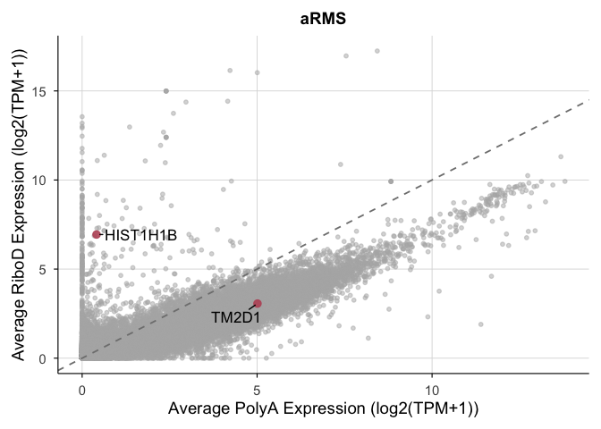


    $SS

    Warning: Removed 60496 rows containing missing values or values outside the scale range
    (`geom_text_repel()`).

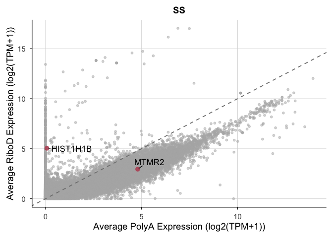


    $WT

    Warning: Removed 60496 rows containing missing values or values outside the scale range
    (`geom_text_repel()`).

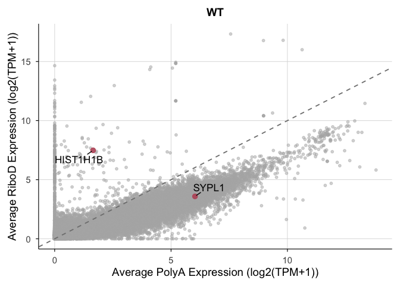


    $NB

    Warning: Removed 60496 rows containing missing values or values outside the scale range
    (`geom_text_repel()`).

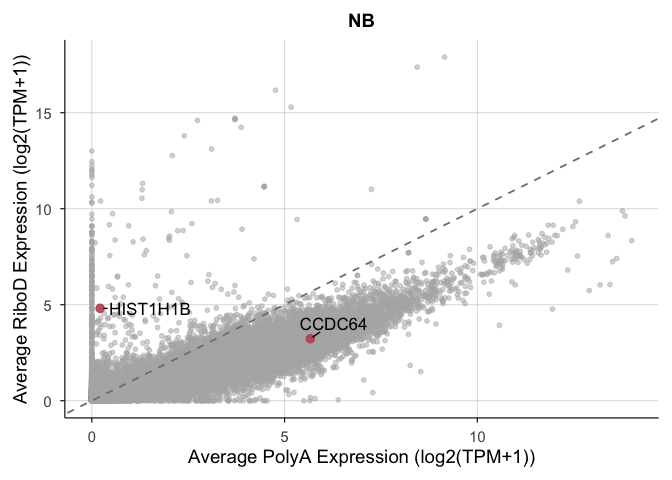


    $ALL

    Warning: Removed 60496 rows containing missing values or values outside the scale range
    (`geom_text_repel()`).

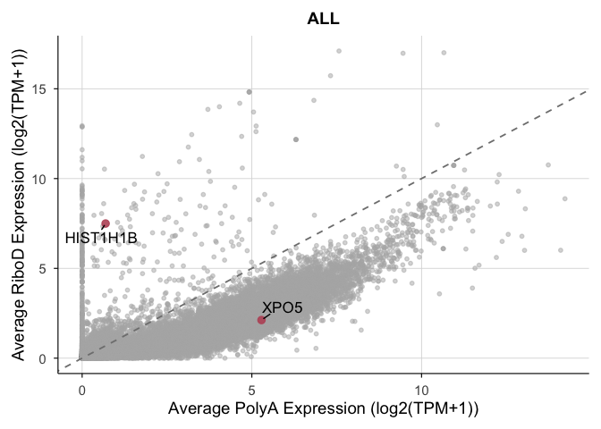


    $AML

    Warning: Removed 60496 rows containing missing values or values outside the scale range
    (`geom_text_repel()`).

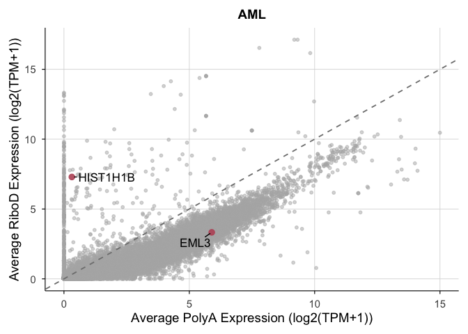

``` r
ggsave("../../Figures/Fig1G.png", plot = Fig1G$SS)
```

    Saving 7 x 5 in image

    Warning: Removed 60496 rows containing missing values or values outside the scale range
    (`geom_text_repel()`).

``` r
ggsave("../../Figures/Fig1G.tif", plot = Fig1G$SS)
```

    Saving 7 x 5 in image

    Warning: Removed 60496 rows containing missing values or values outside the scale range
    (`geom_text_repel()`).

## Fig S6

``` r
diseases <- unique(combined_medians_hugo_res$Disease)

Fig1G_all <- map(diseases, function(d) {

  df <- combined_medians_hugo_res %>% filter(Disease == d)

 ggplot(df, aes(x = polyA_medians, y = riboD_medians)) +
    
   # background points
    geom_point(data = df %>% filter(is.na(label)),
               color = "grey70", alpha = 0.5, size = 4) +

    # highlighted labeled points
    geom_point(data = df %>% filter(!is.na(label)),
               aes(color = label_color),
               size = 8, alpha = 0.9) +

    
       # Labels for representative genes and HIST1H1B
    geom_text_repel(
      aes(label = label),
      size = 12,
      max.overlaps = Inf,
      min.segment.length = 0,
      box.padding = 0.4,
      point.padding = 0.2
    ) +

    scale_color_identity() +   # use colors exactly as defined

    geom_abline(slope = 1, intercept = 0,
                linetype = "dashed", color = "gray50") +

    labs(
      title = paste(d),
      x = "Average PolyA Expression (log2(TPM+1))",
      y = "Average RiboD Expression (log2(TPM+1))",
    ) +
    theme_minimal(base_size = 14) +
    plot_theme() +
    coord_cartesian(xlim = c(0, 15), ylim = c(0, 20)) +
    theme(
    axis.title.y = element_text(size = 32),
    axis.title.x = element_text(size = 32),
    axis.text.y = element_text(size = 28),
    axis.text.x = element_text(size = 28),
    strip.text = element_blank(),
    plot.title = element_text(vjust = -2),
    legend.text = element_text(size = 26),       # <-- label text size
    legend.title = element_text(size = 26)      # <-- title text size
    )
})
names(Fig1G_all) <- diseases

Fig1G_all
```

    $aRMS

    Warning: Removed 60496 rows containing missing values or values outside the scale range
    (`geom_text_repel()`).

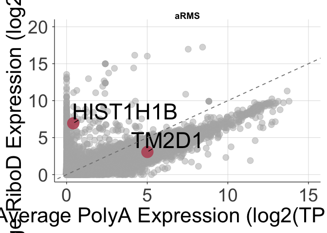


    $SS

    Warning: Removed 60496 rows containing missing values or values outside the scale range
    (`geom_text_repel()`).

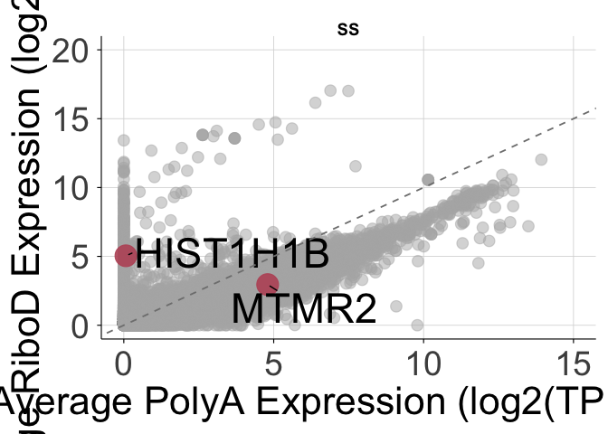


    $WT

    Warning: Removed 60496 rows containing missing values or values outside the scale range
    (`geom_text_repel()`).

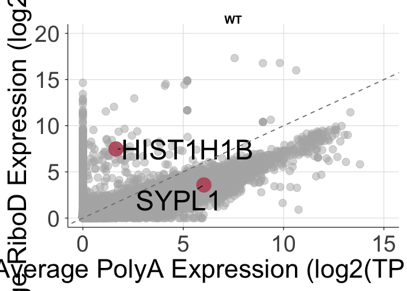


    $NB

    Warning: Removed 60496 rows containing missing values or values outside the scale range
    (`geom_text_repel()`).

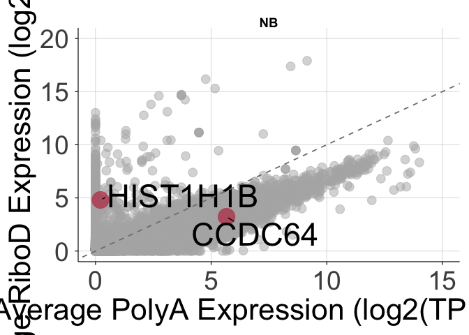


    $ALL

    Warning: Removed 60496 rows containing missing values or values outside the scale range
    (`geom_text_repel()`).

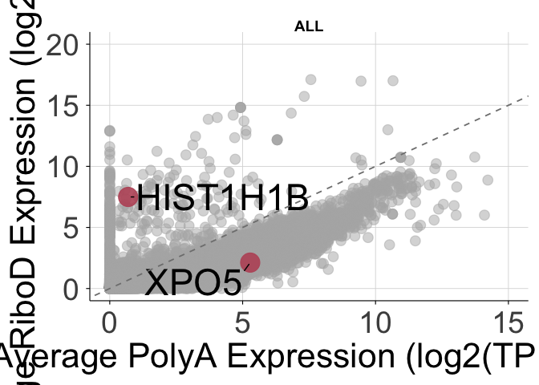


    $AML

    Warning: Removed 60496 rows containing missing values or values outside the scale range
    (`geom_text_repel()`).

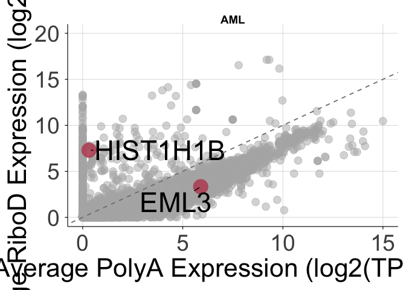

``` r
FigS6 <- wrap_plots(Fig1G_all, ncol = 1) +
  plot_layout(guides = "collect", axis_titles = "collect", axes = "collect") +
  plot_annotation(
    theme = theme(legend.position = "bottom")
  ) &
  theme(
    plot.margin = margin(t = 2, b = 2, l = 4, r = 4),
    plot.title = element_text(face = "bold", size = 36)
  )
FigS6
```

    Warning: Removed 60496 rows containing missing values or values outside the scale range
    (`geom_text_repel()`).
    Removed 60496 rows containing missing values or values outside the scale range
    (`geom_text_repel()`).
    Removed 60496 rows containing missing values or values outside the scale range
    (`geom_text_repel()`).
    Removed 60496 rows containing missing values or values outside the scale range
    (`geom_text_repel()`).
    Removed 60496 rows containing missing values or values outside the scale range
    (`geom_text_repel()`).
    Removed 60496 rows containing missing values or values outside the scale range
    (`geom_text_repel()`).

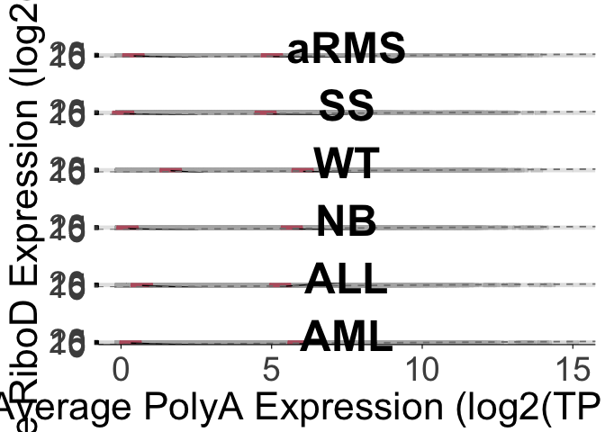

``` r
ggsave("../../Figures/FigS6.png", FigS6, width = 20, height = 36, dpi = 500)
```

    Warning: Removed 60496 rows containing missing values or values outside the scale range
    (`geom_text_repel()`).
    Removed 60496 rows containing missing values or values outside the scale range
    (`geom_text_repel()`).
    Removed 60496 rows containing missing values or values outside the scale range
    (`geom_text_repel()`).
    Removed 60496 rows containing missing values or values outside the scale range
    (`geom_text_repel()`).
    Removed 60496 rows containing missing values or values outside the scale range
    (`geom_text_repel()`).
    Removed 60496 rows containing missing values or values outside the scale range
    (`geom_text_repel()`).

``` r
ggsave("../../Figures/FigS6.tif", FigS6, width = 20, height = 36, dpi = 500)
```

    Warning: Removed 60496 rows containing missing values or values outside the scale range
    (`geom_text_repel()`).
    Removed 60496 rows containing missing values or values outside the scale range
    (`geom_text_repel()`).
    Removed 60496 rows containing missing values or values outside the scale range
    (`geom_text_repel()`).
    Removed 60496 rows containing missing values or values outside the scale range
    (`geom_text_repel()`).
    Removed 60496 rows containing missing values or values outside the scale range
    (`geom_text_repel()`).
    Removed 60496 rows containing missing values or values outside the scale range
    (`geom_text_repel()`).

Session Info

``` r
sessioninfo::session_info()
```

    ─ Session info ───────────────────────────────────────────────────────────────
     setting  value
     version  R version 4.5.2 (2025-10-31)
     os       macOS Tahoe 26.5
     system   aarch64, darwin20
     ui       X11
     language (EN)
     collate  en_US.UTF-8
     ctype    en_US.UTF-8
     tz       America/Los_Angeles
     date     2026-06-25
     pandoc   3.8.3 @ /Applications/RStudio.app/Contents/Resources/app/quarto/bin/tools/aarch64/ (via rmarkdown)
     quarto   1.9.36 @ /Applications/RStudio.app/Contents/Resources/app/quarto/bin/quarto

    ─ Packages ───────────────────────────────────────────────────────────────────
     package      * version date (UTC) lib source
     bit            4.6.0   2025-03-06 [1] CRAN (R 4.5.0)
     bit64          4.6.0-1 2025-01-16 [1] CRAN (R 4.5.0)
     cli            3.6.5   2025-04-23 [1] CRAN (R 4.5.0)
     crayon         1.5.3   2024-06-20 [1] CRAN (R 4.5.0)
     digest         0.6.37  2024-08-19 [1] CRAN (R 4.5.0)
     dplyr        * 1.1.4   2023-11-17 [1] CRAN (R 4.5.0)
     evaluate       1.0.5   2025-08-27 [1] CRAN (R 4.5.0)
     farver         2.1.2   2024-05-13 [1] CRAN (R 4.5.0)
     fastmap        1.2.0   2024-05-15 [1] CRAN (R 4.5.0)
     forcats      * 1.0.1   2025-09-25 [1] CRAN (R 4.5.0)
     generics       0.1.4   2025-05-09 [1] CRAN (R 4.5.0)
     ggplot2      * 4.0.0   2025-09-11 [1] CRAN (R 4.5.0)
     ggrepel      * 0.9.6   2024-09-07 [1] CRAN (R 4.5.0)
     glue           1.8.0   2024-09-30 [1] CRAN (R 4.5.0)
     gtable         0.3.6   2024-10-25 [1] CRAN (R 4.5.0)
     hms            1.1.4   2025-10-17 [1] CRAN (R 4.5.0)
     htmltools      0.5.8.1 2024-04-04 [1] CRAN (R 4.5.0)
     jsonlite       2.0.0   2025-03-27 [1] CRAN (R 4.5.0)
     knitr          1.50    2025-03-16 [1] CRAN (R 4.5.0)
     labeling       0.4.3   2023-08-29 [1] CRAN (R 4.5.0)
     lifecycle      1.0.4   2023-11-07 [1] CRAN (R 4.5.0)
     lubridate    * 1.9.4   2024-12-08 [1] CRAN (R 4.5.0)
     magrittr       2.0.4   2025-09-12 [1] CRAN (R 4.5.0)
     patchwork    * 1.3.2   2025-08-25 [1] CRAN (R 4.5.0)
     pillar         1.11.1  2025-09-17 [1] CRAN (R 4.5.0)
     pkgconfig      2.0.3   2019-09-22 [1] CRAN (R 4.5.0)
     purrr        * 1.1.0   2025-07-10 [1] CRAN (R 4.5.0)
     R6             2.6.1   2025-02-15 [1] CRAN (R 4.5.0)
     ragg           1.5.0   2025-09-02 [1] CRAN (R 4.5.0)
     RColorBrewer   1.1-3   2022-04-03 [1] CRAN (R 4.5.0)
     Rcpp           1.1.0   2025-07-02 [1] CRAN (R 4.5.0)
     readr        * 2.1.5   2024-01-10 [1] CRAN (R 4.5.0)
     rlang          1.2.0   2026-04-06 [1] CRAN (R 4.5.2)
     rmarkdown      2.30    2025-09-28 [1] CRAN (R 4.5.0)
     rstudioapi     0.17.1  2024-10-22 [1] CRAN (R 4.5.0)
     S7             0.2.0   2024-11-07 [1] CRAN (R 4.5.0)
     scales         1.4.0   2025-04-24 [1] CRAN (R 4.5.0)
     sessioninfo    1.2.3   2025-02-05 [1] CRAN (R 4.5.0)
     stringi        1.8.7   2025-03-27 [1] CRAN (R 4.5.0)
     stringr      * 1.5.2   2025-09-08 [1] CRAN (R 4.5.0)
     systemfonts    1.3.1   2025-10-01 [1] CRAN (R 4.5.0)
     textshaping    1.0.4   2025-10-10 [1] CRAN (R 4.5.0)
     tibble       * 3.3.0   2025-06-08 [1] CRAN (R 4.5.0)
     tidyr        * 1.3.1   2024-01-24 [1] CRAN (R 4.5.0)
     tidyselect     1.2.1   2024-03-11 [1] CRAN (R 4.5.0)
     tidyverse    * 2.0.0   2023-02-22 [1] CRAN (R 4.5.0)
     timechange     0.3.0   2024-01-18 [1] CRAN (R 4.5.0)
     tzdb           0.5.0   2025-03-15 [1] CRAN (R 4.5.0)
     vctrs          0.6.5   2023-12-01 [1] CRAN (R 4.5.0)
     vroom          1.6.6   2025-09-19 [1] CRAN (R 4.5.0)
     withr          3.0.2   2024-10-28 [1] CRAN (R 4.5.0)
     xfun           0.55    2025-12-16 [1] CRAN (R 4.5.2)
     yaml           2.3.10  2024-07-26 [1] CRAN (R 4.5.0)

     [1] /Library/Frameworks/R.framework/Versions/4.5-arm64/Resources/library
     * ── Packages attached to the search path.

    ──────────────────────────────────────────────────────────────────────────────
