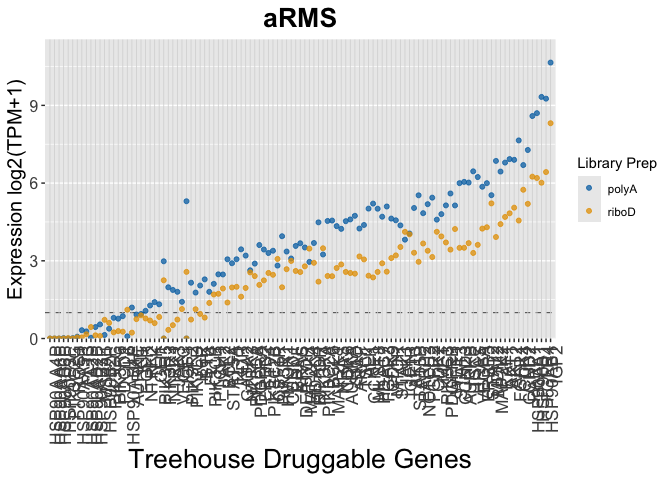
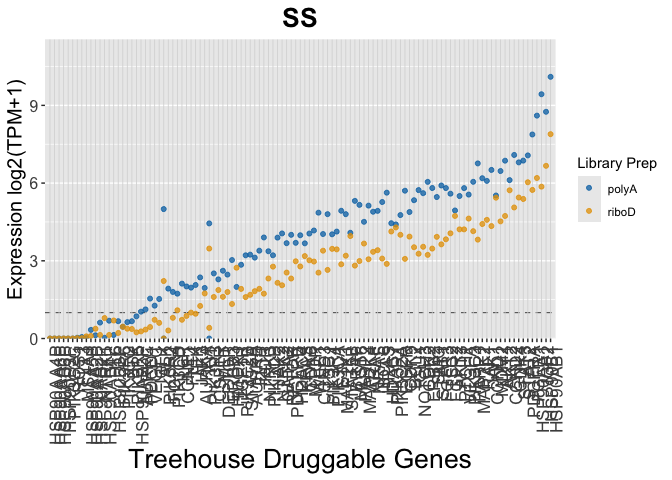
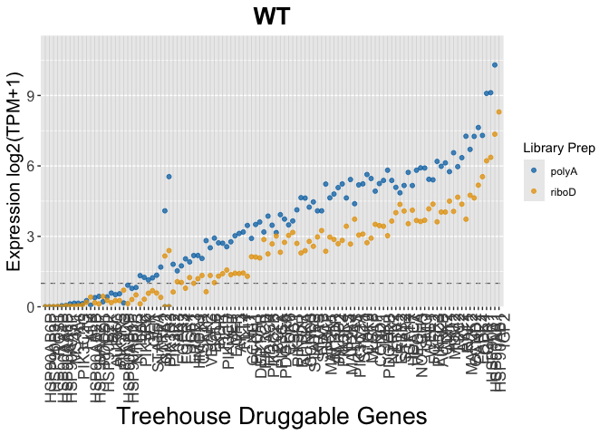
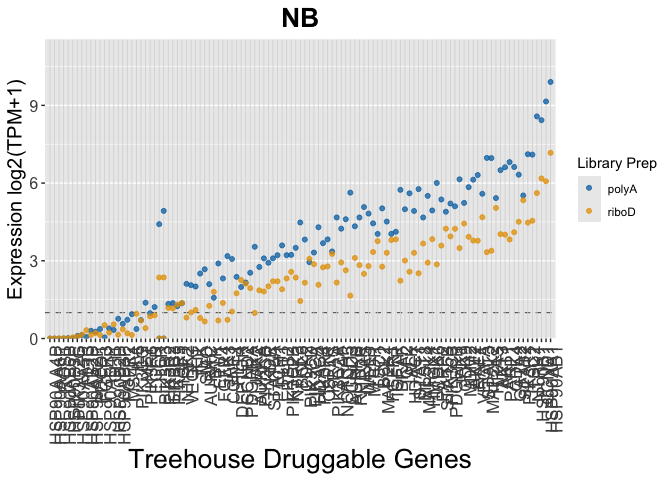
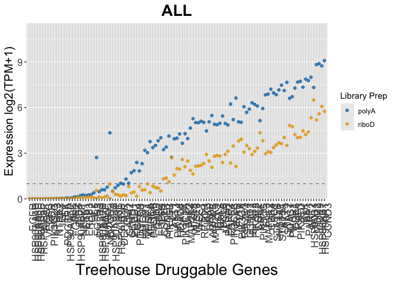
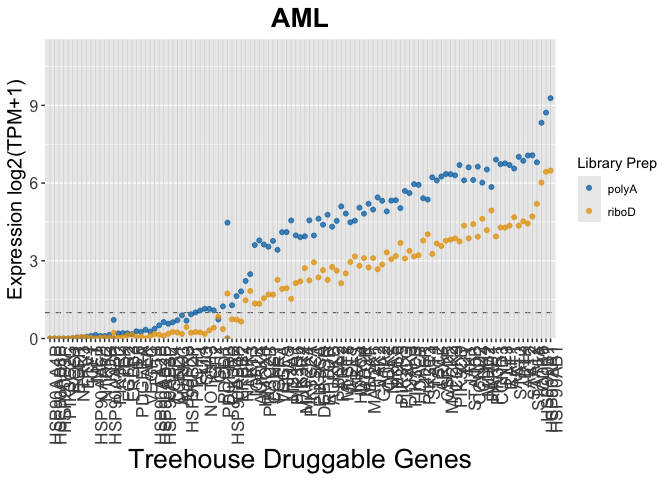

# Fig1H


## Fig 1H

Median expression of Treehouse Druggable Genes.

``` r
library(tidyverse)
```

    ── Attaching core tidyverse packages ──────────────────────── tidyverse 2.0.0 ──
    ✔ dplyr     1.2.1     ✔ readr     2.2.0
    ✔ forcats   1.0.1     ✔ stringr   1.6.0
    ✔ ggplot2   4.0.3     ✔ tibble    3.3.1
    ✔ lubridate 1.9.5     ✔ tidyr     1.3.2
    ✔ purrr     1.2.2     
    ── Conflicts ────────────────────────────────────────── tidyverse_conflicts() ──
    ✖ dplyr::filter() masks stats::filter()
    ✖ dplyr::lag()    masks stats::lag()
    ℹ Use the conflicted package (<http://conflicted.r-lib.org/>) to force all conflicts to become errors

``` r
# sample ID files
# polyA
SS_polyA_list <- read_tsv("../../input_data/sample_selection/SS_polyA_list.tsv")
```

    Rows: 15 Columns: 2
    ── Column specification ────────────────────────────────────────────────────────
    Delimiter: "\t"
    chr (2): term, disease_and_prep

    ℹ Use `spec()` to retrieve the full column specification for this data.
    ℹ Specify the column types or set `show_col_types = FALSE` to quiet this message.

``` r
aRMS_polyA_list <- read_tsv("../../input_data/sample_selection/aRMS_polyA_list.tsv")
```

    Rows: 15 Columns: 2
    ── Column specification ────────────────────────────────────────────────────────
    Delimiter: "\t"
    chr (2): term, disease_and_prep

    ℹ Use `spec()` to retrieve the full column specification for this data.
    ℹ Specify the column types or set `show_col_types = FALSE` to quiet this message.

``` r
WT_polyA_list <- read_tsv("../../input_data/sample_selection/WT_polyA_list.tsv")
```

    Rows: 15 Columns: 2
    ── Column specification ────────────────────────────────────────────────────────
    Delimiter: "\t"
    chr (2): term, disease_and_prep

    ℹ Use `spec()` to retrieve the full column specification for this data.
    ℹ Specify the column types or set `show_col_types = FALSE` to quiet this message.

``` r
NB_polyA_list <- read_tsv("../../input_data/sample_selection/NB_polyA_list.tsv")
```

    Rows: 15 Columns: 2
    ── Column specification ────────────────────────────────────────────────────────
    Delimiter: "\t"
    chr (2): term, disease_and_prep

    ℹ Use `spec()` to retrieve the full column specification for this data.
    ℹ Specify the column types or set `show_col_types = FALSE` to quiet this message.

``` r
ALL_polyA_list <- read_tsv("../../input_data/sample_selection/ALL_polyA_list.tsv")
```

    Rows: 20 Columns: 2
    ── Column specification ────────────────────────────────────────────────────────
    Delimiter: "\t"
    chr (2): term, disease_and_prep

    ℹ Use `spec()` to retrieve the full column specification for this data.
    ℹ Specify the column types or set `show_col_types = FALSE` to quiet this message.

``` r
AML_polyA_list <- read_tsv("../../input_data/sample_selection/AML_polyA_list.tsv")
```

    Rows: 20 Columns: 2
    ── Column specification ────────────────────────────────────────────────────────
    Delimiter: "\t"
    chr (2): term, disease_and_prep

    ℹ Use `spec()` to retrieve the full column specification for this data.
    ℹ Specify the column types or set `show_col_types = FALSE` to quiet this message.

``` r
# riboD
SS_riboD_list <- read_tsv("../../input_data/sample_selection/SS_riboD_list.tsv")
```

    Rows: 15 Columns: 2
    ── Column specification ────────────────────────────────────────────────────────
    Delimiter: "\t"
    chr (2): term, disease_and_prep

    ℹ Use `spec()` to retrieve the full column specification for this data.
    ℹ Specify the column types or set `show_col_types = FALSE` to quiet this message.

``` r
aRMS_riboD_list <- read_tsv("../../input_data/sample_selection/aRMS_riboD_list.tsv")
```

    Rows: 15 Columns: 2
    ── Column specification ────────────────────────────────────────────────────────
    Delimiter: "\t"
    chr (2): term, disease_and_prep

    ℹ Use `spec()` to retrieve the full column specification for this data.
    ℹ Specify the column types or set `show_col_types = FALSE` to quiet this message.

``` r
WT_riboD_list <- read_tsv("../../input_data/sample_selection/WT_riboD_list.tsv")
```

    Rows: 15 Columns: 2
    ── Column specification ────────────────────────────────────────────────────────
    Delimiter: "\t"
    chr (2): term, disease_and_prep

    ℹ Use `spec()` to retrieve the full column specification for this data.
    ℹ Specify the column types or set `show_col_types = FALSE` to quiet this message.

``` r
NB_riboD_list <- read_tsv("../../input_data/sample_selection/NB_riboD_list.tsv")
```

    Rows: 15 Columns: 2
    ── Column specification ────────────────────────────────────────────────────────
    Delimiter: "\t"
    chr (2): term, disease_and_prep

    ℹ Use `spec()` to retrieve the full column specification for this data.
    ℹ Specify the column types or set `show_col_types = FALSE` to quiet this message.

``` r
ALL_riboD_list <- read_tsv("../../input_data/sample_selection/ALL_riboD_list.tsv")
```

    Rows: 20 Columns: 2
    ── Column specification ────────────────────────────────────────────────────────
    Delimiter: "\t"
    chr (2): term, disease_and_prep

    ℹ Use `spec()` to retrieve the full column specification for this data.
    ℹ Specify the column types or set `show_col_types = FALSE` to quiet this message.

``` r
AML_riboD_list <- read_tsv("../../input_data/sample_selection/AML_riboD_list.tsv")
```

    Rows: 20 Columns: 2
    ── Column specification ────────────────────────────────────────────────────────
    Delimiter: "\t"
    chr (2): term, disease_and_prep

    ℹ Use `spec()` to retrieve the full column specification for this data.
    ℹ Specify the column types or set `show_col_types = FALSE` to quiet this message.

``` r
# log2(TPM+1) expression files
# polyA
SS_polyA_expr <- read_tsv("../../input_data/sample_selection/SS_polyA_expr.tsv")
```

    Rows: 60498 Columns: 16
    ── Column specification ────────────────────────────────────────────────────────
    Delimiter: "\t"
    chr  (1): Gene
    dbl (15): THR39_1373_S01, TCGA-WK-A8XT-01, TH40_2281_S01, THR39_1375_S01, TH...

    ℹ Use `spec()` to retrieve the full column specification for this data.
    ℹ Specify the column types or set `show_col_types = FALSE` to quiet this message.

``` r
aRMS_polyA_expr <- read_tsv("../../input_data/sample_selection/aRMS_polyA_expr.tsv")
```

    Rows: 60498 Columns: 16
    ── Column specification ────────────────────────────────────────────────────────
    Delimiter: "\t"
    chr  (1): Gene
    dbl (15): THR29_0788_S01, THR29_0775_S01, THR29_0757_S01, THR29_0762_S01, TH...

    ℹ Use `spec()` to retrieve the full column specification for this data.
    ℹ Specify the column types or set `show_col_types = FALSE` to quiet this message.

``` r
WT_polyA_expr <- read_tsv("../../input_data/sample_selection/WT_polyA_expr.tsv")
```

    Rows: 60498 Columns: 16
    ── Column specification ────────────────────────────────────────────────────────
    Delimiter: "\t"
    chr  (1): Gene
    dbl (15): TARGET-50-PAJNCZ-01, TARGET-50-PAEBXA-01, TARGET-50-PALERC-01, TAR...

    ℹ Use `spec()` to retrieve the full column specification for this data.
    ℹ Specify the column types or set `show_col_types = FALSE` to quiet this message.

``` r
NB_polyA_expr <- read_tsv("../../input_data/sample_selection/NB_polyA_expr.tsv")
```

    Rows: 60498 Columns: 16
    ── Column specification ────────────────────────────────────────────────────────
    Delimiter: "\t"
    chr  (1): Gene
    dbl (15): TARGET-30-PASUML-01, TARGET-30-PASEGA-01, TARGET-30-PAPUAR-01, TAR...

    ℹ Use `spec()` to retrieve the full column specification for this data.
    ℹ Specify the column types or set `show_col_types = FALSE` to quiet this message.

``` r
ALL_polyA_expr <- read_tsv("../../input_data/sample_selection/ALL_polyA_expr.tsv")
```

    Rows: 60498 Columns: 21
    ── Column specification ────────────────────────────────────────────────────────
    Delimiter: "\t"
    chr  (1): Gene
    dbl (20): THR24_1667_S01, THR24_2131_S01, THR24_2119_S01, THR24_1921_S01, TH...

    ℹ Use `spec()` to retrieve the full column specification for this data.
    ℹ Specify the column types or set `show_col_types = FALSE` to quiet this message.

``` r
AML_polyA_expr <- read_tsv("../../input_data/sample_selection/AML_polyA_expr.tsv")
```

    Rows: 60498 Columns: 21
    ── Column specification ────────────────────────────────────────────────────────
    Delimiter: "\t"
    chr  (1): Gene
    dbl (20): TCGA-AB-2889-03, TCGA-AB-2844-03, TCGA-AB-2846-03, TCGA-AB-2881-03...

    ℹ Use `spec()` to retrieve the full column specification for this data.
    ℹ Specify the column types or set `show_col_types = FALSE` to quiet this message.

``` r
# riboD
SS_riboD_expr <- read_tsv("../../input_data/sample_selection/SS_riboD_expr.tsv")
```

    Rows: 60498 Columns: 16
    ── Column specification ────────────────────────────────────────────────────────
    Delimiter: "\t"
    chr  (1): Gene
    dbl (15): THR51_4556_S01, THR51_4558_S01, THR51_4554_S01, THR24_3992_S01, TH...

    ℹ Use `spec()` to retrieve the full column specification for this data.
    ℹ Specify the column types or set `show_col_types = FALSE` to quiet this message.

``` r
aRMS_riboD_expr <- read_tsv("../../input_data/sample_selection/aRMS_riboD_expr.tsv")
```

    Rows: 60498 Columns: 16
    ── Column specification ────────────────────────────────────────────────────────
    Delimiter: "\t"
    chr  (1): Gene
    dbl (15): THR24_3244_S01, THR24_3371_S01, THR24_3181_S01, THR24_3178_S01, TH...

    ℹ Use `spec()` to retrieve the full column specification for this data.
    ℹ Specify the column types or set `show_col_types = FALSE` to quiet this message.

``` r
WT_riboD_expr <- read_tsv("../../input_data/sample_selection/WT_riboD_expr.tsv")
```

    Rows: 60498 Columns: 16
    ── Column specification ────────────────────────────────────────────────────────
    Delimiter: "\t"
    chr  (1): Gene
    dbl (15): THR24_3218_S01, THR24_4194_S01, THR24_4284_S01, THR24_4369_S01, TH...

    ℹ Use `spec()` to retrieve the full column specification for this data.
    ℹ Specify the column types or set `show_col_types = FALSE` to quiet this message.

``` r
NB_riboD_expr <- read_tsv("../../input_data/sample_selection/NB_riboD_expr.tsv")
```

    Rows: 60498 Columns: 16
    ── Column specification ────────────────────────────────────────────────────────
    Delimiter: "\t"
    chr  (1): Gene
    dbl (15): THR24_4310_S01, THR24_2779_S01, THR24_3516_S01, THR24_4114_S01, TH...

    ℹ Use `spec()` to retrieve the full column specification for this data.
    ℹ Specify the column types or set `show_col_types = FALSE` to quiet this message.

``` r
ALL_riboD_expr <- read_tsv("../../input_data/sample_selection/ALL_riboD_expr.tsv")
```

    Rows: 60498 Columns: 21
    ── Column specification ────────────────────────────────────────────────────────
    Delimiter: "\t"
    chr  (1): Gene
    dbl (20): THR24_4203_S01, THR24_3471_S01, THR24_3688_S01, THR24_4235_S01, TH...

    ℹ Use `spec()` to retrieve the full column specification for this data.
    ℹ Specify the column types or set `show_col_types = FALSE` to quiet this message.

``` r
AML_riboD_expr <- read_tsv("../../input_data/sample_selection/AML_riboD_expr.tsv")
```

    Rows: 60498 Columns: 21
    ── Column specification ────────────────────────────────────────────────────────
    Delimiter: "\t"
    chr  (1): Gene
    dbl (20): THR24_4050_S01, THR24_4356_S01, THR24_4265_S01, THR24_4263_S01, TH...

    ℹ Use `spec()` to retrieve the full column specification for this data.
    ℹ Specify the column types or set `show_col_types = FALSE` to quiet this message.

``` r
# to convert EnsemblIDs to HugoIDs
gene_names <- read.table("../../input_data/EnsGeneID_Hugo_Observed_Conversions.txt",
header = TRUE, sep = "\t", stringsAsFactors = FALSE )

# treehouse druggable gene list
drug_genes <- read_tsv("../../input_data/treehouseDruggableGenes_2019-06-12.txt") %>%
  select(gene)
```

    Rows: 115 Columns: 2
    ── Column specification ────────────────────────────────────────────────────────
    Delimiter: "\t"
    chr (2): gene, group

    ℹ Use `spec()` to retrieve the full column specification for this data.
    ℹ Specify the column types or set `show_col_types = FALSE` to quiet this message.

Function for filtering for druggable genes

``` r
filter_druggable <- function(df, drug_genes) {
  df %>% filter(Gene %in% drug_genes$gene)
}
```

Function for calculating median expression across samples

``` r
compute_gene_medians_polyA <- function(polyA_df, disease_name, Compendia ) {
  polyA_medians <- polyA_df %>%
    rowwise() %>%
    mutate(polyA_medians = median(c_across(-Gene), na.rm = TRUE)) %>%
    ungroup() %>%
    select(Gene, polyA_medians)
}
compute_gene_medians_riboD <- function(riboD_df, disease_name, Compendia) {
   riboD_medians <- riboD_df %>%
    rowwise() %>%
    mutate(riboD_medians = median(c_across(-Gene), na.rm = TRUE)) %>%
    ungroup() %>%
    select(Gene, riboD_medians)
}
```

Converting EnsemblID to HugoID for readability

``` r
convert_to_hugo <- function(df) {
  df %>%
    left_join(gene_names, by = c("Gene" = "EnsGeneID")) %>%
    mutate(Gene = ifelse(!is.na(HugoID), HugoID, Gene)) %>%
    select(-HugoID)
}
```

Applying gene medians function

``` r
aRMS_polyA_medians <- compute_gene_medians_polyA(aRMS_polyA_expr) %>%
  pivot_longer(-Gene, values_to = "Expression") %>%
  mutate(Disease = "aRMS", Compendia = "polyA") %>%
  convert_to_hugo()

aRMS_riboD_medians <- compute_gene_medians_riboD(aRMS_riboD_expr) %>%
  pivot_longer(-Gene, values_to = "Expression") %>%
  mutate(Disease = "aRMS", Compendia = "riboD") %>%
  convert_to_hugo()

SS_polyA_medians <- compute_gene_medians_polyA(SS_polyA_expr) %>%
  pivot_longer(-Gene, values_to = "Expression") %>%
  mutate(Disease = "SS", Compendia = "polyA") %>%
  convert_to_hugo()

SS_riboD_medians <- compute_gene_medians_riboD(SS_riboD_expr) %>%
  pivot_longer(-Gene, values_to = "Expression") %>%
  mutate(Disease = "SS", Compendia = "riboD") %>%
  convert_to_hugo()

WT_polyA_medians <- compute_gene_medians_polyA(WT_polyA_expr) %>%
  pivot_longer(-Gene, values_to = "Expression") %>%
  mutate(Disease = "WT", Compendia = "polyA") %>%
  convert_to_hugo()

WT_riboD_medians <- compute_gene_medians_riboD(WT_riboD_expr) %>%
  pivot_longer(-Gene, values_to = "Expression") %>%
  mutate(Disease = "WT", Compendia = "riboD") %>%
  convert_to_hugo()

NB_polyA_medians <- compute_gene_medians_polyA(NB_polyA_expr) %>%
  pivot_longer(-Gene, values_to = "Expression") %>%
  mutate(Disease = "NB", Compendia = "polyA") %>%
  convert_to_hugo()

NB_riboD_medians <- compute_gene_medians_riboD(NB_riboD_expr) %>%
  pivot_longer(-Gene, values_to = "Expression") %>%
  mutate(Disease = "NB", Compendia = "riboD") %>%
  convert_to_hugo()

ALL_polyA_medians <- compute_gene_medians_polyA(ALL_polyA_expr) %>%
  pivot_longer(-Gene, values_to = "Expression") %>%
  mutate(Disease = "ALL", Compendia = "polyA") %>%
  convert_to_hugo()

ALL_riboD_medians <- compute_gene_medians_riboD(ALL_riboD_expr) %>%
  pivot_longer(-Gene, values_to = "Expression") %>%
  mutate(Disease = "ALL", Compendia = "riboD") %>%
  convert_to_hugo()

AML_polyA_medians <- compute_gene_medians_polyA(AML_polyA_expr) %>%
  pivot_longer(-Gene, values_to = "Expression") %>%
  mutate(Disease = "AML", Compendia = "polyA") %>%
  convert_to_hugo()

AML_riboD_medians <- compute_gene_medians_riboD(AML_riboD_expr) %>%
  pivot_longer(-Gene, values_to = "Expression") %>%
  mutate(Disease = "AML", Compendia = "riboD") %>%
  convert_to_hugo()
```

Filtering for druggable genes

``` r
aRMS_polyA_medians_drug <- filter_druggable(aRMS_polyA_medians, drug_genes)
aRMS_riboD_medians_drug <- filter_druggable(aRMS_riboD_medians, drug_genes)

SS_polyA_medians_drug <- filter_druggable(SS_polyA_medians, drug_genes)
SS_riboD_medians_drug <- filter_druggable(SS_riboD_medians, drug_genes)

WT_polyA_medians_drug <- filter_druggable(WT_polyA_medians, drug_genes)
WT_riboD_medians_drug <- filter_druggable(WT_riboD_medians, drug_genes)

NB_polyA_medians_drug <- filter_druggable(NB_polyA_medians, drug_genes)
NB_riboD_medians_drug <- filter_druggable(NB_riboD_medians, drug_genes)

ALL_polyA_medians_drug <- filter_druggable(ALL_polyA_medians, drug_genes)
ALL_riboD_medians_drug <- filter_druggable(ALL_riboD_medians, drug_genes)

AML_polyA_medians_drug <- filter_druggable(AML_polyA_medians, drug_genes)
AML_riboD_medians_drug <- filter_druggable(AML_riboD_medians, drug_genes)
```

``` r
combined_medians_drug <- bind_rows(
  aRMS_polyA_medians_drug,
  aRMS_riboD_medians_drug,
  SS_polyA_medians_drug,
  SS_riboD_medians_drug,
  WT_polyA_medians_drug,
  WT_riboD_medians_drug,
  NB_polyA_medians_drug,
  NB_riboD_medians_drug,
  ALL_polyA_medians_drug,
  ALL_riboD_medians_drug,
  AML_polyA_medians_drug,
  AML_riboD_medians_drug
)
```

Define palette

``` r
# Define consistent color-blind–safe palette
scale_color_compendia <- function() {
  scale_color_manual(values = c(
    "riboD" = "#E69F00",  # yellow
    "polyA" = "#0072B2"   # blue
  ))
}
```

Generate plots

``` r
# Loop through diseases and generate plots
druggable_plots <- map(unique(combined_medians_drug$Disease), function(d) {

 df <- combined_medians_drug %>% 
  filter(Disease == d)

df <- combined_medians_drug %>% 
  filter(Disease == d) %>%
  mutate(Gene = factor(Gene, levels = df %>% 
                         group_by(Gene) %>% 
                         summarize(median_expr = median(Expression), .groups = "drop") %>% 
                         arrange(median_expr) %>% 
                         pull(Gene)))


  ggplot(df, aes(x = Gene, y = Expression, color = Compendia)) +
    geom_hline(yintercept = 1, linetype = "dashed", color = "grey40", linewidth = 0.4) +
    # 1. vertical lines for each gene 
    geom_vline(aes(xintercept = as.numeric(Gene)), color = "grey85", linewidth = 0.3) + 
    # 2. points that stay centered on those lines 
    geom_point(size = 1.4, alpha = 0.75) +
    scale_x_discrete(expand = expansion(mult = c(0.01, 0.01))) +
    scale_y_continuous(limits = c(0, 11), expand = expansion(mult = c(0, 0.05))) +
    scale_color_compendia() +
    labs(
      title = paste(d),
      x = "Treehouse Druggable Genes",
      y = "Expression log2(TPM+1)",
      color = "Library Prep"
    ) +
    theme(
      axis.text.x = element_text(angle = 90, hjust = 1, size = 13),
      panel.grid.major.x = element_blank(),
      axis.title.x = element_text(angle = 0, hjust = 0.5, size = 20), 
      axis.text.y = element_text(angle = 0, hjust = 1, size = 12),
      axis.title.y = element_text(angle = 90, hjust = 0.5, size = 15), 
      plot.title = element_text(hjust = 0.5, face = "bold", size = 20)
    )
})
```

``` r
# Assign names for easy access
names(druggable_plots) <- unique(combined_medians_drug$Disease)

# View plots
druggable_plots
```

    $aRMS




    $SS




    $WT

    Warning: Removed 1 row containing missing values or values outside the scale range
    (`geom_point()`).




    $NB




    $ALL




    $AML



``` r
sessioninfo::session_info()
```

    ─ Session info ───────────────────────────────────────────────────────────────
     setting  value
     version  R version 4.5.2 (2025-10-31)
     os       macOS Tahoe 26.5
     system   aarch64, darwin20
     ui       X11
     language (EN)
     collate  en_US.UTF-8
     ctype    en_US.UTF-8
     tz       America/Los_Angeles
     date     2026-06-15
     pandoc   3.8.3 @ /Applications/RStudio.app/Contents/Resources/app/quarto/bin/tools/aarch64/ (via rmarkdown)
     quarto   1.9.36 @ /Applications/RStudio.app/Contents/Resources/app/quarto/bin/quarto

    ─ Packages ───────────────────────────────────────────────────────────────────
     ! package      * version date (UTC) lib source
     P bit            4.6.0   2025-03-06 [?] RSPM
     P bit64          4.8.0   2026-04-21 [?] RSPM
     P cli            3.6.5   2025-04-23 [?] RSPM
     P crayon         1.5.3   2024-06-20 [?] RSPM
     P digest         0.6.37  2024-08-19 [?] RSPM
     P dplyr        * 1.2.1   2026-04-03 [?] RSPM
     P evaluate       1.0.5   2025-08-27 [?] RSPM
     P farver         2.1.2   2024-05-13 [?] RSPM
     P fastmap        1.2.0   2024-05-15 [?] RSPM
     P forcats      * 1.0.1   2025-09-25 [?] RSPM
     P generics       0.1.4   2025-05-09 [?] RSPM
     P ggplot2      * 4.0.3   2026-04-22 [?] RSPM
     P glue           1.8.0   2024-09-30 [?] RSPM
     P gtable         0.3.6   2024-10-25 [?] RSPM
     P hms            1.1.4   2025-10-17 [?] RSPM
     P htmltools      0.5.8.1 2024-04-04 [?] RSPM
     P jsonlite       2.0.0   2025-03-27 [?] RSPM
     P knitr          1.50    2025-03-16 [?] RSPM
     P labeling       0.4.3   2023-08-29 [?] RSPM
     P lifecycle      1.0.5   2026-01-08 [?] RSPM
     P lubridate    * 1.9.5   2026-02-04 [?] RSPM
     P magrittr       2.0.5   2026-04-04 [?] RSPM
     P pillar         1.11.1  2025-09-17 [?] RSPM
     P pkgconfig      2.0.3   2019-09-22 [?] RSPM
     P purrr        * 1.2.2   2026-04-10 [?] RSPM
     P R6             2.6.1   2025-02-15 [?] RSPM
     P RColorBrewer   1.1-3   2022-04-03 [?] RSPM
     P readr        * 2.2.0   2026-02-19 [?] RSPM
     P rlang          1.2.0   2026-04-06 [?] RSPM
     P rmarkdown      2.30    2025-09-28 [?] RSPM
     P rstudioapi     0.18.0  2026-01-16 [?] RSPM
     P S7             0.2.2   2026-04-22 [?] RSPM
     P scales         1.4.0   2025-04-24 [?] RSPM
     P sessioninfo    1.2.3   2025-02-05 [?] CRAN (R 4.5.0)
     P stringi        1.8.7   2025-03-27 [?] RSPM
     P stringr      * 1.6.0   2025-11-04 [?] RSPM
     P tibble       * 3.3.1   2026-01-11 [?] RSPM
     P tidyr        * 1.3.2   2025-12-19 [?] RSPM
     P tidyselect     1.2.1   2024-03-11 [?] RSPM
     P tidyverse    * 2.0.0   2023-02-22 [?] RSPM
     P timechange     0.4.0   2026-01-29 [?] RSPM
     P tzdb           0.5.0   2025-03-15 [?] RSPM
     P vctrs          0.7.3   2026-04-11 [?] RSPM
     P vroom          1.7.1   2026-03-31 [?] RSPM
     P withr          3.0.2   2024-10-28 [?] RSPM
     P xfun           0.55    2025-12-16 [?] CRAN (R 4.5.2)
     P yaml           2.3.10  2024-07-26 [?] RSPM

     [1] /Users/maryke/Documents/Treehouse/Lab_Notebooks/transcript_enrichment_bias_assessment/Fig_1/renv/library/macos/R-4.5/aarch64-apple-darwin20
     [2] /Library/Frameworks/R.framework/Versions/4.5-arm64/Resources/library

     * ── Packages attached to the search path.
     P ── Loaded and on-disk path mismatch.

    ──────────────────────────────────────────────────────────────────────────────
