# ALL_AML_DESeq2_analysis


## **ALL v AML - DESeq2 Results Analysis**

``` r
library(tidyverse)
```

    ── Attaching core tidyverse packages ──────────────────────── tidyverse 2.0.0 ──
    ✔ dplyr     1.1.4     ✔ readr     2.1.5
    ✔ forcats   1.0.1     ✔ stringr   1.5.2
    ✔ ggplot2   4.0.0     ✔ tibble    3.3.0
    ✔ lubridate 1.9.4     ✔ tidyr     1.3.1
    ✔ purrr     1.1.0     
    ── Conflicts ────────────────────────────────────────── tidyverse_conflicts() ──
    ✖ dplyr::filter() masks stats::filter()
    ✖ dplyr::lag()    masks stats::lag()
    ℹ Use the conflicted package (<http://conflicted.r-lib.org/>) to force all conflicts to become errors

``` r
library(VennDiagram)
```

    Loading required package: grid
    Loading required package: futile.logger

``` r
library(ggplot2)
```

``` r
AMLPolyA_ALLPolyA <- read_tsv("../../output_data/ALL_AML/hugo_results_AML_polyA_ALL_polyA_updated.tsv.gz")
```

    Rows: 24898 Columns: 8
    ── Column specification ────────────────────────────────────────────────────────
    Delimiter: "\t"
    chr (2): HugoID, Gene
    dbl (6): baseMean, log2FoldChange, lfcSE, stat, pvalue, padj

    ℹ Use `spec()` to retrieve the full column specification for this data.
    ℹ Specify the column types or set `show_col_types = FALSE` to quiet this message.

``` r
AMLRiboD_ALLRiboD <- read_tsv("../../output_data/ALL_AML/hugo_results_AML_riboD_ALL_riboD_updated.tsv.gz")
```

    Rows: 24991 Columns: 8
    ── Column specification ────────────────────────────────────────────────────────
    Delimiter: "\t"
    chr (2): HugoID, Gene
    dbl (6): baseMean, log2FoldChange, lfcSE, stat, pvalue, padj

    ℹ Use `spec()` to retrieve the full column specification for this data.
    ℹ Specify the column types or set `show_col_types = FALSE` to quiet this message.

``` r
AMLPolyA_ALLRiboD <- read_tsv("../../output_data/ALL_AML/hugo_results_AML_polyA_ALL_riboD_updated.tsv.gz")
```

    Rows: 25001 Columns: 8
    ── Column specification ────────────────────────────────────────────────────────
    Delimiter: "\t"
    chr (2): HugoID, Gene
    dbl (6): baseMean, log2FoldChange, lfcSE, stat, pvalue, padj

    ℹ Use `spec()` to retrieve the full column specification for this data.
    ℹ Specify the column types or set `show_col_types = FALSE` to quiet this message.

``` r
AMLRiboD_ALLPolyA <- read_tsv("../../output_data/ALL_AML/hugo_results_AML_riboD_ALL_polyA_updated.tsv.gz")
```

    Rows: 25000 Columns: 8
    ── Column specification ────────────────────────────────────────────────────────
    Delimiter: "\t"
    chr (2): HugoID, Gene
    dbl (6): baseMean, log2FoldChange, lfcSE, stat, pvalue, padj

    ℹ Use `spec()` to retrieve the full column specification for this data.
    ℹ Specify the column types or set `show_col_types = FALSE` to quiet this message.

## **L2FC \>/\<= 1 or -1**

Filter for statistically significant DEGs

``` r
# Filter for genes with a Log2 fold change greater or equal to 1 and have an adjusted p-value less than 0.05

AMLPolyA_ALLPolyA_great1 <- AMLPolyA_ALLPolyA %>%
  filter(log2FoldChange >= 1 & padj < 0.05) %>%
  mutate(comparison = "AMLPolyA_ALLPolyA_great1") %>%
  relocate(comparison)

AMLRiboD_ALLRiboD_great1 <- AMLRiboD_ALLRiboD %>%
  filter(log2FoldChange >= 1 & padj < 0.05) %>%
  mutate(comparison = "AMLRiboD_ALLRiboD_great1") %>%
  relocate(comparison)

AMLPolyA_ALLRiboD_great1 <- AMLPolyA_ALLRiboD %>%
  filter(log2FoldChange >= 1 & padj < 0.05) %>%
  mutate(comparison = "AMLPolyA_ALLRiboD_great1") %>%
  relocate(comparison)

AMLRiboD_ALLPolyA_great1 <- AMLRiboD_ALLPolyA %>%
  filter(log2FoldChange >= 1 & padj < 0.05) %>%
  mutate(comparison = "AMLRiboD_ALLPolyA_great1") %>%
  relocate(comparison)


# Filter for genes with a Log2 fold change less than or equal to -1 and have an adjusted p-value less than 0.05

AMLPolyA_ALLPolyA_less1 <- AMLPolyA_ALLPolyA %>%
  filter(log2FoldChange <= -1 & padj < 0.05) %>%
  mutate(comparison = "AMLPolyA_ALLPolyA_less1") %>%
  relocate(comparison)

AMLRiboD_ALLRiboD_less1 <- AMLRiboD_ALLRiboD %>%
  filter(log2FoldChange <= -1 & padj < 0.05) %>%
  mutate(comparison = "AMLRiboD_ALLRiboD_less1") %>%
  relocate(comparison)

AMLPolyA_ALLRiboD_less1 <- AMLPolyA_ALLRiboD %>%
  filter(log2FoldChange <= -1 & padj < 0.05) %>%
  mutate(comparison = "AMLPolyA_ALLRiboD_less1") %>%
  relocate(comparison)

AMLRiboD_ALLPolyA_less1 <- AMLRiboD_ALLPolyA %>%
  filter(log2FoldChange <= -1 & padj < 0.05) %>%
  mutate(comparison = "AMLRiboD_ALLPolyA_less1") %>%
  relocate(comparison)
```

### **PolyA unbiased against biased**

#### **Up DEGs**

``` r
ALL_AML_up_polyAunbiased_polyAbiased_riboDbiased <- list(
  "Up in AML polyA relative to ALL polyA (polyA unbiased)" = AMLPolyA_ALLPolyA_great1$Gene,
  "Up in AML polyA relative to ALL riboD (polyA biased)" = AMLPolyA_ALLRiboD_great1$Gene,
  "Up in AML riboD relative to ALL polyA (riboD biased)" = AMLRiboD_ALLPolyA_great1$Gene
)

write_rds(ALL_AML_up_polyAunbiased_polyAbiased_riboDbiased, "../../output_data/ALL_AML/ALL_AML_up_polyAunbiased_polyAbiased_riboDbiased.rds")
```

``` r
ALL_AML_up_polyAunbiased_polyAbiased_riboDbiased_VD <- venn.diagram(
  x = ALL_AML_up_polyAunbiased_polyAbiased_riboDbiased,
  category.names = c(
    "Up in AML polyA relative to \n ALL polyA (polyA unbiased)",
    "Up in AML polyA relative to \n ALL riboD (polyA biased)",
    "Up in AML riboD relative to \n ALL polyA (riboD biased)"
    ),
  filename = NULL,
  output = TRUE,
  print.mode = c("raw", "percent"),
  # Customize appearance (optional)
  fill = c("#BB5566", "#0072B2", "#E69F00"),
#  cat.col = c("#BB5566", "#0072B2", "#E69F00"),
  cex = 1, # Font size for counts
  cat.cex = 0.65, # Font size for category names
  cat.dist = c(0.05, 0.05, 0.05),
  height = 2000,
  width = 2000,
  cat.default.pos = "outer",
  cat.pos = c(-12, 12, 175), 
  main = "Genes upregulated in AML relative to ALL (L2FC >= 1 and  p-adj < 0.05)",
  main.cex = 0.75, # Font size for main title
  disable.logging = TRUE
)
```

    INFO [2026-07-04 16:22:11] $x
    INFO [2026-07-04 16:22:11] ALL_AML_up_polyAunbiased_polyAbiased_riboDbiased
    INFO [2026-07-04 16:22:11] 
    INFO [2026-07-04 16:22:11] $category.names
    INFO [2026-07-04 16:22:11] c("Up in AML polyA relative to \n ALL polyA (polyA unbiased)", 
    INFO [2026-07-04 16:22:11]     "Up in AML polyA relative to \n ALL riboD (polyA biased)", 
    INFO [2026-07-04 16:22:11]     "Up in AML riboD relative to \n ALL polyA (riboD biased)")
    INFO [2026-07-04 16:22:11] 
    INFO [2026-07-04 16:22:11] $filename
    INFO [2026-07-04 16:22:11] NULL
    INFO [2026-07-04 16:22:11] 
    INFO [2026-07-04 16:22:11] $output
    INFO [2026-07-04 16:22:11] [1] TRUE
    INFO [2026-07-04 16:22:11] 
    INFO [2026-07-04 16:22:11] $print.mode
    INFO [2026-07-04 16:22:11] c("raw", "percent")
    INFO [2026-07-04 16:22:11] 
    INFO [2026-07-04 16:22:11] $fill
    INFO [2026-07-04 16:22:11] c("#BB5566", "#0072B2", "#E69F00")
    INFO [2026-07-04 16:22:11] 
    INFO [2026-07-04 16:22:11] $cex
    INFO [2026-07-04 16:22:11] [1] 1
    INFO [2026-07-04 16:22:11] 
    INFO [2026-07-04 16:22:11] $cat.cex
    INFO [2026-07-04 16:22:11] [1] 0.65
    INFO [2026-07-04 16:22:11] 
    INFO [2026-07-04 16:22:11] $cat.dist
    INFO [2026-07-04 16:22:11] c(0.05, 0.05, 0.05)
    INFO [2026-07-04 16:22:11] 
    INFO [2026-07-04 16:22:11] $height
    INFO [2026-07-04 16:22:11] [1] 2000
    INFO [2026-07-04 16:22:11] 
    INFO [2026-07-04 16:22:11] $width
    INFO [2026-07-04 16:22:11] [1] 2000
    INFO [2026-07-04 16:22:11] 
    INFO [2026-07-04 16:22:11] $cat.default.pos
    INFO [2026-07-04 16:22:11] [1] "outer"
    INFO [2026-07-04 16:22:11] 
    INFO [2026-07-04 16:22:11] $cat.pos
    INFO [2026-07-04 16:22:11] c(-12, 12, 175)
    INFO [2026-07-04 16:22:11] 
    INFO [2026-07-04 16:22:11] $main
    INFO [2026-07-04 16:22:11] [1] "Genes upregulated in AML relative to ALL (L2FC >= 1 and  p-adj < 0.05)"
    INFO [2026-07-04 16:22:11] 
    INFO [2026-07-04 16:22:11] $main.cex
    INFO [2026-07-04 16:22:11] [1] 0.75
    INFO [2026-07-04 16:22:11] 
    INFO [2026-07-04 16:22:11] $disable.logging
    INFO [2026-07-04 16:22:11] [1] TRUE
    INFO [2026-07-04 16:22:11] 

``` r
ALL_AML_up_polyAunbiased_polyAbiased_riboDbiased_VD
```

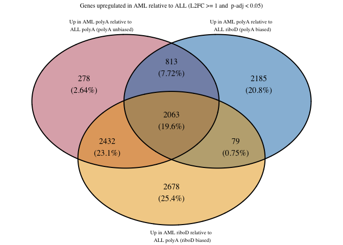

#### **Down DEGs**

``` r
ALL_AML_down_polyAunbiased_polyAbiased_riboDbiased <- list(
  "Down in AML polyA relative to ALL polyA (polyA unbiased)" = AMLPolyA_ALLPolyA_less1$Gene,
  "Down in AML polyA relative to ALL riboD (polyA biased)" = AMLPolyA_ALLRiboD_less1$Gene,
  "Down in AML riboD relative to ALL polyA (riboD biased)" = AMLRiboD_ALLPolyA_less1$Gene
)
write_rds(ALL_AML_down_polyAunbiased_polyAbiased_riboDbiased, "../../output_data/ALL_AML/ALL_AML_down_polyAunbiased_polyAbiased_riboDbiased.rds")
```

``` r
ALL_AML_down_polyAunbiased_polyAbiased_riboDbiased_VD <- venn.diagram(
  x = ALL_AML_down_polyAunbiased_polyAbiased_riboDbiased,
  category.names = c(
    "Down in AML polyA relative to \n ALL polyA (polyA unbiased)",
    "Down in AML polyA relative to \n ALL riboD (polyA biased)",
    "Down in AML riboD relative to \n ALL polyA (riboD biased)"
    ),
  filename = NULL,
  output = TRUE,
  print.mode = c("raw", "percent"),
  # Customize appearance (optional)
  fill = c("#BB5566", "#0072B2", "#E69F00"),
#  cat.col = c("#BB5566", "#0072B2", "#E69F00"),
  cex = 1, # Font size for counts
  cat.cex = 0.65, # Font size for category names
  cat.dist = c(0.05, 0.05, 0.05),
  height = 2000,
  width = 2000,
  cat.default.pos = "outer",
  cat.pos = c(-12, 12, 175), 
  main = "Genes downregulated in AML relative to ALL (L2FC <= -1 and  p-adj < 0.05)",
  main.cex = 0.75, # Font size for main title
  disable.logging = TRUE
)
```

    INFO [2026-07-04 16:22:12] $x
    INFO [2026-07-04 16:22:12] ALL_AML_down_polyAunbiased_polyAbiased_riboDbiased
    INFO [2026-07-04 16:22:12] 
    INFO [2026-07-04 16:22:12] $category.names
    INFO [2026-07-04 16:22:12] c("Down in AML polyA relative to \n ALL polyA (polyA unbiased)", 
    INFO [2026-07-04 16:22:12]     "Down in AML polyA relative to \n ALL riboD (polyA biased)", 
    INFO [2026-07-04 16:22:12]     "Down in AML riboD relative to \n ALL polyA (riboD biased)")
    INFO [2026-07-04 16:22:12] 
    INFO [2026-07-04 16:22:12] $filename
    INFO [2026-07-04 16:22:12] NULL
    INFO [2026-07-04 16:22:12] 
    INFO [2026-07-04 16:22:12] $output
    INFO [2026-07-04 16:22:12] [1] TRUE
    INFO [2026-07-04 16:22:12] 
    INFO [2026-07-04 16:22:12] $print.mode
    INFO [2026-07-04 16:22:12] c("raw", "percent")
    INFO [2026-07-04 16:22:12] 
    INFO [2026-07-04 16:22:12] $fill
    INFO [2026-07-04 16:22:12] c("#BB5566", "#0072B2", "#E69F00")
    INFO [2026-07-04 16:22:12] 
    INFO [2026-07-04 16:22:12] $cex
    INFO [2026-07-04 16:22:12] [1] 1
    INFO [2026-07-04 16:22:12] 
    INFO [2026-07-04 16:22:12] $cat.cex
    INFO [2026-07-04 16:22:12] [1] 0.65
    INFO [2026-07-04 16:22:12] 
    INFO [2026-07-04 16:22:12] $cat.dist
    INFO [2026-07-04 16:22:12] c(0.05, 0.05, 0.05)
    INFO [2026-07-04 16:22:12] 
    INFO [2026-07-04 16:22:12] $height
    INFO [2026-07-04 16:22:12] [1] 2000
    INFO [2026-07-04 16:22:12] 
    INFO [2026-07-04 16:22:12] $width
    INFO [2026-07-04 16:22:12] [1] 2000
    INFO [2026-07-04 16:22:12] 
    INFO [2026-07-04 16:22:12] $cat.default.pos
    INFO [2026-07-04 16:22:12] [1] "outer"
    INFO [2026-07-04 16:22:12] 
    INFO [2026-07-04 16:22:12] $cat.pos
    INFO [2026-07-04 16:22:12] c(-12, 12, 175)
    INFO [2026-07-04 16:22:12] 
    INFO [2026-07-04 16:22:12] $main
    INFO [2026-07-04 16:22:12] [1] "Genes downregulated in AML relative to ALL (L2FC <= -1 and  p-adj < 0.05)"
    INFO [2026-07-04 16:22:12] 
    INFO [2026-07-04 16:22:12] $main.cex
    INFO [2026-07-04 16:22:12] [1] 0.75
    INFO [2026-07-04 16:22:12] 
    INFO [2026-07-04 16:22:12] $disable.logging
    INFO [2026-07-04 16:22:12] [1] TRUE
    INFO [2026-07-04 16:22:12] 

``` r
ALL_AML_down_polyAunbiased_polyAbiased_riboDbiased_VD
```


### **RiboD unbiased against biased**

#### **Up DEGs**

``` r
ALL_AML_up_riboDunbiased_polyAbiased_riboDbiased <- list(
  "Up in AML riboD relative to ALL riboD (riboD unbiased)" = AMLRiboD_ALLRiboD_great1$Gene,
  "Up in AML polyA relative to ALL riboD (polyA biased)" = AMLPolyA_ALLRiboD_great1$Gene,
  "Up in AML riboD relative to ALL polyA (riboD biased)" = AMLRiboD_ALLPolyA_great1$Gene
)
write_rds(ALL_AML_up_riboDunbiased_polyAbiased_riboDbiased, "../../output_data/ALL_AML/ALL_AML_up_riboDunbiased_polyAbiased_riboDbiased.rds")
```

``` r
ALL_AML_up_riboDunbiased_polyAbiased_riboDbiased_VD <- venn.diagram(
  x = ALL_AML_up_riboDunbiased_polyAbiased_riboDbiased,
  category.names = c(
    "Up in AML riboD relative to \n ALL riboD (riboD unbiased)",
    "Up in AML polyA relative to \n ALL riboD (polyA biased)",
    "Up in AML riboD relative to \n ALL polyA (riboD biased)"
    ),
  filename = NULL,
  output = TRUE,
  print.mode = c("raw", "percent"),
  # Customize appearance (optional)
  fill = c("#BB5566", "#0072B2", "#E69F00"),
#  cat.col = c("#BB5566", "#0072B2", "#E69F00"),
  cex = 1, # Font size for counts
  cat.cex = 0.65, # Font size for category names
  cat.dist = c(0.05, 0.05, 0.05),
  height = 2000,
  width = 2000,
  cat.default.pos = "outer",
  cat.pos = c(-12, 12, 175), 
  main = "Genes downregulated in AML relative to ALL (L2FC <= -1 and  p-adj < 0.05)",
  main.cex = 0.75, # Font size for main title
  disable.logging = TRUE
)
```

    INFO [2026-07-04 16:22:12] $x
    INFO [2026-07-04 16:22:12] ALL_AML_up_riboDunbiased_polyAbiased_riboDbiased
    INFO [2026-07-04 16:22:12] 
    INFO [2026-07-04 16:22:12] $category.names
    INFO [2026-07-04 16:22:12] c("Up in AML riboD relative to \n ALL riboD (riboD unbiased)", 
    INFO [2026-07-04 16:22:12]     "Up in AML polyA relative to \n ALL riboD (polyA biased)", 
    INFO [2026-07-04 16:22:12]     "Up in AML riboD relative to \n ALL polyA (riboD biased)")
    INFO [2026-07-04 16:22:12] 
    INFO [2026-07-04 16:22:12] $filename
    INFO [2026-07-04 16:22:12] NULL
    INFO [2026-07-04 16:22:12] 
    INFO [2026-07-04 16:22:12] $output
    INFO [2026-07-04 16:22:12] [1] TRUE
    INFO [2026-07-04 16:22:12] 
    INFO [2026-07-04 16:22:12] $print.mode
    INFO [2026-07-04 16:22:12] c("raw", "percent")
    INFO [2026-07-04 16:22:12] 
    INFO [2026-07-04 16:22:12] $fill
    INFO [2026-07-04 16:22:12] c("#BB5566", "#0072B2", "#E69F00")
    INFO [2026-07-04 16:22:12] 
    INFO [2026-07-04 16:22:12] $cex
    INFO [2026-07-04 16:22:12] [1] 1
    INFO [2026-07-04 16:22:12] 
    INFO [2026-07-04 16:22:12] $cat.cex
    INFO [2026-07-04 16:22:12] [1] 0.65
    INFO [2026-07-04 16:22:12] 
    INFO [2026-07-04 16:22:12] $cat.dist
    INFO [2026-07-04 16:22:12] c(0.05, 0.05, 0.05)
    INFO [2026-07-04 16:22:12] 
    INFO [2026-07-04 16:22:12] $height
    INFO [2026-07-04 16:22:12] [1] 2000
    INFO [2026-07-04 16:22:12] 
    INFO [2026-07-04 16:22:12] $width
    INFO [2026-07-04 16:22:12] [1] 2000
    INFO [2026-07-04 16:22:12] 
    INFO [2026-07-04 16:22:12] $cat.default.pos
    INFO [2026-07-04 16:22:12] [1] "outer"
    INFO [2026-07-04 16:22:12] 
    INFO [2026-07-04 16:22:12] $cat.pos
    INFO [2026-07-04 16:22:12] c(-12, 12, 175)
    INFO [2026-07-04 16:22:12] 
    INFO [2026-07-04 16:22:12] $main
    INFO [2026-07-04 16:22:12] [1] "Genes downregulated in AML relative to ALL (L2FC <= -1 and  p-adj < 0.05)"
    INFO [2026-07-04 16:22:12] 
    INFO [2026-07-04 16:22:12] $main.cex
    INFO [2026-07-04 16:22:12] [1] 0.75
    INFO [2026-07-04 16:22:12] 
    INFO [2026-07-04 16:22:12] $disable.logging
    INFO [2026-07-04 16:22:12] [1] TRUE
    INFO [2026-07-04 16:22:12] 

``` r
ALL_AML_up_riboDunbiased_polyAbiased_riboDbiased_VD
```


#### **Down DEGs**

``` r
ALL_AML_down_riboDunbiased_polyAbiased_riboDbiased <- list(
  "Down in AML riboD relative to ALL riboD (riboD unbiased)" = AMLRiboD_ALLRiboD_less1$Gene,
  "Down in AML polyA relative to ALL riboD (polyA biased)" = AMLPolyA_ALLRiboD_less1$Gene,
  "Down in AML riboD relative to ALL polyA (riboD biased)" = AMLRiboD_ALLPolyA_less1$Gene
)

write_rds(ALL_AML_down_riboDunbiased_polyAbiased_riboDbiased, "../../output_data/ALL_AML/ALL_AML_down_riboDunbiased_polyAbiased_riboDbiased.rds")
```

``` r
ALL_AML_down_riboDunbiased_polyAbiased_riboDbiased_VD <- venn.diagram(
  x = ALL_AML_down_riboDunbiased_polyAbiased_riboDbiased,
  category.names = c(
    "Down in AML riboD relative to \n ALL riboD (riboD unbiased)",
    "Down in AML polyA relative to \n ALL riboD (polyA biased)",
    "Down in AML riboD relative to \n ALL polyA (riboD biased)"
    ),
  filename = NULL,
  output = TRUE,
  print.mode = c("raw", "percent"),
  # Customize appearance (optional)
  fill = c("#BB5566", "#0072B2", "#E69F00"),
#  cat.col = c("#BB5566", "#0072B2", "#E69F00"),
  cex = 1, # Font size for counts
  cat.cex = 0.65, # Font size for category names
  cat.dist = c(0.05, 0.05, 0.05),
  height = 2000,
  width = 2000,
  cat.default.pos = "outer",
  cat.pos = c(-12, 12, 175), 
  main = "Genes downregulated in AML relative to ALL (L2FC <= -1 and  p-adj < 0.05)",
  main.cex = 0.75, # Font size for main title
  disable.logging = TRUE
)
```

    INFO [2026-07-04 16:22:12] $x
    INFO [2026-07-04 16:22:12] ALL_AML_down_riboDunbiased_polyAbiased_riboDbiased
    INFO [2026-07-04 16:22:12] 
    INFO [2026-07-04 16:22:12] $category.names
    INFO [2026-07-04 16:22:12] c("Down in AML riboD relative to \n ALL riboD (riboD unbiased)", 
    INFO [2026-07-04 16:22:12]     "Down in AML polyA relative to \n ALL riboD (polyA biased)", 
    INFO [2026-07-04 16:22:12]     "Down in AML riboD relative to \n ALL polyA (riboD biased)")
    INFO [2026-07-04 16:22:12] 
    INFO [2026-07-04 16:22:12] $filename
    INFO [2026-07-04 16:22:12] NULL
    INFO [2026-07-04 16:22:12] 
    INFO [2026-07-04 16:22:12] $output
    INFO [2026-07-04 16:22:12] [1] TRUE
    INFO [2026-07-04 16:22:12] 
    INFO [2026-07-04 16:22:12] $print.mode
    INFO [2026-07-04 16:22:12] c("raw", "percent")
    INFO [2026-07-04 16:22:12] 
    INFO [2026-07-04 16:22:12] $fill
    INFO [2026-07-04 16:22:12] c("#BB5566", "#0072B2", "#E69F00")
    INFO [2026-07-04 16:22:12] 
    INFO [2026-07-04 16:22:12] $cex
    INFO [2026-07-04 16:22:12] [1] 1
    INFO [2026-07-04 16:22:12] 
    INFO [2026-07-04 16:22:12] $cat.cex
    INFO [2026-07-04 16:22:12] [1] 0.65
    INFO [2026-07-04 16:22:12] 
    INFO [2026-07-04 16:22:12] $cat.dist
    INFO [2026-07-04 16:22:12] c(0.05, 0.05, 0.05)
    INFO [2026-07-04 16:22:12] 
    INFO [2026-07-04 16:22:12] $height
    INFO [2026-07-04 16:22:12] [1] 2000
    INFO [2026-07-04 16:22:12] 
    INFO [2026-07-04 16:22:12] $width
    INFO [2026-07-04 16:22:12] [1] 2000
    INFO [2026-07-04 16:22:12] 
    INFO [2026-07-04 16:22:12] $cat.default.pos
    INFO [2026-07-04 16:22:12] [1] "outer"
    INFO [2026-07-04 16:22:12] 
    INFO [2026-07-04 16:22:12] $cat.pos
    INFO [2026-07-04 16:22:12] c(-12, 12, 175)
    INFO [2026-07-04 16:22:12] 
    INFO [2026-07-04 16:22:12] $main
    INFO [2026-07-04 16:22:12] [1] "Genes downregulated in AML relative to ALL (L2FC <= -1 and  p-adj < 0.05)"
    INFO [2026-07-04 16:22:12] 
    INFO [2026-07-04 16:22:12] $main.cex
    INFO [2026-07-04 16:22:12] [1] 0.75
    INFO [2026-07-04 16:22:12] 
    INFO [2026-07-04 16:22:12] $disable.logging
    INFO [2026-07-04 16:22:12] [1] TRUE
    INFO [2026-07-04 16:22:12] 

``` r
ALL_AML_down_riboDunbiased_polyAbiased_riboDbiased_VD
```


### **Histograms of LFC of genes in intersections**

Starting with upregulated genes in the
polyAunbiased:polyAbiased:riboDbiased comparison.

Looking at genes that are unique to polyAbiased

``` r
ALL_AML_up_polyAunbiased_uniquetopolyAbiased <- AMLPolyA_ALLRiboD_great1 %>%
  anti_join(AMLPolyA_ALLPolyA_great1, by = "Gene") %>%
  anti_join(AMLRiboD_ALLPolyA_great1, by = "Gene")
print(nrow(ALL_AML_up_polyAunbiased_uniquetopolyAbiased))
```

    [1] 2185

``` r
ALL_AML_up_polyAunbiased_uniquetopolyAbiased_avgLFC <- ALL_AML_up_polyAunbiased_uniquetopolyAbiased %>%
  summarise(
    min_value = min(log2FoldChange),
    max_value = max(log2FoldChange),
    median_value = median(log2FoldChange),
    mean_value = mean(log2FoldChange),
    stdev = sd(log2FoldChange)
  )
ALL_AML_up_polyAunbiased_uniquetopolyAbiased_avgLFC
```

| min_value | max_value | median_value | mean_value |     stdev |
|----------:|----------:|-------------:|-----------:|----------:|
|  1.000051 |  8.036623 |     1.451673 |   1.645077 | 0.7174431 |

``` r
ALL_AML_up_polyAunbiased_uniquetopolyAbiased_hist <- ggplot(ALL_AML_up_polyAunbiased_uniquetopolyAbiased, aes(x = log2FoldChange)) +
  geom_histogram(
    bins = 30, # 30 is default
    fill = "#0072B2",
    color = "#0072B2",
    alpha = 0.7
    ) +
#  scale_y_continuous(breaks = c(200, 400, 600, 800), limits = c(0,1000)) +
#  scale_x_continuous(breaks = c(2, 4, 6, 8, 10, 12, 14, 16)) +
  labs(title = "Distribution of log2FoldChange values of \n genes uniquely upregulated in AML polyA relative to ALL riboD",
       subtitle = "polyA biased, compared to polyA unbiased. Median LFC = 1.45",
       y = "Number of genes") +
  theme(plot.title = element_text(hjust = 0.5, size = 10, face = "bold"),
            axis.text = element_text(size = 10),
        plot.subtitle = element_text(size = 8, face = "bold"))

ALL_AML_up_polyAunbiased_uniquetopolyAbiased_hist
```

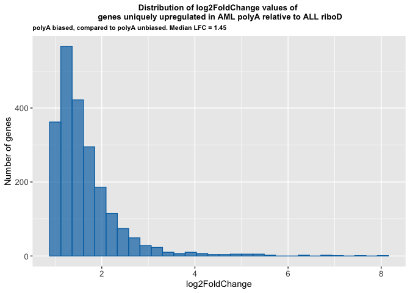

Looking at genes that are unique to riboDbiased

``` r
ALL_AML_up_polyAunbiased_uniquetoriboDbiased <- AMLRiboD_ALLPolyA_great1 %>%
  anti_join(AMLPolyA_ALLPolyA_great1, by = "Gene") %>%
  anti_join(AMLPolyA_ALLRiboD_great1, by = "Gene")
print(nrow(ALL_AML_up_polyAunbiased_uniquetoriboDbiased))
```

    [1] 2678

``` r
ALL_AML_up_polyAunbiased_uniquetoriboDbiased_avgLFC <- ALL_AML_up_polyAunbiased_uniquetoriboDbiased %>%
  summarise(
    min_value = min(log2FoldChange),
    max_value = max(log2FoldChange),
    median_value = median(log2FoldChange),
    mean_value = mean(log2FoldChange),
    stdev = sd(log2FoldChange)
  )
ALL_AML_up_polyAunbiased_uniquetoriboDbiased_avgLFC
```

| min_value | max_value | median_value | mean_value |    stdev |
|----------:|----------:|-------------:|-----------:|---------:|
|  1.000679 |  13.07141 |     1.766787 |    2.51594 | 1.993158 |

``` r
ALL_AML_up_polyAunbiased_uniquetoriboDbiased_hist <- ggplot(ALL_AML_up_polyAunbiased_uniquetoriboDbiased, aes(x = log2FoldChange)) +
  geom_histogram(
    bins = 30,
    fill = "#E69F00",
    color = "#E69F00",
    alpha = 0.7
    ) +
#  scale_y_continuous(breaks = c(200, 400, 600, 800, 1000), limits = c(0,1000)) +
#    scale_x_continuous(breaks = c(2, 4, 6, 8, 10, 12, 14, 16)) +
  labs(title = "Distribution of log2FoldChange values of \n genes uniquely upregulated in AML riboD relative to ALL polyA",
       subtitle = "riboD biased, compared to polyA unbiased. Median LFC = 1.77",
       y = "Number of genes") +
  theme(plot.title = element_text(hjust = 0.5, size = 10, face = "bold"),
            axis.text = element_text(size = 10),
        plot.subtitle = element_text(size = 8, face = "bold"))
ALL_AML_up_polyAunbiased_uniquetoriboDbiased_hist
```

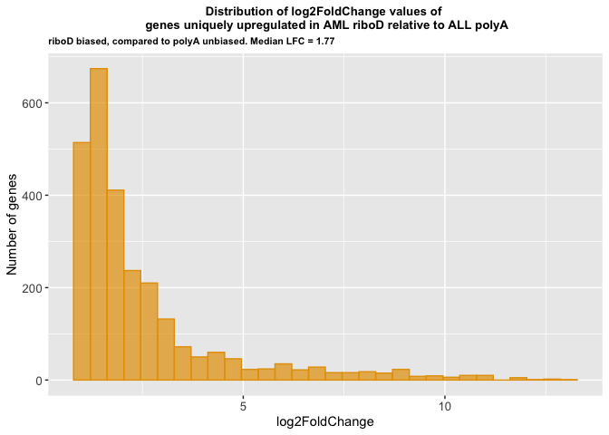

Upregulated genes in the riboD unbiased:polyAbiased:riboDbiased
comparison

Looking at genes that are unique to the polyA biased

``` r
ALL_AML_up_riboDunbiased_uniquetopolyAbiased <- AMLPolyA_ALLRiboD_great1 %>%
  anti_join(AMLRiboD_ALLRiboD_great1, by = "Gene") %>%
  anti_join(AMLRiboD_ALLPolyA_great1, by = "Gene")
print(nrow(ALL_AML_up_riboDunbiased_uniquetopolyAbiased))
```

    [1] 2008

``` r
ALL_AML_up_riboDunbiased_uniquetopolyAbiased_avgLFC <- ALL_AML_up_riboDunbiased_uniquetopolyAbiased %>%
  summarise(
    min_value = min(log2FoldChange),
    max_value = max(log2FoldChange),
    median_value = median(log2FoldChange),
    mean_value = mean(log2FoldChange),
    stdev = sd(log2FoldChange)
  )
ALL_AML_up_riboDunbiased_uniquetopolyAbiased_avgLFC
```

| min_value | max_value | median_value | mean_value |     stdev |
|----------:|----------:|-------------:|-----------:|----------:|
|  1.000315 |   9.05933 |     1.411175 |   1.649536 | 0.8138671 |

``` r
ALL_AML_up_riboDunbiased_uniquetopolyAbiased_hist <- ggplot(ALL_AML_up_riboDunbiased_uniquetopolyAbiased, aes(x = log2FoldChange)) +
  geom_histogram(
    bins = 30, # 30 is default
    fill = "#0072B2",
    color = "#0072B2",
    alpha = 0.7
    ) +
#  scale_y_continuous(breaks = c(200, 400, 600, 800), limits = c(0,1000)) +
#  scale_x_continuous(breaks = c(2, 4, 6, 8, 10, 12, 14, 16)) +
  labs(title = "Distribution of log2FoldChange values of \n genes uniquely upregulated in AML polyA relative to ALL riboD",
       subtitle = "polyA biased, compared to riboD unbiased. Median LFC = 1.41",
       y = "Number of genes") +
  theme(plot.title = element_text(hjust = 0.5, size = 10, face = "bold"),
            axis.text = element_text(size = 10),
        plot.subtitle = element_text(size = 8, face = "bold"))
ALL_AML_up_riboDunbiased_uniquetopolyAbiased_hist
```

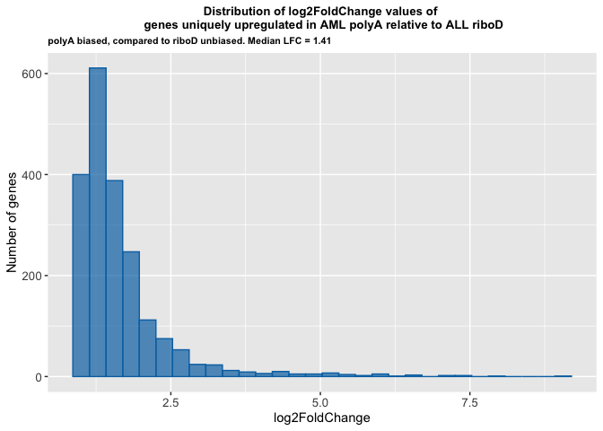

Looking at genes that are unique to riboDbiased

``` r
ALL_AML_up_riboDunbiased_uniquetoriboDbiased <- AMLRiboD_ALLPolyA_great1 %>%
  anti_join(AMLRiboD_ALLRiboD_great1, by = "Gene") %>%
  anti_join(AMLPolyA_ALLRiboD_great1, by = "Gene")
print(nrow(ALL_AML_up_riboDunbiased_uniquetoriboDbiased))
```

    [1] 4486

``` r
ALL_AML_up_riboDunbiased_uniquetoriboDbiased_avgLFC <- ALL_AML_up_riboDunbiased_uniquetoriboDbiased %>%
  summarise(
    min_value = min(log2FoldChange),
    max_value = max(log2FoldChange),
    median_value = median(log2FoldChange),
    mean_value = mean(log2FoldChange),
    stdev = sd(log2FoldChange)
  )
ALL_AML_up_riboDunbiased_uniquetoriboDbiased_avgLFC
```

| min_value | max_value | median_value | mean_value |    stdev |
|----------:|----------:|-------------:|-----------:|---------:|
|  1.000679 |  13.07141 |     2.166455 |   2.681149 | 1.763334 |

``` r
ALL_AML_up_riboDunbiased_uniquetoriboDbiased_hist <- ggplot(ALL_AML_up_riboDunbiased_uniquetoriboDbiased, aes(x = log2FoldChange)) +
  geom_histogram(
    bins = 30,
    fill = "#E69F00",
    color = "#E69F00",
    alpha = 0.7
    ) +
#  scale_y_continuous(breaks = c(200, 400, 600, 800, 1000, 1200), limits = c(0,1200)) +
#    scale_x_continuous(breaks = c(2, 4, 6, 8, 10, 12, 14, 16)) +
  labs(title = "Distribution of log2FoldChange values of \n genes uniquely upregulated in AML riboD relative to ALL polyA",
       subtitle = "riboD biased, compared to riboD unbiased. Median LFC = 2.17",
       y = "Number of genes") +
  theme(plot.title = element_text(hjust = 0.5, size = 10, face = "bold"),
            axis.text = element_text(size = 10),
        plot.subtitle = element_text(size = 8, face = "bold"))
ALL_AML_up_riboDunbiased_uniquetoriboDbiased_hist
```

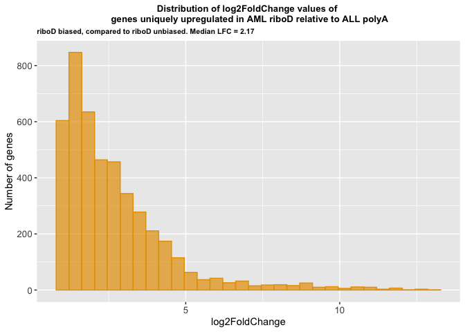

Looking at downregulated genes in the polyA unbiased:polyA biased:riboD
biased comparison

Looking at genes that are unique to the polyA biased

``` r
ALL_AML_down_polyAunbiased_uniquetopolyAbiased <- AMLPolyA_ALLRiboD_less1 %>%
  anti_join(AMLPolyA_ALLPolyA_less1, by = "Gene") %>%
  anti_join(AMLRiboD_ALLPolyA_less1, by = "Gene")
print(nrow(ALL_AML_down_polyAunbiased_uniquetopolyAbiased))
```

    [1] 3663

``` r
ALL_AML_down_polyAunbiased_uniquetopolyAbiased_avgLFC <- ALL_AML_down_polyAunbiased_uniquetopolyAbiased %>%
  summarise(
    min_value = min(log2FoldChange),
    max_value = max(log2FoldChange),
    median_value = median(log2FoldChange),
    mean_value = mean(log2FoldChange),
    stdev = sd(log2FoldChange)
  )
ALL_AML_down_polyAunbiased_uniquetopolyAbiased_avgLFC
```

| min_value | max_value | median_value | mean_value |    stdev |
|----------:|----------:|-------------:|-----------:|---------:|
| -15.39796 |  -1.00016 |    -1.707974 |  -2.359321 | 1.868714 |

``` r
ALL_AML_down_polyAunbiased_uniquetopolyAbiased_hist <- ggplot(ALL_AML_down_polyAunbiased_uniquetopolyAbiased, aes(x = log2FoldChange)) +
  geom_histogram(
    bins = 30, # 30 is default
    fill = "#0072B2",
    color = "#0072B2",
    alpha = 0.7
    ) +
#  scale_y_continuous(breaks = c(200, 400, 600, 800), limits = c(0,1000)) +
#  scale_x_continuous(breaks = c(0, -1, -2, -4, -6, -8, -10, -12, -14, -16)) +
  labs(title = "Distribution of log2FoldChange values of \n genes uniquely downregulated in AML polyA relative to ALL riboD",
       subtitle = "polyA biased, compared to polyA unbiased. Median LFC = -1.7",
       y = "Number of genes") +
  theme(plot.title = element_text(hjust = 0.5, size = 13, face = "bold"),
            axis.text = element_text(size = 13),
        plot.subtitle = element_text(size = 8, face = "bold"))

ALL_AML_down_polyAunbiased_uniquetopolyAbiased_hist
```

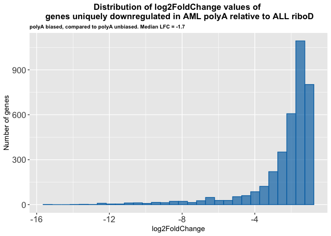

Looking at genes that are unique to the riboD biased

``` r
ALL_AML_down_polyAunbiased_uniquetoriboDbiased <- AMLRiboD_ALLPolyA_less1 %>%
  anti_join(AMLPolyA_ALLPolyA_less1, by = "Gene") %>%
  anti_join(AMLPolyA_ALLRiboD_less1, by = "Gene")
print(nrow(ALL_AML_down_polyAunbiased_uniquetoriboDbiased))
```

    [1] 1420

``` r
ALL_AML_down_polyAunbiased_uniquetoriboDbiased_avgLFC <- ALL_AML_down_polyAunbiased_uniquetoriboDbiased %>%
  summarise(
    min_value = min(log2FoldChange),
    max_value = max(log2FoldChange),
    median_value = median(log2FoldChange),
    mean_value = mean(log2FoldChange),
    stdev = sd(log2FoldChange)
  )
ALL_AML_down_polyAunbiased_uniquetoriboDbiased_avgLFC
```

| min_value | max_value | median_value | mean_value |     stdev |
|----------:|----------:|-------------:|-----------:|----------:|
| -8.750837 | -1.000163 |    -1.311632 |  -1.512637 | 0.6611466 |

``` r
ALL_AML_down_polyAunbiased_uniquetoriboDbiased_hist <- ggplot(ALL_AML_down_polyAunbiased_uniquetoriboDbiased, aes(x = log2FoldChange)) +
  geom_histogram(
    bins = 30, # 30 is default
    fill = "#E69F00",
    color = "#E69F00",
    alpha = 0.7
    ) +
#  scale_y_continuous(breaks = c(200, 400, 600, 800), limits = c(0,1000)) +
#  scale_x_continuous(breaks = c(0, -2, -4, -6, -8, -10, -12, -14, -16)) +
  labs(title = "Distribution of log2FoldChange values of \n genes uniquely downregulated in SS riboD relative to aRMS polyA",
       subtitle = "riboD biased, compared to polyA_unbiased. Median LFC = -1.31",
       y = "Number of genes") +
  theme(plot.title = element_text(hjust = 0.5, size = 13, face = "bold"),
            axis.text = element_text(size = 13),
        plot.subtitle = element_text(size = 8, face = "bold"))

ALL_AML_down_polyAunbiased_uniquetoriboDbiased_hist
```

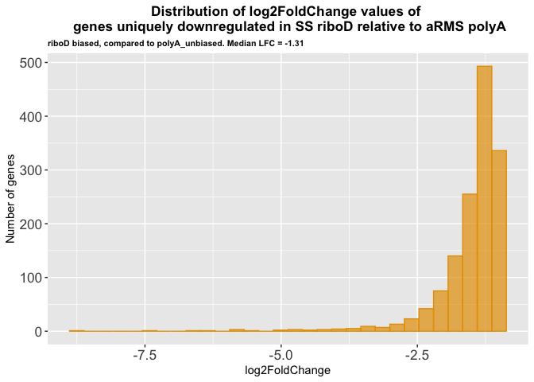

Looking at downregulated genes in the riboD unbiased:polyA biased:riboD
biased comparison

Looking at genes that are unique to the polyA biased

``` r
ALL_AML_down_riboDunbiased_uniquetopolyAbiased <- AMLPolyA_ALLRiboD_less1 %>%
  anti_join(AMLRiboD_ALLRiboD_less1, by = "Gene") %>%
  anti_join(AMLRiboD_ALLPolyA_less1, by = "Gene")
print(nrow(ALL_AML_down_riboDunbiased_uniquetopolyAbiased))
```

    [1] 3561

``` r
ALL_AML_down_riboDunbiased_uniquetopolyAbiased_avgLFC <- ALL_AML_down_riboDunbiased_uniquetopolyAbiased %>%
  summarise(
    min_value = min(log2FoldChange),
    max_value = max(log2FoldChange),
    median_value = median(log2FoldChange),
    mean_value = mean(log2FoldChange),
    stdev = sd(log2FoldChange)
  )
ALL_AML_down_riboDunbiased_uniquetopolyAbiased_avgLFC
```

| min_value | max_value | median_value | mean_value |    stdev |
|----------:|----------:|-------------:|-----------:|---------:|
| -17.95344 |  -1.00016 |    -1.685525 |  -2.343238 | 1.937814 |

``` r
ALL_AML_down_riboDunbiased_uniquetopolyAbiased_hist <- ggplot(ALL_AML_down_riboDunbiased_uniquetopolyAbiased, aes(x = log2FoldChange)) +
  geom_histogram(
    bins = 30, # 30 is default
    fill = "#0072B2",
    color = "#0072B2",
    alpha = 0.7
    ) +
#  scale_y_continuous(breaks = c(200, 400, 600, 800), limits = c(0,1000)) +
#  scale_x_continuous(breaks = c(0, -1, -2, -4, -6, -8, -10, -12, -14, -16)) +
  labs(title = "Distribution of log2FoldChange values of \n genes uniquely downregulated in AML polyA relative to ALL riboD",
       subtitle = "polyA biased, compared to riboD unbiased. Median LFC = -1.69",
       y = "Number of genes") +
  theme(plot.title = element_text(hjust = 0.5, size = 13, face = "bold"),
            axis.text = element_text(size = 13),
        plot.subtitle = element_text(size = 8, face = "bold"))
ALL_AML_down_riboDunbiased_uniquetopolyAbiased_hist
```

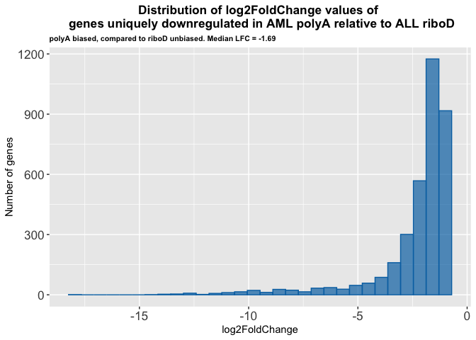

Looking at genes that are unique to the riboD biased

``` r
ALL_AML_down_riboDunbiased_uniquetoriboDbiased <- AMLRiboD_ALLPolyA_less1 %>%
  anti_join(AMLRiboD_ALLRiboD_less1, by = "Gene") %>%
  anti_join(AMLPolyA_ALLRiboD_less1, by = "Gene")
print(nrow(ALL_AML_down_riboDunbiased_uniquetoriboDbiased))
```

    [1] 2064

``` r
ALL_AML_down_riboDunbiased_uniquetoriboDbiased_avgLFC <- ALL_AML_down_riboDunbiased_uniquetoriboDbiased %>%
  summarise(
    min_value = min(log2FoldChange),
    max_value = max(log2FoldChange),
    median_value = median(log2FoldChange),
    mean_value = mean(log2FoldChange),
    stdev = sd(log2FoldChange)
  )
ALL_AML_down_riboDunbiased_uniquetoriboDbiased_avgLFC
```

| min_value | max_value | median_value | mean_value |     stdev |
|----------:|----------:|-------------:|-----------:|----------:|
| -12.45958 | -1.000163 |    -1.418045 |  -1.655392 | 0.8214941 |

``` r
ALL_AML_down_riboDunbiased_uniquetoriboDbiased_hist <- ggplot(ALL_AML_down_riboDunbiased_uniquetoriboDbiased, aes(x = log2FoldChange)) +
  geom_histogram(
    bins = 30, # 30 is default
    fill = "#E69F00",
    color = "#E69F00",
    alpha = 0.7
    ) +
#  scale_y_continuous(breaks = c(200, 400, 600, 800), limits = c(0,1000)) +
#  scale_x_continuous(breaks = c(0, -2, -4, -6, -8, -10, -12, -14, -16)) +
  labs(title = "Distribution of log2FoldChange values of \n genes uniquely downregulated in AML riboD relative to ALL polyA",
       subtitle = "riboD biased, compared to riboD unbiased. Median LFC = -1.42",
       y = "Number of genes") +
  theme(plot.title = element_text(hjust = 0.5, size = 10, face = "bold"),
            axis.text = element_text(size = 10),
        plot.subtitle = element_text(size = 8, face = "bold"))
ALL_AML_down_riboDunbiased_uniquetoriboDbiased_hist
```

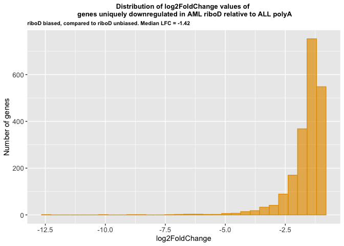

Genes in common between the polyAunbiased:polyAbiased:riboDbiased venn
diagram and the riboDunbiased:polyAbiased:riboDbiased venn diagram

upregulated polyA biased

``` r
ALL_AML_up_polyAbiased <- inner_join(ALL_AML_up_polyAunbiased_uniquetopolyAbiased, ALL_AML_up_riboDunbiased_uniquetopolyAbiased, by = "Gene")

write_rds(ALL_AML_up_polyAbiased, "../../output_data/ALL_AML/ALL_AML_up_polyAbiased.rds")

print(nrow(ALL_AML_up_polyAbiased))
```

    [1] 1520

``` r
ALL_AML_up_polyAbiased_avgLFC <- ALL_AML_up_polyAbiased %>%
  summarise(
    min_value = min(log2FoldChange.x),
    max_value = max(log2FoldChange.x),
    median_value = median(log2FoldChange.x),
    mean_value = mean(log2FoldChange.x),
    stdev = sd(log2FoldChange.x)
  )
ALL_AML_up_polyAbiased_avgLFC
```

| min_value | max_value | median_value | mean_value |     stdev |
|----------:|----------:|-------------:|-----------:|----------:|
|  1.000315 |  8.036623 |     1.342516 |   1.505662 | 0.6205769 |

``` r
ALL_AML_up_polyAbiased_hist <- ggplot(ALL_AML_up_polyAbiased, aes(x = log2FoldChange.x)) +
  geom_histogram(
    bins = 30, # 30 is default
    fill = "#0072B2",
    color = "#0072B2",
    alpha = 0.7
    ) +
#  scale_y_continuous(breaks = c(200, 400, 600, 800), limits = c(0,1000)) +
#  scale_x_continuous(breaks = c(2, 4, 6, 8, 10, 12, 14, 16)) +
  labs(title = "Distribution of log2FoldChange values of \n genes uniquely upregulated in AML polyA relative to ALL riboD",
       subtitle = "polyA biased, Median LFC = 1.34",
       y = "Number of genes") +
  theme(plot.title = element_text(hjust = 0.5, size = 10, face = "bold"),
            axis.text = element_text(size = 10),
        plot.subtitle = element_text(size = 8, face = "bold"))
ALL_AML_up_polyAbiased_hist
```

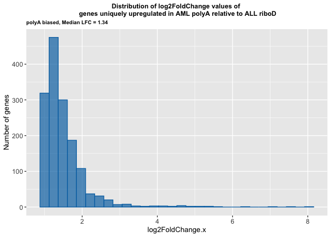

upregulated riboD biased

``` r
ALL_AML_up_riboDbiased <- inner_join(ALL_AML_up_polyAunbiased_uniquetoriboDbiased, ALL_AML_up_riboDunbiased_uniquetoriboDbiased, by = "Gene")

write_rds(ALL_AML_up_riboDbiased, "../../output_data/ALL_AML/ALL_AML_up_riboDbiased.rds")

print(nrow(ALL_AML_up_riboDbiased))
```

    [1] 2443

``` r
ALL_AML_up_riboDbiased_avgLFC <- ALL_AML_up_riboDbiased %>%
  summarise(
    min_value = min(log2FoldChange.x),
    max_value = max(log2FoldChange.x),
    median_value = median(log2FoldChange.x),
    mean_value = mean(log2FoldChange.x),
    stdev = sd(log2FoldChange.x)
  )
ALL_AML_up_riboDbiased_avgLFC
```

| min_value | max_value | median_value | mean_value |    stdev |
|----------:|----------:|-------------:|-----------:|---------:|
|  1.000679 |  13.07141 |     1.752502 |   2.537884 | 2.043994 |

``` r
ALL_AML_up_riboDbiased_hist <- ggplot(ALL_AML_up_riboDbiased, aes(x = log2FoldChange.x)) +
  geom_histogram(
    bins = 30, # 30 is default
    fill = "#E69F00",
    color = "#E69F00",
    alpha = 0.7
    ) +
#  scale_y_continuous(breaks = c(200, 400, 600, 800), limits = c(0,1000)) +
#  scale_x_continuous(breaks = c(2, 4, 6, 8, 10, 12, 14, 16)) +
  labs(title = "Distribution of log2FoldChange values of \n genes uniquely upregulated in AML riboD relative to ALL polyA",
       subtitle = "riboDbiased, Median LFC = 1.75",
       y = "Number of genes") +
  theme(plot.title = element_text(hjust = 0.5, size = 10, face = "bold"),
            axis.text = element_text(size = 10),
        plot.subtitle = element_text(size = 8, face = "bold"))
ALL_AML_up_riboDbiased_hist
```

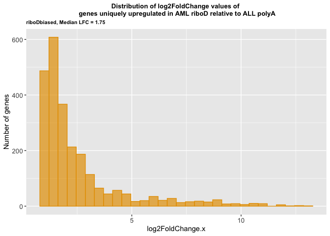

Genes in common between the polyAunbiased:polyAbiased:riboDbiased venn
diagram and the riboDunbiased:polyAbiased:riboDbiased venn diagram

downregulated polyA biased

``` r
ALL_AML_down_polyAbiased <- inner_join(ALL_AML_down_polyAunbiased_uniquetopolyAbiased, ALL_AML_down_riboDunbiased_uniquetopolyAbiased, by = "Gene")
print(nrow(ALL_AML_down_polyAbiased))
```

    [1] 2988

``` r
ALL_AML_down_polyAbiased_avgLFC <- ALL_AML_down_polyAbiased %>%
  summarise(
    min_value = min(log2FoldChange.x),
    max_value = max(log2FoldChange.x),
    median_value = median(log2FoldChange.x),
    mean_value = mean(log2FoldChange.x),
    stdev = sd(log2FoldChange.x)
  )
ALL_AML_down_polyAbiased_avgLFC
```

| min_value | max_value | median_value | mean_value |    stdev |
|----------:|----------:|-------------:|-----------:|---------:|
| -13.27775 |  -1.00016 |    -1.627678 |  -2.236554 | 1.779706 |

``` r
ALL_AML_down_polyAbiased_hist <- ggplot(ALL_AML_down_polyAbiased, aes(x = log2FoldChange.x)) +
  geom_histogram(
    bins = 30, # 30 is default
    fill = "#0072B2",
    color = "#0072B2",
    alpha = 0.7
    ) +
#  scale_y_continuous(breaks = c(200, 400, 600, 800), limits = c(0,1000)) +
#  scale_x_continuous(breaks = c(2, 4, 6, 8, 10, 12, 14, 16)) +
  labs(title = "Distribution of log2FoldChange values of \n genes uniquely downregulated in AML polyA relative to ALL riboD",
       subtitle = "polyA biased, Median LFC = -1.63",
       y = "Number of genes") +
  theme(plot.title = element_text(hjust = 0.5, size = 10, face = "bold"),
            axis.text = element_text(size = 10),
        plot.subtitle = element_text(size = 8, face = "bold"))
ALL_AML_down_polyAbiased_hist
```

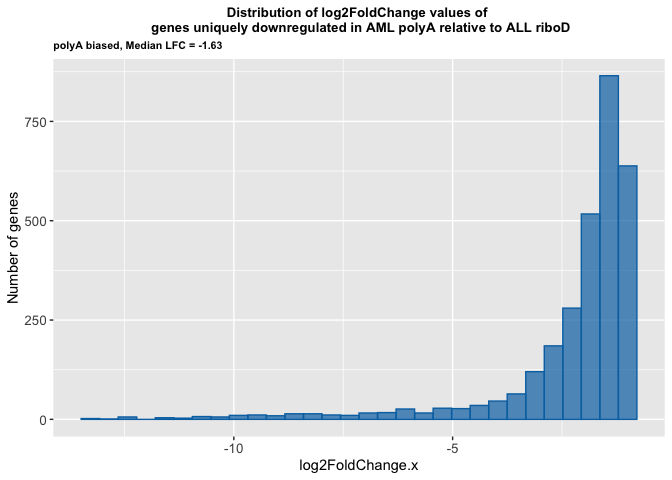

downregulated riboD biased

``` r
ALL_AML_down_riboDbiased <- inner_join(ALL_AML_down_polyAunbiased_uniquetoriboDbiased, ALL_AML_down_riboDunbiased_uniquetoriboDbiased, by = "Gene")

write_rds(ALL_AML_down_riboDbiased, "../../output_data/ALL_AML/ALL_AML_down_riboDbiased.rds")

print(nrow(ALL_AML_down_riboDbiased))
```

    [1] 1274

``` r
ALL_AML_down_riboDbiased_avgLFC <- ALL_AML_down_riboDbiased %>%
  summarise(
    min_value = min(log2FoldChange.x),
    max_value = max(log2FoldChange.x),
    median_value = median(log2FoldChange.x),
    mean_value = mean(log2FoldChange.x),
    stdev = sd(log2FoldChange.x)
  )
ALL_AML_down_riboDbiased_avgLFC
```

| min_value | max_value | median_value | mean_value |     stdev |
|----------:|----------:|-------------:|-----------:|----------:|
| -8.750837 | -1.000163 |    -1.296047 |  -1.490497 | 0.6459411 |

``` r
ALL_AML_down_riboDbiased_hist <- ggplot(ALL_AML_down_riboDbiased, aes(x = log2FoldChange.x)) +
  geom_histogram(
    bins = 30, # 30 is default
    fill = "#E69F00",
    color = "#E69F00",
    alpha = 0.7
    ) +
#  scale_y_continuous(breaks = c(200, 400, 600, 800), limits = c(0,1000)) +
#  scale_x_continuous(breaks = c(2, 4, 6, 8, 10, 12, 14, 16)) +
  labs(title = "Distribution of log2FoldChange values of \n genes uniquely downregulated in AML riboD relative to ALL polyA",
       subtitle = "riboD biased, Mean LFC = -1.30",
       y = "Number of genes") +
  theme(plot.title = element_text(hjust = 0.5, size = 10, face = "bold"),
            axis.text = element_text(size = 10),
        plot.subtitle = element_text(size = 8, face = "bold"))
ALL_AML_down_riboDbiased_hist
```

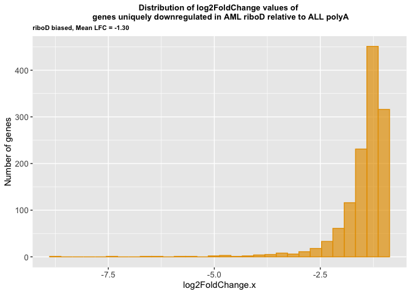

### **Session Info**

``` r
sessioninfo::session_info()
```

    ─ Session info ───────────────────────────────────────────────────────────────
     setting  value
     version  R version 4.5.2 (2025-10-31)
     os       macOS Tahoe 26.5
     system   aarch64, darwin20
     ui       X11
     language (EN)
     collate  en_US.UTF-8
     ctype    en_US.UTF-8
     tz       America/Los_Angeles
     date     2026-07-04
     pandoc   3.8.3 @ /Applications/RStudio.app/Contents/Resources/app/quarto/bin/tools/aarch64/ (via rmarkdown)
     quarto   1.9.36 @ /Applications/RStudio.app/Contents/Resources/app/quarto/bin/quarto

    ─ Packages ───────────────────────────────────────────────────────────────────
     ! package        * version date (UTC) lib source
     P BiocManager      1.30.26 2025-06-05 [?] CRAN (R 4.5.0)
     P bit              4.6.0   2025-03-06 [?] RSPM
     P bit64            4.6.0-1 2025-01-16 [?] CRAN (R 4.5.0)
     P cli              3.6.5   2025-04-23 [?] CRAN (R 4.5.0)
     P crayon           1.5.3   2024-06-20 [?] RSPM
     P digest           0.6.37  2024-08-19 [?] CRAN (R 4.5.0)
     P dplyr          * 1.1.4   2023-11-17 [?] CRAN (R 4.5.0)
     P evaluate         1.0.5   2025-08-27 [?] RSPM
     P farver           2.1.2   2024-05-13 [?] RSPM
     P fastmap          1.2.0   2024-05-15 [?] RSPM
     P forcats        * 1.0.1   2025-09-25 [?] RSPM
     P formatR          1.14    2023-01-17 [?] CRAN (R 4.5.0)
     P futile.logger  * 1.4.3   2016-07-10 [?] CRAN (R 4.5.0)
     P futile.options   1.0.1   2018-04-20 [?] CRAN (R 4.5.0)
     P generics         0.1.4   2025-05-09 [?] RSPM
     P ggplot2        * 4.0.0   2025-09-11 [?] CRAN (R 4.5.0)
     P glue             1.8.0   2024-09-30 [?] CRAN (R 4.5.0)
     P gtable           0.3.6   2024-10-25 [?] RSPM
     P hms              1.1.4   2025-10-17 [?] RSPM
     P htmltools        0.5.8.1 2024-04-04 [?] CRAN (R 4.5.0)
     P jsonlite         2.0.0   2025-03-27 [?] RSPM
     P knitr            1.50    2025-03-16 [?] CRAN (R 4.5.0)
     P labeling         0.4.3   2023-08-29 [?] RSPM
     P lambda.r         1.2.4   2019-09-18 [?] CRAN (R 4.5.0)
     P lifecycle        1.0.4   2023-11-07 [?] CRAN (R 4.5.0)
     P lubridate      * 1.9.4   2024-12-08 [?] CRAN (R 4.5.0)
     P magrittr         2.0.4   2025-09-12 [?] CRAN (R 4.5.0)
     P pillar           1.11.1  2025-09-17 [?] RSPM
     P pkgconfig        2.0.3   2019-09-22 [?] RSPM
     P purrr          * 1.1.0   2025-07-10 [?] CRAN (R 4.5.0)
     P R6               2.6.1   2025-02-15 [?] RSPM
     P RColorBrewer     1.1-3   2022-04-03 [?] RSPM
     P readr          * 2.1.5   2024-01-10 [?] CRAN (R 4.5.0)
       renv             1.1.5   2025-07-24 [1] CRAN (R 4.5.0)
     P rlang            1.2.0   2026-04-06 [?] RSPM
     P rmarkdown        2.30    2025-09-28 [?] CRAN (R 4.5.0)
     P rstudioapi       0.17.1  2024-10-22 [?] CRAN (R 4.5.0)
     P S7               0.2.0   2024-11-07 [?] CRAN (R 4.5.0)
     P scales           1.4.0   2025-04-24 [?] RSPM
     P sessioninfo      1.2.3   2025-02-05 [?] CRAN (R 4.5.0)
     P stringi          1.8.7   2025-03-27 [?] RSPM
     P stringr        * 1.5.2   2025-09-08 [?] CRAN (R 4.5.0)
     P tibble         * 3.3.0   2025-06-08 [?] CRAN (R 4.5.0)
     P tidyr          * 1.3.1   2024-01-24 [?] CRAN (R 4.5.0)
     P tidyselect       1.2.1   2024-03-11 [?] RSPM
     P tidyverse      * 2.0.0   2023-02-22 [?] RSPM
     P timechange       0.3.0   2024-01-18 [?] CRAN (R 4.5.0)
     P tzdb             0.5.0   2025-03-15 [?] RSPM
     P vctrs            0.6.5   2023-12-01 [?] CRAN (R 4.5.0)
     P VennDiagram    * 1.8.2   2026-01-11 [?] RSPM
     P vroom            1.6.6   2025-09-19 [?] CRAN (R 4.5.0)
     P withr            3.0.2   2024-10-28 [?] CRAN (R 4.5.0)
     P xfun             0.55    2025-12-16 [?] CRAN (R 4.5.2)
     P yaml             2.3.10  2024-07-26 [?] CRAN (R 4.5.0)

     [1] /Users/maryke/Documents/Treehouse/Lab_Notebooks/transcript_enrichment_bias_assessment/Fig_2/ALL_AML/renv/library/macos/R-4.5/aarch64-apple-darwin20
     [2] /Users/maryke/Library/Caches/org.R-project.R/R/renv/sandbox/macos/R-4.5/aarch64-apple-darwin20/4cd76b74

     * ── Packages attached to the search path.
     P ── Loaded and on-disk path mismatch.

    ──────────────────────────────────────────────────────────────────────────────
