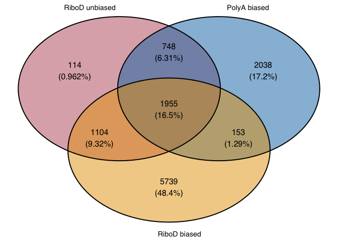
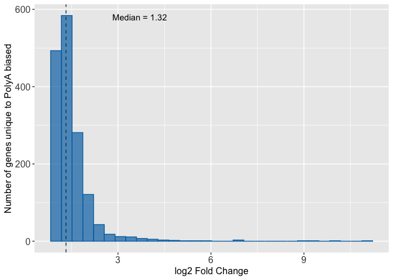
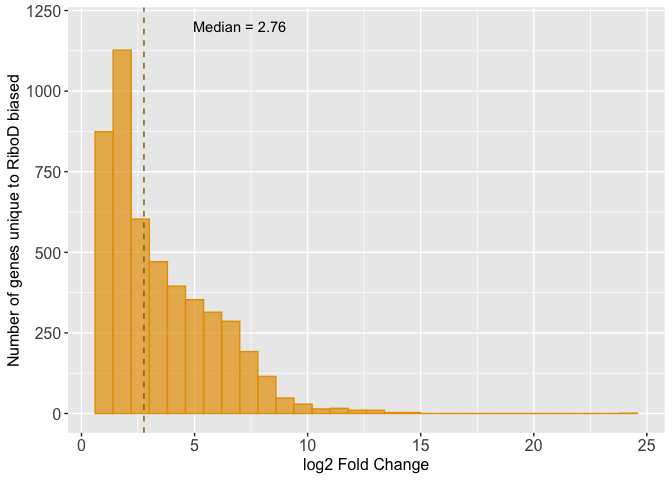
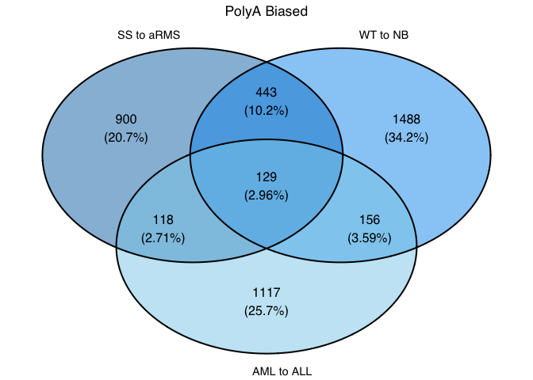
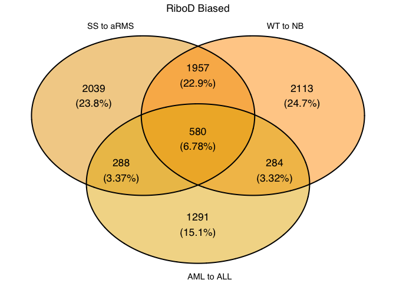
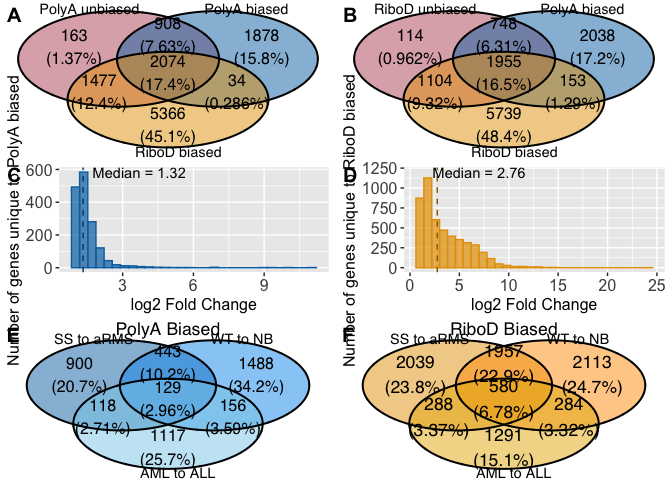

# Fig2_all


## **Fig2**

**Representative assessment of biases introduced in differential
expression analysis when comparing two diseases across transcript
enrichment methods**

``` r
library(tidyverse)
```

    ── Attaching core tidyverse packages ──────────────────────── tidyverse 2.0.0 ──
    ✔ dplyr     1.1.4     ✔ readr     2.1.5
    ✔ forcats   1.0.1     ✔ stringr   1.5.2
    ✔ ggplot2   4.0.0     ✔ tibble    3.3.0
    ✔ lubridate 1.9.4     ✔ tidyr     1.3.1
    ✔ purrr     1.1.0     
    ── Conflicts ────────────────────────────────────────── tidyverse_conflicts() ──
    ✖ dplyr::filter() masks stats::filter()
    ✖ dplyr::lag()    masks stats::lag()
    ℹ Use the conflicted package (<http://conflicted.r-lib.org/>) to force all conflicts to become errors

``` r
library(ggplot2)
library(cowplot)
```


    Attaching package: 'cowplot'

    The following object is masked from 'package:lubridate':

        stamp

``` r
library(VennDiagram)
```

    Loading required package: grid
    Loading required package: futile.logger

``` r
aRMS_SS_up_polyAunbiased_polyAbiased_riboDbiased <- read_rds("../../output_data/aRMS_SS/aRMS_SS_up_polyAunbiased_polyAbiased_riboDbiased.rds") #for fig 2A - venn diagram

aRMS_SS_up_riboDunbiased_polyAbiased_riboDbiased <- read_rds("../../output_data/aRMS_SS/aRMS_SS_up_riboDunbiased_polyAbiased_riboDbiased.rds") #for fig 2B - venn diagram

aRMS_SS_up_polyAbiased <- read_rds("../../output_data/aRMS_SS/aRMS_SS_up_polyAbiased.rds") #for fig 2C - histogram

aRMS_SS_up_riboDbiased <- read_rds("../../output_data/aRMS_SS/aRMS_SS_up_riboDbiased.rds") #for fig 2D - histogram

up_polyAbiased_all <- read_rds("../../output_data/all_disease_comparisons/up_polyAbiased_all.rds") #for fig 2E - venn diagram

up_riboDbiased_all <- read_rds("../../output_data/all_disease_comparisons/up_riboDbiased_all.rds") #for fig 2E - venn diagram
```

``` r
# for fig 2A
Fig_2A <- venn.diagram(
  x = aRMS_SS_up_polyAunbiased_polyAbiased_riboDbiased,
  category.names = c(
    "PolyA unbiased",
    "PolyA biased",
    "RiboD biased"
    ),
  filename = NULL, # Save as a PNG file
  output = TRUE,
  print.mode = c("raw", "percent"),
  # Customize appearance (optional)
  fill = c("#BB5566", "#0072B2", "#E69F00"),
#  cat.col = c("#BB5566", "#0072B2", "#E69F00"),
  cex = 1, # Font size for counts
  cat.cex = 0.9, # Font size for category names
  cat.dist = c(0.04, 0.04, 0.04),
  # height = 1000,
  # width = 1000,
  cat.default.pos = "outer",
  cat.pos = c(-14, 14, 175), 
  # main = "Upregulated genes in SS relative to aRMS",
  main.cex = 1.1, # Font size for main title
  disable.logging = TRUE,
  sigdigs = 3, 
  cat.fontfamily = "sans",
  main.fontfamily = "sans",
  fontfamily = "sans"
)
```

    INFO [2026-07-04 17:59:16] $x
    INFO [2026-07-04 17:59:16] aRMS_SS_up_polyAunbiased_polyAbiased_riboDbiased
    INFO [2026-07-04 17:59:16] 
    INFO [2026-07-04 17:59:16] $category.names
    INFO [2026-07-04 17:59:16] c("PolyA unbiased", "PolyA biased", "RiboD biased")
    INFO [2026-07-04 17:59:16] 
    INFO [2026-07-04 17:59:16] $filename
    INFO [2026-07-04 17:59:16] NULL
    INFO [2026-07-04 17:59:16] 
    INFO [2026-07-04 17:59:16] $output
    INFO [2026-07-04 17:59:16] [1] TRUE
    INFO [2026-07-04 17:59:16] 
    INFO [2026-07-04 17:59:16] $print.mode
    INFO [2026-07-04 17:59:16] c("raw", "percent")
    INFO [2026-07-04 17:59:16] 
    INFO [2026-07-04 17:59:16] $fill
    INFO [2026-07-04 17:59:16] c("#BB5566", "#0072B2", "#E69F00")
    INFO [2026-07-04 17:59:16] 
    INFO [2026-07-04 17:59:16] $cex
    INFO [2026-07-04 17:59:16] [1] 1
    INFO [2026-07-04 17:59:16] 
    INFO [2026-07-04 17:59:16] $cat.cex
    INFO [2026-07-04 17:59:16] [1] 0.9
    INFO [2026-07-04 17:59:16] 
    INFO [2026-07-04 17:59:16] $cat.dist
    INFO [2026-07-04 17:59:16] c(0.04, 0.04, 0.04)
    INFO [2026-07-04 17:59:16] 
    INFO [2026-07-04 17:59:16] $cat.default.pos
    INFO [2026-07-04 17:59:16] [1] "outer"
    INFO [2026-07-04 17:59:16] 
    INFO [2026-07-04 17:59:16] $cat.pos
    INFO [2026-07-04 17:59:16] c(-14, 14, 175)
    INFO [2026-07-04 17:59:16] 
    INFO [2026-07-04 17:59:16] $main.cex
    INFO [2026-07-04 17:59:16] [1] 1.1
    INFO [2026-07-04 17:59:16] 
    INFO [2026-07-04 17:59:16] $disable.logging
    INFO [2026-07-04 17:59:16] [1] TRUE
    INFO [2026-07-04 17:59:16] 
    INFO [2026-07-04 17:59:16] $sigdigs
    INFO [2026-07-04 17:59:16] [1] 3
    INFO [2026-07-04 17:59:16] 
    INFO [2026-07-04 17:59:16] $cat.fontfamily
    INFO [2026-07-04 17:59:16] [1] "sans"
    INFO [2026-07-04 17:59:16] 
    INFO [2026-07-04 17:59:16] $main.fontfamily
    INFO [2026-07-04 17:59:16] [1] "sans"
    INFO [2026-07-04 17:59:16] 
    INFO [2026-07-04 17:59:16] $fontfamily
    INFO [2026-07-04 17:59:16] [1] "sans"
    INFO [2026-07-04 17:59:16] 

``` r
Fig_2A
```


``` r
# for fig 2B
Fig_2B <- venn.diagram(
  x = aRMS_SS_up_riboDunbiased_polyAbiased_riboDbiased,
  category.names = c(
    "RiboD unbiased",
    "PolyA biased",
    "RiboD biased"
    ),
  filename = NULL, # Save as a PNG file
  output = TRUE,
  print.mode = c("raw", "percent"),
  # Customize appearance (optional)
  fill = c("#BB5566", "#0072B2", "#E69F00"),
#  cat.col = c("#BB5566", "#0072B2", "#E69F00"),
  cex = 1, # Font size for counts
  cat.cex = 0.9, # Font size for category names
  cat.dist = c(0.04, 0.04, 0.04),
  # height = 2000,
  # width = 2000,
  cat.default.pos = "outer",
  cat.pos = c(-14, 14, 175), 
  # main = "Upregulated genes in SS relative to aRMS",
  main.cex = 1.1, # Font size for main title
  disable.logging = TRUE,
  sigdigs = 3, 
  cat.fontfamily = "sans",
  main.fontfamily = "sans",
  fontfamily = "sans"
)
```

    INFO [2026-07-04 17:59:16] $x
    INFO [2026-07-04 17:59:16] aRMS_SS_up_riboDunbiased_polyAbiased_riboDbiased
    INFO [2026-07-04 17:59:16] 
    INFO [2026-07-04 17:59:16] $category.names
    INFO [2026-07-04 17:59:16] c("RiboD unbiased", "PolyA biased", "RiboD biased")
    INFO [2026-07-04 17:59:16] 
    INFO [2026-07-04 17:59:16] $filename
    INFO [2026-07-04 17:59:16] NULL
    INFO [2026-07-04 17:59:16] 
    INFO [2026-07-04 17:59:16] $output
    INFO [2026-07-04 17:59:16] [1] TRUE
    INFO [2026-07-04 17:59:16] 
    INFO [2026-07-04 17:59:16] $print.mode
    INFO [2026-07-04 17:59:16] c("raw", "percent")
    INFO [2026-07-04 17:59:16] 
    INFO [2026-07-04 17:59:16] $fill
    INFO [2026-07-04 17:59:16] c("#BB5566", "#0072B2", "#E69F00")
    INFO [2026-07-04 17:59:16] 
    INFO [2026-07-04 17:59:16] $cex
    INFO [2026-07-04 17:59:16] [1] 1
    INFO [2026-07-04 17:59:16] 
    INFO [2026-07-04 17:59:16] $cat.cex
    INFO [2026-07-04 17:59:16] [1] 0.9
    INFO [2026-07-04 17:59:16] 
    INFO [2026-07-04 17:59:16] $cat.dist
    INFO [2026-07-04 17:59:16] c(0.04, 0.04, 0.04)
    INFO [2026-07-04 17:59:16] 
    INFO [2026-07-04 17:59:16] $cat.default.pos
    INFO [2026-07-04 17:59:16] [1] "outer"
    INFO [2026-07-04 17:59:16] 
    INFO [2026-07-04 17:59:16] $cat.pos
    INFO [2026-07-04 17:59:16] c(-14, 14, 175)
    INFO [2026-07-04 17:59:16] 
    INFO [2026-07-04 17:59:16] $main.cex
    INFO [2026-07-04 17:59:16] [1] 1.1
    INFO [2026-07-04 17:59:16] 
    INFO [2026-07-04 17:59:16] $disable.logging
    INFO [2026-07-04 17:59:16] [1] TRUE
    INFO [2026-07-04 17:59:16] 
    INFO [2026-07-04 17:59:16] $sigdigs
    INFO [2026-07-04 17:59:16] [1] 3
    INFO [2026-07-04 17:59:16] 
    INFO [2026-07-04 17:59:16] $cat.fontfamily
    INFO [2026-07-04 17:59:16] [1] "sans"
    INFO [2026-07-04 17:59:16] 
    INFO [2026-07-04 17:59:16] $main.fontfamily
    INFO [2026-07-04 17:59:16] [1] "sans"
    INFO [2026-07-04 17:59:16] 
    INFO [2026-07-04 17:59:16] $fontfamily
    INFO [2026-07-04 17:59:16] [1] "sans"
    INFO [2026-07-04 17:59:16] 

``` r
Fig_2B
```



``` r
aRMS_SS_up_polyAbiased_median <- aRMS_SS_up_polyAbiased %>%
  summarise(
    median_value = median(log2FoldChange.x),
  )
aRMS_SS_up_polyAbiased_median
```

| median_value |
|-------------:|
|     1.322192 |

``` r
# for fig 2C
Fig_2C <- ggplot(aRMS_SS_up_polyAbiased, aes(x = log2FoldChange.x)) +
  geom_histogram(
    bins = 30, # 30 is default
    fill = "#0072B2",
    color = "#0072B2",
    alpha = 0.7
    ) +
#  scale_y_continuous(breaks = c(200, 400, 600, 800), limits = c(0,1000)) +
#  scale_x_continuous(breaks = c(2, 4, 6, 8, 10, 12, 14, 16)) +
  labs(
#    title = "Unique to PolyA Biased",
#    subtitle = "polyA biased, Median LFC = 1.32",
    y = "Number of genes unique to PolyA biased",
    x = "log2 Fold Change"
) +
  theme(plot.title = element_text(hjust = 0.5, size = 12),
        axis.text = element_text(size = 12),
        axis.title = element_text(size = 12)
        ) +
  geom_vline(aes(xintercept = aRMS_SS_up_polyAbiased_median$median_value), color = "#004166", linetype = "dashed", linewidth = 0.5) +
  annotate("text", x=3.7, y=580, label= "Median = 1.32")

Fig_2C
```



``` r
aRMS_SS_up_riboDbiased_median <- aRMS_SS_up_riboDbiased %>%
  summarise(
    median_value = median(log2FoldChange.x),
  )
aRMS_SS_up_riboDbiased_median
```

| median_value |
|-------------:|
|     2.761514 |

``` r
# for fig 2D
Fig_2D <- ggplot(aRMS_SS_up_riboDbiased, aes(x = log2FoldChange.x)) +
  geom_histogram(
    bins = 30, # 30 is default
    fill = "#E69F00",
    color = "#E69F00",
    alpha = 0.7
    ) +
#  scale_y_continuous(breaks = c(200, 400, 600, 800), limits = c(0,1000)) +
#  scale_x_continuous(breaks = c(2, 4, 6, 8, 10, 12, 14, 16)) +
  labs(
#    title = "Unique to RiboD Biased",
    # title = "Distribution of log2FoldChange values of \n genes uniquely upregulated in SS riboD relative to aRMS polyA",
    # subtitle = "riboD biased, Median LFC = 2.76",
    y = "Number of genes unique to RiboD biased",
    x = "log2 Fold Change") +
  theme(plot.title = element_text(hjust = 0.5, size = 12),
        axis.text = element_text(size = 12),
        axis.title = element_text(size = 12)
        ) +
  geom_vline(aes(xintercept = aRMS_SS_up_riboDbiased_median$median_value), color = "#9a6a00", linetype = "dashed", linewidth = 0.5) +
  annotate("text", x=7, y=1200, label= "Median = 2.76")

Fig_2D 
```



``` r
# for fig2E
Fig_2E <- venn.diagram(
  x = up_polyAbiased_all,
  category.names = c(
    "SS to aRMS",
    "WT to NB",
    "AML to ALL"
    ),
  filename = NULL, # Save as a rds file
  output = TRUE,
  print.mode = c("raw", "percent"),
  sigdigs = 3, # the amount of significant digits in percent
  # Customize appearance (optional)
  fill = c("#0072B2", "#0098ed", "#87CEEB"),
#  cat.col = c("#0072B2", "#0072B2", "#0072B2"),
  cex = 1, # Font size for counts
  cat.cex = 0.9, # Font size for category names
  cat.dist = c(0.04, 0.04, 0.04),
  # height = 2000,
  # width = 2000,
  cat.default.pos = "outer",
  cat.pos = c(-14, 14, 175), 
    cat.fontfamily = "sans",
    fontfamily = "sans",
  main = "PolyA Biased",
  main.fontfamily = "sans",
  main.cex = 1.1, # Font size for main title
  disable.logging = TRUE
)
```

    INFO [2026-07-04 17:59:18] $x
    INFO [2026-07-04 17:59:18] up_polyAbiased_all
    INFO [2026-07-04 17:59:18] 
    INFO [2026-07-04 17:59:18] $category.names
    INFO [2026-07-04 17:59:18] c("SS to aRMS", "WT to NB", "AML to ALL")
    INFO [2026-07-04 17:59:18] 
    INFO [2026-07-04 17:59:18] $filename
    INFO [2026-07-04 17:59:18] NULL
    INFO [2026-07-04 17:59:18] 
    INFO [2026-07-04 17:59:18] $output
    INFO [2026-07-04 17:59:18] [1] TRUE
    INFO [2026-07-04 17:59:18] 
    INFO [2026-07-04 17:59:18] $print.mode
    INFO [2026-07-04 17:59:18] c("raw", "percent")
    INFO [2026-07-04 17:59:18] 
    INFO [2026-07-04 17:59:18] $sigdigs
    INFO [2026-07-04 17:59:18] [1] 3
    INFO [2026-07-04 17:59:18] 
    INFO [2026-07-04 17:59:18] $fill
    INFO [2026-07-04 17:59:18] c("#0072B2", "#0098ed", "#87CEEB")
    INFO [2026-07-04 17:59:18] 
    INFO [2026-07-04 17:59:18] $cex
    INFO [2026-07-04 17:59:18] [1] 1
    INFO [2026-07-04 17:59:18] 
    INFO [2026-07-04 17:59:18] $cat.cex
    INFO [2026-07-04 17:59:18] [1] 0.9
    INFO [2026-07-04 17:59:18] 
    INFO [2026-07-04 17:59:18] $cat.dist
    INFO [2026-07-04 17:59:18] c(0.04, 0.04, 0.04)
    INFO [2026-07-04 17:59:18] 
    INFO [2026-07-04 17:59:18] $cat.default.pos
    INFO [2026-07-04 17:59:18] [1] "outer"
    INFO [2026-07-04 17:59:18] 
    INFO [2026-07-04 17:59:18] $cat.pos
    INFO [2026-07-04 17:59:18] c(-14, 14, 175)
    INFO [2026-07-04 17:59:18] 
    INFO [2026-07-04 17:59:18] $cat.fontfamily
    INFO [2026-07-04 17:59:18] [1] "sans"
    INFO [2026-07-04 17:59:18] 
    INFO [2026-07-04 17:59:18] $fontfamily
    INFO [2026-07-04 17:59:18] [1] "sans"
    INFO [2026-07-04 17:59:18] 
    INFO [2026-07-04 17:59:18] $main
    INFO [2026-07-04 17:59:18] [1] "PolyA Biased"
    INFO [2026-07-04 17:59:18] 
    INFO [2026-07-04 17:59:18] $main.fontfamily
    INFO [2026-07-04 17:59:18] [1] "sans"
    INFO [2026-07-04 17:59:18] 
    INFO [2026-07-04 17:59:18] $main.cex
    INFO [2026-07-04 17:59:18] [1] 1.1
    INFO [2026-07-04 17:59:18] 
    INFO [2026-07-04 17:59:18] $disable.logging
    INFO [2026-07-04 17:59:18] [1] TRUE
    INFO [2026-07-04 17:59:18] 

``` r
Fig_2E
```



``` r
# for fig2F
Fig_2F <- venn.diagram(
  x = up_riboDbiased_all,
  category.names = c(
    "SS to aRMS",
    "WT to NB",
    "AML to ALL"
    ),
  filename = NULL, # Save as a rds file
  output = TRUE,
  print.mode = c("raw", "percent"),
  sigdigs = 3, # the amount of significant digits in percent
  # Customize appearance (optional)
  fill = c("#E69F00", "#ff9b00", "#e6b200"),
#  cat.col = c("#E69F00", "#E69F00", "#E69F00"),
  cex = 1.1, # Font size for counts
  cat.cex = 0.9, # Font size for category names
  cat.dist = c(0.04, 0.04, 0.04), # distance of category name to VD
  # height = 2000,
  # width = 2000,
  cat.default.pos = "outer", # location of category names
  cat.pos = c(-14, 14, 175), # position of category names
  main = "RiboD Biased",
    fontfamily = "sans",
  main.fontfamily = "sans",
    cat.fontfamily = "sans",
  main.cex = 1.1, # Font size for main title
  disable.logging = TRUE
)
```

    INFO [2026-07-04 17:59:18] $x
    INFO [2026-07-04 17:59:18] up_riboDbiased_all
    INFO [2026-07-04 17:59:18] 
    INFO [2026-07-04 17:59:18] $category.names
    INFO [2026-07-04 17:59:18] c("SS to aRMS", "WT to NB", "AML to ALL")
    INFO [2026-07-04 17:59:18] 
    INFO [2026-07-04 17:59:18] $filename
    INFO [2026-07-04 17:59:18] NULL
    INFO [2026-07-04 17:59:18] 
    INFO [2026-07-04 17:59:18] $output
    INFO [2026-07-04 17:59:18] [1] TRUE
    INFO [2026-07-04 17:59:18] 
    INFO [2026-07-04 17:59:18] $print.mode
    INFO [2026-07-04 17:59:18] c("raw", "percent")
    INFO [2026-07-04 17:59:18] 
    INFO [2026-07-04 17:59:18] $sigdigs
    INFO [2026-07-04 17:59:18] [1] 3
    INFO [2026-07-04 17:59:18] 
    INFO [2026-07-04 17:59:18] $fill
    INFO [2026-07-04 17:59:18] c("#E69F00", "#ff9b00", "#e6b200")
    INFO [2026-07-04 17:59:18] 
    INFO [2026-07-04 17:59:18] $cex
    INFO [2026-07-04 17:59:18] [1] 1.1
    INFO [2026-07-04 17:59:18] 
    INFO [2026-07-04 17:59:18] $cat.cex
    INFO [2026-07-04 17:59:18] [1] 0.9
    INFO [2026-07-04 17:59:18] 
    INFO [2026-07-04 17:59:18] $cat.dist
    INFO [2026-07-04 17:59:18] c(0.04, 0.04, 0.04)
    INFO [2026-07-04 17:59:18] 
    INFO [2026-07-04 17:59:18] $cat.default.pos
    INFO [2026-07-04 17:59:18] [1] "outer"
    INFO [2026-07-04 17:59:18] 
    INFO [2026-07-04 17:59:18] $cat.pos
    INFO [2026-07-04 17:59:18] c(-14, 14, 175)
    INFO [2026-07-04 17:59:18] 
    INFO [2026-07-04 17:59:18] $main
    INFO [2026-07-04 17:59:18] [1] "RiboD Biased"
    INFO [2026-07-04 17:59:18] 
    INFO [2026-07-04 17:59:18] $fontfamily
    INFO [2026-07-04 17:59:18] [1] "sans"
    INFO [2026-07-04 17:59:18] 
    INFO [2026-07-04 17:59:18] $main.fontfamily
    INFO [2026-07-04 17:59:18] [1] "sans"
    INFO [2026-07-04 17:59:18] 
    INFO [2026-07-04 17:59:18] $cat.fontfamily
    INFO [2026-07-04 17:59:18] [1] "sans"
    INFO [2026-07-04 17:59:18] 
    INFO [2026-07-04 17:59:18] $main.cex
    INFO [2026-07-04 17:59:18] [1] 1.1
    INFO [2026-07-04 17:59:18] 
    INFO [2026-07-04 17:59:18] $disable.logging
    INFO [2026-07-04 17:59:18] [1] TRUE
    INFO [2026-07-04 17:59:18] 

``` r
Fig_2F
```



``` r
Fig_2 <- plot_grid(
  Fig_2A,
  Fig_2B,
  Fig_2C,
  Fig_2D,
  Fig_2E,
  Fig_2F,
  ncol = 2,
  labels = c('A', 'B', 'C', 'D', 'E', 'F'),
  label_size = 15)

ggsave("../../Figures/Fig_2.png", Fig_2, width = 8, height = 12, dpi = 300)
ggsave("../../Figures/Fig_2.tif", Fig_2, width = 8, height = 12, dpi = 300)

Fig_2
```



Session Info

``` r
sessioninfo::session_info()
```

    ─ Session info ───────────────────────────────────────────────────────────────
     setting  value
     version  R version 4.5.2 (2025-10-31)
     os       macOS Tahoe 26.5
     system   aarch64, darwin20
     ui       X11
     language (EN)
     collate  en_US.UTF-8
     ctype    en_US.UTF-8
     tz       America/Los_Angeles
     date     2026-07-04
     pandoc   3.8.3 @ /Applications/RStudio.app/Contents/Resources/app/quarto/bin/tools/aarch64/ (via rmarkdown)
     quarto   1.9.36 @ /Applications/RStudio.app/Contents/Resources/app/quarto/bin/quarto

    ─ Packages ───────────────────────────────────────────────────────────────────
     ! package        * version date (UTC) lib source
     P BiocManager      1.30.26 2025-06-05 [?] CRAN (R 4.5.0)
     P cli              3.6.5   2025-04-23 [?] CRAN (R 4.5.0)
     P cowplot        * 1.2.0   2025-07-07 [?] RSPM
     P digest           0.6.37  2024-08-19 [?] CRAN (R 4.5.0)
     P dplyr          * 1.1.4   2023-11-17 [?] CRAN (R 4.5.0)
     P evaluate         1.0.5   2025-08-27 [?] RSPM
     P farver           2.1.2   2024-05-13 [?] RSPM
     P fastmap          1.2.0   2024-05-15 [?] RSPM
     P forcats        * 1.0.1   2025-09-25 [?] RSPM
     P formatR          1.14    2023-01-17 [?] CRAN (R 4.5.0)
     P futile.logger  * 1.4.3   2016-07-10 [?] CRAN (R 4.5.0)
     P futile.options   1.0.1   2018-04-20 [?] CRAN (R 4.5.0)
     P generics         0.1.4   2025-05-09 [?] RSPM
     P ggplot2        * 4.0.0   2025-09-11 [?] CRAN (R 4.5.0)
     P glue             1.8.0   2024-09-30 [?] CRAN (R 4.5.0)
     P gtable           0.3.6   2024-10-25 [?] RSPM
     P hms              1.1.4   2025-10-17 [?] RSPM
     P htmltools        0.5.8.1 2024-04-04 [?] CRAN (R 4.5.0)
     P jsonlite         2.0.0   2025-03-27 [?] RSPM
     P knitr            1.50    2025-03-16 [?] CRAN (R 4.5.0)
     P labeling         0.4.3   2023-08-29 [?] RSPM
     P lambda.r         1.2.4   2019-09-18 [?] CRAN (R 4.5.0)
     P lifecycle        1.0.4   2023-11-07 [?] CRAN (R 4.5.0)
     P lubridate      * 1.9.4   2024-12-08 [?] CRAN (R 4.5.0)
     P magrittr         2.0.4   2025-09-12 [?] CRAN (R 4.5.0)
     P pillar           1.11.1  2025-09-17 [?] RSPM
     P pkgconfig        2.0.3   2019-09-22 [?] RSPM
     P purrr          * 1.1.0   2025-07-10 [?] CRAN (R 4.5.0)
     P R6               2.6.1   2025-02-15 [?] RSPM
     P ragg             1.5.0   2025-09-02 [?] CRAN (R 4.5.0)
     P RColorBrewer     1.1-3   2022-04-03 [?] RSPM
     P readr          * 2.1.5   2024-01-10 [?] CRAN (R 4.5.0)
       renv             1.1.5   2025-07-24 [1] CRAN (R 4.5.0)
     P rlang            1.2.0   2026-04-06 [?] RSPM
     P rmarkdown        2.30    2025-09-28 [?] CRAN (R 4.5.0)
     P rstudioapi       0.17.1  2024-10-22 [?] CRAN (R 4.5.0)
     P S7               0.2.0   2024-11-07 [?] CRAN (R 4.5.0)
     P scales           1.4.0   2025-04-24 [?] RSPM
     P sessioninfo      1.2.3   2025-02-05 [?] CRAN (R 4.5.0)
     P stringi          1.8.7   2025-03-27 [?] RSPM
     P stringr        * 1.5.2   2025-09-08 [?] CRAN (R 4.5.0)
     P systemfonts      1.3.1   2025-10-01 [?] CRAN (R 4.5.0)
     P textshaping      1.0.4   2025-10-10 [?] CRAN (R 4.5.0)
     P tibble         * 3.3.0   2025-06-08 [?] CRAN (R 4.5.0)
     P tidyr          * 1.3.1   2024-01-24 [?] CRAN (R 4.5.0)
     P tidyselect       1.2.1   2024-03-11 [?] RSPM
     P tidyverse      * 2.0.0   2023-02-22 [?] RSPM
     P timechange       0.3.0   2024-01-18 [?] CRAN (R 4.5.0)
     P tzdb             0.5.0   2025-03-15 [?] RSPM
     P vctrs            0.6.5   2023-12-01 [?] CRAN (R 4.5.0)
     P VennDiagram    * 1.8.2   2026-01-11 [?] RSPM
     P withr            3.0.2   2024-10-28 [?] CRAN (R 4.5.0)
     P xfun             0.55    2025-12-16 [?] CRAN (R 4.5.2)
     P yaml             2.3.10  2024-07-26 [?] CRAN (R 4.5.0)

     [1] /Users/maryke/Documents/Treehouse/Lab_Notebooks/transcript_enrichment_bias_assessment/Fig_2/ALL_AML/renv/library/macos/R-4.5/aarch64-apple-darwin20
     [2] /Users/maryke/Library/Caches/org.R-project.R/R/renv/sandbox/macos/R-4.5/aarch64-apple-darwin20/4cd76b74

     * ── Packages attached to the search path.
     P ── Loaded and on-disk path mismatch.

    ──────────────────────────────────────────────────────────────────────────────
