# NB_WT_DESeq2_analysis


## **NB v WT - DESeq2 Results Analysis**

``` r
library(tidyverse)
```

    ── Attaching core tidyverse packages ──────────────────────── tidyverse 2.0.0 ──
    ✔ dplyr     1.1.4     ✔ readr     2.1.5
    ✔ forcats   1.0.1     ✔ stringr   1.5.2
    ✔ ggplot2   4.0.0     ✔ tibble    3.3.0
    ✔ lubridate 1.9.4     ✔ tidyr     1.3.1
    ✔ purrr     1.1.0     
    ── Conflicts ────────────────────────────────────────── tidyverse_conflicts() ──
    ✖ dplyr::filter() masks stats::filter()
    ✖ dplyr::lag()    masks stats::lag()
    ℹ Use the conflicted package (<http://conflicted.r-lib.org/>) to force all conflicts to become errors

``` r
library(VennDiagram)
```

    Loading required package: grid
    Loading required package: futile.logger

``` r
library(ggplot2)
```

``` r
WTPolyA_NBPolyA <- read_tsv("../../output_data/NB_WT/hugo_results_WT_polyA_NB_polyA_updated.tsv.gz")
```

    Rows: 27939 Columns: 8
    ── Column specification ────────────────────────────────────────────────────────
    Delimiter: "\t"
    chr (2): HugoID, Gene
    dbl (6): baseMean, log2FoldChange, lfcSE, stat, pvalue, padj

    ℹ Use `spec()` to retrieve the full column specification for this data.
    ℹ Specify the column types or set `show_col_types = FALSE` to quiet this message.

``` r
WTRiboD_NBRiboD <- read_tsv("../../output_data/NB_WT/hugo_results_WT_riboD_NB_riboD_updated.tsv.gz")
```

    Rows: 28387 Columns: 8
    ── Column specification ────────────────────────────────────────────────────────
    Delimiter: "\t"
    chr (2): HugoID, Gene
    dbl (6): baseMean, log2FoldChange, lfcSE, stat, pvalue, padj

    ℹ Use `spec()` to retrieve the full column specification for this data.
    ℹ Specify the column types or set `show_col_types = FALSE` to quiet this message.

``` r
WTPolyA_NBRiboD <- read_tsv("../../output_data/NB_WT/hugo_results_WT_polyA_NB_riboD_updated.tsv.gz")
```

    Rows: 28408 Columns: 8
    ── Column specification ────────────────────────────────────────────────────────
    Delimiter: "\t"
    chr (2): HugoID, Gene
    dbl (6): baseMean, log2FoldChange, lfcSE, stat, pvalue, padj

    ℹ Use `spec()` to retrieve the full column specification for this data.
    ℹ Specify the column types or set `show_col_types = FALSE` to quiet this message.

``` r
WTRiboD_NBPolyA <- read_tsv("../../output_data/NB_WT/hugo_results_WT_riboD_NB_polyA_updated.tsv.gz")
```

    Rows: 28400 Columns: 8
    ── Column specification ────────────────────────────────────────────────────────
    Delimiter: "\t"
    chr (2): HugoID, Gene
    dbl (6): baseMean, log2FoldChange, lfcSE, stat, pvalue, padj

    ℹ Use `spec()` to retrieve the full column specification for this data.
    ℹ Specify the column types or set `show_col_types = FALSE` to quiet this message.

## **L2FC \>/\<= 1 or -1**

Filter for statistically significant DEGs

``` r
# Filter for genes with a Log2 fold change greater or equal to 1 and have an adjusted p-value less than 0.05

WTPolyA_NBPolyA_great1 <- WTPolyA_NBPolyA %>%
  filter(log2FoldChange >= 1 & padj < 0.05) %>%
  mutate(comparison = "WTPolyA_NBPolyA_great1") %>%
  relocate(comparison)

WTRiboD_NBRiboD_great1 <- WTRiboD_NBRiboD %>%
  filter(log2FoldChange >= 1 & padj < 0.05) %>%
  mutate(comparison = "WTRiboD_NBRiboD_great1") %>%
  relocate(comparison)

WTPolyA_NBRiboD_great1 <- WTPolyA_NBRiboD %>%
  filter(log2FoldChange >= 1 & padj < 0.05) %>%
  mutate(comparison = "WTPolyA_NBRiboD_great1") %>%
  relocate(comparison)

WTRiboD_NBPolyA_great1 <- WTRiboD_NBPolyA %>%
  filter(log2FoldChange >= 1 & padj < 0.05) %>%
  mutate(comparison = "WTRiboD_NBPolyA_great1") %>%
  relocate(comparison)

# Filter for genes with a Log2 fold change less than or equal to -1 and have an adjusted p-value less than 0.05

WTPolyA_NBPolyA_less1 <- WTPolyA_NBPolyA %>%
  filter(log2FoldChange <= -1 & padj < 0.05) %>%
  mutate(comparison = "WTPolyA_NBPolyA_less1") %>%
  relocate(comparison)

WTRiboD_NBRiboD_less1 <- WTRiboD_NBRiboD %>%
  filter(log2FoldChange <= -1 & padj < 0.05) %>%
  mutate(comparison = "WTRiboD_NBRiboD_less1") %>%
  relocate(comparison)

WTPolyA_NBRiboD_less1 <- WTPolyA_NBRiboD %>%
  filter(log2FoldChange <= -1 & padj < 0.05) %>%
  mutate(comparison = "WTPolyA_NBRiboD_less1") %>%
  relocate(comparison)

WTRiboD_NBPolyA_less1 <- WTRiboD_NBPolyA %>%
  filter(log2FoldChange <= -1 & padj < 0.05) %>%
  mutate(comparison = "WTRiboD_NBPolyA_less1") %>%
  relocate(comparison)
```

### **PolyA unbiased against biased**

#### **Up DEGs**

``` r
WT_NB_up_polyAunbiased_polyAbiased_riboDbiased <- list(
  "Up in WT polyA relative to NB polyA (polyA unbiased)" = WTPolyA_NBPolyA_great1$Gene,
  "Up in WT polyA relative to NB riboD (polyA biased)" = WTPolyA_NBRiboD_great1$Gene,
    "Up in WT riboD relative to NB polyA (riboD biased)" = WTRiboD_NBPolyA_great1$Gene
)

write_rds(WT_NB_up_polyAunbiased_polyAbiased_riboDbiased,
  "../../output_data/NB_WT/WT_NB_up_polyAunbiased_polyAbiased_riboDbiased.rds")
```

``` r
WT_NB_up_polyAunbiased_polyAbiased_riboDbiased_VD <- venn.diagram(
  x = WT_NB_up_polyAunbiased_polyAbiased_riboDbiased,
  category.names = c(
    "Up in WT polyA relative to \n NB polyA (polyA unbiased)",
    "Up in WT polyA relative to \n NB riboD (polyA biased)",
    "Up in WT riboD relative to \n NB polyA (riboD biased)"
    ),
  filename = NULL, # Save as a PNG file
  output = TRUE,
  print.mode = c("raw", "percent"),
  # Customize appearance (optional)
  fill = c("#BB5566", "#0072B2", "#E69F00"),
#  cat.col = c("#BB5566", "#0072B2", "#E69F00"),
  cex = 1, # Font size for counts
  cat.cex = 0.65, # Font size for category names
  cat.dist = c(0.05, 0.05, 0.05),
  height = 2000,
  width = 2000,
  cat.default.pos = "outer",
  cat.pos = c(-12, 12, 175), 
  main = "Genes upregulated in WT relative to NB (L2FC >= 1 and  p-adj < 0.05)",
  main.cex = 0.75, # Font size for main title
  disable.logging = TRUE
)
```

    INFO [2026-07-02 16:51:30] $x
    INFO [2026-07-02 16:51:30] WT_NB_up_polyAunbiased_polyAbiased_riboDbiased
    INFO [2026-07-02 16:51:30] 
    INFO [2026-07-02 16:51:30] $category.names
    INFO [2026-07-02 16:51:30] c("Up in WT polyA relative to \n NB polyA (polyA unbiased)", 
    INFO [2026-07-02 16:51:30]     "Up in WT polyA relative to \n NB riboD (polyA biased)", 
    INFO [2026-07-02 16:51:30]     "Up in WT riboD relative to \n NB polyA (riboD biased)")
    INFO [2026-07-02 16:51:30] 
    INFO [2026-07-02 16:51:30] $filename
    INFO [2026-07-02 16:51:30] NULL
    INFO [2026-07-02 16:51:30] 
    INFO [2026-07-02 16:51:30] $output
    INFO [2026-07-02 16:51:30] [1] TRUE
    INFO [2026-07-02 16:51:30] 
    INFO [2026-07-02 16:51:30] $print.mode
    INFO [2026-07-02 16:51:30] c("raw", "percent")
    INFO [2026-07-02 16:51:30] 
    INFO [2026-07-02 16:51:30] $fill
    INFO [2026-07-02 16:51:30] c("#BB5566", "#0072B2", "#E69F00")
    INFO [2026-07-02 16:51:30] 
    INFO [2026-07-02 16:51:30] $cex
    INFO [2026-07-02 16:51:30] [1] 1
    INFO [2026-07-02 16:51:30] 
    INFO [2026-07-02 16:51:30] $cat.cex
    INFO [2026-07-02 16:51:30] [1] 0.65
    INFO [2026-07-02 16:51:30] 
    INFO [2026-07-02 16:51:30] $cat.dist
    INFO [2026-07-02 16:51:30] c(0.05, 0.05, 0.05)
    INFO [2026-07-02 16:51:30] 
    INFO [2026-07-02 16:51:30] $height
    INFO [2026-07-02 16:51:30] [1] 2000
    INFO [2026-07-02 16:51:30] 
    INFO [2026-07-02 16:51:30] $width
    INFO [2026-07-02 16:51:30] [1] 2000
    INFO [2026-07-02 16:51:30] 
    INFO [2026-07-02 16:51:30] $cat.default.pos
    INFO [2026-07-02 16:51:30] [1] "outer"
    INFO [2026-07-02 16:51:30] 
    INFO [2026-07-02 16:51:30] $cat.pos
    INFO [2026-07-02 16:51:30] c(-12, 12, 175)
    INFO [2026-07-02 16:51:30] 
    INFO [2026-07-02 16:51:30] $main
    INFO [2026-07-02 16:51:30] [1] "Genes upregulated in WT relative to NB (L2FC >= 1 and  p-adj < 0.05)"
    INFO [2026-07-02 16:51:30] 
    INFO [2026-07-02 16:51:30] $main.cex
    INFO [2026-07-02 16:51:30] [1] 0.75
    INFO [2026-07-02 16:51:30] 
    INFO [2026-07-02 16:51:30] $disable.logging
    INFO [2026-07-02 16:51:30] [1] TRUE
    INFO [2026-07-02 16:51:30] 

``` r
WT_NB_up_polyAunbiased_polyAbiased_riboDbiased_VD
```


#### Down DEGs

``` r
WT_NB_down_polyAunbiased_polyAbiased_riboDbiased <- list(
  "Down in WT polyA relative to NB polyA (polyA unbiased)" = WTPolyA_NBPolyA_less1$Gene,
  "Down in WT polyA relative to NB riboD (polyA biased)" = WTPolyA_NBRiboD_less1$Gene,
  "Down in WT riboD relative to NB polyA (riboD biased)" = WTRiboD_NBPolyA_less1$Gene
)

write_rds(
  WT_NB_down_polyAunbiased_polyAbiased_riboDbiased,
  "../../output_data/NB_WT/WT_NB_down_polyAunbiased_polyAbiased_riboDbiased.rds")
```

``` r
WT_NB_down_polyAunbiased_polyAbiased_riboDbiased_VD <- venn.diagram(
  x = WT_NB_down_polyAunbiased_polyAbiased_riboDbiased,
  category.names = c(
    "Down in WT polyA relative to \n NB polyA (polyA unbiased)",
    "Down in WT polyA relative to \n NB riboD (polyA biased)",
    "Down in WT riboD relative to \n NB polyA (riboD biased)"
    ),
  filename = NULL, # Save as a PNG file
  output = TRUE,
  print.mode = c("raw", "percent"),
  # Customize appearance (optional)
  fill = c("#BB5566", "#0072B2", "#E69F00"),
#  cat.col = c("#BB5566", "#0072B2", "#E69F00"),
  cex = 1, # Font size for counts
  cat.cex = 0.65, # Font size for category names
  cat.dist = c(0.05, 0.05, 0.05),
  height = 2000,
  width = 2000,
  cat.default.pos = "outer",
  cat.pos = c(-12, 12, 175), 
  main = "Genes downregulated in WT relative to NB (L2FC <= -1 and  p-adj < 0.05)",
  main.cex = 0.75, # Font size for main title
  disable.logging = TRUE
)
```

    INFO [2026-07-02 16:51:31] $x
    INFO [2026-07-02 16:51:31] WT_NB_down_polyAunbiased_polyAbiased_riboDbiased
    INFO [2026-07-02 16:51:31] 
    INFO [2026-07-02 16:51:31] $category.names
    INFO [2026-07-02 16:51:31] c("Down in WT polyA relative to \n NB polyA (polyA unbiased)", 
    INFO [2026-07-02 16:51:31]     "Down in WT polyA relative to \n NB riboD (polyA biased)", 
    INFO [2026-07-02 16:51:31]     "Down in WT riboD relative to \n NB polyA (riboD biased)")
    INFO [2026-07-02 16:51:31] 
    INFO [2026-07-02 16:51:31] $filename
    INFO [2026-07-02 16:51:31] NULL
    INFO [2026-07-02 16:51:31] 
    INFO [2026-07-02 16:51:31] $output
    INFO [2026-07-02 16:51:31] [1] TRUE
    INFO [2026-07-02 16:51:31] 
    INFO [2026-07-02 16:51:31] $print.mode
    INFO [2026-07-02 16:51:31] c("raw", "percent")
    INFO [2026-07-02 16:51:31] 
    INFO [2026-07-02 16:51:31] $fill
    INFO [2026-07-02 16:51:31] c("#BB5566", "#0072B2", "#E69F00")
    INFO [2026-07-02 16:51:31] 
    INFO [2026-07-02 16:51:31] $cex
    INFO [2026-07-02 16:51:31] [1] 1
    INFO [2026-07-02 16:51:31] 
    INFO [2026-07-02 16:51:31] $cat.cex
    INFO [2026-07-02 16:51:31] [1] 0.65
    INFO [2026-07-02 16:51:31] 
    INFO [2026-07-02 16:51:31] $cat.dist
    INFO [2026-07-02 16:51:31] c(0.05, 0.05, 0.05)
    INFO [2026-07-02 16:51:31] 
    INFO [2026-07-02 16:51:31] $height
    INFO [2026-07-02 16:51:31] [1] 2000
    INFO [2026-07-02 16:51:31] 
    INFO [2026-07-02 16:51:31] $width
    INFO [2026-07-02 16:51:31] [1] 2000
    INFO [2026-07-02 16:51:31] 
    INFO [2026-07-02 16:51:31] $cat.default.pos
    INFO [2026-07-02 16:51:31] [1] "outer"
    INFO [2026-07-02 16:51:31] 
    INFO [2026-07-02 16:51:31] $cat.pos
    INFO [2026-07-02 16:51:31] c(-12, 12, 175)
    INFO [2026-07-02 16:51:31] 
    INFO [2026-07-02 16:51:31] $main
    INFO [2026-07-02 16:51:31] [1] "Genes downregulated in WT relative to NB (L2FC <= -1 and  p-adj < 0.05)"
    INFO [2026-07-02 16:51:31] 
    INFO [2026-07-02 16:51:31] $main.cex
    INFO [2026-07-02 16:51:31] [1] 0.75
    INFO [2026-07-02 16:51:31] 
    INFO [2026-07-02 16:51:31] $disable.logging
    INFO [2026-07-02 16:51:31] [1] TRUE
    INFO [2026-07-02 16:51:31] 

``` r
WT_NB_down_polyAunbiased_polyAbiased_riboDbiased_VD
```

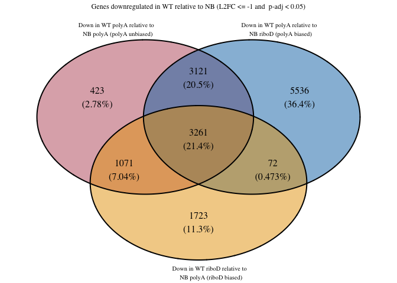

### RiboD unbiased against polyA biased and riboD biased

#### Up DEGs

``` r
WT_NB_up_riboDunbiased_polyAbiased_riboDbiased <- list(
  "Up in WT riboD relative to NB riboD (riboD unbiased)" = WTRiboD_NBRiboD_great1$Gene,
  "Up in WT polyA relative to NB riboD (polyA biased)" = WTPolyA_NBRiboD_great1$Gene,
    "Up in WT riboD relative to NB polyA (riboD biased)" = WTRiboD_NBPolyA_great1$Gene
)

write_rds(
  WT_NB_up_riboDunbiased_polyAbiased_riboDbiased,
  "../../output_data/NB_WT/WT_NB_up_riboDunbiased_polyAbiased_riboDbiased.rds")
```

``` r
WT_NB_up_riboDunbiased_polyAbiased_riboDbiased_VD <- venn.diagram(
  x = WT_NB_up_riboDunbiased_polyAbiased_riboDbiased,
  category.names = c(
    "Up in WT riboD relative to \n NB riboD (riboD unbiased)",
    "Up in WT polyA relative to \n NB riboD (polyA biased)",
    "Up in WT riboD relative to \n NB polyA (riboD biased)"
    ),
  filename = NULL, # Save as a PNG file
  output = TRUE,
  print.mode = c("raw", "percent"),
  # Customize appearance (optional)
  fill = c("#BB5566", "#0072B2", "#E69F00"),
#  cat.col = c("#BB5566", "#0072B2", "#E69F00"),
  cex = 1, # Font size for counts
  cat.cex = 0.65, # Font size for category names
  cat.dist = c(0.05, 0.05, 0.05),
  height = 2000,
  width = 2000,
  cat.default.pos = "outer",
  cat.pos = c(-12, 12, 175), 
  main = "Genes upregulated in WT relative to NB (L2FC >= 1 and  p-adj < 0.05)",
  main.cex = 0.75, # Font size for main title
  disable.logging = TRUE
)
```

    INFO [2026-07-02 16:51:31] $x
    INFO [2026-07-02 16:51:31] WT_NB_up_riboDunbiased_polyAbiased_riboDbiased
    INFO [2026-07-02 16:51:31] 
    INFO [2026-07-02 16:51:31] $category.names
    INFO [2026-07-02 16:51:31] c("Up in WT riboD relative to \n NB riboD (riboD unbiased)", 
    INFO [2026-07-02 16:51:31]     "Up in WT polyA relative to \n NB riboD (polyA biased)", 
    INFO [2026-07-02 16:51:31]     "Up in WT riboD relative to \n NB polyA (riboD biased)")
    INFO [2026-07-02 16:51:31] 
    INFO [2026-07-02 16:51:31] $filename
    INFO [2026-07-02 16:51:31] NULL
    INFO [2026-07-02 16:51:31] 
    INFO [2026-07-02 16:51:31] $output
    INFO [2026-07-02 16:51:31] [1] TRUE
    INFO [2026-07-02 16:51:31] 
    INFO [2026-07-02 16:51:31] $print.mode
    INFO [2026-07-02 16:51:31] c("raw", "percent")
    INFO [2026-07-02 16:51:31] 
    INFO [2026-07-02 16:51:31] $fill
    INFO [2026-07-02 16:51:31] c("#BB5566", "#0072B2", "#E69F00")
    INFO [2026-07-02 16:51:31] 
    INFO [2026-07-02 16:51:31] $cex
    INFO [2026-07-02 16:51:31] [1] 1
    INFO [2026-07-02 16:51:31] 
    INFO [2026-07-02 16:51:31] $cat.cex
    INFO [2026-07-02 16:51:31] [1] 0.65
    INFO [2026-07-02 16:51:31] 
    INFO [2026-07-02 16:51:31] $cat.dist
    INFO [2026-07-02 16:51:31] c(0.05, 0.05, 0.05)
    INFO [2026-07-02 16:51:31] 
    INFO [2026-07-02 16:51:31] $height
    INFO [2026-07-02 16:51:31] [1] 2000
    INFO [2026-07-02 16:51:31] 
    INFO [2026-07-02 16:51:31] $width
    INFO [2026-07-02 16:51:31] [1] 2000
    INFO [2026-07-02 16:51:31] 
    INFO [2026-07-02 16:51:31] $cat.default.pos
    INFO [2026-07-02 16:51:31] [1] "outer"
    INFO [2026-07-02 16:51:31] 
    INFO [2026-07-02 16:51:31] $cat.pos
    INFO [2026-07-02 16:51:31] c(-12, 12, 175)
    INFO [2026-07-02 16:51:31] 
    INFO [2026-07-02 16:51:31] $main
    INFO [2026-07-02 16:51:31] [1] "Genes upregulated in WT relative to NB (L2FC >= 1 and  p-adj < 0.05)"
    INFO [2026-07-02 16:51:31] 
    INFO [2026-07-02 16:51:31] $main.cex
    INFO [2026-07-02 16:51:31] [1] 0.75
    INFO [2026-07-02 16:51:31] 
    INFO [2026-07-02 16:51:31] $disable.logging
    INFO [2026-07-02 16:51:31] [1] TRUE
    INFO [2026-07-02 16:51:31] 

``` r
WT_NB_up_riboDunbiased_polyAbiased_riboDbiased_VD
```

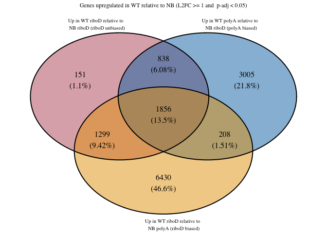

### Down DEGs

``` r
WT_NB_down_riboDunbiased_polyAbiased_riboDbiased <- list(
  "Down in WT riboD relative to NB riboD (riboD unbiased)" = WTRiboD_NBRiboD_less1$Gene,
  "Down in WT polyA relative to NB riboD (polyA biased)" = WTPolyA_NBRiboD_less1$Gene,
   "Down in WT riboD relative to NB polyA (riboD biased)" = WTRiboD_NBPolyA_less1$Gene
)

write_rds(WT_NB_down_riboDunbiased_polyAbiased_riboDbiased, "../../output_data/NB_WT/WT_NB_down_riboDunbiased_polyAbiased_riboDbiased_upset.rds")
```

``` r
WT_NB_down_riboDunbiased_polyAbiased_riboDbiased_VD <- venn.diagram(
  x = WT_NB_down_riboDunbiased_polyAbiased_riboDbiased,
  category.names = c(
    "Down in WT riboD relative to \n NB riboD (riboD unbiased)",
    "Down in WT polyA relative to \n NB riboD (polyA biased)",
    "Down in WT riboD relative to \n NB polyA (riboD biased)"
    ),
  filename = NULL, # Save as a PNG file
  output = TRUE,
  print.mode = c("raw", "percent"),
  # Customize appearance (optional)
  fill = c("#BB5566", "#0072B2", "#E69F00"),
#  cat.col = c("#BB5566", "#0072B2", "#E69F00"),
  cex = 1, # Font size for counts
  cat.cex = 0.65, # Font size for category names
  cat.dist = c(0.05, 0.05, 0.05),
  height = 2000,
  width = 2000,
  cat.default.pos = "outer",
  cat.pos = c(-12, 12, 175), 
  main = "Genes downregulated in WT relative to NB (L2FC <= -1 and  p-adj < 0.05)",
  main.cex = 0.75, # Font size for main title
  disable.logging = TRUE
)
```

    INFO [2026-07-02 16:51:31] $x
    INFO [2026-07-02 16:51:31] WT_NB_down_riboDunbiased_polyAbiased_riboDbiased
    INFO [2026-07-02 16:51:31] 
    INFO [2026-07-02 16:51:31] $category.names
    INFO [2026-07-02 16:51:31] c("Down in WT riboD relative to \n NB riboD (riboD unbiased)", 
    INFO [2026-07-02 16:51:31]     "Down in WT polyA relative to \n NB riboD (polyA biased)", 
    INFO [2026-07-02 16:51:31]     "Down in WT riboD relative to \n NB polyA (riboD biased)")
    INFO [2026-07-02 16:51:31] 
    INFO [2026-07-02 16:51:31] $filename
    INFO [2026-07-02 16:51:31] NULL
    INFO [2026-07-02 16:51:31] 
    INFO [2026-07-02 16:51:31] $output
    INFO [2026-07-02 16:51:31] [1] TRUE
    INFO [2026-07-02 16:51:31] 
    INFO [2026-07-02 16:51:31] $print.mode
    INFO [2026-07-02 16:51:31] c("raw", "percent")
    INFO [2026-07-02 16:51:31] 
    INFO [2026-07-02 16:51:31] $fill
    INFO [2026-07-02 16:51:31] c("#BB5566", "#0072B2", "#E69F00")
    INFO [2026-07-02 16:51:31] 
    INFO [2026-07-02 16:51:31] $cex
    INFO [2026-07-02 16:51:31] [1] 1
    INFO [2026-07-02 16:51:31] 
    INFO [2026-07-02 16:51:31] $cat.cex
    INFO [2026-07-02 16:51:31] [1] 0.65
    INFO [2026-07-02 16:51:31] 
    INFO [2026-07-02 16:51:31] $cat.dist
    INFO [2026-07-02 16:51:31] c(0.05, 0.05, 0.05)
    INFO [2026-07-02 16:51:31] 
    INFO [2026-07-02 16:51:31] $height
    INFO [2026-07-02 16:51:31] [1] 2000
    INFO [2026-07-02 16:51:31] 
    INFO [2026-07-02 16:51:31] $width
    INFO [2026-07-02 16:51:31] [1] 2000
    INFO [2026-07-02 16:51:31] 
    INFO [2026-07-02 16:51:31] $cat.default.pos
    INFO [2026-07-02 16:51:31] [1] "outer"
    INFO [2026-07-02 16:51:31] 
    INFO [2026-07-02 16:51:31] $cat.pos
    INFO [2026-07-02 16:51:31] c(-12, 12, 175)
    INFO [2026-07-02 16:51:31] 
    INFO [2026-07-02 16:51:31] $main
    INFO [2026-07-02 16:51:31] [1] "Genes downregulated in WT relative to NB (L2FC <= -1 and  p-adj < 0.05)"
    INFO [2026-07-02 16:51:31] 
    INFO [2026-07-02 16:51:31] $main.cex
    INFO [2026-07-02 16:51:31] [1] 0.75
    INFO [2026-07-02 16:51:31] 
    INFO [2026-07-02 16:51:31] $disable.logging
    INFO [2026-07-02 16:51:31] [1] TRUE
    INFO [2026-07-02 16:51:31] 

``` r
WT_NB_down_riboDunbiased_polyAbiased_riboDbiased_VD
```


### Histograms of LFC of genes in intersections

#### Up PolyA unbiased against polyA biased and riboD biased

Starting with upregulated genes in the polyA unbiased:polyA biased:riboD
biased comparison

Looking at genes that are unique to the polyAbiased

``` r
WT_NB_up_polyAunbiased_uniquetopolyAbiased <- WTPolyA_NBRiboD_great1 %>%
  anti_join(WTPolyA_NBPolyA_great1, by = "Gene") %>%
  anti_join(WTRiboD_NBPolyA_great1, by = "Gene")
print(WT_NB_up_polyAunbiased_uniquetopolyAbiased %>% nrow())
```

    [1] 2657

What is the average LFC?

``` r
WT_NB_up_polyAunbiased_uniquetopolyAbiased_avgLFC <- WT_NB_up_polyAunbiased_uniquetopolyAbiased %>%
  summarise(
    min_value = min(log2FoldChange),
    max_value = max(log2FoldChange),
    median_value = median(log2FoldChange),
    mean_value = mean(log2FoldChange),
    stdev = sd(log2FoldChange)
  )
WT_NB_up_polyAunbiased_uniquetopolyAbiased_avgLFC
```

| min_value | max_value | median_value | mean_value |     stdev |
|----------:|----------:|-------------:|-----------:|----------:|
|   1.00057 |  24.24821 |     1.482839 |   1.675263 | 0.9608265 |

``` r
WT_NB_up_polyAunbiased_uniquetopolyAbiased_hist <- ggplot(WT_NB_up_polyAunbiased_uniquetopolyAbiased, aes(x = log2FoldChange)) +
  geom_histogram(
    bins = 30, # 30 is default
    fill = "#0072B2",
    color = "#0072B2",
    alpha = 0.7
    ) +
  scale_y_continuous(breaks = c(200, 400, 600, 800, 1000), limits = c(0,NA)) +
  scale_x_continuous(breaks = seq(2, 30, by = 2)) +
  labs(title = "Distribution of log2FoldChange values of \n genes uniquely upregulated in WT polyA relative to NB riboD",
       subtitle = "polyA biased, compared to polyA unbiased, Median LFC = 1.48",
       y = "Number of genes") +
  theme(plot.title = element_text(hjust = 0.5, size = 10, face = "bold"),
            axis.text = element_text(size = 10),
        plot.subtitle = element_text(size = 8, face = "bold"))
WT_NB_up_polyAunbiased_uniquetopolyAbiased_hist
```

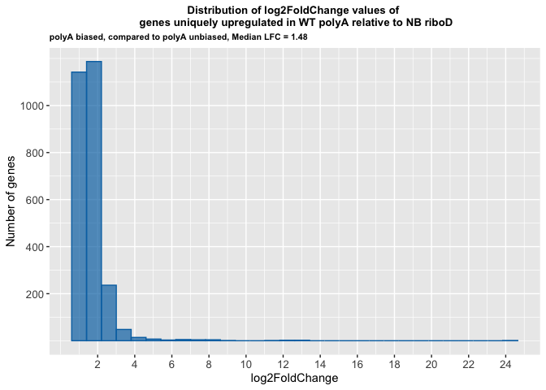

Looking at genes that are unique to riboD biased

``` r
WT_NB_up_polyAunbiased_uniquetoriboDbiased <- WTRiboD_NBPolyA_great1 %>%
  anti_join(WTPolyA_NBPolyA_great1, by = "Gene") %>%
  anti_join(WTPolyA_NBRiboD_great1, by = "Gene")
print(WT_NB_up_polyAunbiased_uniquetoriboDbiased %>% nrow())
```

    [1] 5559

``` r
WT_NB_polyAunbiased_uniquetoriboDbiased_avgLFC <- WT_NB_up_polyAunbiased_uniquetoriboDbiased %>%
  summarise(
    min_value = min(log2FoldChange),
    max_value = max(log2FoldChange),
    median_value = median(log2FoldChange),
    mean_value = mean(log2FoldChange),
    stdev = sd(log2FoldChange)
  )
WT_NB_polyAunbiased_uniquetoriboDbiased_avgLFC
```

| min_value | max_value | median_value | mean_value |    stdev |
|----------:|----------:|-------------:|-----------:|---------:|
|  1.000801 |  15.18727 |      2.69417 |    3.41835 | 2.259915 |

``` r
WT_NB_up_polyAunbiased_uniquetoriboDbiased_hist <- ggplot(WT_NB_up_polyAunbiased_uniquetoriboDbiased, aes(x = log2FoldChange)) +
  geom_histogram(
    bins = 30,
    fill = "#E69F00",
    color = "#E69F00",
    alpha = 0.7
    ) +
  scale_y_continuous(breaks = c(200, 400, 600, 800, 1000), limits = c(0,NA)) +
    scale_x_continuous(breaks = c(2, 4, 6, 8, 10, 12, 14, 16)) +
  labs(title = "Distribution of log2FoldChange values of \n genes uniquely upregulated in WT riboD relative to NB polyA",
       subtitle = "riboD biased, compared to polyA unbiased, Median LFC = 2.69",
       y = "Number of genes") +
  theme(plot.title = element_text(hjust = 0.5, size = 10, face = "bold"),
            axis.text = element_text(size = 10),
        plot.subtitle = element_text(size = 8, face = "bold"))
WT_NB_up_polyAunbiased_uniquetoriboDbiased_hist
```

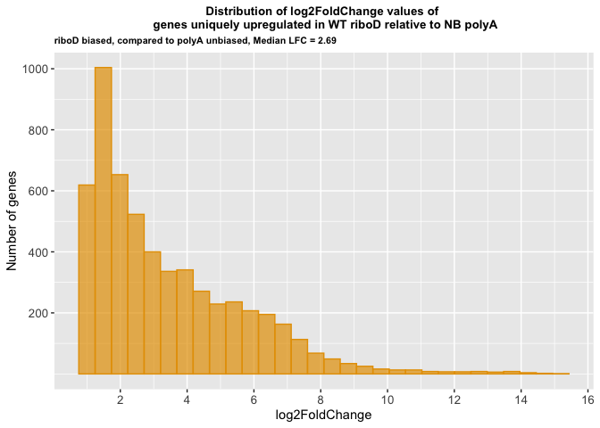

#### Down PolyA unbiased against polyA biased and riboD biased

Looking at genes that are unique to polyA biased

``` r
WT_NB_down_polyAunbiased_uniquetopolyAbiased <- WTPolyA_NBRiboD_less1 %>%
  anti_join(WTPolyA_NBPolyA_less1, by = "Gene") %>%
  anti_join(WTRiboD_NBPolyA_less1, by = "Gene")
print(WT_NB_down_polyAunbiased_uniquetopolyAbiased %>% nrow())
```

    [1] 5536

``` r
WT_NB_down_polyAunbiased_uniquetopolyAbiased_avgLFC <- WT_NB_down_polyAunbiased_uniquetopolyAbiased %>%
  summarise(
    min_value = min(log2FoldChange),
    max_value = max(log2FoldChange),
    median_value = median(log2FoldChange),
    mean_value = mean(log2FoldChange),
    stdev = sd(log2FoldChange)
  )
WT_NB_down_polyAunbiased_uniquetopolyAbiased_avgLFC
```

| min_value | max_value | median_value | mean_value |    stdev |
|----------:|----------:|-------------:|-----------:|---------:|
| -24.74268 | -1.000026 |    -3.151152 |  -3.655166 | 2.232812 |

``` r
WT_NB_down_polyAunbiased_uniquetopolyAbiased_hist <- ggplot(WT_NB_down_polyAunbiased_uniquetopolyAbiased, aes(x = log2FoldChange)) +
  geom_histogram(
    bins = 30,
    fill = "#0072B2",
    color = "#0072B2",
    alpha = 0.7
    ) +
  # scale_y_continuous(breaks = c(200, 400, 600, 800, 1000), limits = c(0,NA)) +
    # scale_x_continuous(
    #   breaks = c(0,-1,-2,-4,-6,-8,-10,-12,-14,-16,-18,-20,-22,-24,-26)) +
  labs(title = "Distribution of log2FoldChange values of \n genes uniquely downregulated in WT PolyA relative to NB RiboD",
       subtitle = "polyA biased, compared to polyA unbiased, Median LFC = -3.15",
       y = "Number of genes") +
  theme(plot.title = element_text(hjust = 0.5, size = 10, face = "bold"),
            axis.text = element_text(size = 10),
        plot.subtitle = element_text(size = 8, face = "bold"))
WT_NB_down_polyAunbiased_uniquetopolyAbiased_hist
```

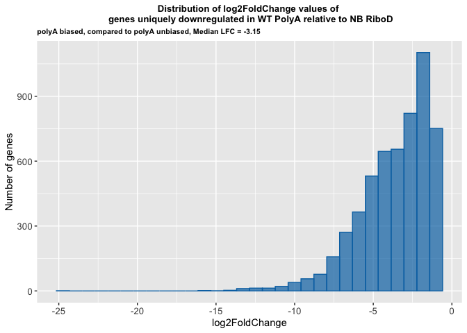

Looking at genes that are unique to riboD biased

``` r
WT_NB_down_polyAunbiased_uniquetoriboDbiased <- WTRiboD_NBPolyA_less1 %>%
  anti_join(WTPolyA_NBPolyA_less1, by = "Gene") %>%
  anti_join(WTPolyA_NBRiboD_less1, by = "Gene")
print(WT_NB_down_polyAunbiased_uniquetoriboDbiased %>% nrow())
```

    [1] 1723

``` r
WT_NB_down_polyAunbiased_uniquetoriboDbiased_avgLFC <- WT_NB_down_polyAunbiased_uniquetoriboDbiased %>%
  summarise(
    min_value = min(log2FoldChange),
    max_value = max(log2FoldChange),
    median_value = median(log2FoldChange),
    mean_value = mean(log2FoldChange),
    stdev = sd(log2FoldChange)
  )
WT_NB_down_polyAunbiased_uniquetoriboDbiased_avgLFC
```

| min_value | max_value | median_value | mean_value |     stdev |
|----------:|----------:|-------------:|-----------:|----------:|
| -12.10728 | -1.000605 |    -1.386696 |  -1.660059 | 0.9498494 |

``` r
WT_NB_down_polyAunbiased_uniquetoriboDbiased_hist <- ggplot(WT_NB_down_polyAunbiased_uniquetoriboDbiased, aes(x = log2FoldChange)) +
  geom_histogram(
    bins = 30,
    fill = "#E69F00",
    color = "#E69F00",
    alpha = 0.7
    ) +
  # scale_y_continuous(breaks = c(200, 400, 600), limits = c(0,800)) +
  #   scale_x_continuous(breaks = c(0,-1,-2,-4,-6,-8,-10,-12,-14,-16)) +
  labs(title = "Distribution of log2FoldChange values of \n genes uniquely downregulated in WT riboD relative to NB polyA",
       subtitle = "riboD biased, compared to polyA unbiased, Median LFC = -1.39",
       y = "Number of genes") +
  theme(plot.title = element_text(hjust = 0.5, size = 10, face = "bold"),
            axis.text = element_text(size = 10),
        plot.subtitle = element_text(size = 8, face = "bold"))
WT_NB_down_polyAunbiased_uniquetoriboDbiased_hist
```

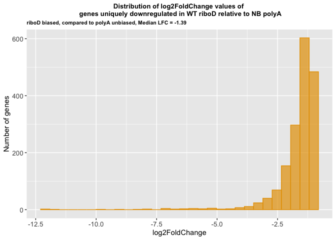

#### Up RiboD unbiased against polyA biased and riboD biased

Starting with upregulated genes in the riboD
unbiased:polyAbiased:riboDbiased comparison

Looking at genes that are unique to the polyAbiased

``` r
WT_NB_up_riboDunbiased_uniquetopolyAbiased <- WTPolyA_NBRiboD_great1 %>%
  anti_join(WTRiboD_NBRiboD_great1, by = "Gene") %>%
  anti_join(WTRiboD_NBPolyA_great1, by = "Gene")
print(WT_NB_up_riboDunbiased_uniquetopolyAbiased %>% nrow())
```

    [1] 3005

``` r
WT_NB_up_riboDunbiased_uniquetopolyAbiased_avgLFC <- WT_NB_up_riboDunbiased_uniquetopolyAbiased %>%
  summarise(
    min_value = min(log2FoldChange),
    max_value = max(log2FoldChange),
    median_value = median(log2FoldChange),
    mean_value = mean(log2FoldChange),
    stdev = sd(log2FoldChange)
  )
WT_NB_up_riboDunbiased_uniquetopolyAbiased_avgLFC
```

| min_value | max_value | median_value | mean_value |    stdev |
|----------:|----------:|-------------:|-----------:|---------:|
|   1.00057 |  24.24821 |     1.511523 |   1.765975 | 1.083745 |

``` r
WT_NB_up_riboDunbiased_uniquetopolyAbiased_hist <- ggplot(WT_NB_up_riboDunbiased_uniquetopolyAbiased, aes(x = log2FoldChange)) +
  geom_histogram(
    bins = 30, # 30 is default
    fill = "#0072B2",
    color = "#0072B2",
    alpha = 0.7
    ) +
  # scale_y_continuous(breaks = c(200, 400, 600, 800, 1000), limits = c(0,NA)) +
  # scale_x_continuous(breaks = seq(2, 30, by = 2)) +
  labs(title = "Distribution of log2FoldChange values of \n genes uniquely upregulated in WT polyA relative to NB riboD",
       subtitle = "polyA biased, compared to riboD unbiased, Median LFC = 1.51",
       y = "Number of genes") +
  theme(plot.title = element_text(hjust = 0.5, size = 10, face = "bold"),
            axis.text = element_text(size = 10),
        plot.subtitle = element_text(size = 8, face = "bold"))

WT_NB_up_riboDunbiased_uniquetopolyAbiased_hist
```

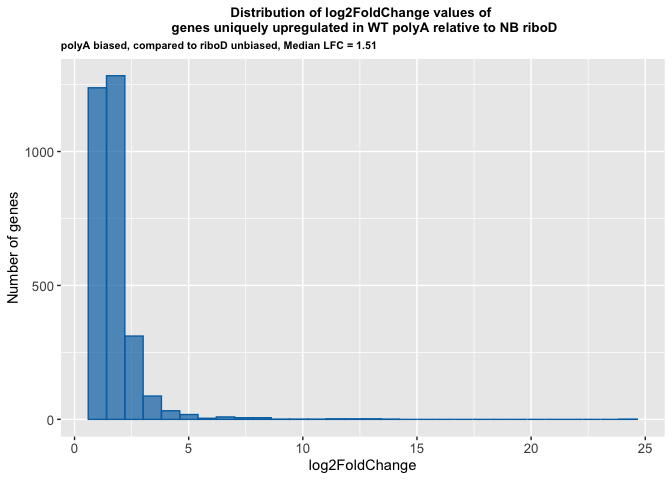

Looking at genes that are unique to riboD biased

``` r
WT_NB_up_riboDunbiased_uniquetoriboDbiased <- WTRiboD_NBPolyA_great1 %>%
  anti_join(WTRiboD_NBRiboD_great1, by = "Gene") %>%
  anti_join(WTPolyA_NBRiboD_great1, by = "Gene")
print(WT_NB_up_riboDunbiased_uniquetoriboDbiased %>% nrow())
```

    [1] 6430

``` r
WT_NB_up_riboDunbiased_uniquetoriboDbiased_avgLFC <- WT_NB_up_riboDunbiased_uniquetoriboDbiased %>%
  summarise(
    min_value = min(log2FoldChange),
    max_value = max(log2FoldChange),
    median_value = median(log2FoldChange),
    mean_value = mean(log2FoldChange),
    stdev = sd(log2FoldChange)
  )
WT_NB_up_riboDunbiased_uniquetoriboDbiased_avgLFC
```

| min_value | max_value | median_value | mean_value |    stdev |
|----------:|----------:|-------------:|-----------:|---------:|
|  1.000801 |  15.18727 |     2.685078 |   3.415368 | 2.211739 |

``` r
WT_NB_up_riboDunbiased_uniquetoriboDbiased_hist <- ggplot(WT_NB_up_riboDunbiased_uniquetoriboDbiased, aes(x = log2FoldChange)) +
  geom_histogram(
    bins = 30,
    fill = "#E69F00",
    color = "#E69F00",
    alpha = 0.7
    ) +
  # scale_y_continuous(breaks = c(200, 400, 600, 800, 1000), limits = c(0,NA)) +
  #   scale_x_continuous(breaks = c(2, 4, 6, 8, 10, 12, 14, 16)) +
  labs(title = "Distribution of log2FoldChange values of \n genes uniquely upregulated in WT riboD relative to NB polyA",
       subtitle = "riboD biased, compared to riboD unbiased, Median LFC = 2.69",
       y = "Number of genes") +
  theme(plot.title = element_text(hjust = 0.5, size = 10, face = "bold"),
            axis.text = element_text(size = 10),
        plot.subtitle = element_text(size = 8, face = "bold"))
WT_NB_up_riboDunbiased_uniquetoriboDbiased_hist
```

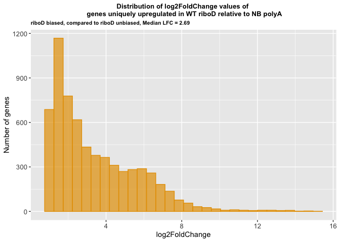

#### Down RiboD unbiased against polyA biased and riboD biased

Looking at genes that are unique to polyA biased

``` r
WT_NB_down_riboDunbiased_uniquetopolyAbiased <- WTPolyA_NBRiboD_less1 %>%
  anti_join(WTRiboD_NBRiboD_less1, by = "Gene") %>%
  anti_join(WTRiboD_NBPolyA_less1, by = "Gene")
print(WT_NB_down_riboDunbiased_uniquetopolyAbiased %>% nrow())
```

    [1] 6490

``` r
WT_NB_down_riboDunbiased_uniquetopolyAbiased_avgLFC <- WT_NB_down_riboDunbiased_uniquetopolyAbiased %>%
  summarise(
    min_value = min(log2FoldChange),
    max_value = max(log2FoldChange),
    median_value = median(log2FoldChange),
    mean_value = mean(log2FoldChange),
    stdev = sd(log2FoldChange)
  )
WT_NB_down_riboDunbiased_uniquetopolyAbiased_avgLFC
```

| min_value | max_value | median_value | mean_value |    stdev |
|----------:|----------:|-------------:|-----------:|---------:|
| -24.74268 | -1.000026 |    -2.941426 |  -3.378153 | 2.012125 |

``` r
WT_NB_down_riboDunbiased_uniquetopolyAbiased_hist <- ggplot(WT_NB_down_riboDunbiased_uniquetopolyAbiased, aes(x = log2FoldChange)) +
  geom_histogram(
    bins = 30,
    fill = "#0072B2",
    color = "#0072B2",
    alpha = 0.7
    ) +
  # scale_y_continuous(breaks = c(100,200), limits = c(0,NA)) +
  #   scale_x_continuous(breaks =  seq(0, -30, by = -2)) +
  labs(title = "Distribution of log2FoldChange values of \n genes uniquely downregulated in WT PolyA relative to NB RiboD",
       subtitle = "polyA biased compared to riboD unbiased, Median LFC = -2.94",
       y = "Number of genes") +
  theme(plot.title = element_text(hjust = 0.5, size = 10, face = "bold"),
            axis.text = element_text(size = 10),
        plot.subtitle = element_text(size = 8, face = "bold"))
WT_NB_down_riboDunbiased_uniquetopolyAbiased_hist
```

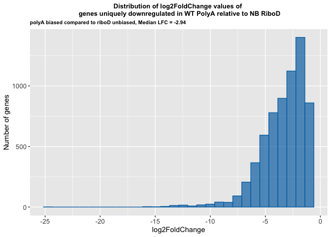

Looking at genes that are unique to riboD biased

``` r
WT_NB_down_riboDunbiased_uniquetoriboDbiased <- WTRiboD_NBPolyA_less1 %>%
  anti_join(WTRiboD_NBRiboD_less1, by = "Gene") %>%
  anti_join(WTPolyA_NBRiboD_less1, by = "Gene")
print(WT_NB_down_riboDunbiased_uniquetoriboDbiased %>% nrow())
```

    [1] 2083

``` r
WT_NB_down_riboDunbiased_uniquetoriboDbiased_avgLFC <- WT_NB_down_riboDunbiased_uniquetoriboDbiased %>%
  summarise(
    min_value = min(log2FoldChange),
    max_value = max(log2FoldChange),
    median_value = median(log2FoldChange),
    mean_value = mean(log2FoldChange),
    stdev = sd(log2FoldChange)
  )
WT_NB_down_riboDunbiased_uniquetoriboDbiased_avgLFC
```

| min_value | max_value | median_value | mean_value |    stdev |
|----------:|----------:|-------------:|-----------:|---------:|
| -12.10728 | -1.000605 |    -1.410325 |  -1.698982 | 1.028765 |

``` r
WT_NB_down_riboDunbiased_uniquetoriboDbiased_hist <- ggplot(WT_NB_down_riboDunbiased_uniquetoriboDbiased, aes(x = log2FoldChange)) +
  geom_histogram(
    bins = 30,
    fill = "#E69F00",
    color = "#E69F00",
    alpha = 0.7
    ) +
  # scale_y_continuous(breaks = c(200, 400, 600, 800, 1000), limits = c(0,1000)) +
  #   scale_x_continuous(breaks = c(0,-1,-2,-4,-6,-8,-10,-12,-14,-16)) +
  labs(title = "Distribution of log2FoldChange values of \n genes uniquely downregulated in WT riboD relative to NB polyA",
       subtitle = "riboD biased, compared to riboD unbiased, Median LFC = -1.41",
       y = "Number of genes") +
  theme(plot.title = element_text(hjust = 0.5, size = 10, face = "bold"),
            axis.text = element_text(size = 10),
        plot.subtitle = element_text(size = 8, face = "bold"))
WT_NB_down_riboDunbiased_uniquetoriboDbiased_hist
```

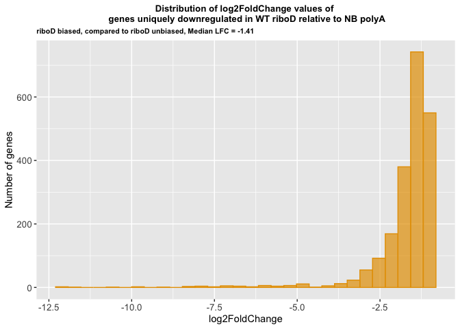

Genes in common between the polyAunbiased:polyAbiased:riboDbiased venn
diagram and the riboDunbiased:polyAbiased:riboDbiased venn diagram

upregulated polyA biased

``` r
WT_NB_up_polyAbiased <- inner_join(WT_NB_up_polyAunbiased_uniquetopolyAbiased, WT_NB_up_riboDunbiased_uniquetopolyAbiased, by = "Gene")

write_rds(WT_NB_up_polyAbiased, "../../output_data/NB_WT/WT_NB_up_polyAbiased.rds")

print(WT_NB_up_polyAbiased %>% nrow())
```

    [1] 2216

``` r
WT_NB_up_polyAbiased_avgLFC <- WT_NB_up_polyAbiased %>%
  summarise(
    min_value = min(log2FoldChange.x),
    max_value = max(log2FoldChange.x),
    median_value = median(log2FoldChange.x),
    mean_value = mean(log2FoldChange.x),
    stdev = sd(log2FoldChange.x)
  )
WT_NB_up_polyAbiased_avgLFC
```

| min_value | max_value | median_value | mean_value |    stdev |
|----------:|----------:|-------------:|-----------:|---------:|
|   1.00057 |  24.24821 |     1.430398 |   1.622365 | 1.003886 |

``` r
WT_NB_up_polyAbiased_hist <- ggplot(WT_NB_up_polyAbiased, aes(x = log2FoldChange.x)) +
  geom_histogram(
    bins = 30, # 30 is default
    fill = "#0072B2",
    color = "#0072B2",
    alpha = 0.7
    ) +
#  scale_y_continuous(breaks = c(200, 400, 600, 800), limits = c(0,1000)) +
#  scale_x_continuous(breaks = c(2, 4, 6, 8, 10, 12, 14, 16)) +
  labs(title = "Distribution of log2FoldChange values of \n genes uniquely upregulated in WT polyA relative to NB riboD",
       subtitle = "polyA biased, Median LFC = 1.44",
       y = "Number of genes") +
  theme(plot.title = element_text(hjust = 0.5, size = 10, face = "bold"),
            axis.text = element_text(size = 10),
        plot.subtitle = element_text(size = 8, face = "bold"))
WT_NB_up_polyAbiased_hist
```

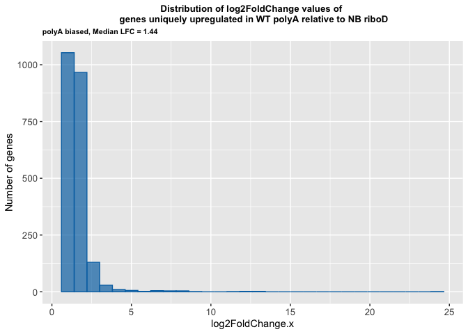

upregulated riboD biased

``` r
WT_NB_up_riboDbiased <- inner_join(WT_NB_up_polyAunbiased_uniquetoriboDbiased, WT_NB_up_riboDunbiased_uniquetoriboDbiased, by = "Gene")

write_rds(WT_NB_up_riboDbiased, "../../output_data/NB_WT/WT_NB_up_riboDbiased.rds")

print(WT_NB_up_riboDbiased %>% nrow())
```

    [1] 4934

``` r
WT_NB_up_riboDbiased_avgLFC <- WT_NB_up_riboDbiased %>%
  summarise(
    min_value = min(log2FoldChange.x),
    max_value = max(log2FoldChange.x),
    median_value = median(log2FoldChange.x),
    mean_value = mean(log2FoldChange.x),
    stdev = sd(log2FoldChange.x)
  )
WT_NB_up_riboDbiased_avgLFC
```

| min_value | max_value | median_value | mean_value |    stdev |
|----------:|----------:|-------------:|-----------:|---------:|
|  1.000801 |  15.18727 |     2.596998 |   3.324069 | 2.204271 |

``` r
WT_NB_up_riboDbiased_hist <- ggplot(WT_NB_up_riboDbiased, aes(x = log2FoldChange.x)) +
  geom_histogram(
    bins = 30, # 30 is default
    fill = "#E69F00",
    color = "#E69F00",
    alpha = 0.7
    ) +
#  scale_y_continuous(breaks = c(200, 400, 600, 800), limits = c(0,1000)) +
#  scale_x_continuous(breaks = c(2, 4, 6, 8, 10, 12, 14, 16)) +
  labs(title = "Distribution of log2FoldChange values of \n genes uniquely upregulated in WT riboD relative to NB polyA",
       subtitle = "riboD biased, Median LFC = 2.59",
       y = "Number of genes") +
  theme(plot.title = element_text(hjust = 0.5, size = 10, face = "bold"),
            axis.text = element_text(size = 10),
        plot.subtitle = element_text(size = 8, face = "bold"))
WT_NB_up_riboDbiased_hist
```

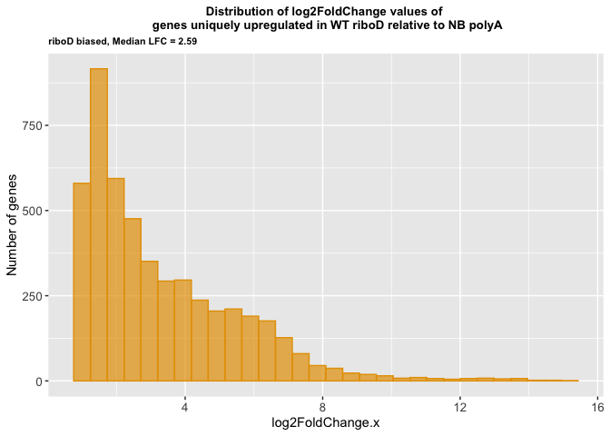

downregulated polyA biased

``` r
WT_NB_down_polyAbiased <- inner_join(WT_NB_down_polyAunbiased_uniquetopolyAbiased, WT_NB_down_riboDunbiased_uniquetopolyAbiased, by = "Gene")

write_rds(WT_NB_down_polyAbiased, "../../output_data/NB_WT/WT_NB_down_polyAbiased.rds")

print(WT_NB_down_polyAbiased %>% nrow())
```

    [1] 4553

``` r
WT_NB_down_polyAbiased_avgLFC <- WT_NB_down_polyAbiased %>%
  summarise(
    min_value = min(log2FoldChange.x),
    max_value = max(log2FoldChange.x),
    median_value = median(log2FoldChange.x),
    mean_value = mean(log2FoldChange.x),
    stdev = sd(log2FoldChange.x)
  )
WT_NB_down_polyAbiased_avgLFC
```

| min_value | max_value | median_value | mean_value |    stdev |
|----------:|----------:|-------------:|-----------:|---------:|
| -24.74268 | -1.000026 |    -3.066331 |  -3.510288 | 2.125688 |

``` r
WT_NB_down_polyAbiased_hist <- ggplot(WT_NB_down_polyAbiased, aes(x = log2FoldChange.x)) +
  geom_histogram(
    bins = 30, # 30 is default
    fill = "#0072B2",
    color = "#0072B2",
    alpha = 0.7
    ) +
#  scale_y_continuous(breaks = c(200, 400, 600, 800), limits = c(0,1000)) +
#  scale_x_continuous(breaks = c(2, 4, 6, 8, 10, 12, 14, 16)) +
  labs(title = "Distribution of log2FoldChange values of \n genes uniquely downregulated in WT polyA relative to NB riboD",
       subtitle = "polyA biased, Median LFC = -3.06",
       y = "Number of genes") +
  theme(plot.title = element_text(hjust = 0.5, size = 10, face = "bold"),
            axis.text = element_text(size = 10),
        plot.subtitle = element_text(size = 8, face = "bold"))
WT_NB_down_polyAbiased_hist
```

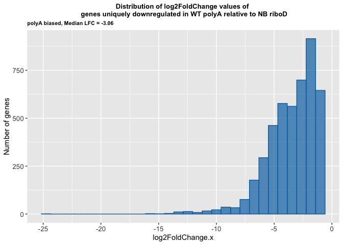

downregulated riboD biased

``` r
WT_NB_down_riboDbiased <- inner_join(WT_NB_down_polyAunbiased_uniquetoriboDbiased, WT_NB_down_riboDunbiased_uniquetoriboDbiased, by = "Gene")

write_rds(WT_NB_down_riboDbiased, "../../output_data/NB_WT/WT_NB_down_riboDbiased.rds")

print(WT_NB_down_riboDbiased %>% nrow())
```

    [1] 1361

``` r
WT_NB_down_riboDbiased_avgLFC <- WT_NB_down_riboDbiased %>%
  summarise(
    min_value = min(log2FoldChange.x),
    max_value = max(log2FoldChange.x),
    median_value = median(log2FoldChange.x),
    mean_value = mean(log2FoldChange.x),
    stdev = sd(log2FoldChange.x)
  )
WT_NB_down_riboDbiased_avgLFC
```

| min_value | max_value | median_value | mean_value |     stdev |
|----------:|----------:|-------------:|-----------:|----------:|
| -12.10728 | -1.000605 |    -1.334511 |  -1.590746 | 0.9766384 |

``` r
WT_NB_down_riboDbiased_hist <- ggplot(WT_NB_down_riboDbiased, aes(x = log2FoldChange.x)) +
  geom_histogram(
    bins = 30, # 30 is default
    fill = "#E69F00",
    color = "#E69F00",
    alpha = 0.7
    ) +
#  scale_y_continuous(breaks = c(200, 400, 600, 800), limits = c(0,1000)) +
#  scale_x_continuous(breaks = c(2, 4, 6, 8, 10, 12, 14, 16)) +
  labs(title = "Distribution of log2FoldChange values of \n genes uniquely downregulated in WT riboD relative to NB polyA",
       subtitle = "riboD biased, Median LFC = -1.33",
       y = "Number of genes") +
  theme(plot.title = element_text(hjust = 0.5, size = 10, face = "bold"),
            axis.text = element_text(size = 10),
        plot.subtitle = element_text(size = 8, face = "bold"))
WT_NB_down_riboDbiased_hist
```

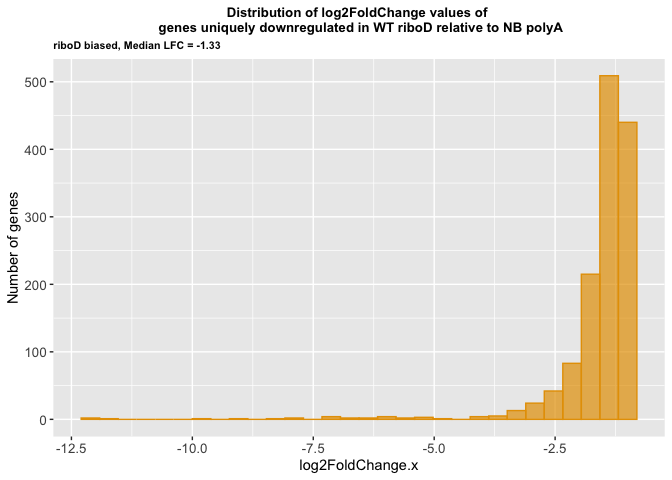

### Save Session Info

``` r
sessioninfo::session_info()
```

    ─ Session info ───────────────────────────────────────────────────────────────
     setting  value
     version  R version 4.5.2 (2025-10-31)
     os       macOS Tahoe 26.5
     system   aarch64, darwin20
     ui       X11
     language (EN)
     collate  en_US.UTF-8
     ctype    en_US.UTF-8
     tz       America/Los_Angeles
     date     2026-07-02
     pandoc   3.8.3 @ /Applications/RStudio.app/Contents/Resources/app/quarto/bin/tools/aarch64/ (via rmarkdown)
     quarto   1.9.36 @ /Applications/RStudio.app/Contents/Resources/app/quarto/bin/quarto

    ─ Packages ───────────────────────────────────────────────────────────────────
     ! package        * version date (UTC) lib source
     P BiocManager      1.30.26 2025-06-05 [?] CRAN (R 4.5.0)
     P bit              4.6.0   2025-03-06 [?] RSPM
     P bit64            4.6.0-1 2025-01-16 [?] CRAN (R 4.5.0)
     P cli              3.6.5   2025-04-23 [?] CRAN (R 4.5.0)
     P crayon           1.5.3   2024-06-20 [?] RSPM
     P digest           0.6.37  2024-08-19 [?] CRAN (R 4.5.0)
     P dplyr          * 1.1.4   2023-11-17 [?] CRAN (R 4.5.0)
     P evaluate         1.0.5   2025-08-27 [?] RSPM
     P farver           2.1.2   2024-05-13 [?] RSPM
     P fastmap          1.2.0   2024-05-15 [?] RSPM
     P forcats        * 1.0.1   2025-09-25 [?] RSPM
     P formatR          1.14    2023-01-17 [?] CRAN (R 4.5.0)
     P futile.logger  * 1.4.3   2016-07-10 [?] CRAN (R 4.5.0)
     P futile.options   1.0.1   2018-04-20 [?] CRAN (R 4.5.0)
     P generics         0.1.4   2025-05-09 [?] RSPM
     P ggplot2        * 4.0.0   2025-09-11 [?] CRAN (R 4.5.0)
     P glue             1.8.0   2024-09-30 [?] CRAN (R 4.5.0)
     P gtable           0.3.6   2024-10-25 [?] RSPM
     P hms              1.1.4   2025-10-17 [?] RSPM
     P htmltools        0.5.8.1 2024-04-04 [?] CRAN (R 4.5.0)
     P jsonlite         2.0.0   2025-03-27 [?] RSPM
     P knitr            1.50    2025-03-16 [?] CRAN (R 4.5.0)
     P labeling         0.4.3   2023-08-29 [?] RSPM
     P lambda.r         1.2.4   2019-09-18 [?] CRAN (R 4.5.0)
     P lifecycle        1.0.4   2023-11-07 [?] CRAN (R 4.5.0)
     P lubridate      * 1.9.4   2024-12-08 [?] CRAN (R 4.5.0)
     P magrittr         2.0.4   2025-09-12 [?] CRAN (R 4.5.0)
     P pillar           1.11.1  2025-09-17 [?] RSPM
     P pkgconfig        2.0.3   2019-09-22 [?] RSPM
     P purrr          * 1.1.0   2025-07-10 [?] CRAN (R 4.5.0)
     P R6               2.6.1   2025-02-15 [?] RSPM
     P RColorBrewer     1.1-3   2022-04-03 [?] RSPM
     P readr          * 2.1.5   2024-01-10 [?] CRAN (R 4.5.0)
       renv             1.1.5   2025-07-24 [1] CRAN (R 4.5.0)
     P rlang            1.2.0   2026-04-06 [?] RSPM
     P rmarkdown        2.30    2025-09-28 [?] CRAN (R 4.5.0)
     P rstudioapi       0.17.1  2024-10-22 [?] CRAN (R 4.5.0)
     P S7               0.2.0   2024-11-07 [?] CRAN (R 4.5.0)
     P scales           1.4.0   2025-04-24 [?] RSPM
     P sessioninfo      1.2.3   2025-02-05 [?] CRAN (R 4.5.0)
     P stringi          1.8.7   2025-03-27 [?] RSPM
     P stringr        * 1.5.2   2025-09-08 [?] CRAN (R 4.5.0)
     P tibble         * 3.3.0   2025-06-08 [?] CRAN (R 4.5.0)
     P tidyr          * 1.3.1   2024-01-24 [?] CRAN (R 4.5.0)
     P tidyselect       1.2.1   2024-03-11 [?] RSPM
     P tidyverse      * 2.0.0   2023-02-22 [?] RSPM
     P timechange       0.3.0   2024-01-18 [?] CRAN (R 4.5.0)
     P tzdb             0.5.0   2025-03-15 [?] RSPM
     P vctrs            0.6.5   2023-12-01 [?] CRAN (R 4.5.0)
     P VennDiagram    * 1.8.2   2026-01-11 [?] RSPM
     P vroom            1.6.6   2025-09-19 [?] CRAN (R 4.5.0)
     P withr            3.0.2   2024-10-28 [?] CRAN (R 4.5.0)
     P xfun             0.55    2025-12-16 [?] CRAN (R 4.5.2)
     P yaml             2.3.10  2024-07-26 [?] CRAN (R 4.5.0)

     [1] /Users/maryke/Documents/Treehouse/Lab_Notebooks/transcript_enrichment_bias_assessment/Fig_2/NB_WT/renv/library/macos/R-4.5/aarch64-apple-darwin20
     [2] /Users/maryke/Library/Caches/org.R-project.R/R/renv/sandbox/macos/R-4.5/aarch64-apple-darwin20/4cd76b74

     * ── Packages attached to the search path.
     P ── Loaded and on-disk path mismatch.

    ──────────────────────────────────────────────────────────────────────────────
