# aRMS_SS_DESeq2_analysis


## **aRMS v SS - DESeq2 Results Analysis**

``` r
library(tidyverse)
```

    ── Attaching core tidyverse packages ──────────────────────── tidyverse 2.0.0 ──
    ✔ dplyr     1.1.4     ✔ readr     2.1.5
    ✔ forcats   1.0.1     ✔ stringr   1.5.2
    ✔ ggplot2   4.0.0     ✔ tibble    3.3.0
    ✔ lubridate 1.9.4     ✔ tidyr     1.3.1
    ✔ purrr     1.1.0     
    ── Conflicts ────────────────────────────────────────── tidyverse_conflicts() ──
    ✖ dplyr::filter() masks stats::filter()
    ✖ dplyr::lag()    masks stats::lag()
    ℹ Use the conflicted package (<http://conflicted.r-lib.org/>) to force all conflicts to become errors

``` r
library(VennDiagram)
```

    Loading required package: grid
    Loading required package: futile.logger

``` r
library(ggplot2)
```

``` r
armsPolyA_ssPolyA <- read_tsv("../../output_data/aRMS_SS/hugo_results_aRMS_polyA_SS_polyA_updated.tsv.gz")
```

    Rows: 26949 Columns: 8
    ── Column specification ────────────────────────────────────────────────────────
    Delimiter: "\t"
    chr (2): HugoID, Gene
    dbl (6): baseMean, log2FoldChange, lfcSE, stat, pvalue, padj

    ℹ Use `spec()` to retrieve the full column specification for this data.
    ℹ Specify the column types or set `show_col_types = FALSE` to quiet this message.

``` r
armsRiboD_ssRiboD <- read_tsv("../../output_data/aRMS_SS/hugo_results_aRMS_riboD_SS_riboD_updated.tsv.gz")
```

    Rows: 27312 Columns: 8
    ── Column specification ────────────────────────────────────────────────────────
    Delimiter: "\t"
    chr (2): HugoID, Gene
    dbl (6): baseMean, log2FoldChange, lfcSE, stat, pvalue, padj

    ℹ Use `spec()` to retrieve the full column specification for this data.
    ℹ Specify the column types or set `show_col_types = FALSE` to quiet this message.

``` r
armsPolyA_ssRiboD <- read_tsv("../../output_data/aRMS_SS/hugo_results_aRMS_polyA_SS_riboD_updated.tsv.gz")
```

    Rows: 27325 Columns: 8
    ── Column specification ────────────────────────────────────────────────────────
    Delimiter: "\t"
    chr (2): HugoID, Gene
    dbl (6): baseMean, log2FoldChange, lfcSE, stat, pvalue, padj

    ℹ Use `spec()` to retrieve the full column specification for this data.
    ℹ Specify the column types or set `show_col_types = FALSE` to quiet this message.

``` r
armsRiboD_ssPolyA <- read_tsv("../../output_data/aRMS_SS/hugo_results_aRMS_riboD_SS_polyA_updated.tsv.gz")
```

    Rows: 27324 Columns: 8
    ── Column specification ────────────────────────────────────────────────────────
    Delimiter: "\t"
    chr (2): HugoID, Gene
    dbl (6): baseMean, log2FoldChange, lfcSE, stat, pvalue, padj

    ℹ Use `spec()` to retrieve the full column specification for this data.
    ℹ Specify the column types or set `show_col_types = FALSE` to quiet this message.

## **L2FC \>/\<= 1 or -1**

Filter for statistically significant DEGs

``` r
# Filter for genes with a Log2 fold change greater or equal to 1 and have an adjusted p-value less than 0.05

armsPolyA_ssPolyA_great1 <- armsPolyA_ssPolyA %>%
  filter(log2FoldChange >= 1 & padj < 0.05) %>%
  mutate(comparison = "armsPolyA_ssPolyA_great1") %>%
  relocate(comparison)

armsRiboD_ssRiboD_great1 <- armsRiboD_ssRiboD %>%
  filter(log2FoldChange >= 1 & padj < 0.05) %>%
  mutate(comparison = "armsRiboD_ssRiboD_great1") %>%
  relocate(comparison)

armsPolyA_ssRiboD_great1 <- armsPolyA_ssRiboD %>%
  filter(log2FoldChange >= 1 & padj < 0.05) %>%
  mutate(comparison = "armsPolyA_ssRiboD_great1") %>%
  relocate(comparison)

armsRiboD_ssPolyA_great1 <- armsRiboD_ssPolyA %>%
  filter(log2FoldChange >= 1 & padj < 0.05) %>%
  mutate(comparison = "armsRiboD_ssPolyA_great1") %>%
  relocate(comparison)

# Filter for genes with a Log2 fold change less than or equal to -1 and have an adjusted p-value less than 0.05

armsPolyA_ssPolyA_less1 <- armsPolyA_ssPolyA %>%
  filter(log2FoldChange <= -1 & padj < 0.05) %>%
  mutate(comparison = "armsPolyA_ssPolyA_less1") %>%
  relocate(comparison)

armsRiboD_ssRiboD_less1 <- armsRiboD_ssRiboD %>%
  filter(log2FoldChange <= -1 & padj < 0.05) %>%
  mutate(comparison = "armsRiboD_ssRiboD_less1") %>%
  relocate(comparison)

armsPolyA_ssRiboD_less1 <- armsPolyA_ssRiboD %>%
  filter(log2FoldChange <= -1 & padj < 0.05) %>%
  mutate(comparison = "armsPolyA_ssRiboD_less1") %>%
  relocate(comparison)

armsRiboD_ssPolyA_less1 <- armsRiboD_ssPolyA %>%
  filter(log2FoldChange <= -1 & padj < 0.05) %>%
  mutate(comparison = "armsRiboD_ssPolyA_less1") %>%
  relocate(comparison)
```

### **PolyA unbiased against biased**

#### **Up DEGs**

``` r
aRMS_SS_up_polyAunbiased_polyAbiased_riboDbiased <- list(
  "Up in SS polyA relative to aRMS polyA (polyA unbiased)" = armsPolyA_ssPolyA_great1$Gene,
  "Up in SS polyA relative to aRMS riboD (polyA biased)" = armsRiboD_ssPolyA_great1$Gene,
  "Up in SS riboD relative to aRMS polyA (riboD biased)" = armsPolyA_ssRiboD_great1$Gene
)

write_rds(aRMS_SS_up_polyAunbiased_polyAbiased_riboDbiased, "../../output_data/aRMS_SS/aRMS_SS_up_polyAunbiased_polyAbiased_riboDbiased.rds")
```

``` r
aRMS_SS_up_polyAunbiased_polyAbiased_riboDbiased_VD <- venn.diagram(
  x = aRMS_SS_up_polyAunbiased_polyAbiased_riboDbiased,
  category.names = c(
    "Up in SS polyA relative to \n aRMS polyA (polyA unbiased)",
    "Up in SS polyA relative to \n aRMS riboD (polyA biased)",
    "Up in SS riboD relative to \n aRMS polyA (riboD biased)"
    ),
  filename = NULL, # Save as a PNG file
  output = TRUE,
  print.mode = c("raw", "percent"),
  # Customize appearance (optional)
  fill = c("#BB5566", "#0072B2", "#E69F00"),
#  cat.col = c("#BB5566", "#0072B2", "#E69F00"),
  cex = 1, # Font size for counts
  cat.cex = 0.65, # Font size for category names
  cat.dist = c(0.05, 0.05, 0.05),
  height = 2000,
  width = 2000,
  cat.default.pos = "outer",
  cat.pos = c(-12, 12, 175), 
  main = "Genes upregulated in SS relative to aRMS (L2FC >= 1 and  p-adj < 0.05)",
  main.cex = 0.75, # Font size for main title
  disable.logging = TRUE
)
```

    INFO [2026-07-02 15:55:54] $x
    INFO [2026-07-02 15:55:54] aRMS_SS_up_polyAunbiased_polyAbiased_riboDbiased
    INFO [2026-07-02 15:55:54] 
    INFO [2026-07-02 15:55:54] $category.names
    INFO [2026-07-02 15:55:54] c("Up in SS polyA relative to \n aRMS polyA (polyA unbiased)", 
    INFO [2026-07-02 15:55:54]     "Up in SS polyA relative to \n aRMS riboD (polyA biased)", 
    INFO [2026-07-02 15:55:54]     "Up in SS riboD relative to \n aRMS polyA (riboD biased)")
    INFO [2026-07-02 15:55:54] 
    INFO [2026-07-02 15:55:54] $filename
    INFO [2026-07-02 15:55:54] NULL
    INFO [2026-07-02 15:55:54] 
    INFO [2026-07-02 15:55:54] $output
    INFO [2026-07-02 15:55:54] [1] TRUE
    INFO [2026-07-02 15:55:54] 
    INFO [2026-07-02 15:55:54] $print.mode
    INFO [2026-07-02 15:55:54] c("raw", "percent")
    INFO [2026-07-02 15:55:54] 
    INFO [2026-07-02 15:55:54] $fill
    INFO [2026-07-02 15:55:54] c("#BB5566", "#0072B2", "#E69F00")
    INFO [2026-07-02 15:55:54] 
    INFO [2026-07-02 15:55:54] $cex
    INFO [2026-07-02 15:55:54] [1] 1
    INFO [2026-07-02 15:55:54] 
    INFO [2026-07-02 15:55:54] $cat.cex
    INFO [2026-07-02 15:55:54] [1] 0.65
    INFO [2026-07-02 15:55:54] 
    INFO [2026-07-02 15:55:54] $cat.dist
    INFO [2026-07-02 15:55:54] c(0.05, 0.05, 0.05)
    INFO [2026-07-02 15:55:54] 
    INFO [2026-07-02 15:55:54] $height
    INFO [2026-07-02 15:55:54] [1] 2000
    INFO [2026-07-02 15:55:54] 
    INFO [2026-07-02 15:55:54] $width
    INFO [2026-07-02 15:55:54] [1] 2000
    INFO [2026-07-02 15:55:54] 
    INFO [2026-07-02 15:55:54] $cat.default.pos
    INFO [2026-07-02 15:55:54] [1] "outer"
    INFO [2026-07-02 15:55:54] 
    INFO [2026-07-02 15:55:54] $cat.pos
    INFO [2026-07-02 15:55:54] c(-12, 12, 175)
    INFO [2026-07-02 15:55:54] 
    INFO [2026-07-02 15:55:54] $main
    INFO [2026-07-02 15:55:54] [1] "Genes upregulated in SS relative to aRMS (L2FC >= 1 and  p-adj < 0.05)"
    INFO [2026-07-02 15:55:54] 
    INFO [2026-07-02 15:55:54] $main.cex
    INFO [2026-07-02 15:55:54] [1] 0.75
    INFO [2026-07-02 15:55:54] 
    INFO [2026-07-02 15:55:54] $disable.logging
    INFO [2026-07-02 15:55:54] [1] TRUE
    INFO [2026-07-02 15:55:54] 

``` r
aRMS_SS_up_polyAunbiased_polyAbiased_riboDbiased_VD
```

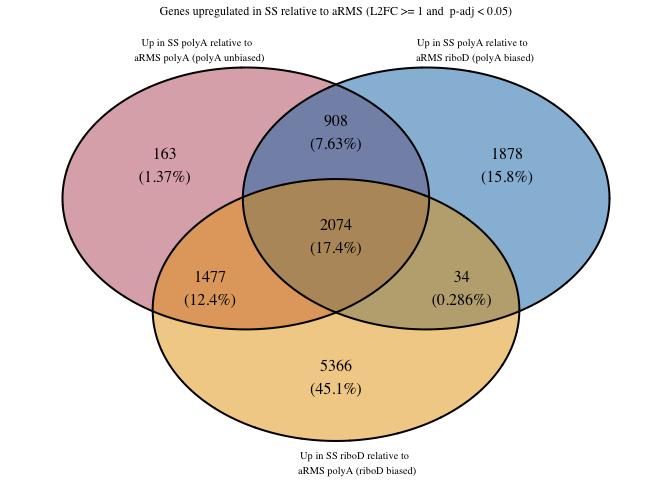

#### **Down DEGs**

``` r
aRMS_SS_down_polyAunbiased_polyAbiased_riboDbiased <- list(
  "Down in SS polyA relative to aRMS polyA (polyA unbiased)" = armsPolyA_ssPolyA_less1$Gene,
  "Down in SS polyA relative to aRMS riboD (polyA biased)" = armsRiboD_ssPolyA_less1$Gene,
  "Down in SS riboD relative to aRMS polyA (riboD biased)" = armsPolyA_ssRiboD_less1$Gene
)

write_rds(aRMS_SS_down_polyAunbiased_polyAbiased_riboDbiased, "../../output_data/aRMS_SS/aRMS_SS_down_polyAunbiased_polyAbiased_riboDbiased.rds")
```

``` r
aRMS_SS_down_polyAunbiased_polyAbiased_riboDbiased_VD <- venn.diagram(
  x = aRMS_SS_down_polyAunbiased_polyAbiased_riboDbiased,
  category.names = c(
    "Down in SS polyA relative to \n aRMS polyA (polyA unbiased)",
    "Down in SS polyA relative to \n aRMS riboD (polyA biased)",
    "Down in SS riboD relative to \n aRMS polyA (riboD biased)"
    ),
  filename = NULL, # Save as a PNG file
  output = TRUE,
  print.mode = c("raw", "percent"),
  # Customize appearance (optional)
  fill = c("#BB5566", "#0072B2", "#E69F00"),
  cat.col = c("#BB5566", "#0072B2", "#E69F00"),
  cex = 1, # Font size for counts
  cat.cex = 0.65, # Font size for category names
  cat.dist = c(0.05, 0.05, 0.05),
  height = 2000,
  width = 2000,
  cat.default.pos = "outer",
  cat.pos = c(-12, 12, 175), 
  main = "Genes downregulated in SS relative to aRMS (L2FC <= -1 and  p-adj < 0.05)",
  main.cex = 0.75, # Font size for main title
  disable.logging = TRUE
)
```

    INFO [2026-07-02 15:55:55] $x
    INFO [2026-07-02 15:55:55] aRMS_SS_down_polyAunbiased_polyAbiased_riboDbiased
    INFO [2026-07-02 15:55:55] 
    INFO [2026-07-02 15:55:55] $category.names
    INFO [2026-07-02 15:55:55] c("Down in SS polyA relative to \n aRMS polyA (polyA unbiased)", 
    INFO [2026-07-02 15:55:55]     "Down in SS polyA relative to \n aRMS riboD (polyA biased)", 
    INFO [2026-07-02 15:55:55]     "Down in SS riboD relative to \n aRMS polyA (riboD biased)")
    INFO [2026-07-02 15:55:55] 
    INFO [2026-07-02 15:55:55] $filename
    INFO [2026-07-02 15:55:55] NULL
    INFO [2026-07-02 15:55:55] 
    INFO [2026-07-02 15:55:55] $output
    INFO [2026-07-02 15:55:55] [1] TRUE
    INFO [2026-07-02 15:55:55] 
    INFO [2026-07-02 15:55:55] $print.mode
    INFO [2026-07-02 15:55:55] c("raw", "percent")
    INFO [2026-07-02 15:55:55] 
    INFO [2026-07-02 15:55:55] $fill
    INFO [2026-07-02 15:55:55] c("#BB5566", "#0072B2", "#E69F00")
    INFO [2026-07-02 15:55:55] 
    INFO [2026-07-02 15:55:55] $cat.col
    INFO [2026-07-02 15:55:55] c("#BB5566", "#0072B2", "#E69F00")
    INFO [2026-07-02 15:55:55] 
    INFO [2026-07-02 15:55:55] $cex
    INFO [2026-07-02 15:55:55] [1] 1
    INFO [2026-07-02 15:55:55] 
    INFO [2026-07-02 15:55:55] $cat.cex
    INFO [2026-07-02 15:55:55] [1] 0.65
    INFO [2026-07-02 15:55:55] 
    INFO [2026-07-02 15:55:55] $cat.dist
    INFO [2026-07-02 15:55:55] c(0.05, 0.05, 0.05)
    INFO [2026-07-02 15:55:55] 
    INFO [2026-07-02 15:55:55] $height
    INFO [2026-07-02 15:55:55] [1] 2000
    INFO [2026-07-02 15:55:55] 
    INFO [2026-07-02 15:55:55] $width
    INFO [2026-07-02 15:55:55] [1] 2000
    INFO [2026-07-02 15:55:55] 
    INFO [2026-07-02 15:55:55] $cat.default.pos
    INFO [2026-07-02 15:55:55] [1] "outer"
    INFO [2026-07-02 15:55:55] 
    INFO [2026-07-02 15:55:55] $cat.pos
    INFO [2026-07-02 15:55:55] c(-12, 12, 175)
    INFO [2026-07-02 15:55:55] 
    INFO [2026-07-02 15:55:55] $main
    INFO [2026-07-02 15:55:55] [1] "Genes downregulated in SS relative to aRMS (L2FC <= -1 and  p-adj < 0.05)"
    INFO [2026-07-02 15:55:55] 
    INFO [2026-07-02 15:55:55] $main.cex
    INFO [2026-07-02 15:55:55] [1] 0.75
    INFO [2026-07-02 15:55:55] 
    INFO [2026-07-02 15:55:55] $disable.logging
    INFO [2026-07-02 15:55:55] [1] TRUE
    INFO [2026-07-02 15:55:55] 

``` r
aRMS_SS_down_polyAunbiased_polyAbiased_riboDbiased_VD
```

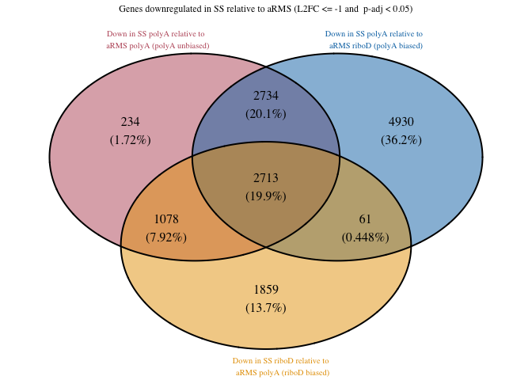

### **RiboD unbiased against biased**

#### **Up DEGs**

``` r
aRMS_SS_up_riboDunbiased_polyAbiased_riboDbiased <- list(
  "Up in SS riboD relative to aRMS riboD (riboD unbiased)" = armsRiboD_ssRiboD_great1$Gene,
  "Up in SS polyA relative to aRMS riboD (polyA biased)" = armsRiboD_ssPolyA_great1$Gene,
  "Up in SS riboD relative to aRMS polyA (riboD biased)" = armsPolyA_ssRiboD_great1$Gene
)

write_rds(aRMS_SS_up_riboDunbiased_polyAbiased_riboDbiased, "../../output_data/aRMS_SS/aRMS_SS_up_riboDunbiased_polyAbiased_riboDbiased.rds")
```

``` r
aRMS_SS_up_riboDunbiased_polyAbiased_riboDbiased_VD <- venn.diagram(
  x = aRMS_SS_up_riboDunbiased_polyAbiased_riboDbiased,
  category.names = c(
    "Up in SS riboD relative to \n aRMS riboD (riboD unbiased)",
    "Up in SS polyA relative to \n aRMS riboD (polyA biased)",
    "Up in SS riboD relative to \n aRMS polyA (riboD biased)"
    ),
  filename = NULL, # Save as a PNG file
  output = TRUE,
  print.mode = c("raw", "percent"),
  # Customize appearance (optional)
  fill = c("#BB5566", "#0072B2", "#E69F00"),
  cat.col = c("#BB5566", "#0072B2", "#E69F00"),
  cex = 1, # Font size for counts
  cat.cex = 0.65, # Font size for category names
  cat.dist = c(0.05, 0.05, 0.05),
  height = 2000,
  width = 2000,
  cat.default.pos = "outer",
  cat.pos = c(-12, 12, 175), 
  main = "Genes upregulated in SS relative to aRMS (L2FC >= 1 and  p-adj < 0.05)",
  main.cex = 0.75, # Font size for main title
  disable.logging = TRUE
)
```

    INFO [2026-07-02 15:55:57] $x
    INFO [2026-07-02 15:55:57] aRMS_SS_up_riboDunbiased_polyAbiased_riboDbiased
    INFO [2026-07-02 15:55:57] 
    INFO [2026-07-02 15:55:57] $category.names
    INFO [2026-07-02 15:55:57] c("Up in SS riboD relative to \n aRMS riboD (riboD unbiased)", 
    INFO [2026-07-02 15:55:57]     "Up in SS polyA relative to \n aRMS riboD (polyA biased)", 
    INFO [2026-07-02 15:55:57]     "Up in SS riboD relative to \n aRMS polyA (riboD biased)")
    INFO [2026-07-02 15:55:57] 
    INFO [2026-07-02 15:55:57] $filename
    INFO [2026-07-02 15:55:57] NULL
    INFO [2026-07-02 15:55:57] 
    INFO [2026-07-02 15:55:57] $output
    INFO [2026-07-02 15:55:57] [1] TRUE
    INFO [2026-07-02 15:55:57] 
    INFO [2026-07-02 15:55:57] $print.mode
    INFO [2026-07-02 15:55:57] c("raw", "percent")
    INFO [2026-07-02 15:55:57] 
    INFO [2026-07-02 15:55:57] $fill
    INFO [2026-07-02 15:55:57] c("#BB5566", "#0072B2", "#E69F00")
    INFO [2026-07-02 15:55:57] 
    INFO [2026-07-02 15:55:57] $cat.col
    INFO [2026-07-02 15:55:57] c("#BB5566", "#0072B2", "#E69F00")
    INFO [2026-07-02 15:55:57] 
    INFO [2026-07-02 15:55:57] $cex
    INFO [2026-07-02 15:55:57] [1] 1
    INFO [2026-07-02 15:55:57] 
    INFO [2026-07-02 15:55:57] $cat.cex
    INFO [2026-07-02 15:55:57] [1] 0.65
    INFO [2026-07-02 15:55:57] 
    INFO [2026-07-02 15:55:57] $cat.dist
    INFO [2026-07-02 15:55:57] c(0.05, 0.05, 0.05)
    INFO [2026-07-02 15:55:57] 
    INFO [2026-07-02 15:55:57] $height
    INFO [2026-07-02 15:55:57] [1] 2000
    INFO [2026-07-02 15:55:57] 
    INFO [2026-07-02 15:55:57] $width
    INFO [2026-07-02 15:55:57] [1] 2000
    INFO [2026-07-02 15:55:57] 
    INFO [2026-07-02 15:55:57] $cat.default.pos
    INFO [2026-07-02 15:55:57] [1] "outer"
    INFO [2026-07-02 15:55:57] 
    INFO [2026-07-02 15:55:57] $cat.pos
    INFO [2026-07-02 15:55:57] c(-12, 12, 175)
    INFO [2026-07-02 15:55:57] 
    INFO [2026-07-02 15:55:57] $main
    INFO [2026-07-02 15:55:57] [1] "Genes upregulated in SS relative to aRMS (L2FC >= 1 and  p-adj < 0.05)"
    INFO [2026-07-02 15:55:57] 
    INFO [2026-07-02 15:55:57] $main.cex
    INFO [2026-07-02 15:55:57] [1] 0.75
    INFO [2026-07-02 15:55:57] 
    INFO [2026-07-02 15:55:57] $disable.logging
    INFO [2026-07-02 15:55:57] [1] TRUE
    INFO [2026-07-02 15:55:57] 

``` r
aRMS_SS_up_riboDunbiased_polyAbiased_riboDbiased_VD
```

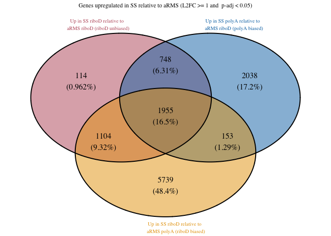

#### **Down DEGs**

``` r
aRMS_SS_down_riboDunbiased_polyAbiased_riboDbiased <- list(
  "Down in SS riboD relative to aRMS riboD (riboD unbiased)" = armsRiboD_ssRiboD_less1$Gene,
  "Down in SS polyA relative to aRMS riboD (polyA biased)" = armsRiboD_ssPolyA_less1$Gene,
  "Down in SS riboD relative to aRMS polyA (riboD biased)" = armsPolyA_ssRiboD_less1$Gene
)

write_rds(aRMS_SS_down_riboDunbiased_polyAbiased_riboDbiased, "../../output_data/aRMS_SS/aRMS_SS_down_riboDunbiased_polyAbiased_riboDbiased.rds")
```

``` r
aRMS_SS_down_riboDunbiased_polyAbiased_riboDbiased_VD <- venn.diagram(
  x = aRMS_SS_down_riboDunbiased_polyAbiased_riboDbiased,
  category.names = c(
    "Down in SS riboD relative to \n aRMS riboD (riboD unbiased)",
    "Down in SS polyA relative to \n aRMS riboD (polyA biased)",
    "Down in SS riboD relative to \n aRMS polyA (riboD biased)"
    ),
  filename = NULL, # Save as a PNG file
  output = TRUE,
  print.mode = c("raw", "percent"),
  # Customize appearance (optional)
  fill = c("#BB5566", "#0072B2", "#E69F00"),
  cat.col = c("#BB5566", "#0072B2", "#E69F00"),
  cex = 1, # Font size for counts
  cat.cex = 0.65, # Font size for category names
  cat.dist = c(0.05, 0.05, 0.05),
  height = 2000,
  width = 2000,
  cat.default.pos = "outer",
  cat.pos = c(-12, 12, 175), 
  main = "Genes downregulated in SS relative to aRMS (L2FC <= -1 and  p-adj < 0.05)",
  main.cex = 0.75, # Font size for main title
  disable.logging = TRUE
)
```

    INFO [2026-07-02 15:55:58] $x
    INFO [2026-07-02 15:55:58] aRMS_SS_down_riboDunbiased_polyAbiased_riboDbiased
    INFO [2026-07-02 15:55:58] 
    INFO [2026-07-02 15:55:58] $category.names
    INFO [2026-07-02 15:55:58] c("Down in SS riboD relative to \n aRMS riboD (riboD unbiased)", 
    INFO [2026-07-02 15:55:58]     "Down in SS polyA relative to \n aRMS riboD (polyA biased)", 
    INFO [2026-07-02 15:55:58]     "Down in SS riboD relative to \n aRMS polyA (riboD biased)")
    INFO [2026-07-02 15:55:58] 
    INFO [2026-07-02 15:55:58] $filename
    INFO [2026-07-02 15:55:58] NULL
    INFO [2026-07-02 15:55:58] 
    INFO [2026-07-02 15:55:58] $output
    INFO [2026-07-02 15:55:58] [1] TRUE
    INFO [2026-07-02 15:55:58] 
    INFO [2026-07-02 15:55:58] $print.mode
    INFO [2026-07-02 15:55:58] c("raw", "percent")
    INFO [2026-07-02 15:55:58] 
    INFO [2026-07-02 15:55:58] $fill
    INFO [2026-07-02 15:55:58] c("#BB5566", "#0072B2", "#E69F00")
    INFO [2026-07-02 15:55:58] 
    INFO [2026-07-02 15:55:58] $cat.col
    INFO [2026-07-02 15:55:58] c("#BB5566", "#0072B2", "#E69F00")
    INFO [2026-07-02 15:55:58] 
    INFO [2026-07-02 15:55:58] $cex
    INFO [2026-07-02 15:55:58] [1] 1
    INFO [2026-07-02 15:55:58] 
    INFO [2026-07-02 15:55:58] $cat.cex
    INFO [2026-07-02 15:55:58] [1] 0.65
    INFO [2026-07-02 15:55:58] 
    INFO [2026-07-02 15:55:58] $cat.dist
    INFO [2026-07-02 15:55:58] c(0.05, 0.05, 0.05)
    INFO [2026-07-02 15:55:58] 
    INFO [2026-07-02 15:55:58] $height
    INFO [2026-07-02 15:55:58] [1] 2000
    INFO [2026-07-02 15:55:58] 
    INFO [2026-07-02 15:55:58] $width
    INFO [2026-07-02 15:55:58] [1] 2000
    INFO [2026-07-02 15:55:58] 
    INFO [2026-07-02 15:55:58] $cat.default.pos
    INFO [2026-07-02 15:55:58] [1] "outer"
    INFO [2026-07-02 15:55:58] 
    INFO [2026-07-02 15:55:58] $cat.pos
    INFO [2026-07-02 15:55:58] c(-12, 12, 175)
    INFO [2026-07-02 15:55:58] 
    INFO [2026-07-02 15:55:58] $main
    INFO [2026-07-02 15:55:58] [1] "Genes downregulated in SS relative to aRMS (L2FC <= -1 and  p-adj < 0.05)"
    INFO [2026-07-02 15:55:58] 
    INFO [2026-07-02 15:55:58] $main.cex
    INFO [2026-07-02 15:55:58] [1] 0.75
    INFO [2026-07-02 15:55:58] 
    INFO [2026-07-02 15:55:58] $disable.logging
    INFO [2026-07-02 15:55:58] [1] TRUE
    INFO [2026-07-02 15:55:58] 

``` r
aRMS_SS_down_riboDunbiased_polyAbiased_riboDbiased_VD
```


### **Histograms of LFC of genes in intersections**

Starting with upregulated genes in the
polyAunbiased:polyAbiased:riboDbiased comparison.

Looking at genes that are unique to polyAbiased

``` r
aRMS_SS_up_polyAunbiased_uniquetopolyAbiased <- armsRiboD_ssPolyA_great1 %>%
  anti_join(armsPolyA_ssPolyA_great1, by = "Gene") %>%
  anti_join(armsPolyA_ssRiboD_great1, by = "Gene")
print(aRMS_SS_up_polyAunbiased_uniquetopolyAbiased %>% nrow())
```

    [1] 1878

What is the average LFC?

``` r
aRMS_SS_up_polyAunbiased_uniquetopolyAbiased_avgLFC <- aRMS_SS_up_polyAunbiased_uniquetopolyAbiased %>%
  summarise(
    min_value = min(log2FoldChange),
    max_value = max(log2FoldChange),
    median_value = median(log2FoldChange),
    mean_value = mean(log2FoldChange),
    stdev = sd(log2FoldChange)
  )
aRMS_SS_up_polyAunbiased_uniquetopolyAbiased_avgLFC
```

| min_value | max_value | median_value | mean_value |     stdev |
|----------:|----------:|-------------:|-----------:|----------:|
|  1.000263 |  12.31537 |      1.36887 |   1.571108 | 0.7760129 |

Histogram of LFC

``` r
aRMS_SS_up_polyAunbiased_uniquetopolyAbiased_hist <- ggplot(aRMS_SS_up_polyAunbiased_uniquetopolyAbiased, aes(x = log2FoldChange)) +
  geom_histogram(
    bins = 30, # 30 is default
    fill = "#0072B2",
    color = "#0072B2",
    alpha = 0.7
    ) +
#  scale_y_continuous(breaks = c(200, 400, 600, 800), limits = c(0,1000)) +
#  scale_x_continuous(breaks = c(2, 4, 6, 8, 10, 12, 14, 16)) +
  labs(title = "Distribution of log2FoldChange values of \n genes uniquely upregulated in SS polyA relative to aRMS riboD",
       subtitle = "polyAbiased, compared to polyAunbiased. Median LFC = 1.37",
       y = "Number of genes") +
  theme(plot.title = element_text(hjust = 0.5, size = 13, face = "bold"),
            axis.text = element_text(size = 13),
        plot.subtitle = element_text(size = 8, face = "bold"))

aRMS_SS_up_polyAunbiased_uniquetopolyAbiased_hist
```

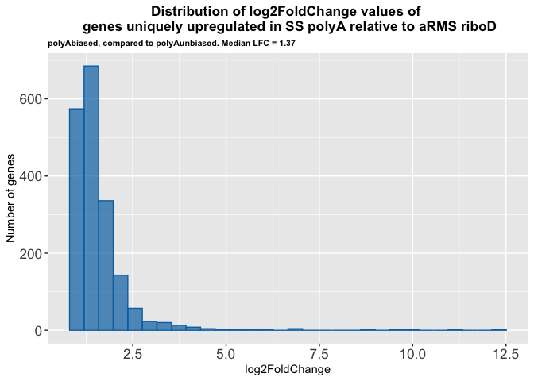

Looking at genes that are unique to riboDbiased

``` r
aRMS_SS_up_polyAunbiased_uniquetoriboDbiased <- armsPolyA_ssRiboD_great1 %>%
  anti_join(armsPolyA_ssPolyA_great1, by = "Gene") %>%
  anti_join(armsRiboD_ssPolyA_great1, by = "Gene")
print(aRMS_SS_up_polyAunbiased_uniquetoriboDbiased %>% nrow())
```

    [1] 5366

What’s the average LFC?

``` r
aRMS_SS_up_polyAunbiased_uniquetoriboDbiased_avgLFC <- aRMS_SS_up_polyAunbiased_uniquetoriboDbiased %>%
  summarise(
    min_value = min(log2FoldChange),
    max_value = max(log2FoldChange),
    median_value = median(log2FoldChange),
    mean_value = mean(log2FoldChange),
    stdev = sd(log2FoldChange)
  )
aRMS_SS_up_polyAunbiased_uniquetoriboDbiased_avgLFC
```

| min_value | max_value | median_value | mean_value |    stdev |
|----------:|----------:|-------------:|-----------:|---------:|
|  1.000549 |  24.18898 |      2.80746 |   3.582051 | 2.406409 |

``` r
aRMS_SS_up_polyAunbiased_uniquetoriboDbiased_hist <- ggplot(aRMS_SS_up_polyAunbiased_uniquetoriboDbiased, aes(x = log2FoldChange)) +
  geom_histogram(
    bins = 30,
    fill = "#E69F00",
    color = "#E69F00",
    alpha = 0.7
    ) +
#  scale_y_continuous(breaks = c(200, 400, 600, 800, 1000), limits = c(0,1000)) +
#    scale_x_continuous(breaks = c(2, 4, 6, 8, 10, 12, 14, 16)) +
  labs(title = "Distribution of log2FoldChange values of \n genes uniquely upregulated in SS riboD relative to aRMS polyA",
       subtitle = "riboD biased, compared to polyA_unbiased. Median LFC = 2.81",
       y = "Number of genes") +
  theme(plot.title = element_text(hjust = 0.5, size = 13, face = "bold"),
            axis.text = element_text(size = 13),
        plot.subtitle = element_text(size = 8, face = "bold"))

aRMS_SS_up_polyAunbiased_uniquetoriboDbiased_hist
```

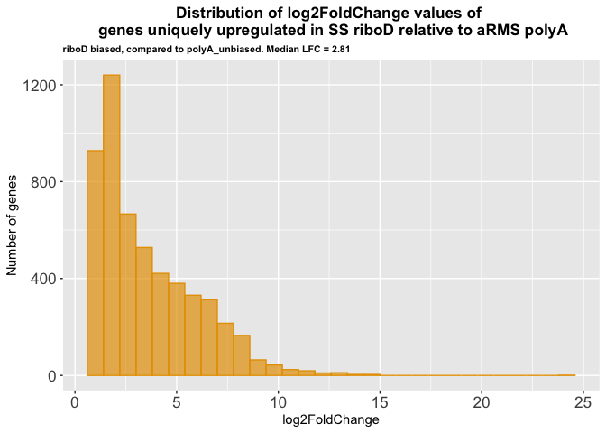

Upregulated genes in the riboD unbiased:polyAbiased:riboDbiased
comparison

Looking at genes that are unique to the polyA biased

``` r
aRMS_SS_up_riboDunbiased_uniquetopolyAbiased <- armsRiboD_ssPolyA_great1 %>%
  anti_join(armsRiboD_ssRiboD_great1, by = "Gene") %>%
  anti_join(armsPolyA_ssRiboD_great1, by = "Gene")
print(aRMS_SS_up_riboDunbiased_uniquetopolyAbiased %>% nrow())
```

    [1] 2038

``` r
aRMS_SS_up_riboDunbiased_uniquetopolyAbiased_avgLFC <- aRMS_SS_up_riboDunbiased_uniquetopolyAbiased %>%
  summarise(
    min_value = min(log2FoldChange),
    max_value = max(log2FoldChange),
    median_value = median(log2FoldChange),
    mean_value = mean(log2FoldChange),
    stdev = sd(log2FoldChange)
  )
aRMS_SS_up_riboDunbiased_uniquetopolyAbiased_avgLFC
```

| min_value | max_value | median_value | mean_value |     stdev |
|----------:|----------:|-------------:|-----------:|----------:|
|  1.000263 |  11.04357 |     1.387874 |    1.59491 | 0.7698466 |

``` r
aRMS_SS_up_riboDunbiased_uniquetopolyAbiased_hist <- ggplot(aRMS_SS_up_riboDunbiased_uniquetopolyAbiased, aes(x = log2FoldChange)) +
  geom_histogram(
    bins = 30, # 30 is default
    fill = "#0072B2",
    color = "#0072B2",
    alpha = 0.7
    ) +
#  scale_y_continuous(breaks = c(200, 400, 600, 800), limits = c(0,1000)) +
#  scale_x_continuous(breaks = c(2, 4, 6, 8, 10, 12, 14, 16)) +
  labs(title = "Distribution of log2FoldChange values of \n genes uniquely upregulated in SS polyA relative to aRMS riboD",
       subtitle = "polyA biased, compared to RiboD_unbiased. Median LFC = 1.39",
       y = "Number of genes") +
  theme(plot.title = element_text(hjust = 0.5, size = 13, face = "bold"),
            axis.text = element_text(size = 13),
        plot.subtitle = element_text(size = 8, face = "bold"))

aRMS_SS_up_riboDunbiased_uniquetopolyAbiased_hist
```

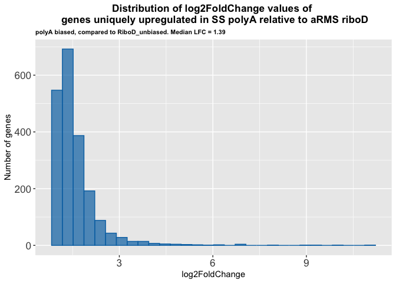

Looking at genes that are unique to riboDbiased

``` r
aRMS_SS_up_riboDunbiased_uniquetoriboDbiased <- armsPolyA_ssRiboD_great1 %>%
  anti_join(armsRiboD_ssRiboD_great1, by = "Gene") %>%
  anti_join(armsRiboD_ssPolyA_great1, by = "Gene")
print(aRMS_SS_up_riboDunbiased_uniquetoriboDbiased %>% nrow())
```

    [1] 5739

``` r
aRMS_SS_up_riboDunbiased_uniquetoriboDbiased_avgLFC <- aRMS_SS_up_riboDunbiased_uniquetoriboDbiased %>%
  summarise(
    min_value = min(log2FoldChange),
    max_value = max(log2FoldChange),
    median_value = median(log2FoldChange),
    mean_value = mean(log2FoldChange),
    stdev = sd(log2FoldChange)
  )
aRMS_SS_up_riboDunbiased_uniquetoriboDbiased_avgLFC
```

| min_value | max_value | median_value | mean_value |    stdev |
|----------:|----------:|-------------:|-----------:|---------:|
|  1.000549 |  24.18898 |     2.649969 |   3.424113 | 2.306018 |

``` r
aRMS_SS_up_riboDunbiased_uniquetoriboDbiased_hist <- ggplot(aRMS_SS_up_riboDunbiased_uniquetoriboDbiased, aes(x = log2FoldChange)) +
  geom_histogram(
    bins = 30,
    fill = "#E69F00",
    color = "#E69F00",
    alpha = 0.7
    ) +
#  scale_y_continuous(breaks = c(200, 400, 600, 800, 1000, 1200), limits = c(0,1200)) +
#    scale_x_continuous(breaks = c(2, 4, 6, 8, 10, 12, 14, 16)) +
  labs(title = "Distribution of log2FoldChange values of \n genes uniquely upregulated in SS riboD relative to aRMS polyA",
       subtitle = "riboD biased, compared to riboD_unbiased. Median LFC = 2.65",
       y = "Number of genes") +
  theme(plot.title = element_text(hjust = 0.5, size = 13, face = "bold"),
            axis.text = element_text(size = 13),
        plot.subtitle = element_text(size = 8, face = "bold"))

aRMS_SS_up_riboDunbiased_uniquetoriboDbiased_hist
```

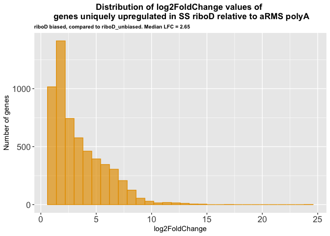

Looking at downregulated genes in the polyA unbiased:polyA biased:riboD
biased comparison

Looking at genes that are unique to the polyA biased

``` r
aRMS_SS_down_polyAunbiased_uniquetopolyAbiased <- armsRiboD_ssPolyA_less1 %>%
  anti_join(armsPolyA_ssPolyA_less1, by = "Gene") %>%
  anti_join(armsPolyA_ssRiboD_less1, by = "Gene")
print(aRMS_SS_down_polyAunbiased_uniquetopolyAbiased %>% nrow())
```

    [1] 4930

``` r
aRMS_SS_down_polyAunbiased_uniquetopolyAbiased_avgLFC <- aRMS_SS_down_polyAunbiased_uniquetopolyAbiased %>%
  summarise(
    min_value = min(log2FoldChange),
    max_value = max(log2FoldChange),
    median_value = median(log2FoldChange),
    mean_value = mean(log2FoldChange),
    stdev = sd(log2FoldChange)
  )
aRMS_SS_down_polyAunbiased_uniquetopolyAbiased_avgLFC
```

| min_value | max_value | median_value | mean_value |    stdev |
|----------:|----------:|-------------:|-----------:|---------:|
| -14.07496 | -1.000385 |     -3.24821 |  -3.974758 | 2.548693 |

``` r
aRMS_SS_down_polyAunbiased_uniquetopolyAbiased_hist <- ggplot(aRMS_SS_down_polyAunbiased_uniquetopolyAbiased, aes(x = log2FoldChange)) +
  geom_histogram(
    bins = 30, # 30 is default
    fill = "#0072B2",
    color = "#0072B2",
    alpha = 0.7
    ) +
#  scale_y_continuous(breaks = c(200, 400, 600, 800), limits = c(0,1000)) +
#  scale_x_continuous(breaks = c(0, -1, -2, -4, -6, -8, -10, -12, -14, -16)) +
  labs(title = "Distribution of log2FoldChange values of \n genes uniquely downregulated in SS polyA relative to aRMS riboD",
       subtitle = "polyA biased, compared to polyA_unbiased. Median LFC = -3.25",
       y = "Number of genes") +
  theme(plot.title = element_text(hjust = 0.5, size = 13, face = "bold"),
            axis.text = element_text(size = 13),
        plot.subtitle = element_text(size = 8, face = "bold"))

aRMS_SS_down_polyAunbiased_uniquetopolyAbiased_hist
```

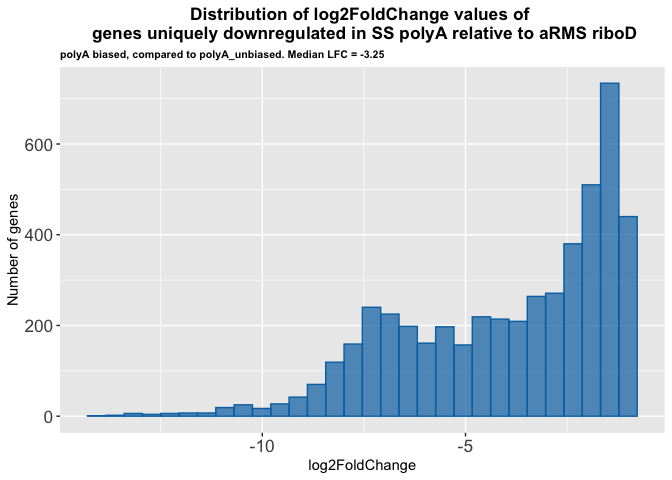

Looking at genes that are unique to the riboD biased

``` r
aRMS_SS_down_polyAunbiased_uniquetoriboDbiased <- armsPolyA_ssRiboD_less1 %>%
  anti_join(armsPolyA_ssPolyA_less1, by = "Gene") %>%
  anti_join(armsRiboD_ssPolyA_less1, by = "Gene")
print(aRMS_SS_down_polyAunbiased_uniquetoriboDbiased %>% nrow())
```

    [1] 1859

``` r
aRMS_SS_down_polyAunbiased_uniquetoriboDbiased_avgLFC <- aRMS_SS_down_polyAunbiased_uniquetoriboDbiased %>%
  summarise(
    min_value = min(log2FoldChange),
    max_value = max(log2FoldChange),
    median_value = median(log2FoldChange),
    mean_value = mean(log2FoldChange),
    stdev = sd(log2FoldChange)
  )
aRMS_SS_down_polyAunbiased_uniquetoriboDbiased_avgLFC
```

| min_value | max_value | median_value | mean_value |     stdev |
|----------:|----------:|-------------:|-----------:|----------:|
|  -23.0428 | -1.000219 |    -1.379713 |  -1.590427 | 0.8893011 |

``` r
aRMS_SS_down_polyAunbiased_uniquetoriboDbiased_hist <- ggplot(aRMS_SS_down_polyAunbiased_uniquetoriboDbiased, aes(x = log2FoldChange)) +
  geom_histogram(
    bins = 30, # 30 is default
    fill = "#E69F00",
    color = "#E69F00",
    alpha = 0.7
    ) +
#  scale_y_continuous(breaks = c(200, 400, 600, 800), limits = c(0,1000)) +
#  scale_x_continuous(breaks = c(0, -2, -4, -6, -8, -10, -12, -14, -16)) +
  labs(title = "Distribution of log2FoldChange values of \n genes uniquely downregulated in SS riboD relative to aRMS polyA",
       subtitle = "riboD biased, compared to polyA_unbiased. Median LFC = -1.38",
       y = "Number of genes") +
  theme(plot.title = element_text(hjust = 0.5, size = 13, face = "bold"),
            axis.text = element_text(size = 13),
        plot.subtitle = element_text(size = 8, face = "bold"))

aRMS_SS_down_polyAunbiased_uniquetoriboDbiased_hist
```

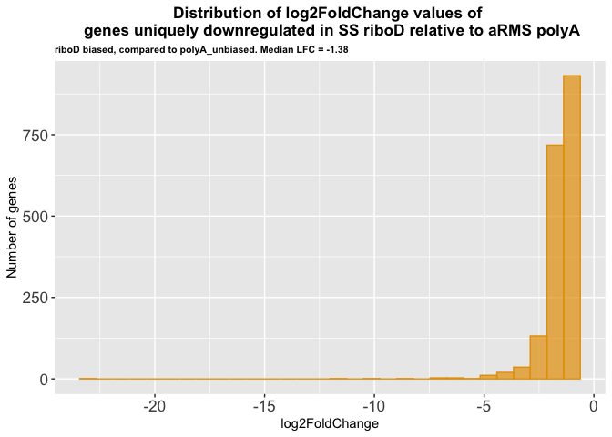

Looking at downregulated genes in the riboD unbiased:polyA biased:riboD
biased comparison

Looking at genes that are unique to the polyA biased

``` r
aRMS_SS_down_riboDunbiased_uniquetopolyAbiased <- armsRiboD_ssPolyA_less1 %>%
  anti_join(armsRiboD_ssRiboD_less1, by = "Gene") %>%
  anti_join(armsPolyA_ssRiboD_less1, by = "Gene")
print(aRMS_SS_down_riboDunbiased_uniquetopolyAbiased %>% nrow())
```

    [1] 5652

``` r
aRMS_SS_down_riboDunbiased_uniquetopolyAbiased_avgLFC <- aRMS_SS_down_riboDunbiased_uniquetopolyAbiased %>%
  summarise(
    min_value = min(log2FoldChange),
    max_value = max(log2FoldChange),
    median_value = median(log2FoldChange),
    mean_value = mean(log2FoldChange),
    stdev = sd(log2FoldChange)
  )
aRMS_SS_down_riboDunbiased_uniquetopolyAbiased_avgLFC
```

| min_value | max_value | median_value | mean_value |    stdev |
|----------:|----------:|-------------:|-----------:|---------:|
| -14.07496 | -1.000385 |     -2.84593 |  -3.576354 | 2.276026 |

``` r
aRMS_SS_down_riboDunbiased_uniquetopolyAbiased_hist <- ggplot(aRMS_SS_down_riboDunbiased_uniquetopolyAbiased, aes(x = log2FoldChange)) +
  geom_histogram(
    bins = 30, # 30 is default
    fill = "#0072B2",
    color = "#0072B2",
    alpha = 0.7
    ) +
#  scale_y_continuous(breaks = c(200, 400, 600, 800), limits = c(0,1000)) +
#  scale_x_continuous(breaks = c(0, -1, -2, -4, -6, -8, -10, -12, -14, -16)) +
  labs(title = "Distribution of log2FoldChange values of \n genes uniquely downregulated in SS polyA relative to aRMS riboD",
       subtitle = "polyA biased, compared to riboD_truth. Median LFC = -2.85",
       y = "Number of genes") +
  theme(plot.title = element_text(hjust = 0.5, size = 13, face = "bold"),
            axis.text = element_text(size = 13),
        plot.subtitle = element_text(size = 8, face = "bold"))

aRMS_SS_down_riboDunbiased_uniquetopolyAbiased_hist
```

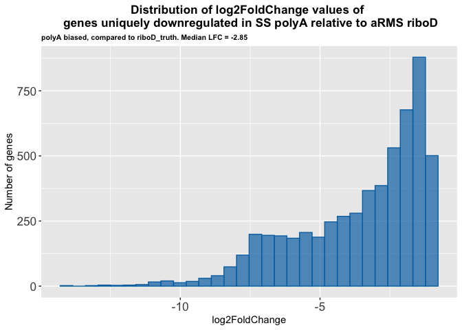

Looking at genes that are unique to the riboD biased

``` r
aRMS_SS_down_riboDunbiased_uniquetoriboDbiased <- armsPolyA_ssRiboD_less1 %>%
  anti_join(armsRiboD_ssRiboD_less1, by = "Gene") %>%
  anti_join(armsRiboD_ssPolyA_less1, by = "Gene")
print(aRMS_SS_down_riboDunbiased_uniquetoriboDbiased %>% nrow())
```

    [1] 2500

``` r
aRMS_SS_down_riboDunbiased_uniquetoriboDbiased_avgLFC <- aRMS_SS_down_riboDunbiased_uniquetoriboDbiased %>%
  summarise(
    min_value = min(log2FoldChange),
    max_value = max(log2FoldChange),
    median_value = median(log2FoldChange),
    mean_value = mean(log2FoldChange),
    stdev = sd(log2FoldChange)
  )
aRMS_SS_down_riboDunbiased_uniquetoriboDbiased_avgLFC
```

| min_value | max_value | median_value | mean_value |     stdev |
|----------:|----------:|-------------:|-----------:|----------:|
|  -23.0428 | -1.000219 |    -1.472269 |  -1.716921 | 0.9684467 |

``` r
aRMS_SS_down_riboDunbiased_uniquetoriboDbiased_hist <- ggplot(aRMS_SS_down_riboDunbiased_uniquetoriboDbiased, aes(x = log2FoldChange)) +
  geom_histogram(
    bins = 30, # 30 is default
    fill = "#E69F00",
    color = "#E69F00",
    alpha = 0.7
    ) +
#  scale_y_continuous(breaks = c(200, 400, 600, 800), limits = c(0,1000)) +
#  scale_x_continuous(breaks = c(0, -2, -4, -6, -8, -10, -12, -14, -16)) +
  labs(title = "Distribution of log2FoldChange values of \n genes uniquely downregulated in SS riboD relative to aRMS polyA",
       subtitle = "riboD biased, compared to riboD_truth. Median LFC = -1.47",
       y = "Number of genes") +
  theme(plot.title = element_text(hjust = 0.5, size = 13, face = "bold"),
            axis.text = element_text(size = 13),
        plot.subtitle = element_text(size = 8, face = "bold"))

aRMS_SS_down_riboDunbiased_uniquetoriboDbiased_hist
```

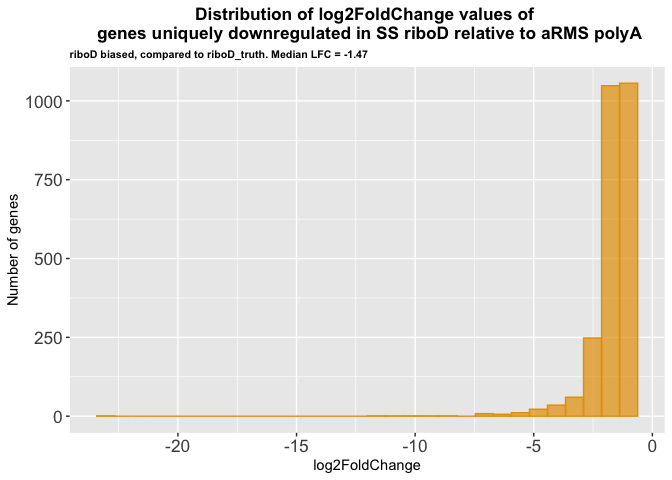

Genes in common between the polyAunbiased:polyAbiased:riboDbiased venn
diagram and the riboDunbiased:polyAbiased:riboDbiased venn diagram

upregulated polyA biased

``` r
aRMS_SS_up_polyAbiased <- inner_join(aRMS_SS_up_polyAunbiased_uniquetopolyAbiased, aRMS_SS_up_riboDunbiased_uniquetopolyAbiased, by = "Gene")

write_rds(aRMS_SS_up_polyAbiased, "../../output_data/aRMS_SS/aRMS_SS_up_polyAbiased.rds")

print(aRMS_SS_up_polyAbiased %>% nrow())
```

    [1] 1590

``` r
aRMS_SS_up_polyAbiased_avgLFC <- aRMS_SS_up_polyAbiased %>%
  summarise(
    min_value = min(log2FoldChange.x),
    max_value = max(log2FoldChange.x),
    median_value = median(log2FoldChange.x),
    mean_value = mean(log2FoldChange.x),
    stdev = sd(log2FoldChange.x)
  )
aRMS_SS_up_polyAbiased_avgLFC
```

| min_value | max_value | median_value | mean_value |     stdev |
|----------:|----------:|-------------:|-----------:|----------:|
|  1.000263 |  11.04357 |     1.322192 |   1.504586 | 0.7177717 |

``` r
aRMS_SS_up_polyAbiased_hist <- ggplot(aRMS_SS_up_polyAbiased, aes(x = log2FoldChange.x)) +
  geom_histogram(
    bins = 30, # 30 is default
    fill = "#0072B2",
    color = "#0072B2",
    alpha = 0.7
    ) +
#  scale_y_continuous(breaks = c(200, 400, 600, 800), limits = c(0,1000)) +
#  scale_x_continuous(breaks = c(2, 4, 6, 8, 10, 12, 14, 16)) +
  labs(title = "Distribution of log2FoldChange values of \n genes uniquely upregulated in SS polyA relative to aRMS riboD",
       subtitle = "polyA biased, Median LFC = 1.32",
       y = "Number of genes") +
  theme(plot.title = element_text(hjust = 0.5, size = 13, face = "bold"),
            axis.text = element_text(size = 13),
        plot.subtitle = element_text(size = 8, face = "bold"))

# ggsave(filename = "../../plots/DESeq2_results_analysis/histograms/aRMS_SS_up_polyAbiased_hist.png", plot = aRMS_SS_up_polyAbiased_hist)
# 
# ggsave(filename = "../../plots/DESeq2_results_analysis/histograms/aRMS_SS_up_polyAbiased_hist.svg", plot = aRMS_SS_up_polyAbiased_hist)
# 
# saveRDS(aRMS_SS_up_polyAbiased_hist, file = "../../plots/DESeq2_results_analysis/histograms/aRMS_SS_up_polyAbiased_hist.rds")

aRMS_SS_up_polyAbiased_hist
```

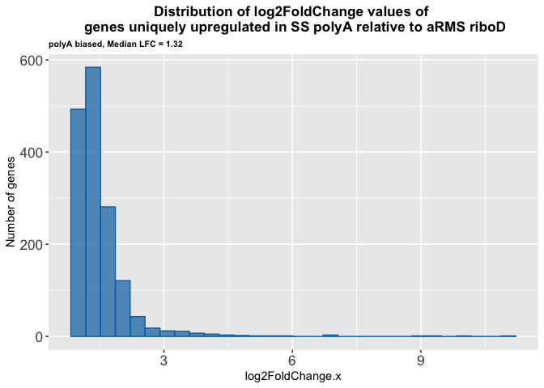

upregulated riboD biased

``` r
aRMS_SS_up_riboDbiased <- inner_join(aRMS_SS_up_polyAunbiased_uniquetoriboDbiased, aRMS_SS_up_riboDunbiased_uniquetoriboDbiased, by = "Gene")

write_rds(aRMS_SS_up_riboDbiased, "../../output_data/aRMS_SS/aRMS_SS_up_riboDbiased.rds")

print(aRMS_SS_up_riboDbiased %>% nrow())
```

    [1] 4864

``` r
aRMS_SS_up_riboDbiased_avgLFC <- aRMS_SS_up_riboDbiased %>%
  summarise(
    min_value = min(log2FoldChange.x),
    max_value = max(log2FoldChange.x),
    median_value = median(log2FoldChange.x),
    mean_value = mean(log2FoldChange.x),
    stdev = sd(log2FoldChange.x)
  )
aRMS_SS_up_riboDbiased_avgLFC
```

| min_value | max_value | median_value | mean_value |    stdev |
|----------:|----------:|-------------:|-----------:|---------:|
|  1.000549 |  24.18898 |     2.761514 |   3.505731 | 2.336743 |

``` r
aRMS_SS_up_riboDbiased_hist <- ggplot(aRMS_SS_up_riboDbiased, aes(x = log2FoldChange.x)) +
  geom_histogram(
    bins = 30, # 30 is default
    fill = "#E69F00",
    color = "#E69F00",
    alpha = 0.7
    ) +
#  scale_y_continuous(breaks = c(200, 400, 600, 800), limits = c(0,1000)) +
#  scale_x_continuous(breaks = c(2, 4, 6, 8, 10, 12, 14, 16)) +
  labs(title = "Distribution of log2FoldChange values of \n genes uniquely upregulated in SS riboD relative to aRMS polyA",
       subtitle = "riboD biased, Median LFC = 2.76",
       y = "Number of genes") +
  theme(plot.title = element_text(hjust = 0.5, size = 13, face = "bold"),
            axis.text = element_text(size = 13),
        plot.subtitle = element_text(size = 8, face = "bold"))

# ggsave(filename = "../../plots/DESeq2_results_analysis/histograms/aRMS_SS_up_riboDbiased_hist.png", plot = aRMS_SS_up_riboDbiased_hist)
# 
# ggsave(filename = "../../plots/DESeq2_results_analysis/histograms/aRMS_SS_up_riboDbiased_hist.svg", plot = aRMS_SS_up_riboDbiased_hist)
# 
# saveRDS(aRMS_SS_up_riboDbiased_hist, file = "../../plots/DESeq2_results_analysis/histograms/aRMS_SS_up_riboDbiased_hist.rds")

aRMS_SS_up_riboDbiased_hist
```

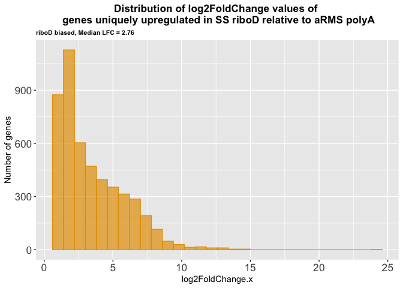

Genes in common between the polyAunbiased:polyAbiased:riboDbiased venn
diagram and the riboDunbiased:polyAbiased:riboDbiased venn diagram

downregulated polyA biased

``` r
aRMS_SS_down_polyAbiased <- inner_join(aRMS_SS_down_polyAunbiased_uniquetopolyAbiased, aRMS_SS_down_riboDunbiased_uniquetopolyAbiased, by = "Gene")

write_rds(aRMS_SS_down_polyAbiased, "../../output_data/aRMS_SS/aRMS_SS_down_polyAbiased.rds")

print(aRMS_SS_down_polyAbiased %>% nrow())
```

    [1] 4102

``` r
aRMS_SS_down_polyAbiased_avgLFC <- aRMS_SS_down_polyAbiased %>%
  summarise(
    min_value = min(log2FoldChange.x),
    max_value = max(log2FoldChange.x),
    median_value = median(log2FoldChange.x),
    mean_value = mean(log2FoldChange.x),
    stdev = sd(log2FoldChange.x)
  )
aRMS_SS_down_polyAbiased_avgLFC
```

| min_value | max_value | median_value | mean_value |    stdev |
|----------:|----------:|-------------:|-----------:|---------:|
| -14.07496 | -1.000385 |    -2.895363 |  -3.710862 | 2.433385 |

``` r
aRMS_SS_down_polyAbiased_hist <- ggplot(aRMS_SS_down_polyAbiased, aes(x = log2FoldChange.x)) +
  geom_histogram(
    bins = 30, # 30 is default
    fill = "#0072B2",
    color = "#0072B2",
    alpha = 0.7
    ) +
#  scale_y_continuous(breaks = c(200, 400, 600, 800), limits = c(0,1000)) +
#  scale_x_continuous(breaks = c(2, 4, 6, 8, 10, 12, 14, 16)) +
  labs(title = "Distribution of log2FoldChange values of \n genes uniquely downregulated in SS polyA relative to aRMS riboD",
       subtitle = "polyA biased, Median LFC = -2.90",
       y = "Number of genes") +
  theme(plot.title = element_text(hjust = 0.5, size = 13, face = "bold"),
            axis.text = element_text(size = 13),
        plot.subtitle = element_text(size = 8, face = "bold"))

aRMS_SS_down_polyAbiased_hist
```

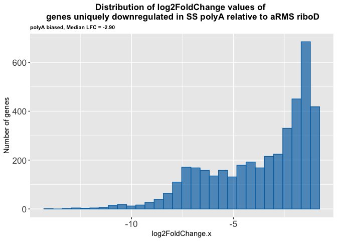

downregulated riboD biased

``` r
aRMS_SS_down_riboDbiased <- inner_join(aRMS_SS_down_polyAunbiased_uniquetoriboDbiased, aRMS_SS_down_riboDunbiased_uniquetoriboDbiased, by = "Gene")

write_rds(aRMS_SS_down_riboDbiased, "../../output_data/aRMS_SS/aRMS_SS_down_riboDbiased.rds")

print(aRMS_SS_down_riboDbiased %>% nrow())
```

    [1] 1712

``` r
aRMS_SS_down_riboDbiased_avgLFC <- aRMS_SS_down_riboDbiased %>%
  summarise(
    min_value = min(log2FoldChange.x),
    max_value = max(log2FoldChange.x),
    median_value = median(log2FoldChange.x),
    mean_value = mean(log2FoldChange.x),
    stdev = sd(log2FoldChange.x)
  )
aRMS_SS_down_riboDbiased_avgLFC
```

| min_value | max_value | median_value | mean_value |     stdev |
|----------:|----------:|-------------:|-----------:|----------:|
|  -23.0428 | -1.000219 |    -1.355701 |  -1.543953 | 0.8766656 |

``` r
aRMS_SS_down_riboDbiased_hist <- ggplot(aRMS_SS_down_riboDbiased, aes(x = log2FoldChange.x)) +
  geom_histogram(
    bins = 30, # 30 is default
    fill = "#E69F00",
    color = "#E69F00",
    alpha = 0.7
    ) +
#  scale_y_continuous(breaks = c(200, 400, 600, 800), limits = c(0,1000)) +
#  scale_x_continuous(breaks = c(2, 4, 6, 8, 10, 12, 14, 16)) +
  labs(title = "Distribution of log2FoldChange values of \n genes uniquely downregulated in SS riboD relative to aRMS polyA",
       subtitle = "riboD biased, Median LFC = -1.36",
       y = "Number of genes") +
  theme(plot.title = element_text(hjust = 0.5, size = 13, face = "bold"),
            axis.text = element_text(size = 13),
        plot.subtitle = element_text(size = 8, face = "bold"))

aRMS_SS_down_riboDbiased_hist
```

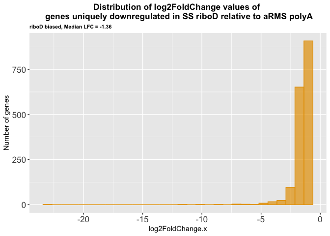

### Session Info

``` r
sessioninfo::session_info()
```

    ─ Session info ───────────────────────────────────────────────────────────────
     setting  value
     version  R version 4.5.2 (2025-10-31)
     os       macOS Tahoe 26.5
     system   aarch64, darwin20
     ui       X11
     language (EN)
     collate  en_US.UTF-8
     ctype    en_US.UTF-8
     tz       America/Los_Angeles
     date     2026-07-02
     pandoc   3.8.3 @ /Applications/RStudio.app/Contents/Resources/app/quarto/bin/tools/aarch64/ (via rmarkdown)
     quarto   1.9.36 @ /Applications/RStudio.app/Contents/Resources/app/quarto/bin/quarto

    ─ Packages ───────────────────────────────────────────────────────────────────
     ! package        * version date (UTC) lib source
     P BiocManager      1.30.26 2025-06-05 [?] CRAN (R 4.5.0)
     P bit              4.6.0   2025-03-06 [?] RSPM
     P bit64            4.6.0-1 2025-01-16 [?] CRAN (R 4.5.0)
     P cli              3.6.5   2025-04-23 [?] CRAN (R 4.5.0)
     P crayon           1.5.3   2024-06-20 [?] RSPM
     P digest           0.6.37  2024-08-19 [?] CRAN (R 4.5.0)
     P dplyr          * 1.1.4   2023-11-17 [?] CRAN (R 4.5.0)
     P evaluate         1.0.5   2025-08-27 [?] RSPM
     P farver           2.1.2   2024-05-13 [?] RSPM
     P fastmap          1.2.0   2024-05-15 [?] RSPM
     P forcats        * 1.0.1   2025-09-25 [?] RSPM
     P formatR          1.14    2023-01-17 [?] CRAN (R 4.5.0)
     P futile.logger  * 1.4.3   2016-07-10 [?] CRAN (R 4.5.0)
     P futile.options   1.0.1   2018-04-20 [?] CRAN (R 4.5.0)
     P generics         0.1.4   2025-05-09 [?] RSPM
     P ggplot2        * 4.0.0   2025-09-11 [?] CRAN (R 4.5.0)
     P glue             1.8.0   2024-09-30 [?] CRAN (R 4.5.0)
     P gtable           0.3.6   2024-10-25 [?] RSPM
     P hms              1.1.4   2025-10-17 [?] RSPM
     P htmltools        0.5.8.1 2024-04-04 [?] CRAN (R 4.5.0)
     P jsonlite         2.0.0   2025-03-27 [?] RSPM
     P knitr            1.50    2025-03-16 [?] CRAN (R 4.5.0)
     P labeling         0.4.3   2023-08-29 [?] RSPM
     P lambda.r         1.2.4   2019-09-18 [?] CRAN (R 4.5.0)
     P lifecycle        1.0.4   2023-11-07 [?] CRAN (R 4.5.0)
     P lubridate      * 1.9.4   2024-12-08 [?] CRAN (R 4.5.0)
     P magrittr         2.0.4   2025-09-12 [?] CRAN (R 4.5.0)
     P pillar           1.11.1  2025-09-17 [?] RSPM
     P pkgconfig        2.0.3   2019-09-22 [?] RSPM
     P purrr          * 1.1.0   2025-07-10 [?] CRAN (R 4.5.0)
     P R6               2.6.1   2025-02-15 [?] RSPM
     P RColorBrewer     1.1-3   2022-04-03 [?] RSPM
     P readr          * 2.1.5   2024-01-10 [?] CRAN (R 4.5.0)
       renv             1.1.5   2025-07-24 [1] CRAN (R 4.5.0)
     P rlang            1.2.0   2026-04-06 [?] RSPM
     P rmarkdown        2.30    2025-09-28 [?] CRAN (R 4.5.0)
     P rstudioapi       0.17.1  2024-10-22 [?] CRAN (R 4.5.0)
     P S7               0.2.0   2024-11-07 [?] CRAN (R 4.5.0)
     P scales           1.4.0   2025-04-24 [?] RSPM
     P sessioninfo      1.2.3   2025-02-05 [?] CRAN (R 4.5.0)
     P stringi          1.8.7   2025-03-27 [?] RSPM
     P stringr        * 1.5.2   2025-09-08 [?] CRAN (R 4.5.0)
     P tibble         * 3.3.0   2025-06-08 [?] CRAN (R 4.5.0)
     P tidyr          * 1.3.1   2024-01-24 [?] CRAN (R 4.5.0)
     P tidyselect       1.2.1   2024-03-11 [?] RSPM
     P tidyverse      * 2.0.0   2023-02-22 [?] RSPM
     P timechange       0.3.0   2024-01-18 [?] CRAN (R 4.5.0)
     P tzdb             0.5.0   2025-03-15 [?] RSPM
     P vctrs            0.6.5   2023-12-01 [?] CRAN (R 4.5.0)
     P VennDiagram    * 1.8.2   2026-01-11 [?] RSPM
     P vroom            1.6.6   2025-09-19 [?] CRAN (R 4.5.0)
     P withr            3.0.2   2024-10-28 [?] CRAN (R 4.5.0)
     P xfun             0.55    2025-12-16 [?] CRAN (R 4.5.2)
     P yaml             2.3.10  2024-07-26 [?] CRAN (R 4.5.0)

     [1] /Users/maryke/Documents/Treehouse/Lab_Notebooks/transcript_enrichment_bias_assessment/Fig_2/aRMS_SS/renv/library/macos/R-4.5/aarch64-apple-darwin20
     [2] /Users/maryke/Library/Caches/org.R-project.R/R/renv/sandbox/macos/R-4.5/aarch64-apple-darwin20/4cd76b74

     * ── Packages attached to the search path.
     P ── Loaded and on-disk path mismatch.

    ──────────────────────────────────────────────────────────────────────────────
