# all_disease_comparisons


## **Analysis of DESeq2 results across all disease comparisons**

This project is going to be analyzing the results from the differential
expression analysis of the following disease comparisons, each with
riboD and polyA samples:

SS versus aRMS

WT versus NB

ALL versus AML

The goal is to find common patterns of genes that are artifactually
differentially expressed when comparing samples prepared by different
transcript enrichment types.

``` r
library(tidyverse)
```

    ── Attaching core tidyverse packages ──────────────────────── tidyverse 2.0.0 ──
    ✔ dplyr     1.1.4     ✔ readr     2.1.5
    ✔ forcats   1.0.1     ✔ stringr   1.5.2
    ✔ ggplot2   4.0.0     ✔ tibble    3.3.0
    ✔ lubridate 1.9.4     ✔ tidyr     1.3.1
    ✔ purrr     1.1.0     
    ── Conflicts ────────────────────────────────────────── tidyverse_conflicts() ──
    ✖ dplyr::filter() masks stats::filter()
    ✖ dplyr::lag()    masks stats::lag()
    ℹ Use the conflicted package (<http://conflicted.r-lib.org/>) to force all conflicts to become errors

``` r
library(VennDiagram)
```

    Loading required package: grid
    Loading required package: futile.logger

``` r
# load in results files from the SS:aRMS comparisons (aRMS is the reference)
armsPolyA_ssPolyA <- read_tsv("../../output_data/aRMS_SS/hugo_results_aRMS_polyA_SS_polyA_updated.tsv.gz")
```

    Rows: 26949 Columns: 8
    ── Column specification ────────────────────────────────────────────────────────
    Delimiter: "\t"
    chr (2): HugoID, Gene
    dbl (6): baseMean, log2FoldChange, lfcSE, stat, pvalue, padj

    ℹ Use `spec()` to retrieve the full column specification for this data.
    ℹ Specify the column types or set `show_col_types = FALSE` to quiet this message.

``` r
armsRiboD_ssRiboD <- read_tsv("../../output_data/aRMS_SS/hugo_results_aRMS_riboD_SS_riboD_updated.tsv.gz")
```

    Rows: 27312 Columns: 8
    ── Column specification ────────────────────────────────────────────────────────
    Delimiter: "\t"
    chr (2): HugoID, Gene
    dbl (6): baseMean, log2FoldChange, lfcSE, stat, pvalue, padj

    ℹ Use `spec()` to retrieve the full column specification for this data.
    ℹ Specify the column types or set `show_col_types = FALSE` to quiet this message.

``` r
armsPolyA_ssRiboD <- read_tsv("../../output_data/aRMS_SS/hugo_results_aRMS_polyA_SS_riboD_updated.tsv.gz")
```

    Rows: 27325 Columns: 8
    ── Column specification ────────────────────────────────────────────────────────
    Delimiter: "\t"
    chr (2): HugoID, Gene
    dbl (6): baseMean, log2FoldChange, lfcSE, stat, pvalue, padj

    ℹ Use `spec()` to retrieve the full column specification for this data.
    ℹ Specify the column types or set `show_col_types = FALSE` to quiet this message.

``` r
armsRiboD_ssPolyA <- read_tsv("../../output_data/aRMS_SS/hugo_results_aRMS_riboD_SS_polyA_updated.tsv.gz")
```

    Rows: 27324 Columns: 8
    ── Column specification ────────────────────────────────────────────────────────
    Delimiter: "\t"
    chr (2): HugoID, Gene
    dbl (6): baseMean, log2FoldChange, lfcSE, stat, pvalue, padj

    ℹ Use `spec()` to retrieve the full column specification for this data.
    ℹ Specify the column types or set `show_col_types = FALSE` to quiet this message.

``` r
# load in results from the WT:NB comparisons (NB is the reference)
nbPolyA_wtPolyA <- read_tsv("../../output_data/NB_WT/hugo_results_WT_polyA_NB_polyA_updated.tsv.gz") 
```

    Rows: 27939 Columns: 8
    ── Column specification ────────────────────────────────────────────────────────
    Delimiter: "\t"
    chr (2): HugoID, Gene
    dbl (6): baseMean, log2FoldChange, lfcSE, stat, pvalue, padj

    ℹ Use `spec()` to retrieve the full column specification for this data.
    ℹ Specify the column types or set `show_col_types = FALSE` to quiet this message.

``` r
nbRiboD_wtRiboD <- read_tsv("../../output_data/NB_WT/hugo_results_WT_riboD_NB_riboD_updated.tsv.gz") 
```

    Rows: 28387 Columns: 8
    ── Column specification ────────────────────────────────────────────────────────
    Delimiter: "\t"
    chr (2): HugoID, Gene
    dbl (6): baseMean, log2FoldChange, lfcSE, stat, pvalue, padj

    ℹ Use `spec()` to retrieve the full column specification for this data.
    ℹ Specify the column types or set `show_col_types = FALSE` to quiet this message.

``` r
nbPolyA_wtRiboD <- read_tsv("../../output_data/NB_WT/hugo_results_WT_riboD_NB_polyA_updated.tsv.gz")
```

    Rows: 28400 Columns: 8
    ── Column specification ────────────────────────────────────────────────────────
    Delimiter: "\t"
    chr (2): HugoID, Gene
    dbl (6): baseMean, log2FoldChange, lfcSE, stat, pvalue, padj

    ℹ Use `spec()` to retrieve the full column specification for this data.
    ℹ Specify the column types or set `show_col_types = FALSE` to quiet this message.

``` r
nbRiboD_wtPolyA <- read_tsv("../../output_data/NB_WT/hugo_results_WT_polyA_NB_riboD_updated.tsv.gz")
```

    Rows: 28408 Columns: 8
    ── Column specification ────────────────────────────────────────────────────────
    Delimiter: "\t"
    chr (2): HugoID, Gene
    dbl (6): baseMean, log2FoldChange, lfcSE, stat, pvalue, padj

    ℹ Use `spec()` to retrieve the full column specification for this data.
    ℹ Specify the column types or set `show_col_types = FALSE` to quiet this message.

``` r
# load in results from the ALL:AML comparisons (ALL is the reference)
allPolyA_amlPolyA <- read_tsv("../../output_data/ALL_AML/hugo_results_AML_polyA_ALL_polyA_updated.tsv.gz")
```

    Rows: 24898 Columns: 8
    ── Column specification ────────────────────────────────────────────────────────
    Delimiter: "\t"
    chr (2): HugoID, Gene
    dbl (6): baseMean, log2FoldChange, lfcSE, stat, pvalue, padj

    ℹ Use `spec()` to retrieve the full column specification for this data.
    ℹ Specify the column types or set `show_col_types = FALSE` to quiet this message.

``` r
allRiboD_amlRiboD <- read_tsv("../../output_data/ALL_AML/hugo_results_AML_riboD_ALL_riboD_updated.tsv.gz")
```

    Rows: 24991 Columns: 8
    ── Column specification ────────────────────────────────────────────────────────
    Delimiter: "\t"
    chr (2): HugoID, Gene
    dbl (6): baseMean, log2FoldChange, lfcSE, stat, pvalue, padj

    ℹ Use `spec()` to retrieve the full column specification for this data.
    ℹ Specify the column types or set `show_col_types = FALSE` to quiet this message.

``` r
allPolyA_amlRiboD <- read_tsv("../../output_data/ALL_AML/hugo_results_AML_riboD_ALL_polyA_updated.tsv.gz")
```

    Rows: 25000 Columns: 8
    ── Column specification ────────────────────────────────────────────────────────
    Delimiter: "\t"
    chr (2): HugoID, Gene
    dbl (6): baseMean, log2FoldChange, lfcSE, stat, pvalue, padj

    ℹ Use `spec()` to retrieve the full column specification for this data.
    ℹ Specify the column types or set `show_col_types = FALSE` to quiet this message.

``` r
allRiboD_amlPolyA <- read_tsv("../../output_data/ALL_AML/hugo_results_AML_polyA_ALL_riboD_updated.tsv.gz")
```

    Rows: 25001 Columns: 8
    ── Column specification ────────────────────────────────────────────────────────
    Delimiter: "\t"
    chr (2): HugoID, Gene
    dbl (6): baseMean, log2FoldChange, lfcSE, stat, pvalue, padj

    ℹ Use `spec()` to retrieve the full column specification for this data.
    ℹ Specify the column types or set `show_col_types = FALSE` to quiet this message.

### **Get significant up genes**

``` r
# for SS and aRMS
# Filter for genes with a Log2 fold change greater or equal to 1 and have an adjusted p-value less than 0.05
armsPolyA_ssPolyA_great1 <- armsPolyA_ssPolyA %>%
  filter(log2FoldChange >= 1 & padj < 0.05) %>%
  mutate(comparison = "armsPolyA_ssPolyA_great1") %>%
  relocate(comparison)

armsRiboD_ssRiboD_great1 <- armsRiboD_ssRiboD %>%
  filter(log2FoldChange >= 1 & padj < 0.05) %>%
  mutate(comparison = "ARMSriboD_SSriboD_great1") %>%
  relocate(comparison)

armsRiboD_ssPolyA_great1 <- armsRiboD_ssPolyA %>%
  filter(log2FoldChange >= 1 & padj < 0.05) %>%
  mutate(comparison = "ARMSriboD_SSpolyA_great1") %>%
  relocate(comparison)

armsPolyA_ssRiboD_great1 <- armsPolyA_ssRiboD %>%
  filter(log2FoldChange >= 1 & padj < 0.05) %>%
  mutate(comparison = "ARMSpolyA_SSriboD_great1") %>%
  relocate(comparison)
```

``` r
# for WT and NB
# Filter for genes with a Log2 fold change greater or equal to 1 and have an adjusted p-value less than 0.05

nbPolyA_wtPolyA_great1 <- nbPolyA_wtPolyA %>%
  filter(log2FoldChange >= 1 & padj < 0.05) %>%
  mutate(comparison = "NBpolyA_WTpolyA_great1") %>%
  relocate(comparison)

nbRiboD_wtRiboD_great1 <- nbRiboD_wtRiboD %>%
  filter(log2FoldChange >= 1 & padj < 0.05) %>%
  mutate(comparison = "NBriboD_WTriboD_great1") %>%
  relocate(comparison)
 
nbRiboD_wtPolyA_great1 <- nbRiboD_wtPolyA %>%
  filter(log2FoldChange >= 1 & padj < 0.05) %>%
  mutate(comparison = "NBriboD_WTpolyA_great1") %>%
  relocate(comparison)

nbPolyA_wtRiboD_great1 <- nbPolyA_wtRiboD %>%
  filter(log2FoldChange >= 1 & padj < 0.05) %>%
  mutate(comparison = "NBpolyA_WTriboD_great1") %>%
  relocate(comparison)
```

``` r
# for ALL and AML
# Filter for genes with a Log2 fold change greater or equal to 1 and have an adjusted p-value less than 0.05

allPolyA_amlPolyA_great1 <- allPolyA_amlPolyA %>%
  filter(log2FoldChange >= 1 & padj < 0.05) %>%
  mutate(comparison = "ALLpolyA_AMLpolyA_great1") %>%
  relocate(comparison)

allRiboD_amlRiboD_great1 <- allRiboD_amlRiboD %>%
  filter(log2FoldChange >= 1 & padj < 0.05) %>%
  mutate(comparison = "ALLriboD_AMLriboD_great1") %>%
  relocate(comparison)

allRiboD_amlPolyA_great1 <- allRiboD_amlPolyA %>%
  filter(log2FoldChange >= 1 & padj < 0.05) %>%
  mutate(comparison = "ALLriboD_AMLpolyA_great1") %>%
  relocate(comparison)

allPolyA_amlRiboD_great1 <- allPolyA_amlRiboD %>%
  filter(log2FoldChange >= 1 & padj < 0.05) %>%
  mutate(comparison = "ALLpolyA_AMLriboD_great1") %>%
  relocate(comparison)
```

### **Unique gene lists - upregulated**

PolyA biased (in common between the polyAtruth and riboDtruth
comparisons) and RiboD biased (in common between the polyAtruth and
riboDtruth comparisons)

#### up in SS relative to aRMS

``` r
# polyA biased for SS and aRMS comparison
# genes that are uniquely upregulated in ssPolyA relative to armsRiboD (polyA biased)
print(paste("total number of up genes in SS polyA relative to aRMS riboD (polyA biased) is", nrow(armsRiboD_ssPolyA_great1)))
```

    [1] "total number of up genes in SS polyA relative to aRMS riboD (polyA biased) is 4894"

``` r
up_arms_ss_PolyAunbiased_uniquetoPolyAbiased <- armsRiboD_ssPolyA_great1 %>%
  anti_join(armsPolyA_ssPolyA_great1, by = "Gene") %>% # not in polyA unbiased
  anti_join(armsPolyA_ssRiboD_great1, by = "Gene") # not in riboD biased
print(paste("number of genes unique to polyA biased wrt polyAunbiased and riboD biased is", nrow(up_arms_ss_PolyAunbiased_uniquetoPolyAbiased)))
```

    [1] "number of genes unique to polyA biased wrt polyAunbiased and riboD biased is 1878"

``` r
up_arms_ss_RiboDunbiased_uniquetoPolyAbiased <- armsRiboD_ssPolyA_great1 %>%
  anti_join(armsRiboD_ssRiboD_great1, by = "Gene") %>% # not in riboD unbiased
  anti_join(armsPolyA_ssRiboD_great1, by = "Gene") # not in riboD biased
print(paste("number of genes unique to polyA biased wrt riboDunbiased and riboDbiased is", nrow(up_arms_ss_RiboDunbiased_uniquetoPolyAbiased)))
```

    [1] "number of genes unique to polyA biased wrt riboDunbiased and riboDbiased is 2038"

``` r
up_arms_ss_PolyAunbiased_uniquetoPolyAunbiased <- armsPolyA_ssPolyA_great1 %>%
  anti_join(armsRiboD_ssPolyA_great1, by = "Gene") %>% # not in polyA biased
  anti_join(armsPolyA_ssRiboD_great1, by = "Gene") # not in riboD biased
print(paste("number of genes unique to polyA unbiased wrt polyAbiased and riboD biased is", nrow(up_arms_ss_PolyAunbiased_uniquetoPolyAunbiased)))
```

    [1] "number of genes unique to polyA unbiased wrt polyAbiased and riboD biased is 163"

``` r
up_arms_ss_RiboDunbiased_uniquetoRiboDunbiased <- armsRiboD_ssRiboD_great1 %>%
  anti_join(armsRiboD_ssPolyA_great1, by = "Gene") %>% # not in polyA biased
  anti_join(armsPolyA_ssRiboD_great1, by = "Gene") # not in riboD biased
print(paste("number of genes unique to RiboD unbiased wrt polyA biased and riboD biased is", nrow(up_arms_ss_RiboDunbiased_uniquetoRiboDunbiased)))
```

    [1] "number of genes unique to RiboD unbiased wrt polyA biased and riboD biased is 114"

``` r
# are there any genes found to be differentially upregulated in the polyA unbiased and riboD unbiased that are not found in the biased comparisons?
up_arms_ss_polyAunbiased_riboDunbiased <- up_arms_ss_PolyAunbiased_uniquetoPolyAunbiased %>%
  inner_join(up_arms_ss_RiboDunbiased_uniquetoRiboDunbiased, by = "Gene")
print(paste("number of genes in both unique_to_polyAunbiased and unique_to_riboDunbiased is", nrow(up_arms_ss_polyAunbiased_riboDunbiased)))
```

    [1] "number of genes in both unique_to_polyAunbiased and unique_to_riboDunbiased is 2"

``` r
# need to combine these to get the genes in common between the two venn diagram polyA biased sections
up_arms_ss_polyAbiased <- inner_join(up_arms_ss_PolyAunbiased_uniquetoPolyAbiased, up_arms_ss_RiboDunbiased_uniquetoPolyAbiased, by = "Gene")
print(paste("number of genes in common as unique to polyA biased is", nrow(up_arms_ss_polyAbiased)))
```

    [1] "number of genes in common as unique to polyA biased is 1590"

``` r
# write_tsv(up_arms_ss_polyAbiased, "../../output_data/all_disease_comparisons/up_arms_ss_polyAbiased.tsv.gz")
```

``` r
# riboD biased for SS and aRMS comparison
# genes that are uniquely upregulated in ssRiboD relative to armsPolyA (riboD biased)
print(paste("total number of genes in riboD_biased is", nrow(armsPolyA_ssRiboD_great1)))
```

    [1] "total number of genes in riboD_biased is 8951"

``` r
up_arms_ss_polyAunbiased_uniquetoRiboDbiased <- armsPolyA_ssRiboD_great1 %>%
  anti_join(armsPolyA_ssPolyA_great1, by = "Gene") %>%
  anti_join(armsRiboD_ssPolyA_great1, by = "Gene")
print(paste("number of genes unique to riboD biased wrt polyAunbiased is", nrow(up_arms_ss_polyAunbiased_uniquetoRiboDbiased)))
```

    [1] "number of genes unique to riboD biased wrt polyAunbiased is 5366"

``` r
up_arms_ss_riboDunbiased_uniquetoRiboDbiased <- armsPolyA_ssRiboD_great1 %>%
  anti_join(armsRiboD_ssRiboD_great1, by = "Gene") %>%
  anti_join(armsRiboD_ssPolyA_great1, by = "Gene")
print(paste("number of genes unique to riboD biased wrt riboDunbiased is", nrow(up_arms_ss_riboDunbiased_uniquetoRiboDbiased)))
```

    [1] "number of genes unique to riboD biased wrt riboDunbiased is 5739"

``` r
# need to combine these to get the ones in common between the two venn diagram riboD biased sections
up_arms_ss_riboDbiased <- inner_join(up_arms_ss_polyAunbiased_uniquetoRiboDbiased, up_arms_ss_riboDunbiased_uniquetoRiboDbiased, by = "Gene")

print(paste("number of genes unique to riboD biased is", nrow(up_arms_ss_riboDbiased)))
```

    [1] "number of genes unique to riboD biased is 4864"

``` r
# write_tsv(up_arms_ss_riboDbiased, "../../output_data/all_disease_comparisons/up_arms_ss_riboDbiased.tsv.gz")
```

#### up in WT relative to NB

``` r
# first false for WT and NB comparison
# genes that are uniquely upregulated in wtPolyA relative to nbRiboD (polyA biased)
print(paste("total number of genes in polyA biased is", nrow(nbRiboD_wtPolyA_great1)))
```

    [1] "total number of genes in polyA biased is 5907"

``` r
up_nb_wt_PolyAunbiased_uniquetoPolyAbiased <- nbRiboD_wtPolyA_great1 %>%
  anti_join(nbPolyA_wtPolyA_great1, by = "Gene") %>%
  anti_join(nbPolyA_wtRiboD_great1, by = "Gene")
print(paste("number of genes unique to polyAbiased wrt polyAunbiased is", nrow(up_nb_wt_PolyAunbiased_uniquetoPolyAbiased)))
```

    [1] "number of genes unique to polyAbiased wrt polyAunbiased is 2657"

``` r
up_nb_wt_RiboDunbiased_uniquetoPolyAbiased <- nbRiboD_wtPolyA_great1 %>%
  anti_join(nbRiboD_wtRiboD_great1, by = "Gene") %>%
  anti_join(nbPolyA_wtRiboD_great1, by = "Gene")
print(paste("number of genes unique to polyAbiased wrt riboDunbiased is", nrow(up_nb_wt_RiboDunbiased_uniquetoPolyAbiased)))
```

    [1] "number of genes unique to polyAbiased wrt riboDunbiased is 3005"

``` r
# need to combine these to get the ones in common between the two venn diagram first false sections
up_nb_wt_polyAbiased <- inner_join(up_nb_wt_PolyAunbiased_uniquetoPolyAbiased, up_nb_wt_RiboDunbiased_uniquetoPolyAbiased, by = "Gene")

print(paste("number of genes unique to polyAbiased is", nrow(up_nb_wt_polyAbiased)))
```

    [1] "number of genes unique to polyAbiased is 2216"

``` r
# write_tsv(up_nb_wt_polyAbiased, "../../output_data/all_disease_comparisons/up_nb_wt_polyAbiased.tsv.gz")
```

``` r
# riboD biased for WT and NB comparison
# genes that are uniquely upregulated in wtRiboD relative to nbPolyA (riboD biased)
print(paste("total number of genes in riboD biased is", nrow(nbPolyA_wtRiboD_great1)))
```

    [1] "total number of genes in riboD biased is 9793"

``` r
up_nb_wt_polyAunbiased_uniquetoRiboDbiased <- nbPolyA_wtRiboD_great1 %>%
  anti_join(nbPolyA_wtPolyA_great1, by = "Gene") %>%
  anti_join(nbRiboD_wtPolyA_great1, by = "Gene")
print(paste("number of genes unique to riboD biased wrt polyAunbiased is", nrow(up_nb_wt_polyAunbiased_uniquetoRiboDbiased)))
```

    [1] "number of genes unique to riboD biased wrt polyAunbiased is 5559"

``` r
up_nb_wt_riboDunbiased_uniquetoRiboDbiased <- nbPolyA_wtRiboD_great1 %>%
  anti_join(nbRiboD_wtRiboD_great1, by = "Gene") %>%
  anti_join(nbRiboD_wtPolyA_great1, by = "Gene")
print(paste("number of genes unique to riboD biased wrt riboDunbiased is", nrow(up_nb_wt_riboDunbiased_uniquetoRiboDbiased)))
```

    [1] "number of genes unique to riboD biased wrt riboDunbiased is 6430"

``` r
# need to combine these to get the ones in common between the two venn diagram riboD biased sections
up_nb_wt_riboDbiased <- inner_join(up_nb_wt_polyAunbiased_uniquetoRiboDbiased, up_nb_wt_riboDunbiased_uniquetoRiboDbiased, by = "Gene")

print(paste("number of genes unique to riboD biased is", nrow(up_nb_wt_riboDbiased)))
```

    [1] "number of genes unique to riboD biased is 4934"

``` r
# write_tsv(up_nb_wt_riboDbiased, "../../output_data/all_disease_comparisons/up_nb_wt_riboDbiased.tsv.gz")
```

#### up in AML relative to ALL

``` r
# polyA biased for ALL and AML comparison
# genes that are uniquely upregulated in amlPolyA relative to allRiboD (polyA biased)
print(paste("total number of genes in polyA biased is", nrow(allRiboD_amlPolyA_great1)))
```

    [1] "total number of genes in polyA biased is 5140"

``` r
up_all_aml_PolyAunbiased_uniquetoPolyAbiased <- allRiboD_amlPolyA_great1 %>%
  anti_join(allPolyA_amlPolyA_great1, by = "Gene") %>%
  anti_join(allPolyA_amlRiboD_great1, by = "Gene")
print(paste("number of genes unique to polyA biased wrt polyAunbiased is", nrow(up_all_aml_PolyAunbiased_uniquetoPolyAbiased)))
```

    [1] "number of genes unique to polyA biased wrt polyAunbiased is 2185"

``` r
up_all_aml_RiboDunbiased_uniquetoPolyAbiased <- allRiboD_amlPolyA_great1 %>%
  anti_join(allRiboD_amlRiboD_great1, by = "Gene") %>%
  anti_join(allPolyA_amlRiboD_great1, by = "Gene")
print(paste("number of genes unique to polyA biased wrt riboDunbiased is", nrow(up_all_aml_RiboDunbiased_uniquetoPolyAbiased)))
```

    [1] "number of genes unique to polyA biased wrt riboDunbiased is 2008"

``` r
# need to combine these to get the ones in common between the two venn diagram first false sections
up_all_aml_polyAbiased <- inner_join(up_all_aml_PolyAunbiased_uniquetoPolyAbiased, up_all_aml_RiboDunbiased_uniquetoPolyAbiased, by = "Gene")

print(paste("number of genes unique to polyA biased is", nrow(up_all_aml_polyAbiased)))
```

    [1] "number of genes unique to polyA biased is 1520"

``` r
# write_tsv(up_all_aml_polyAbiased, "../../output_data/all_disease_comparisons/up_all_aml_polyAbiased.tsv.gz")
```

``` r
# riboD biased for ALL and AML comparison
# genes that are uniquely upregulated in amlRiboD relative to allPolyA (riboD biased)
print(paste("total number of genes in riboD biased is", nrow(allPolyA_amlRiboD_great1)))
```

    [1] "total number of genes in riboD biased is 7252"

``` r
up_all_aml_polyAunbiased_uniquetoRiboDbiased <- allPolyA_amlRiboD_great1 %>%
  anti_join(allPolyA_amlPolyA_great1, by = "Gene") %>%
  anti_join(allRiboD_amlPolyA_great1, by = "Gene")
print(paste("number of genes unique to riboD biased wrt polyAunbiased is", nrow(up_all_aml_polyAunbiased_uniquetoRiboDbiased)))
```

    [1] "number of genes unique to riboD biased wrt polyAunbiased is 2678"

``` r
up_all_aml_riboDunbiased_uniquetoRiboDbiased <- allPolyA_amlRiboD_great1 %>%
  anti_join(allRiboD_amlRiboD_great1, by = "Gene") %>%
  anti_join(allRiboD_amlPolyA_great1, by = "Gene")
print(paste("number of genes unique to riboD biased wrt riboDunbiased is", nrow(up_all_aml_riboDunbiased_uniquetoRiboDbiased)))
```

    [1] "number of genes unique to riboD biased wrt riboDunbiased is 4486"

``` r
# need to combine these to get the ones in common between the two venn diagram second false sections
up_all_aml_riboDbiased <- inner_join(up_all_aml_polyAunbiased_uniquetoRiboDbiased, up_all_aml_riboDunbiased_uniquetoRiboDbiased, by = "Gene")

print(paste("number of genes unique to riboD biased is", nrow(up_all_aml_riboDbiased)))
```

    [1] "number of genes unique to riboD biased is 2443"

``` r
# write_tsv(up_all_aml_riboDbiased, "../../output_data/all_disease_comparisons/up_all_aml_riboDbiased.tsv.gz")
```

### Venn Diagrams

``` r
# up genes in the polyAbiased category of ss:arms, wt:nb, aml:all
up_polyAbiased_all <- list(
  "Up in SS polyA relative to aRMS riboD (polyA biased)" = up_arms_ss_polyAbiased$Gene,
  "Up in WT polyA relative to NB riboD (polyA biased)" = up_nb_wt_polyAbiased$Gene,
  "Up in AML polyA relative to ALL riboD (polyA biased)" = up_all_aml_polyAbiased$Gene
)

# write_rds(up_polyAbiased_all, "../../output_data/all_disease_comparisons/up_polyAbiased_all.rds")

up_polyAbiased_all_VD <- venn.diagram(
  x = up_polyAbiased_all,
  category.names = c(
    "Up in SS polyA relative to \n aRMS riboD (polyAbiased)",
    "Up in WT polyA relative to \n NB riboD (polyAbiased)",
    "Up in AML polyA relative to \n ALL riboD (polyAbiased)"
    ),
  filename = NULL, # Save as a rds file
  output = TRUE,
  print.mode = c("raw", "percent"),
  # Customize appearance (optional)
  fill = c("#0072B2", "#0098ed", "#87CEEB"),
  # cat.col = c("#0072B2", "#0072B2", "#0072B2"),
  cex = 1, # Font size for counts
  cat.cex = 0.65, # Font size for category names
  cat.dist = c(0.05, 0.05, 0.05),
  height = 2000,
  width = 2000,
  cat.default.pos = "outer",
  cat.pos = c(-12, 12, 175), 
  main = "Genes upregulated in PolyA disease relative to \n reference RiboD disease (L2FC >= 1 and  p-adj < 0.05)",
  main.cex = 0.70, # Font size for main title
  disable.logging = TRUE
)
```

    INFO [2026-09-02 11:31:47] $x
    INFO [2026-09-02 11:31:47] up_polyAbiased_all
    INFO [2026-09-02 11:31:47] 
    INFO [2026-09-02 11:31:47] $category.names
    INFO [2026-09-02 11:31:47] c("Up in SS polyA relative to \n aRMS riboD (polyAbiased)", "Up in WT polyA relative to \n NB riboD (polyAbiased)", 
    INFO [2026-09-02 11:31:47]     "Up in AML polyA relative to \n ALL riboD (polyAbiased)")
    INFO [2026-09-02 11:31:47] 
    INFO [2026-09-02 11:31:47] $filename
    INFO [2026-09-02 11:31:47] NULL
    INFO [2026-09-02 11:31:47] 
    INFO [2026-09-02 11:31:47] $output
    INFO [2026-09-02 11:31:47] [1] TRUE
    INFO [2026-09-02 11:31:47] 
    INFO [2026-09-02 11:31:47] $print.mode
    INFO [2026-09-02 11:31:47] c("raw", "percent")
    INFO [2026-09-02 11:31:47] 
    INFO [2026-09-02 11:31:47] $fill
    INFO [2026-09-02 11:31:47] c("#0072B2", "#0098ed", "#87CEEB")
    INFO [2026-09-02 11:31:47] 
    INFO [2026-09-02 11:31:47] $cex
    INFO [2026-09-02 11:31:47] [1] 1
    INFO [2026-09-02 11:31:47] 
    INFO [2026-09-02 11:31:47] $cat.cex
    INFO [2026-09-02 11:31:47] [1] 0.65
    INFO [2026-09-02 11:31:47] 
    INFO [2026-09-02 11:31:47] $cat.dist
    INFO [2026-09-02 11:31:47] c(0.05, 0.05, 0.05)
    INFO [2026-09-02 11:31:47] 
    INFO [2026-09-02 11:31:47] $height
    INFO [2026-09-02 11:31:47] [1] 2000
    INFO [2026-09-02 11:31:47] 
    INFO [2026-09-02 11:31:47] $width
    INFO [2026-09-02 11:31:47] [1] 2000
    INFO [2026-09-02 11:31:47] 
    INFO [2026-09-02 11:31:47] $cat.default.pos
    INFO [2026-09-02 11:31:47] [1] "outer"
    INFO [2026-09-02 11:31:47] 
    INFO [2026-09-02 11:31:47] $cat.pos
    INFO [2026-09-02 11:31:47] c(-12, 12, 175)
    INFO [2026-09-02 11:31:47] 
    INFO [2026-09-02 11:31:47] $main
    INFO [2026-09-02 11:31:47] [1] "Genes upregulated in PolyA disease relative to \n reference RiboD disease (L2FC >= 1 and  p-adj < 0.05)"
    INFO [2026-09-02 11:31:47] 
    INFO [2026-09-02 11:31:47] $main.cex
    INFO [2026-09-02 11:31:47] [1] 0.7
    INFO [2026-09-02 11:31:47] 
    INFO [2026-09-02 11:31:47] $disable.logging
    INFO [2026-09-02 11:31:47] [1] TRUE
    INFO [2026-09-02 11:31:47] 

``` r
up_polyAbiased_all_VD
```

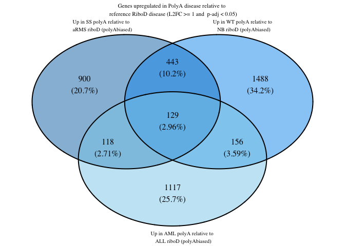

``` r
# up genes in the riboD biased category of ss:arms, wt:nb, aml:all
up_riboDbiased_all <- list(
  "Up in SS riboD relative to aRMS polyA (riboD biased)" = up_arms_ss_riboDbiased$Gene,
  "Up in WT riboD relative to NB polyA (riboD biased)" = up_nb_wt_riboDbiased$Gene,
  "Up in AML riboD relative to ALL polyA (riboD biased)" = up_all_aml_riboDbiased$Gene
)

# write_rds(up_riboDbiased_all, "../../output_data/all_disease_comparisons/up_riboDbiased_all.rds")

up_riboDbiased_all_VD <- venn.diagram(
  x = up_riboDbiased_all,
  category.names = c(
    "Up in SS riboD relative to \n aRMS polyA (riboD biased)",
    "Up in WT riboD relative to \n NB polyA (riboD biased)",
    "Up in AML riboD relative to \n ALL polyA (riboD biased)"
    ),
  filename = NULL, # Save as a rds file
  output = TRUE,
  print.mode = c("raw", "percent"),
  # Customize appearance (optional)
  fill = c("#E69F00", "#ff9b00", "#e6b200"),
  # cat.col = c("#E69F00", "#E69F00", "#E69F00"),
  cex = 1, # Font size for counts
  cat.cex = 0.60, # Font size for category names
  cat.dist = c(0.05, 0.05, 0.05),
  height = 2000,
  width = 2000,
  cat.default.pos = "outer",
  cat.pos = c(-12, 12, 175), 
  main = "Genes upregulated in RiboD disease relative to \n reference PolyA disease (L2FC >= 1 and  p-adj < 0.05)",
  main.cex = 0.70, # Font size for main title
  disable.logging = TRUE
)
```

    INFO [2026-09-02 11:31:48] $x
    INFO [2026-09-02 11:31:48] up_riboDbiased_all
    INFO [2026-09-02 11:31:48] 
    INFO [2026-09-02 11:31:48] $category.names
    INFO [2026-09-02 11:31:48] c("Up in SS riboD relative to \n aRMS polyA (riboD biased)", 
    INFO [2026-09-02 11:31:48]     "Up in WT riboD relative to \n NB polyA (riboD biased)", 
    INFO [2026-09-02 11:31:48]     "Up in AML riboD relative to \n ALL polyA (riboD biased)")
    INFO [2026-09-02 11:31:48] 
    INFO [2026-09-02 11:31:48] $filename
    INFO [2026-09-02 11:31:48] NULL
    INFO [2026-09-02 11:31:48] 
    INFO [2026-09-02 11:31:48] $output
    INFO [2026-09-02 11:31:48] [1] TRUE
    INFO [2026-09-02 11:31:48] 
    INFO [2026-09-02 11:31:48] $print.mode
    INFO [2026-09-02 11:31:48] c("raw", "percent")
    INFO [2026-09-02 11:31:48] 
    INFO [2026-09-02 11:31:48] $fill
    INFO [2026-09-02 11:31:48] c("#E69F00", "#ff9b00", "#e6b200")
    INFO [2026-09-02 11:31:48] 
    INFO [2026-09-02 11:31:48] $cex
    INFO [2026-09-02 11:31:48] [1] 1
    INFO [2026-09-02 11:31:48] 
    INFO [2026-09-02 11:31:48] $cat.cex
    INFO [2026-09-02 11:31:48] [1] 0.6
    INFO [2026-09-02 11:31:48] 
    INFO [2026-09-02 11:31:48] $cat.dist
    INFO [2026-09-02 11:31:48] c(0.05, 0.05, 0.05)
    INFO [2026-09-02 11:31:48] 
    INFO [2026-09-02 11:31:48] $height
    INFO [2026-09-02 11:31:48] [1] 2000
    INFO [2026-09-02 11:31:48] 
    INFO [2026-09-02 11:31:48] $width
    INFO [2026-09-02 11:31:48] [1] 2000
    INFO [2026-09-02 11:31:48] 
    INFO [2026-09-02 11:31:48] $cat.default.pos
    INFO [2026-09-02 11:31:48] [1] "outer"
    INFO [2026-09-02 11:31:48] 
    INFO [2026-09-02 11:31:48] $cat.pos
    INFO [2026-09-02 11:31:48] c(-12, 12, 175)
    INFO [2026-09-02 11:31:48] 
    INFO [2026-09-02 11:31:48] $main
    INFO [2026-09-02 11:31:48] [1] "Genes upregulated in RiboD disease relative to \n reference PolyA disease (L2FC >= 1 and  p-adj < 0.05)"
    INFO [2026-09-02 11:31:48] 
    INFO [2026-09-02 11:31:48] $main.cex
    INFO [2026-09-02 11:31:48] [1] 0.7
    INFO [2026-09-02 11:31:48] 
    INFO [2026-09-02 11:31:48] $disable.logging
    INFO [2026-09-02 11:31:48] [1] TRUE
    INFO [2026-09-02 11:31:48] 

``` r
up_riboDbiased_all_VD
```


``` r
# gene list for the genes in common between all three polyA_biased comparisons
up_polyAbiased_common <- up_arms_ss_polyAbiased %>%
  inner_join(up_nb_wt_polyAbiased, by = "Gene") %>%
  inner_join(up_all_aml_polyAbiased, by = "Gene")
print(nrow(up_polyAbiased_common))
```

    [1] 129

``` r
# gene list for the genes in common between all three riboD_biased comparisons
up_riboDbiased_common <- up_arms_ss_riboDbiased %>%
  inner_join(up_nb_wt_riboDbiased, by = "Gene") %>%
  inner_join(up_all_aml_riboDbiased, by = "Gene")
print(nrow(up_riboDbiased_common))
```

    [1] 580

### Get significant down genes

``` r
# for SS and aRMS
# Filter for genes with a Log2 fold change less than or equal to -1 and have an adjusted p-value less than 0.05
armsPolyA_ssPolyA_less1 <- armsPolyA_ssPolyA %>%
  filter(log2FoldChange <= -1 & padj < 0.05) %>%
  mutate(comparison = "armsPolyA_ssPolyA_less1") %>%
  relocate(comparison)

armsRiboD_ssRiboD_less1 <- armsRiboD_ssRiboD %>%
  filter(log2FoldChange <= -1 & padj < 0.05) %>%
  mutate(comparison = "ARMSriboD_SSriboD_less1") %>%
  relocate(comparison)

armsRiboD_ssPolyA_less1 <- armsRiboD_ssPolyA %>%
  filter(log2FoldChange <= -1 & padj < 0.05) %>%
  mutate(comparison = "ARMSriboD_SSpolyA_less1") %>%
  relocate(comparison)

armsPolyA_ssRiboD_less1 <- armsPolyA_ssRiboD %>%
  filter(log2FoldChange <= -1 & padj < 0.05) %>%
  mutate(comparison = "ARMSpolyA_SSriboD_less1") %>%
  relocate(comparison)
```

``` r
# for WT and NB
# Filter for genes with a Log2 fold change less than or equal to -1 and have an adjusted p-value less than 0.05

nbPolyA_wtPolyA_less1 <- nbPolyA_wtPolyA %>%
  filter(log2FoldChange <= -1 & padj < 0.05) %>%
  mutate(comparison = "NBpolyA_WTpolyA_less1") %>%
  relocate(comparison)

nbRiboD_wtRiboD_less1 <- nbRiboD_wtRiboD %>%
  filter(log2FoldChange <= -1 & padj < 0.05) %>%
  mutate(comparison = "NBriboD_WTriboD_less1") %>%
  relocate(comparison)
 
nbRiboD_wtPolyA_less1 <- nbRiboD_wtPolyA %>%
  filter(log2FoldChange <= -1 & padj < 0.05) %>%
  mutate(comparison = "NBriboD_WTpolyA_less1") %>%
  relocate(comparison)

nbPolyA_wtRiboD_less1 <- nbPolyA_wtRiboD %>%
  filter(log2FoldChange <= -1 & padj < 0.05) %>%
  mutate(comparison = "NBpolyA_WTriboD_less1") %>%
  relocate(comparison)
```

``` r
# for ALL and AML
# Filter for genes with a Log2 fold change less than or equal to 1 and have an adjusted p-value less than 0.05

allPolyA_amlPolyA_less1 <- allPolyA_amlPolyA %>%
  filter(log2FoldChange <= -1 & padj < 0.05) %>%
  mutate(comparison = "ALLpolyA_AMLpolyA_less1") %>%
  relocate(comparison)

allRiboD_amlRiboD_less1 <- allRiboD_amlRiboD %>%
  filter(log2FoldChange <= -1 & padj < 0.05) %>%
  mutate(comparison = "ALLriboD_AMLriboD_less1") %>%
  relocate(comparison)

allRiboD_amlPolyA_less1 <- allRiboD_amlPolyA %>%
  filter(log2FoldChange <= -1 & padj < 0.05) %>%
  mutate(comparison = "ALLriboD_AMLpolyA_less1") %>%
  relocate(comparison)

allPolyA_amlRiboD_less1 <- allPolyA_amlRiboD %>%
  filter(log2FoldChange <= -1 & padj < 0.05) %>%
  mutate(comparison = "ALLpolyA_AMLriboD_less1") %>%
  relocate(comparison)
```

### **Unique gene lists - downregulated**

PolyA biased (in common between the polyAtruth and riboDtruth
comparisons) and RiboD biased (in common between the polyAtruth and
riboDtruth comparisons)

#### **Down in SS relative to aRMS**

``` r
# polyA biased for SS and aRMS comparison
# genes that are uniquely downregulated in ssPolyA relative to armsRiboD (first false)

print(paste("total number of downregulated genes in SS polyA relative to aRMS riboD (polyA biased) is", nrow(armsRiboD_ssPolyA_less1)))
```

    [1] "total number of downregulated genes in SS polyA relative to aRMS riboD (polyA biased) is 10438"

``` r
down_arms_ss_PolyAunbiased_uniquetoPolyAbiased <- armsRiboD_ssPolyA_less1 %>%
  anti_join(armsPolyA_ssPolyA_less1, by = "Gene") %>% # not in polyA unbiased
  anti_join(armsPolyA_ssRiboD_less1, by = "Gene") # not in riboD biased
print(paste("number of genes unique to polyAbiased wrt polyAunbiased and riboDbiased is", nrow(down_arms_ss_PolyAunbiased_uniquetoPolyAbiased)))
```

    [1] "number of genes unique to polyAbiased wrt polyAunbiased and riboDbiased is 4930"

``` r
down_arms_ss_RiboDunbiased_uniquetoPolyAbiased <- armsRiboD_ssPolyA_less1 %>%
  anti_join(armsRiboD_ssRiboD_less1, by = "Gene") %>% # not in riboD unbiased
  anti_join(armsPolyA_ssRiboD_less1, by = "Gene") # not in riboD biased
print(paste("number of genes unique to polyAbiased wrt riboDunbiased and riboDbiased is", nrow(down_arms_ss_RiboDunbiased_uniquetoPolyAbiased)))
```

    [1] "number of genes unique to polyAbiased wrt riboDunbiased and riboDbiased is 5652"

``` r
# need to combine these to get the ones in common between the two venn diagram polyA biased sections
down_arms_ss_polyAbiased <- inner_join(down_arms_ss_PolyAunbiased_uniquetoPolyAbiased, down_arms_ss_RiboDunbiased_uniquetoPolyAbiased, by = "Gene")
print(paste("number of genes in common as unique to PolyA biased is", nrow(down_arms_ss_polyAbiased)))
```

    [1] "number of genes in common as unique to PolyA biased is 4102"

``` r
# write_tsv(down_arms_ss_polyAbiased, "../../output_data/all_disease_comparisons/down_arms_ss_polyAbiased.tsv.gz")
```

``` r
# riboDbiased for SS and aRMS comparison
# genes that are uniquely downregulated in ssRiboD relative to armsPolyA (riboDbiased)
print(paste("total number of genes in riboD biased is", nrow(armsPolyA_ssRiboD_less1)))
```

    [1] "total number of genes in riboD biased is 5711"

``` r
down_arms_ss_polyAunbiased_uniquetoRiboDbiased <- armsPolyA_ssRiboD_less1 %>%
  anti_join(armsPolyA_ssPolyA_less1, by = "Gene") %>%
  anti_join(armsRiboD_ssPolyA_less1, by = "Gene")
print(paste("number of genes unique to riboD biased wrt polyAunbiased is", nrow(down_arms_ss_polyAunbiased_uniquetoRiboDbiased)))
```

    [1] "number of genes unique to riboD biased wrt polyAunbiased is 1859"

``` r
down_arms_ss_riboDunbiased_uniquetoRiboDbiased <- armsPolyA_ssRiboD_less1 %>%
  anti_join(armsRiboD_ssRiboD_less1, by = "Gene") %>%
  anti_join(armsRiboD_ssPolyA_less1, by = "Gene")
print(paste("number of genes unique to riboD biased wrt riboDunbiased is", nrow(down_arms_ss_riboDunbiased_uniquetoRiboDbiased)))
```

    [1] "number of genes unique to riboD biased wrt riboDunbiased is 2500"

``` r
# need to combine these to get the ones in common between the two venn diagram second false sections
down_arms_ss_riboDbiased <- inner_join(down_arms_ss_polyAunbiased_uniquetoRiboDbiased, down_arms_ss_riboDunbiased_uniquetoRiboDbiased, by = "Gene")
print(paste("number of genes unique to riboD biased is", nrow(down_arms_ss_riboDbiased)))
```

    [1] "number of genes unique to riboD biased is 1712"

``` r
# write_tsv(down_arms_ss_riboDbiased, "../../output_data/all_disease_comparisons/down_arms_ss_riboDbiased.tsv.gz")
```

``` r
down_arms_ss_PolyAunbiased_uniquetoPolyAunbiased <- armsPolyA_ssPolyA_less1 %>%
  anti_join(armsRiboD_ssPolyA_less1, by = "Gene") %>% # not in polyA biased
  anti_join(armsPolyA_ssRiboD_less1, by = "Gene") # not in riboD biased
print(paste("number of genes uniquely downregulated in polyA unbiased wrt polyAbiased and riboD biased is", nrow(down_arms_ss_PolyAunbiased_uniquetoPolyAunbiased)))
```

    [1] "number of genes uniquely downregulated in polyA unbiased wrt polyAbiased and riboD biased is 234"

``` r
down_arms_ss_RiboDunbiased_uniquetoRiboDunbiased <- armsRiboD_ssRiboD_less1 %>%
  anti_join(armsRiboD_ssPolyA_less1, by = "Gene") %>% # not in polyA biased
  anti_join(armsPolyA_ssRiboD_less1, by = "Gene") # not in riboD biased
print(paste("number of genes uniquely downregulated in riboD unbiased wrt polyAbiased and riboD biased is", nrow(down_arms_ss_RiboDunbiased_uniquetoRiboDunbiased)))
```

    [1] "number of genes uniquely downregulated in riboD unbiased wrt polyAbiased and riboD biased is 67"

``` r
# are there any genes found to be differentially downregulated in the polyA unbiased and riboD unbiased that are not found in the biased comparisons?
down_arms_ss_polyAunbiased_riboDunbiased <- down_arms_ss_PolyAunbiased_uniquetoPolyAunbiased %>%
  inner_join(down_arms_ss_RiboDunbiased_uniquetoRiboDunbiased, by = "Gene")
print(paste("number of genes in both unique_to_polyAunbiased and unique_to_riboDunbiased is", nrow(down_arms_ss_polyAunbiased_riboDunbiased)))
```

    [1] "number of genes in both unique_to_polyAunbiased and unique_to_riboDunbiased is 12"

#### **Down in WT relative to NB**

``` r
# polyA biased for WT and NB comparison
# genes that are uniquely downregulated in wtPolyA relative to nbRiboD
print(paste("total number of genes in polyA biased is", nrow(nbRiboD_wtPolyA_less1)))
```

    [1] "total number of genes in polyA biased is 11990"

``` r
down_nb_wt_PolyAunbiased_uniquetoPolyAbiased <- nbRiboD_wtPolyA_less1 %>%
  anti_join(nbPolyA_wtPolyA_less1, by = "Gene") %>%
  anti_join(nbPolyA_wtRiboD_less1, by = "Gene")
print(paste("number of genes unique to polyA biased wrt polyA unbiased is", nrow(down_nb_wt_PolyAunbiased_uniquetoPolyAbiased)))
```

    [1] "number of genes unique to polyA biased wrt polyA unbiased is 5536"

``` r
down_nb_wt_RiboDunbiased_uniquetoPolyAbiased <- nbRiboD_wtPolyA_less1 %>%
  anti_join(nbRiboD_wtRiboD_less1, by = "Gene") %>%
  anti_join(nbPolyA_wtRiboD_less1, by = "Gene")
print(paste("number of genes unique to polyA biased wrt riboD unbiased is", nrow(down_nb_wt_RiboDunbiased_uniquetoPolyAbiased)))
```

    [1] "number of genes unique to polyA biased wrt riboD unbiased is 6490"

``` r
# need to combine these to get the ones in common between the two venn diagram polyA biased sections
down_nb_wt_polyAbiased <- inner_join(down_nb_wt_PolyAunbiased_uniquetoPolyAbiased, down_nb_wt_RiboDunbiased_uniquetoPolyAbiased, by = "Gene")

print(paste("number of genes unique to polyA biased is", nrow(down_nb_wt_polyAbiased)))
```

    [1] "number of genes unique to polyA biased is 4553"

``` r
# write_tsv(down_nb_wt_polyAbiased, "../../output_data/all_disease_comparisons/down_nb_wt_polyAbiased.tsv.gz")
```

``` r
# riboD biased for WT and NB comparison
# genes that are uniquely downregulated in wtRiboD relative to nbPolyA (riboD biased)
print(paste("total number of genes in riboD biased is", nrow(nbPolyA_wtRiboD_less1)))
```

    [1] "total number of genes in riboD biased is 6127"

``` r
down_nb_wt_polyAunbiased_uniquetoRiboDbiased <- nbPolyA_wtRiboD_less1 %>%
  anti_join(nbPolyA_wtPolyA_less1, by = "Gene") %>%
  anti_join(nbRiboD_wtPolyA_less1, by = "Gene")
print(paste("number of genes unique to riboD biased wrt polyAunbiased is", nrow(down_nb_wt_polyAunbiased_uniquetoRiboDbiased)))
```

    [1] "number of genes unique to riboD biased wrt polyAunbiased is 1723"

``` r
down_nb_wt_riboDunbiased_uniquetoRiboDbiased <- nbPolyA_wtRiboD_less1 %>%
  anti_join(nbRiboD_wtRiboD_less1, by = "Gene") %>%
  anti_join(nbRiboD_wtPolyA_less1, by = "Gene")
print(paste("number of genes unique to riboD biased wrt riboDunbiased is", nrow(down_nb_wt_riboDunbiased_uniquetoRiboDbiased)))
```

    [1] "number of genes unique to riboD biased wrt riboDunbiased is 2083"

``` r
# need to combine these to get the ones in common between the two venn diagram second false sections
down_nb_wt_riboDbiased <- inner_join(down_nb_wt_polyAunbiased_uniquetoRiboDbiased, down_nb_wt_riboDunbiased_uniquetoRiboDbiased, by = "Gene")

print(paste("number of genes unique to riboD biased is", nrow(down_nb_wt_riboDbiased)))
```

    [1] "number of genes unique to riboD biased is 1361"

``` r
# write_tsv(down_nb_wt_riboDbiased, "../../output_data/all_disease_comparisons/down_nb_wt_riboDbiased.tsv.gz")
```

#### **Down in AML relative to ALL**

``` r
# polyA biased for ALL and AML comparison
# genes that are uniquely downregulated in amlPolyA relative to allRiboD (first false)
print(paste("total number of genes in polyA biased is", nrow(allRiboD_amlPolyA_less1)))
```

    [1] "total number of genes in polyA biased is 6346"

``` r
down_all_aml_PolyAunbiased_uniquetoPolyAbiased <- allRiboD_amlPolyA_less1 %>%
  anti_join(allPolyA_amlPolyA_less1, by = "Gene") %>%
  anti_join(allPolyA_amlRiboD_less1, by = "Gene")
print(paste("number of genes unique to polyA biased wrt polyAunbiased is", nrow(down_all_aml_PolyAunbiased_uniquetoPolyAbiased)))
```

    [1] "number of genes unique to polyA biased wrt polyAunbiased is 3663"

``` r
down_all_aml_RiboDunbiased_uniquetoPolyAbiased <- allRiboD_amlPolyA_less1 %>%
  anti_join(allRiboD_amlRiboD_less1, by = "Gene") %>%
  anti_join(allPolyA_amlRiboD_less1, by = "Gene")
print(paste("number of genes unique to polyA biased wrt riboDunbiased is", nrow(down_all_aml_RiboDunbiased_uniquetoPolyAbiased)))
```

    [1] "number of genes unique to polyA biased wrt riboDunbiased is 3561"

``` r
# need to combine these to get the ones in common between the two venn diagram first false sections
down_all_aml_polyAbiased <- inner_join(down_all_aml_PolyAunbiased_uniquetoPolyAbiased, down_all_aml_RiboDunbiased_uniquetoPolyAbiased, by = "Gene")

print(paste("number of genes unique to polyA biased is", nrow(down_all_aml_polyAbiased)))
```

    [1] "number of genes unique to polyA biased is 2988"

``` r
# write_tsv(down_all_aml_polyAbiased, "../../output_data/all_disease_comparisons/down_all_aml_polyAbiased.tsv.gz")
```

``` r
# riboD biased for ALL and AML comparison
# genes that are uniquely downregulated in amlRiboD relative to allPolyA
print(paste("total number of genes in riboD biased is", nrow(allPolyA_amlRiboD_less1)))
```

    [1] "total number of genes in riboD biased is 4115"

``` r
down_all_aml_polyAunbiased_uniquetoRiboDbiased <- allPolyA_amlRiboD_less1 %>%
  anti_join(allPolyA_amlPolyA_less1, by = "Gene") %>%
  anti_join(allRiboD_amlPolyA_less1, by = "Gene")
print(paste("number of genes unique to riboD biased wrt polyAunbiased is", nrow(down_all_aml_polyAunbiased_uniquetoRiboDbiased)))
```

    [1] "number of genes unique to riboD biased wrt polyAunbiased is 1420"

``` r
down_all_aml_riboDunbiased_uniquetoRiboDbiased <- allPolyA_amlRiboD_less1 %>%
  anti_join(allRiboD_amlRiboD_less1, by = "Gene") %>%
  anti_join(allRiboD_amlPolyA_less1, by = "Gene")
print(paste("number of genes unique to riboD biased wrt riboDunbiased is", nrow(down_all_aml_riboDunbiased_uniquetoRiboDbiased)))
```

    [1] "number of genes unique to riboD biased wrt riboDunbiased is 2064"

``` r
# need to combine these to get the ones in common between the two venn diagram second false sections
down_all_aml_riboDbiased <- inner_join(down_all_aml_polyAunbiased_uniquetoRiboDbiased, down_all_aml_riboDunbiased_uniquetoRiboDbiased, by = "Gene")

print(paste("number of genes unique to riboD biased is", nrow(down_all_aml_riboDbiased)))
```

    [1] "number of genes unique to riboD biased is 1274"

``` r
# write_tsv(down_all_aml_riboDbiased, "../../output_data/all_disease_comparisons/down_all_aml_riboDbiased.tsv.gz")
```

### Venn diagrams

``` r
# down genes in the first false category of ss:arms, wt:nb, aml:all
down_polyAbiased_all <- list(
  "Down SS polyA relative to aRMS riboD (polyA biased)" = down_arms_ss_polyAbiased$Gene,
  "Down in WT polyA relative to NB riboD (polyA biased)" = down_nb_wt_polyAbiased$Gene,
  "Down in AML polyA relative to ALL riboD (polyA biased)" = down_all_aml_polyAbiased$Gene
)

# write_rds(down_polyAbiased_all, "../../output_data/all_disease_comparisons/down_polyAbiased_all.rds")


down_polyAbiased_all_VD <- venn.diagram(
  x = down_polyAbiased_all,
  category.names = c(
    "Down in SS polyA relative to \n aRMS riboD (polyA biased)",
    "Down in WT polyA relative to \n NB riboD (polyA biased)",
    "Down in AML polyA relative to \n ALL riboD (polyA biased)"
    ),
  filename = NULL, # Save as a rds file
  output = TRUE,
  print.mode = c("raw", "percent"),
  # Customize appearance (optional)
  fill = c("#0072B2", "#0098ed", "#87CEEB"),
  # cat.col = c("#0072B2", "#0072B2", "#0072B2"),
  cex = 1, # Font size for counts
  cat.cex = 0.65, # Font size for category names
  cat.dist = c(0.05, 0.05, 0.05),
  height = 2000,
  width = 2000,
  cat.default.pos = "outer",
  cat.pos = c(-12, 12, 175), 
  main = "Genes downregulated in PolyA disease relative to \n reference RiboD disease (L2FC <= -1 and  p-adj < 0.05)",
  main.cex = 0.70, # Font size for main title
  disable.logging = TRUE
)
```

    INFO [2026-09-02 11:31:48] $x
    INFO [2026-09-02 11:31:48] down_polyAbiased_all
    INFO [2026-09-02 11:31:48] 
    INFO [2026-09-02 11:31:48] $category.names
    INFO [2026-09-02 11:31:48] c("Down in SS polyA relative to \n aRMS riboD (polyA biased)", 
    INFO [2026-09-02 11:31:48]     "Down in WT polyA relative to \n NB riboD (polyA biased)", 
    INFO [2026-09-02 11:31:48]     "Down in AML polyA relative to \n ALL riboD (polyA biased)")
    INFO [2026-09-02 11:31:48] 
    INFO [2026-09-02 11:31:48] $filename
    INFO [2026-09-02 11:31:48] NULL
    INFO [2026-09-02 11:31:48] 
    INFO [2026-09-02 11:31:48] $output
    INFO [2026-09-02 11:31:48] [1] TRUE
    INFO [2026-09-02 11:31:48] 
    INFO [2026-09-02 11:31:48] $print.mode
    INFO [2026-09-02 11:31:48] c("raw", "percent")
    INFO [2026-09-02 11:31:48] 
    INFO [2026-09-02 11:31:48] $fill
    INFO [2026-09-02 11:31:48] c("#0072B2", "#0098ed", "#87CEEB")
    INFO [2026-09-02 11:31:48] 
    INFO [2026-09-02 11:31:48] $cex
    INFO [2026-09-02 11:31:48] [1] 1
    INFO [2026-09-02 11:31:48] 
    INFO [2026-09-02 11:31:48] $cat.cex
    INFO [2026-09-02 11:31:48] [1] 0.65
    INFO [2026-09-02 11:31:48] 
    INFO [2026-09-02 11:31:48] $cat.dist
    INFO [2026-09-02 11:31:48] c(0.05, 0.05, 0.05)
    INFO [2026-09-02 11:31:48] 
    INFO [2026-09-02 11:31:48] $height
    INFO [2026-09-02 11:31:48] [1] 2000
    INFO [2026-09-02 11:31:48] 
    INFO [2026-09-02 11:31:48] $width
    INFO [2026-09-02 11:31:48] [1] 2000
    INFO [2026-09-02 11:31:48] 
    INFO [2026-09-02 11:31:48] $cat.default.pos
    INFO [2026-09-02 11:31:48] [1] "outer"
    INFO [2026-09-02 11:31:48] 
    INFO [2026-09-02 11:31:48] $cat.pos
    INFO [2026-09-02 11:31:48] c(-12, 12, 175)
    INFO [2026-09-02 11:31:48] 
    INFO [2026-09-02 11:31:48] $main
    INFO [2026-09-02 11:31:48] [1] "Genes downregulated in PolyA disease relative to \n reference RiboD disease (L2FC <= -1 and  p-adj < 0.05)"
    INFO [2026-09-02 11:31:48] 
    INFO [2026-09-02 11:31:48] $main.cex
    INFO [2026-09-02 11:31:48] [1] 0.7
    INFO [2026-09-02 11:31:48] 
    INFO [2026-09-02 11:31:48] $disable.logging
    INFO [2026-09-02 11:31:48] [1] TRUE
    INFO [2026-09-02 11:31:48] 

``` r
down_polyAbiased_all_VD
```


``` r
# down genes in the second false category of ss:arms, wt:nb, aml:all
down_riboDbiased_all <- list(
  "Down in SS riboD relative to aRMS polyA (second false)" = down_arms_ss_riboDbiased$Gene,
  "Down in WT riboD relative to NB polyA (second false)" = down_nb_wt_riboDbiased$Gene,
  "Down in AML riboD relative to ALL polyA (second false)" = down_all_aml_riboDbiased$Gene
)

# write_rds(down_riboDbiased_all, "../../output_data/all_disease_comparisons/down_riboDbiased_all.rds")


down_riboDbiased_all_VD <- venn.diagram(
  x = down_riboDbiased_all,
  category.names = c(
    "Down in SS riboD relative to \n aRMS polyA (riboD biased)",
    "Down in WT riboD relative to \n NB polyA (riboD biased)",
    "Down in AML riboD relative to \n ALL polyA (riboD biased)"
    ),
  filename = NULL, # Save as a rds file
  output = TRUE,
  print.mode = c("raw", "percent"),
  # Customize appearance (optional)
  fill = c("#E69F00", "#ff9b00", "#e6b200"),
  # cat.col = c("#E69F00", "#E69F00", "#E69F00"),
  cex = 1, # Font size for counts
  cat.cex = 0.60, # Font size for category names
  cat.dist = c(0.05, 0.05, 0.05),
  height = 2000,
  width = 2000,
  cat.default.pos = "outer",
  cat.pos = c(-12, 12, 175), 
  main = "Genes downregulated in RiboD disease relative to \n reference PolyA disease (L2FC <= -1 and  p-adj < 0.05)",
  main.cex = 0.70, # Font size for main title
  disable.logging = TRUE
)
```

    INFO [2026-09-02 11:31:48] $x
    INFO [2026-09-02 11:31:48] down_riboDbiased_all
    INFO [2026-09-02 11:31:48] 
    INFO [2026-09-02 11:31:48] $category.names
    INFO [2026-09-02 11:31:48] c("Down in SS riboD relative to \n aRMS polyA (riboD biased)", 
    INFO [2026-09-02 11:31:48]     "Down in WT riboD relative to \n NB polyA (riboD biased)", 
    INFO [2026-09-02 11:31:48]     "Down in AML riboD relative to \n ALL polyA (riboD biased)")
    INFO [2026-09-02 11:31:48] 
    INFO [2026-09-02 11:31:48] $filename
    INFO [2026-09-02 11:31:48] NULL
    INFO [2026-09-02 11:31:48] 
    INFO [2026-09-02 11:31:48] $output
    INFO [2026-09-02 11:31:48] [1] TRUE
    INFO [2026-09-02 11:31:48] 
    INFO [2026-09-02 11:31:48] $print.mode
    INFO [2026-09-02 11:31:48] c("raw", "percent")
    INFO [2026-09-02 11:31:48] 
    INFO [2026-09-02 11:31:48] $fill
    INFO [2026-09-02 11:31:48] c("#E69F00", "#ff9b00", "#e6b200")
    INFO [2026-09-02 11:31:48] 
    INFO [2026-09-02 11:31:48] $cex
    INFO [2026-09-02 11:31:48] [1] 1
    INFO [2026-09-02 11:31:48] 
    INFO [2026-09-02 11:31:48] $cat.cex
    INFO [2026-09-02 11:31:48] [1] 0.6
    INFO [2026-09-02 11:31:48] 
    INFO [2026-09-02 11:31:48] $cat.dist
    INFO [2026-09-02 11:31:48] c(0.05, 0.05, 0.05)
    INFO [2026-09-02 11:31:48] 
    INFO [2026-09-02 11:31:48] $height
    INFO [2026-09-02 11:31:48] [1] 2000
    INFO [2026-09-02 11:31:48] 
    INFO [2026-09-02 11:31:48] $width
    INFO [2026-09-02 11:31:48] [1] 2000
    INFO [2026-09-02 11:31:48] 
    INFO [2026-09-02 11:31:48] $cat.default.pos
    INFO [2026-09-02 11:31:48] [1] "outer"
    INFO [2026-09-02 11:31:48] 
    INFO [2026-09-02 11:31:48] $cat.pos
    INFO [2026-09-02 11:31:48] c(-12, 12, 175)
    INFO [2026-09-02 11:31:48] 
    INFO [2026-09-02 11:31:48] $main
    INFO [2026-09-02 11:31:48] [1] "Genes downregulated in RiboD disease relative to \n reference PolyA disease (L2FC <= -1 and  p-adj < 0.05)"
    INFO [2026-09-02 11:31:48] 
    INFO [2026-09-02 11:31:48] $main.cex
    INFO [2026-09-02 11:31:48] [1] 0.7
    INFO [2026-09-02 11:31:48] 
    INFO [2026-09-02 11:31:48] $disable.logging
    INFO [2026-09-02 11:31:48] [1] TRUE
    INFO [2026-09-02 11:31:48] 

``` r
down_riboDbiased_all_VD
```

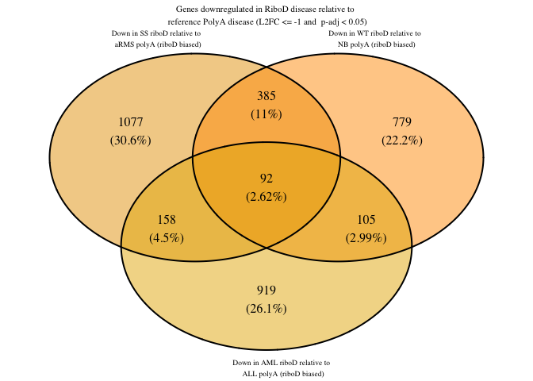

``` r
# gene list for the genes in common between all three polyA biased comparisons
down_polyAbiased_common <- down_arms_ss_polyAbiased %>%
  inner_join(down_nb_wt_polyAbiased, by = "Gene") %>%
  inner_join(down_all_aml_polyAbiased, by = "Gene")
print(nrow(down_polyAbiased_common))
```

    [1] 574

``` r
# gene list for the genes in common between all three riboD biased comparisons
down_riboDbiased_common <- down_arms_ss_riboDbiased %>%
  inner_join(down_nb_wt_riboDbiased, by = "Gene") %>%
  inner_join(down_all_aml_riboDbiased, by = "Gene")
print(nrow(down_riboDbiased_common))
```

    [1] 92

## **Visualizing venn diagram similarities**

### **Up genes in PolyAunbiased v biases**

Taking the venn diagram numbers (proportions of genes in each region)
from DESeq2_results_analysis for each disease comparisons (SS:aRMS,
WT:NB, ALL:AML), visualizing how the regions of the VDs are
similar/different (upregulated genes)

``` r
up_polyAunbiased_vs_biases <- data.frame(
  region  = rep(c("polyA unbiased only", 
                  "polyA biased only", 
                  "riboD biased only",
                  "polyA unbiased & polyA biased",  
                  "polyA unbiased & riboD biased",  
                  "polyA biased & riboD biased",  
                  "polyA unbiased, polyA biased, riboD biased"), times = 3),
  disease_comparison = rep(c("up in SS relative to aRMS", "up in WT relative to NB", "up in AML relative to ALL"), each = 7),
  percentage   = c(
    # up in SS relative to aRMS
    1.37, 15.8, 45.1, 7.63, 12.4, 0.286, 17.4,
    # up in WT relative to NB
    1.6, 19.3, 39.9, 8.72, 15.8, 0.535, 14.1,
    # up in AML relative to ALL
    #5.17,  21.6, 28.7, 11.5, 9.5, 1.56, 22 # these were numbers from Anusha's old samples?
    2.52, 20.1, 24.6, 7.52, 25.1, 0.581, 19.5
  )
)
```

``` r
# Fix region order for the x-axis
up_polyAunbiased_vs_biases$region <- factor(up_polyAunbiased_vs_biases$region,
                      levels = c("polyA unbiased only", 
                                 "polyA biased only", 
                                 "riboD biased only", 
                                 "polyA unbiased & polyA biased",  
                                 "polyA unbiased & riboD biased",  
                                 "polyA biased & riboD biased", 
                                 "polyA unbiased, polyA biased, riboD biased"))
```

``` r
up_polyAunbiased_vs_biases_plot <- ggplot(up_polyAunbiased_vs_biases, aes(x = region, y = percentage, fill = disease_comparison)) +
  geom_col(position = position_dodge(width = 0.75), width = 0.7) +
  geom_text(aes(label = percentage),
            position = position_dodge(width = 0.75),
#            vjust = -0.4, 
            size = 2.8, 
            angle = 90,
            color = "grey30") +
  scale_fill_manual(values = c(
    "up in SS relative to aRMS" = "#f0eca3",
    "up in WT relative to NB" = "#cda5e6",
    "up in AML relative to ALL" = "#a1d6a1"
  )) +
  labs(
    title    = "Venn Diagram Region Percentages  - upregulated polyA unbiased vs biases",
    subtitle = "Each group of bars shows one intersection region across the three disease contexts",
    x        = "Venn Diagram Region",
    y        = "Percentage",
    fill     = "Disease comparison"
  ) +
  theme_minimal(base_size = 11) +
  theme(
    plot.title       = element_text(face = "bold", size = 15, margin = margin(b = 4)),
    plot.subtitle    = element_text(color = "grey45", size = 11, margin = margin(b = 12)),
    axis.text.x      = element_text(angle = 50, hjust = 1),
    panel.grid.major.x = element_blank(), #removes the major vertical grid lines from the plot panel
    legend.position  = "right",
    legend.title     = element_text(face = "bold")
  )

up_polyAunbiased_vs_biases_plot
```

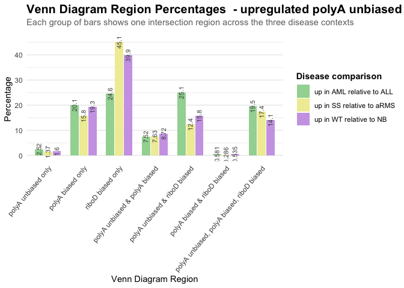

``` r
up_polyAunbiased_vs_biases_plot_bydisease <- ggplot(up_polyAunbiased_vs_biases, aes(x = disease_comparison, y = percentage, fill = region)) +
  geom_col(position = position_stack(), width = 0.7) +
  geom_text(aes(label = percentage),
            position = position_stack(vjust = 0.5),
#            vjust = -0.4,
            size = 2.8,
            color = "black") +
  scale_fill_manual(values = c(
    "polyA unbiased only" = "#BB5566",
    "polyA biased only" = "#0072B2",
    "riboD biased only" = "#E69F00",
    "polyA unbiased & polyA biased" = "#8391b5",
    "polyA unbiased & riboD biased" = "#e2a86c",
    "polyA biased & riboD biased" = "#bfad80",
    "polyA unbiased, polyA biased, riboD biased" = "#b7986a"
  )) +
  labs(
    title    = "Percentage of upregulated genes in each region - polyA unbiased vs biases",
    subtitle = "Each bar shows the percentage of genes in each \nvenn diagram region for a given disease comparison",
    x        = "Disease comparison",
    y        = "Percentage",
    fill     = "Venn diagram region"
  ) +
  theme_minimal(base_size = 11) +
  theme(
    plot.title       = element_text(face = "bold", 
                                    size = 15,
                                    margin = margin(b = 4)),
    plot.subtitle    = element_text(color = "grey45", size = 11, margin = margin(b = 12)),
    axis.text.x      = element_text(angle = 50, hjust = 1),
    panel.grid.major.x = element_blank(), #removes the major vertical grid lines from the plot panel
    legend.position  = "right",
    legend.title     = element_text(face = "bold")
  )

up_polyAunbiased_vs_biases_plot_bydisease
```

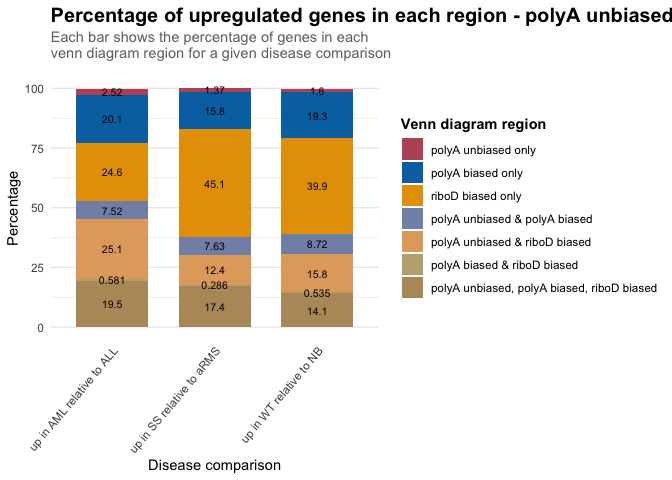

### **Up genes in riboD unbiased v biases**

``` r
up_riboDunbiased_vs_biases <- data.frame(
  region  = rep(c("riboD unbiased only", 
                  "polyA biased only", 
                  "riboD biased only",
                  "riboD unbiased & polyA biased",
                  "riboD unbiased & riboD biased",  
                  "polyA biased & riboD biased",  
                  "riboD unbiased, polyA biased, riboD biased"), times = 3),
  disease_comparison = rep(c("up in SS relative to aRMS", "up in WT relative to NB", "up in AML relative to ALL"), each = 7),
  percentage   = c(
    # up in SS relative to aRMS
    0.962, 17.2, 48.4, 6.31, 9.32, 1.29, 16.5,
    # up in WT relative to NB
    1.2, 21.8, 46.6, 6.33, 9.33, 1.49, 13.2,
    # up in AML relative to ALL
    #4.53, 24.3, 29.5, 9.02, 8.95, 1.84, 21.8 - according to Anusha's old samples?
    1.25, 19, 44.4, 8.97, 5.99, 3.06, 17.3
  )
)
```

``` r
# Fix region order for the x-axis
up_riboDunbiased_vs_biases$region <- factor(up_riboDunbiased_vs_biases$region,
                      levels = c("riboD unbiased only", 
                                 "polyA biased only", 
                                 "riboD biased only", 
                                 "riboD unbiased & polyA biased",  
                                 "riboD unbiased & riboD biased",  
                                 "polyA biased & riboD biased", 
                                 "riboD unbiased, polyA biased, riboD biased"))
```

``` r
up_riboDunbiased_vs_biases_plot <- ggplot(up_riboDunbiased_vs_biases, aes(x = region, y = percentage, fill = disease_comparison)) +
  geom_col(position = position_dodge(width = 0.75), width = 0.7) +
  geom_text(aes(label = percentage),
            position = position_dodge(width = 0.75),
#            vjust = -0.4, 
            size = 2.8, 
            angle = 90,
            color = "grey30") +
  scale_fill_manual(values = c(
    "up in SS relative to aRMS" = "#f0eca3",
    "up in WT relative to NB" = "#cda5e6",
    "up in AML relative to ALL" = "#a1d6a1"
  )) +
  labs(
    title    = "Venn Diagram Region Percentages - upregulated riboD unbiased vs biases",
    subtitle = "Each group of bars shows one intersection region across the three disease contexts",
    x        = "Venn Diagram Region",
    y        = "Percentage",
    fill     = "Disease comparison"
  ) +
  theme_minimal(base_size = 11) +
  theme(
    plot.title       = element_text(face = "bold", size = 15, margin = margin(b = 4)),
    plot.subtitle    = element_text(color = "grey45", size = 11, margin = margin(b = 12)),
    axis.text.x      = element_text(angle = 50, hjust = 1),
    panel.grid.major.x = element_blank(), #removes the major vertical grid lines from the plot panel
    legend.position  = "right",
    legend.title     = element_text(face = "bold")
  )

up_riboDunbiased_vs_biases_plot
```

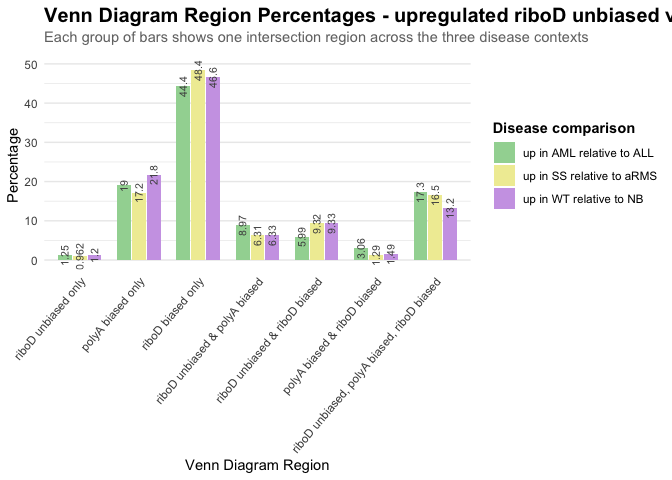

``` r
up_riboDunbiased_vs_biases_plot_bydisease <- ggplot(up_riboDunbiased_vs_biases, aes(x = disease_comparison, y = percentage, fill = region)) +
  geom_col(position = position_stack(), width = 0.7) +
  geom_text(aes(label = percentage),
            position = position_stack(vjust = 0.5),
#            vjust = -0.4,
            size = 2.8,
            color = "black") +
  scale_fill_manual(values = c(
    "riboD unbiased only" = "#BB5566",
    "polyA biased only" = "#0072B2",
    "riboD biased only" = "#E69F00",
    "riboD unbiased & polyA biased" = "#8391b5",
    "riboD unbiased & riboD biased" = "#e2a86c",
    "polyA biased & riboD biased" = "#bfad80",
    "riboD unbiased, polyA biased, riboD biased" = "#b7986a"
  )) +
  labs(
    title    = "Percentage of upregulated genes in each region - riboD unbiased vs biases",
    subtitle = "Each bar shows the percentage of genes in each \nvenn diagram region for a given disease comparison",
    x        = "Disease comparison",
    y        = "Percentage",
    fill     = "Venn diagram region"
  ) +
  theme_minimal(base_size = 11) +
  theme(
    plot.title       = element_text(face = "bold", 
                                    size = 15,
                                    margin = margin(b = 4)),
    plot.subtitle    = element_text(color = "grey45", size = 11, margin = margin(b = 12)),
    axis.text.x      = element_text(angle = 50, hjust = 1),
    panel.grid.major.x = element_blank(), #removes the major vertical grid lines from the plot panel
    legend.position  = "right",
    legend.title     = element_text(face = "bold")
  )

up_riboDunbiased_vs_biases_plot_bydisease
```


### **Down genes in PolyAunbiased v biases**

Taking the venn diagram numbers (proportions of genes in each region)
from DESeq2_results_analysis for each disease comparisons (SS:aRMS,
WT:NB, ALL:AML), visualizing how the regions of the VDs are
similar/different (upregulated genes)

``` r
down_polyAunbiased_vs_biases <- data.frame(
  region  = rep(c("polyA unbiased only", 
                  "polyA biased only", 
                  "riboD biased only",
                  "polyA unbiased & polyA biased",  
                  "polyA unbiased & riboD biased",  
                  "polyA biased & riboD biased",  
                  "polyA unbiased, polyA biased, riboD biased"), times = 3),
  disease_comparison = rep(c("up in SS relative to aRMS", "up in WT relative to NB", "up in AML relative to ALL"), each = 7),
  percentage   = c(
    # down in SS relative to aRMS
    1.72, 36.2, 13.7, 20.1, 7.92, 0.448, 19.9,
    # down in WT relative to NB
    2.84, 35.2, 11.6, 20, 7.69, 0.472, 22.2,
    # down in AML relative to ALL
    3.17, 40.9, 15.3, 11.3, 11, 0.603, 17.7
  )
)
```

``` r
# Fix region order for the x-axis
down_polyAunbiased_vs_biases$region <- factor(down_polyAunbiased_vs_biases$region,
                      levels = c("polyA unbiased only", 
                                 "polyA biased only", 
                                 "riboD biased only", 
                                 "polyA unbiased & polyA biased",  
                                 "polyA unbiased & riboD biased",  
                                 "polyA biased & riboD biased", 
                                 "polyA unbiased, polyA biased, riboD biased"))
```

``` r
down_polyAunbiased_vs_biases_plot <- ggplot(down_polyAunbiased_vs_biases, aes(x = region, y = percentage, fill = disease_comparison)) +
  geom_col(position = position_dodge(width = 0.75), width = 0.7) +
  geom_text(aes(label = percentage),
            position = position_dodge(width = 0.75),
#            vjust = -0.4, 
            size = 2.8, 
            angle = 90,
            color = "grey30") +
  scale_fill_manual(values = c(
    "up in SS relative to aRMS" = "#f0eca3",
    "up in WT relative to NB" = "#cda5e6",
    "up in AML relative to ALL" = "#a1d6a1"
  )) +
  labs(
    title    = "Venn Diagram Region Percentages  - downregulated polyA unbiased vs biases",
    subtitle = "Each group of bars shows one intersection region across the three disease contexts",
    x        = "Venn Diagram Region",
    y        = "Percentage",
    fill     = "Disease comparison"
  ) +
  theme_minimal(base_size = 11) +
  theme(
    plot.title       = element_text(face = "bold", size = 15, margin = margin(b = 4)),
    plot.subtitle    = element_text(color = "grey45", size = 11, margin = margin(b = 12)),
    axis.text.x      = element_text(angle = 50, hjust = 1),
    panel.grid.major.x = element_blank(), #removes the major vertical grid lines from the plot panel
    legend.position  = "right",
    legend.title     = element_text(face = "bold")
  )
down_polyAunbiased_vs_biases_plot
```

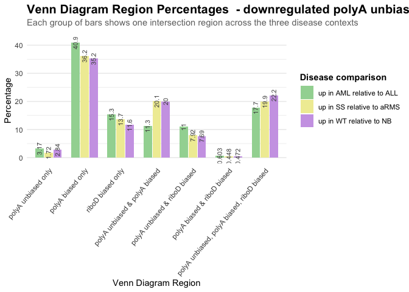

``` r
down_polyAunbiased_vs_biases_plot_bydisease <- ggplot(down_polyAunbiased_vs_biases, aes(x = disease_comparison, y = percentage, fill = region)) +
  geom_col(position = position_stack(), width = 0.7) +
  geom_text(aes(label = percentage),
            position = position_stack(vjust = 0.5),
#            vjust = -0.4,
            size = 2.8,
            color = "black") +
  scale_fill_manual(values = c(
    "polyA unbiased only" = "#BB5566",
    "polyA biased only" = "#0072B2",
    "riboD biased only" = "#E69F00",
    "polyA unbiased & polyA biased" = "#8391b5",
    "polyA unbiased & riboD biased" = "#e2a86c",
    "polyA biased & riboD biased" = "#bfad80",
    "polyA unbiased, polyA biased, riboD biased" = "#b7986a"
  )) +
  labs(
    title    = "Percentage of downregulated genes in each region - polyA unbiased vs biases",
    subtitle = "Each bar shows the percentage of genes in each \nvenn diagram region for a given disease comparison",
    x        = "Disease comparison",
    y        = "Percentage",
    fill     = "Venn diagram region"
  ) +
  theme_minimal(base_size = 11) +
  theme(
    plot.title       = element_text(face = "bold", 
                                    size = 15,
                                    margin = margin(b = 4)),
    plot.subtitle    = element_text(color = "grey45", size = 11, margin = margin(b = 12)),
    axis.text.x      = element_text(angle = 50, hjust = 1),
    panel.grid.major.x = element_blank(), #removes the major vertical grid lines from the plot panel
    legend.position  = "right",
    legend.title     = element_text(face = "bold")
  )

down_polyAunbiased_vs_biases_plot_bydisease
```

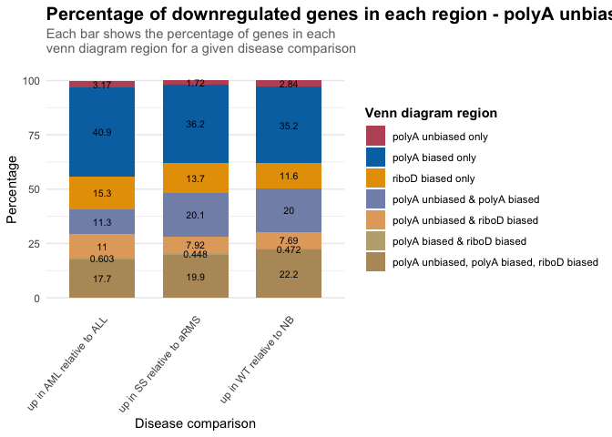

### **Down genes in riboD unbiased v biases**

``` r
down_riboDunbiased_vs_biases <- data.frame(
  region  = rep(c("riboD unbiased only", 
                  "polyA biased only", 
                  "riboD biased only",
                  "riboD unbiased & polyA biased",
                  "riboD unbiased & riboD biased",  
                  "polyA biased & riboD biased",  
                  "riboD unbiased, polyA biased, riboD biased"), times = 3),
  disease_comparison = rep(c("up in SS relative to aRMS", "up in WT relative to NB", "up in AML relative to ALL"), each = 7),
  percentage   = c(
    # down in SS relative to aRMS
    0.498, 42, 18.6, 15, 3.25, 2.3, 18.3,
    # down in WT relative to NB
    1.02, 42.5, 14.9, 13.7, 4.76, 2.44, 20.6,
    # down in AML relative to ALL
    1.78, 40.5, 23.2, 12.5, 3.46, 1.55, 17.1
  )
)
```

``` r
# Fix region order for the x-axis
down_riboDunbiased_vs_biases$region <- factor(down_riboDunbiased_vs_biases$region,
                      levels = c("riboD unbiased only", 
                                 "polyA biased only", 
                                 "riboD biased only", 
                                 "riboD unbiased & polyA biased",  
                                 "riboD unbiased & riboD biased",  
                                 "polyA biased & riboD biased", 
                                 "riboD unbiased, polyA biased, riboD biased"))
```

``` r
down_riboDunbiased_vs_biases_plot <- ggplot(down_riboDunbiased_vs_biases, aes(x = region, y = percentage, fill = disease_comparison)) +
  geom_col(position = position_dodge(width = 0.75), width = 0.7) +
  geom_text(aes(label = percentage),
            position = position_dodge(width = 0.75),
#            vjust = -0.4, 
            size = 2.8, 
            angle = 90,
            color = "grey30") +
  scale_fill_manual(values = c(
    "up in SS relative to aRMS" = "#f0eca3",
    "up in WT relative to NB" = "#cda5e6",
    "up in AML relative to ALL" = "#a1d6a1"
  )) +
  labs(
    title    = "Venn Diagram Region Percentages - downregulated riboD unbiased vs biases",
    subtitle = "Each group of bars shows one intersection region across the three disease contexts",
    x        = "Venn Diagram Region",
    y        = "Percentage",
    fill     = "Disease comparison"
  ) +
  theme_minimal(base_size = 11) +
  theme(
    plot.title       = element_text(face = "bold", size = 15, margin = margin(b = 4)),
    plot.subtitle    = element_text(color = "grey45", size = 11, margin = margin(b = 12)),
    axis.text.x      = element_text(angle = 50, hjust = 1),
    panel.grid.major.x = element_blank(), #removes the major vertical grid lines from the plot panel
    legend.position  = "right",
    legend.title     = element_text(face = "bold")
  )

down_riboDunbiased_vs_biases_plot
```

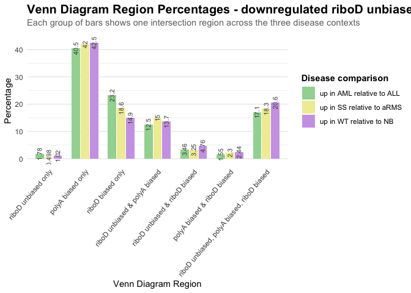

``` r
down_riboDunbiased_vs_biases_plot_bydisease <- ggplot(down_riboDunbiased_vs_biases, aes(x = disease_comparison, y = percentage, fill = region)) +
  geom_col(position = position_stack(), width = 0.7) +
  geom_text(aes(label = percentage),
            position = position_stack(vjust = 0.5),
#            vjust = -0.4,
            size = 2.8,
            color = "black") +
  scale_fill_manual(values = c(
    "riboD unbiased only" = "#BB5566",
    "polyA biased only" = "#0072B2",
    "riboD biased only" = "#E69F00",
    "riboD unbiased & polyA biased" = "#8391b5",
    "riboD unbiased & riboD biased" = "#e2a86c",
    "polyA biased & riboD biased" = "#bfad80",
    "riboD unbiased, polyA biased, riboD biased" = "#b7986a"
  )) +
  labs(
    title    = "Percentage of downregulated genes in each region - riboD unbiased vs biases",
    subtitle = "Each bar shows the percentage of genes in each \nvenn diagram region for a given disease comparison",
    x        = "Disease comparison",
    y        = "Percentage",
    fill     = "Venn diagram region"
  ) +
  theme_minimal(base_size = 11) +
  theme(
    plot.title       = element_text(face = "bold", 
                                    size = 15,
                                    margin = margin(b = 4)),
    plot.subtitle    = element_text(color = "grey45", size = 11, margin = margin(b = 12)),
    axis.text.x      = element_text(angle = 50, hjust = 1),
    panel.grid.major.x = element_blank(), #removes the major vertical grid lines from the plot panel
    legend.position  = "right",
    legend.title     = element_text(face = "bold")
  )
down_riboDunbiased_vs_biases_plot_bydisease
```

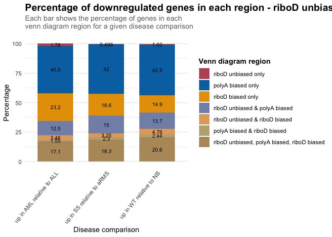

### Misc Analysis

Interested in knowing how many DEGs are unique across all 4 comparisons
(polyA unbiased, riboD unbiased, polyA biased, and riboD biased).

#### aRMS v SS - Up DEGS across all 4 comparisons

``` r
aRMS_SS_up_list <- list(armsPolyA_ssPolyA_great1, armsRiboD_ssRiboD_great1, armsPolyA_ssRiboD_great1, armsRiboD_ssPolyA_great1)

aRMS_SS_up_genes <- aRMS_SS_up_list %>%
  bind_rows() %>%
  summarize(distinct_genes = unique(Gene))
```

    Warning: Returning more (or less) than 1 row per `summarise()` group was deprecated in
    dplyr 1.1.0.
    ℹ Please use `reframe()` instead.
    ℹ When switching from `summarise()` to `reframe()`, remember that `reframe()`
      always returns an ungrouped data frame and adjust accordingly.

``` r
print(aRMS_SS_up_genes %>% nrow())
```

    [1] 12012

``` r
# genes unique to each comparison across all 4 comparisons

#polyA_unbiased
aRMS_SS_up_polyAunbiased_unique_v_all <- armsPolyA_ssPolyA_great1 %>%
  anti_join(armsRiboD_ssRiboD_great1, by = "Gene") %>%
  anti_join(armsPolyA_ssRiboD_great1, by = "Gene") %>%
  anti_join(armsRiboD_ssPolyA_great1, by = "Gene")
print(armsPolyA_ssPolyA_great1 %>% nrow())
```

    [1] 4622

``` r
print(aRMS_SS_up_polyAunbiased_unique_v_all %>% nrow())
```

    [1] 161

``` r
#riboD_unbiased
aRMS_SS_up_riboDunbiased_unique_v_all <- armsRiboD_ssRiboD_great1 %>%
  anti_join(armsPolyA_ssPolyA_great1, by = "Gene") %>%
  anti_join(armsPolyA_ssRiboD_great1, by = "Gene") %>%
  anti_join(armsRiboD_ssPolyA_great1, by = "Gene")
print(armsRiboD_ssRiboD_great1 %>% nrow())
```

    [1] 3921

``` r
print(aRMS_SS_up_riboDunbiased_unique_v_all %>% nrow())
```

    [1] 112

``` r
#polyA_biased
aRMS_SS_up_polyAbiased_unique_v_all <- armsRiboD_ssPolyA_great1 %>%
  anti_join(armsPolyA_ssPolyA_great1, by = "Gene") %>%
  anti_join(armsRiboD_ssRiboD_great1, by = "Gene") %>%
  anti_join(armsPolyA_ssRiboD_great1, by = "Gene") 
print(armsRiboD_ssPolyA_great1 %>% nrow())
```

    [1] 4894

``` r
print(aRMS_SS_up_polyAbiased_unique_v_all %>% nrow())
```

    [1] 1590

``` r
#riboD_biased
aRMS_SS_up_riboDbiased_unique_v_all <- armsPolyA_ssRiboD_great1 %>%
  anti_join(armsPolyA_ssPolyA_great1, by = "Gene") %>%
  anti_join(armsRiboD_ssRiboD_great1, by = "Gene") %>%
  anti_join(armsRiboD_ssPolyA_great1, by = "Gene") 
print(armsPolyA_ssRiboD_great1 %>% nrow())
```

    [1] 8951

``` r
print(aRMS_SS_up_riboDbiased_unique_v_all %>% nrow())
```

    [1] 4864

4-part venn diagram

``` r
g1_aRMS_SS_up = armsPolyA_ssPolyA_great1$Gene
g2_aRMS_SS_up = armsRiboD_ssRiboD_great1$Gene
g3_aRMS_SS_up = armsRiboD_ssPolyA_great1$Gene
g4_aRMS_SS_up = armsPolyA_ssRiboD_great1$Gene

grid.newpage()
draw.quad.venn(
  area1 = length(g1_aRMS_SS_up), 
  area2 = length(g2_aRMS_SS_up), 
  area3 = length(g3_aRMS_SS_up), 
  area4 = length(g4_aRMS_SS_up),
  n12 = length(intersect(g1_aRMS_SS_up, g2_aRMS_SS_up)), 
  n13 = length(intersect(g1_aRMS_SS_up, g3_aRMS_SS_up)), 
  n14 = length(intersect(g1_aRMS_SS_up, g4_aRMS_SS_up)),
  n23 = length(intersect(g2_aRMS_SS_up, g3_aRMS_SS_up)), 
  n24 = length(intersect(g2_aRMS_SS_up, g4_aRMS_SS_up)), 
  n34 = length(intersect(g3_aRMS_SS_up, g4_aRMS_SS_up)),
  n123 = length(intersect(intersect(g1_aRMS_SS_up, g2_aRMS_SS_up), g3_aRMS_SS_up)),
  n124 = length(intersect(intersect(g1_aRMS_SS_up, g2_aRMS_SS_up), g4_aRMS_SS_up)),
  n134 = length(intersect(intersect(g1_aRMS_SS_up, g3_aRMS_SS_up), g4_aRMS_SS_up)),
  n234 = length(intersect(intersect(g2_aRMS_SS_up, g3_aRMS_SS_up), g4_aRMS_SS_up)),
  n1234 = length(intersect(intersect(intersect(g1_aRMS_SS_up, g2_aRMS_SS_up), g3_aRMS_SS_up), g4_aRMS_SS_up)),
  category = c("PolyA unbiased", "RiboD unbiased", "PolyA biased", "RiboD biased"),
  fill = c("#BB5566", "#D55E00", "#0072B2", "#E69F00"),
  print.mode = c("raw", "percent")
)
```


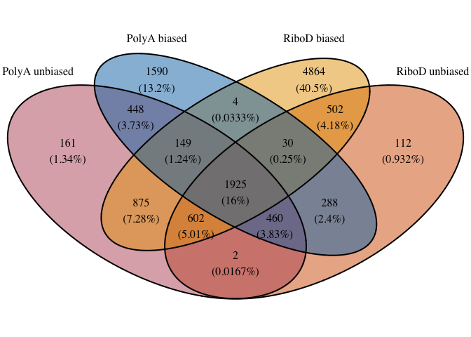

#### aRMS v SS - Down DEGS across all 4 comparisons

``` r
aRMS_SS_down_list <- list(armsPolyA_ssPolyA_less1, armsRiboD_ssRiboD_less1, armsPolyA_ssRiboD_less1, armsRiboD_ssPolyA_less1)

aRMS_SS_down_genes <- aRMS_SS_down_list %>%
  bind_rows() %>%
  summarize(distinct_genes = unique(Gene))
```

    Warning: Returning more (or less) than 1 row per `summarise()` group was deprecated in
    dplyr 1.1.0.
    ℹ Please use `reframe()` instead.
    ℹ When switching from `summarise()` to `reframe()`, remember that `reframe()`
      always returns an ungrouped data frame and adjust accordingly.

``` r
print(aRMS_SS_down_genes %>% nrow())
```

    [1] 13664

``` r
# genes unique to each comparison across all 4 comparisons

#polyA_unbiased
aRMS_SS_down_polyAunbiased_unique_v_all <- armsPolyA_ssPolyA_less1 %>%
  anti_join(armsRiboD_ssRiboD_less1, by = "Gene") %>%
  anti_join(armsPolyA_ssRiboD_less1, by = "Gene") %>%
  anti_join(armsRiboD_ssPolyA_less1, by = "Gene")
print(armsPolyA_ssPolyA_less1 %>% nrow())
```

    [1] 6759

``` r
print(aRMS_SS_down_polyAunbiased_unique_v_all %>% nrow())
```

    [1] 222

``` r
#riboD_unbiased
aRMS_SS_down_riboDunbiased_unique_v_all <- armsRiboD_ssRiboD_less1 %>%
  anti_join(armsPolyA_ssPolyA_less1, by = "Gene") %>%
  anti_join(armsPolyA_ssRiboD_less1, by = "Gene") %>%
  anti_join(armsRiboD_ssPolyA_less1, by = "Gene")
print(armsRiboD_ssRiboD_less1 %>% nrow())
```

    [1] 4981

``` r
print(aRMS_SS_down_riboDunbiased_unique_v_all %>% nrow())
```

    [1] 55

``` r
#polyA_biased
aRMS_SS_down_polyAbiased_unique_v_all <- armsRiboD_ssPolyA_less1 %>%
  anti_join(armsPolyA_ssPolyA_less1, by = "Gene") %>%
  anti_join(armsRiboD_ssRiboD_less1, by = "Gene") %>%
  anti_join(armsPolyA_ssRiboD_less1, by = "Gene") 
print(armsRiboD_ssPolyA_less1 %>% nrow())
```

    [1] 10438

``` r
print(aRMS_SS_down_polyAbiased_unique_v_all %>% nrow())
```

    [1] 4102

``` r
#riboD_biased
aRMS_SS_down_riboDbiased_unique_v_all <- armsPolyA_ssRiboD_less1 %>%
  anti_join(armsPolyA_ssPolyA_less1, by = "Gene") %>%
  anti_join(armsRiboD_ssRiboD_less1, by = "Gene") %>%
  anti_join(armsRiboD_ssPolyA_less1, by = "Gene") 
print(armsPolyA_ssRiboD_less1 %>% nrow())
```

    [1] 5711

``` r
print(aRMS_SS_down_riboDbiased_unique_v_all %>% nrow())
```

    [1] 1712

``` r
g1_aRMS_SS_down = armsPolyA_ssPolyA_less1$Gene
g2_aRMS_SS_down = armsRiboD_ssRiboD_less1$Gene
g3_aRMS_SS_down = armsRiboD_ssPolyA_less1$Gene
g4_aRMS_SS_down = armsPolyA_ssRiboD_less1$Gene


grid.newpage()
draw.quad.venn(
  area1 = length(g1_aRMS_SS_down), 
  area2 = length(g2_aRMS_SS_down), 
  area3 = length(g3_aRMS_SS_down), 
  area4 = length(g4_aRMS_SS_down),
  n12 = length(intersect(g1_aRMS_SS_down, g2_aRMS_SS_down)), 
  n13 = length(intersect(g1_aRMS_SS_down, g3_aRMS_SS_down)), 
  n14 = length(intersect(g1_aRMS_SS_down, g4_aRMS_SS_down)),
  n23 = length(intersect(g2_aRMS_SS_down, g3_aRMS_SS_down)), 
  n24 = length(intersect(g2_aRMS_SS_down, g4_aRMS_SS_down)), 
  n34 = length(intersect(g3_aRMS_SS_down, g4_aRMS_SS_down)),
  n123 = length(intersect(intersect(g1_aRMS_SS_down, g2_aRMS_SS_down), g3_aRMS_SS_down)),
  n124 = length(intersect(intersect(g1_aRMS_SS_down, g2_aRMS_SS_down), g4_aRMS_SS_down)),
  n134 = length(intersect(intersect(g1_aRMS_SS_down, g3_aRMS_SS_down), g4_aRMS_SS_down)),
  n234 = length(intersect(intersect(g2_aRMS_SS_down, g3_aRMS_SS_down), g4_aRMS_SS_down)),
  n1234 = length(intersect(intersect(intersect(g1_aRMS_SS_down, g2_aRMS_SS_down), g3_aRMS_SS_down), g4_aRMS_SS_down)),
  category = c("PolyA unbiased", "RiboD unbiased", "PolyA biased", "RiboD biased"),
  fill = c("#BB5566", "#D55E00", "#0072B2", "#E69F00"),
  print.mode = c("raw", "percent")
)
```


#### NB v WT - Up DEGS across all 4 comparisons

``` r
NB_WT_up_list <- list(nbPolyA_wtPolyA_great1, nbRiboD_wtRiboD_great1, nbPolyA_wtRiboD_great1, nbRiboD_wtPolyA_great1)

NB_WT_up_genes <- NB_WT_up_list %>%
  bind_rows() %>%
  summarize(distinct_genes = unique(Gene))
```

    Warning: Returning more (or less) than 1 row per `summarise()` group was deprecated in
    dplyr 1.1.0.
    ℹ Please use `reframe()` instead.
    ℹ When switching from `summarise()` to `reframe()`, remember that `reframe()`
      always returns an ungrouped data frame and adjust accordingly.

``` r
print(NB_WT_up_genes %>% nrow())
```

    [1] 13981

``` r
# genes unique to each comparison across all 4 comparisons

#polyA_unbiased
NB_WT_up_polyAunbiased_unique_v_all <- nbPolyA_wtPolyA_great1 %>%
  anti_join(nbRiboD_wtRiboD_great1, by = "Gene") %>%
  anti_join(nbPolyA_wtRiboD_great1, by = "Gene") %>%
  anti_join(nbRiboD_wtPolyA_great1, by = "Gene")
print(nbPolyA_wtPolyA_great1 %>% nrow())
```

    [1] 5557

``` r
print(NB_WT_up_polyAunbiased_unique_v_all %>% nrow())
```

    [1] 194

``` r
#riboD_unbiased
NB_WT_up_riboDunbiased_unique_v_all <- nbRiboD_wtRiboD_great1 %>%
  anti_join(nbPolyA_wtPolyA_great1, by = "Gene") %>%
  anti_join(nbPolyA_wtRiboD_great1, by = "Gene") %>%
  anti_join(nbRiboD_wtPolyA_great1, by = "Gene")
print(nbRiboD_wtRiboD_great1 %>% nrow())
```

    [1] 4144

``` r
print(NB_WT_up_riboDunbiased_unique_v_all %>% nrow())
```

    [1] 150

``` r
#polyA_biased
NB_WT_up_polyAbiased_unique_v_all <- nbRiboD_wtPolyA_great1 %>%
  anti_join(nbPolyA_wtPolyA_great1, by = "Gene") %>%
  anti_join(nbRiboD_wtRiboD_great1, by = "Gene") %>%
  anti_join(nbPolyA_wtRiboD_great1, by = "Gene") 
print(nbRiboD_wtPolyA_great1 %>% nrow())
```

    [1] 5907

``` r
print(NB_WT_up_polyAbiased_unique_v_all %>% nrow())
```

    [1] 2216

``` r
#riboD_biased
NB_WT_up_riboDbiased_unique_v_all <- nbPolyA_wtRiboD_great1 %>%
  anti_join(nbPolyA_wtPolyA_great1, by = "Gene") %>%
  anti_join(nbRiboD_wtRiboD_great1, by = "Gene") %>%
  anti_join(nbRiboD_wtPolyA_great1, by = "Gene") 
print(nbPolyA_wtRiboD_great1 %>% nrow())
```

    [1] 9793

``` r
print(NB_WT_up_riboDbiased_unique_v_all %>% nrow())
```

    [1] 4934

``` r
g1_NB_WT_up = nbPolyA_wtPolyA_great1$Gene
g2_NB_WT_up = nbRiboD_wtRiboD_great1$Gene
g3_NB_WT_up = nbRiboD_wtPolyA_great1$Gene
g4_NB_WT_up = nbPolyA_wtRiboD_great1$Gene


grid.newpage()
draw.quad.venn(
  area1 = length(g1_NB_WT_up), 
  area2 = length(g2_NB_WT_up), 
  area3 = length(g3_NB_WT_up), 
  area4 = length(g4_NB_WT_up),
  n12 = length(intersect(g1_NB_WT_up, g2_NB_WT_up)), 
  n13 = length(intersect(g1_NB_WT_up, g3_NB_WT_up)), 
  n14 = length(intersect(g1_NB_WT_up, g4_NB_WT_up)),
  n23 = length(intersect(g2_NB_WT_up, g3_NB_WT_up)), 
  n24 = length(intersect(g2_NB_WT_up, g4_NB_WT_up)), 
  n34 = length(intersect(g3_NB_WT_up, g4_NB_WT_up)),
  n123 = length(intersect(intersect(g1_NB_WT_up, g2_NB_WT_up), g3_NB_WT_up)),
  n124 = length(intersect(intersect(g1_NB_WT_up, g2_NB_WT_up), g4_NB_WT_up)),
  n134 = length(intersect(intersect(g1_NB_WT_up, g3_NB_WT_up), g4_NB_WT_up)),
  n234 = length(intersect(intersect(g2_NB_WT_up, g3_NB_WT_up), g4_NB_WT_up)),
  n1234 = length(intersect(intersect(intersect(g1_NB_WT_up, g2_NB_WT_up), g3_NB_WT_up), g4_NB_WT_up)),
  category = c("PolyA unbiased", "RiboD unbiased", "PolyA biased", "RiboD biased"),
  fill = c("#BB5566", "#D55E00", "#0072B2", "#E69F00"),
  print.mode = c("raw", "percent")
)
```


#### NB v WT - Down DEGS across all 4 comparisons

``` r
NB_WT_down_list <- list(nbPolyA_wtPolyA_less1, nbRiboD_wtRiboD_less1, nbPolyA_wtRiboD_less1, nbRiboD_wtPolyA_less1)

NB_WT_down_genes <- NB_WT_down_list %>%
  bind_rows() %>%
  summarize(distinct_genes = unique(Gene))
```

    Warning: Returning more (or less) than 1 row per `summarise()` group was deprecated in
    dplyr 1.1.0.
    ℹ Please use `reframe()` instead.
    ℹ When switching from `summarise()` to `reframe()`, remember that `reframe()`
      always returns an ungrouped data frame and adjust accordingly.

``` r
print(NB_WT_down_genes %>% nrow())
```

    [1] 15370

``` r
# genes unique to each comparison across all 4 comparisons

#polyA_unbiased
NB_WT_down_polyAunbiased_unique_v_all <- nbPolyA_wtPolyA_less1 %>%
  anti_join(nbRiboD_wtRiboD_less1, by = "Gene") %>%
  anti_join(nbPolyA_wtRiboD_less1, by = "Gene") %>%
  anti_join(nbRiboD_wtPolyA_less1, by = "Gene")
print(nbPolyA_wtPolyA_less1 %>% nrow())
```

    [1] 7876

``` r
print(NB_WT_down_polyAunbiased_unique_v_all %>% nrow())
```

    [1] 421

``` r
#riboD_unbiased
NB_WT_down_riboDunbiased_unique_v_all <- nbRiboD_wtRiboD_less1 %>%
  anti_join(nbPolyA_wtPolyA_less1, by = "Gene") %>%
  anti_join(nbPolyA_wtRiboD_less1, by = "Gene") %>%
  anti_join(nbRiboD_wtPolyA_less1, by = "Gene")
print(nbRiboD_wtRiboD_less1 %>% nrow())
```

    [1] 6065

``` r
print(NB_WT_down_riboDunbiased_unique_v_all %>% nrow())
```

    [1] 163

``` r
#polyA_biased
NB_WT_down_polyAbiased_unique_v_all <- nbRiboD_wtPolyA_less1 %>%
  anti_join(nbPolyA_wtPolyA_less1, by = "Gene") %>%
  anti_join(nbRiboD_wtRiboD_less1, by = "Gene") %>%
  anti_join(nbPolyA_wtRiboD_less1, by = "Gene") 
print(nbRiboD_wtPolyA_less1 %>% nrow())
```

    [1] 11990

``` r
print(NB_WT_down_polyAbiased_unique_v_all %>% nrow())
```

    [1] 4553

``` r
#riboD_biased
NB_WT_down_riboDbiased_unique_v_all <- nbPolyA_wtRiboD_less1 %>%
  anti_join(nbPolyA_wtPolyA_less1, by = "Gene") %>%
  anti_join(nbRiboD_wtRiboD_less1, by = "Gene") %>%
  anti_join(nbRiboD_wtPolyA_less1, by = "Gene") 
print(nbPolyA_wtRiboD_less1 %>% nrow())
```

    [1] 6127

``` r
print(NB_WT_down_riboDbiased_unique_v_all %>% nrow())
```

    [1] 1361

``` r
g1_NB_WT_down = nbPolyA_wtPolyA_less1$Gene
g2_NB_WT_down = nbRiboD_wtRiboD_less1$Gene
g3_NB_WT_down = nbRiboD_wtPolyA_less1$Gene
g4_NB_WT_down = nbPolyA_wtRiboD_less1$Gene


grid.newpage()
draw.quad.venn(
  area1 = length(g1_NB_WT_down), 
  area2 = length(g2_NB_WT_down), 
  area3 = length(g3_NB_WT_down), 
  area4 = length(g4_NB_WT_down),
  n12 = length(intersect(g1_NB_WT_down, g2_NB_WT_down)), 
  n13 = length(intersect(g1_NB_WT_down, g3_NB_WT_down)), 
  n14 = length(intersect(g1_NB_WT_down, g4_NB_WT_down)),
  n23 = length(intersect(g2_NB_WT_down, g3_NB_WT_down)), 
  n24 = length(intersect(g2_NB_WT_down, g4_NB_WT_down)), 
  n34 = length(intersect(g3_NB_WT_down, g4_NB_WT_down)),
  n123 = length(intersect(intersect(g1_NB_WT_down, g2_NB_WT_down), g3_NB_WT_down)),
  n124 = length(intersect(intersect(g1_NB_WT_down, g2_NB_WT_down), g4_NB_WT_down)),
  n134 = length(intersect(intersect(g1_NB_WT_down, g3_NB_WT_down), g4_NB_WT_down)),
  n234 = length(intersect(intersect(g2_NB_WT_down, g3_NB_WT_down), g4_NB_WT_down)),
  n1234 = length(intersect(intersect(intersect(g1_NB_WT_down, g2_NB_WT_down), g3_NB_WT_down), g4_NB_WT_down)),
  category = c("PolyA unbiased", "RiboD unbiased", "PolyA biased", "RiboD biased"),
  fill = c("#BB5566", "#D55E00", "#0072B2", "#E69F00"),
  print.mode = c("raw", "percent")
)
```


#### ALL v AML - Up DEGS across all 4 comparisons

``` r
ALL_AML_up_list <- list(allPolyA_amlPolyA_great1, allRiboD_amlRiboD_great1, allPolyA_amlRiboD_great1, allRiboD_amlPolyA_great1)

ALL_AML_up_genes <- ALL_AML_up_list %>%
  bind_rows() %>%
  summarize(distinct_genes = unique(Gene))
```

    Warning: Returning more (or less) than 1 row per `summarise()` group was deprecated in
    dplyr 1.1.0.
    ℹ Please use `reframe()` instead.
    ℹ When switching from `summarise()` to `reframe()`, remember that `reframe()`
      always returns an ungrouped data frame and adjust accordingly.

``` r
print(ALL_AML_up_genes %>% nrow())
```

    [1] 10652

``` r
# genes unique to each comparison across all 4 comparisons

#polyA_unbiased
ALL_AML_up_polyAunbiased_unique_v_all <- allPolyA_amlPolyA_great1 %>%
  anti_join(allRiboD_amlRiboD_great1, by = "Gene") %>%
  anti_join(allPolyA_amlRiboD_great1, by = "Gene") %>%
  anti_join(allRiboD_amlPolyA_great1, by = "Gene")
print(allPolyA_amlPolyA_great1 %>% nrow())
```

    [1] 5586

``` r
print(ALL_AML_up_polyAunbiased_unique_v_all %>% nrow())
```

    [1] 277

``` r
#riboD_unbiased
ALL_AML_up_riboDunbiased_unique_v_all <- allRiboD_amlRiboD_great1 %>%
  anti_join(allPolyA_amlPolyA_great1, by = "Gene") %>%
  anti_join(allPolyA_amlRiboD_great1, by = "Gene") %>%
  anti_join(allRiboD_amlPolyA_great1, by = "Gene")
print(allRiboD_amlRiboD_great1 %>% nrow())
```

    [1] 3599

``` r
print(ALL_AML_up_riboDunbiased_unique_v_all %>% nrow())
```

    [1] 124

``` r
#polyA_biased
ALL_AML_up_polyAbiased_unique_v_all <- allRiboD_amlPolyA_great1 %>%
  anti_join(allPolyA_amlPolyA_great1, by = "Gene") %>%
  anti_join(allRiboD_amlRiboD_great1, by = "Gene") %>%
  anti_join(allPolyA_amlRiboD_great1, by = "Gene") 
print(allRiboD_amlPolyA_great1 %>% nrow())
```

    [1] 5140

``` r
print(ALL_AML_up_polyAbiased_unique_v_all %>% nrow())
```

    [1] 1520

``` r
#riboD_biased
ALL_AML_up_riboDbiased_unique_v_all <- allPolyA_amlRiboD_great1 %>%
  anti_join(allPolyA_amlPolyA_great1, by = "Gene") %>%
  anti_join(allRiboD_amlRiboD_great1, by = "Gene") %>%
  anti_join(allRiboD_amlPolyA_great1, by = "Gene") 
print(allPolyA_amlRiboD_great1 %>% nrow())
```

    [1] 7252

``` r
print(ALL_AML_up_riboDbiased_unique_v_all %>% nrow())
```

    [1] 2443

``` r
g1_all_aml_up = allPolyA_amlPolyA_great1$Gene
g2_all_aml_up = allRiboD_amlRiboD_great1$Gene
g3_all_aml_up = allRiboD_amlPolyA_great1$Gene
g4_all_aml_up = allPolyA_amlRiboD_great1$Gene


grid.newpage()
draw.quad.venn(
  area1 = length(g1_all_aml_up), 
  area2 = length(g2_all_aml_up), 
  area3 = length(g3_all_aml_up), 
  area4 = length(g4_all_aml_up),
  n12 = length(intersect(g1_all_aml_up, g2_all_aml_up)), 
  n13 = length(intersect(g1_all_aml_up, g3_all_aml_up)), 
  n14 = length(intersect(g1_all_aml_up, g4_all_aml_up)),
  n23 = length(intersect(g2_all_aml_up, g3_all_aml_up)), 
  n24 = length(intersect(g2_all_aml_up, g4_all_aml_up)), 
  n34 = length(intersect(g3_all_aml_up, g4_all_aml_up)),
  n123 = length(intersect(intersect(g1_all_aml_up, g2_all_aml_up), g3_all_aml_up)),
  n124 = length(intersect(intersect(g1_all_aml_up, g2_all_aml_up), g4_all_aml_up)),
  n134 = length(intersect(intersect(g1_all_aml_up, g3_all_aml_up), g4_all_aml_up)),
  n234 = length(intersect(intersect(g2_all_aml_up, g3_all_aml_up), g4_all_aml_up)),
  n1234 = length(intersect(intersect(intersect(g1_all_aml_up, g2_all_aml_up), g3_all_aml_up), g4_all_aml_up)),
  category = c("PolyA unbiased", "RiboD unbiased", "PolyA biased", "RiboD biased"),
  fill = c("#BB5566", "#D55E00", "#0072B2", "#E69F00"),
  print.mode = c("raw", "percent")
)
```


#### ALL v AML - Down DEGS across all 4 comparisons

``` r
ALL_AML_down_list <- list(allPolyA_amlPolyA_less1, allRiboD_amlRiboD_less1, allPolyA_amlRiboD_less1, allRiboD_amlPolyA_less1)

ALL_AML_down_genes <- ALL_AML_down_list %>%
  bind_rows() %>%
  summarize(distinct_genes = unique(Gene))
```

    Warning: Returning more (or less) than 1 row per `summarise()` group was deprecated in
    dplyr 1.1.0.
    ℹ Please use `reframe()` instead.
    ℹ When switching from `summarise()` to `reframe()`, remember that `reframe()`
      always returns an ungrouped data frame and adjust accordingly.

``` r
print(ALL_AML_down_genes %>% nrow())
```

    [1] 9173

``` r
# genes unique to each comparison across all 4 comparisons

#polyA_unbiased
ALL_AML_down_polyAunbiased_unique_v_all <- allPolyA_amlPolyA_less1 %>%
  anti_join(allRiboD_amlRiboD_less1, by = "Gene") %>%
  anti_join(allPolyA_amlRiboD_less1, by = "Gene") %>%
  anti_join(allRiboD_amlPolyA_less1, by = "Gene")
print(allPolyA_amlPolyA_less1 %>% nrow())
```

    [1] 3878

``` r
print(ALL_AML_down_polyAunbiased_unique_v_all %>% nrow())
```

    [1] 276

``` r
#riboD_unbiased
ALL_AML_down_riboDunbiased_unique_v_all <- allRiboD_amlRiboD_less1 %>%
  anti_join(allPolyA_amlPolyA_less1, by = "Gene") %>%
  anti_join(allPolyA_amlRiboD_less1, by = "Gene") %>%
  anti_join(allRiboD_amlPolyA_less1, by = "Gene")
print(allRiboD_amlRiboD_less1 %>% nrow())
```

    [1] 3116

``` r
print(ALL_AML_down_riboDunbiased_unique_v_all %>% nrow())
```

    [1] 153

``` r
#polyA_biased
ALL_AML_down_polyAbiased_unique_v_all <- allRiboD_amlPolyA_less1 %>%
  anti_join(allPolyA_amlPolyA_less1, by = "Gene") %>%
  anti_join(allRiboD_amlRiboD_less1, by = "Gene") %>%
  anti_join(allPolyA_amlRiboD_less1, by = "Gene") 
print(allRiboD_amlPolyA_less1 %>% nrow())
```

    [1] 6346

``` r
print(ALL_AML_down_polyAbiased_unique_v_all %>% nrow())
```

    [1] 2988

``` r
#riboD_biased
ALL_AML_down_riboDbiased_unique_v_all <- allPolyA_amlRiboD_less1 %>%
  anti_join(allPolyA_amlPolyA_less1, by = "Gene") %>%
  anti_join(allRiboD_amlRiboD_less1, by = "Gene") %>%
  anti_join(allRiboD_amlPolyA_less1, by = "Gene") 
print(allPolyA_amlRiboD_less1 %>% nrow())
```

    [1] 4115

``` r
print(ALL_AML_down_riboDbiased_unique_v_all %>% nrow())
```

    [1] 1274

``` r
g1_all_aml_down = allPolyA_amlPolyA_less1$Gene
g2_all_aml_down = allRiboD_amlRiboD_less1$Gene
g3_all_aml_down = allRiboD_amlPolyA_less1$Gene
g4_all_aml_down = allPolyA_amlRiboD_less1$Gene


grid.newpage()
draw.quad.venn(
  area1 = length(g1_all_aml_down), 
  area2 = length(g2_all_aml_down), 
  area3 = length(g3_all_aml_down), 
  area4 = length(g4_all_aml_down),
  n12 = length(intersect(g1_all_aml_down, g2_all_aml_down)), 
  n13 = length(intersect(g1_all_aml_down, g3_all_aml_down)), 
  n14 = length(intersect(g1_all_aml_down, g4_all_aml_down)),
  n23 = length(intersect(g2_all_aml_down, g3_all_aml_down)), 
  n24 = length(intersect(g2_all_aml_down, g4_all_aml_down)), 
  n34 = length(intersect(g3_all_aml_down, g4_all_aml_down)),
  n123 = length(intersect(intersect(g1_all_aml_down, g2_all_aml_down), g3_all_aml_down)),
  n124 = length(intersect(intersect(g1_all_aml_down, g2_all_aml_down), g4_all_aml_down)),
  n134 = length(intersect(intersect(g1_all_aml_down, g3_all_aml_down), g4_all_aml_down)),
  n234 = length(intersect(intersect(g2_all_aml_down, g3_all_aml_down), g4_all_aml_down)),
  n1234 = length(intersect(intersect(intersect(g1_all_aml_down, g2_all_aml_down), g3_all_aml_down), g4_all_aml_down)),
  category = c("PolyA unbiased", "RiboD unbiased", "PolyA biased", "RiboD biased"),
  fill = c("#BB5566", "#D55E00", "#0072B2", "#E69F00"),
  print.mode = c("raw", "percent")
)
```


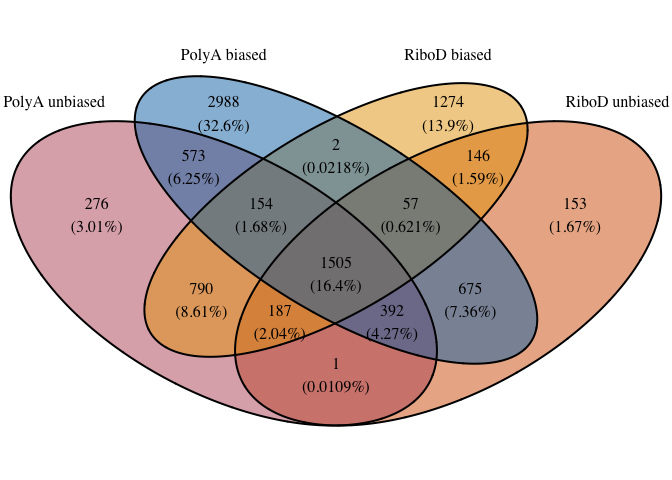

## Session Info

``` r
sessioninfo::session_info()
```

    ─ Session info ───────────────────────────────────────────────────────────────
     setting  value
     version  R version 4.5.2 (2025-10-31)
     os       macOS Tahoe 26.5
     system   aarch64, darwin20
     ui       X11
     language (EN)
     collate  en_US.UTF-8
     ctype    en_US.UTF-8
     tz       America/Los_Angeles
     date     2026-09-02
     pandoc   3.8.3 @ /Applications/RStudio.app/Contents/Resources/app/quarto/bin/tools/aarch64/ (via rmarkdown)
     quarto   1.9.36 @ /Applications/RStudio.app/Contents/Resources/app/quarto/bin/quarto

    ─ Packages ───────────────────────────────────────────────────────────────────
     ! package        * version date (UTC) lib source
     P bit              4.6.0   2025-03-06 [?] RSPM
     P bit64            4.6.0-1 2025-01-16 [?] CRAN (R 4.5.0)
     P cli              3.6.5   2025-04-23 [?] CRAN (R 4.5.0)
     P crayon           1.5.3   2024-06-20 [?] RSPM
     P digest           0.6.37  2024-08-19 [?] CRAN (R 4.5.0)
     P dplyr          * 1.1.4   2023-11-17 [?] CRAN (R 4.5.0)
     P evaluate         1.0.5   2025-08-27 [?] RSPM
     P farver           2.1.2   2024-05-13 [?] RSPM
     P fastmap          1.2.0   2024-05-15 [?] RSPM
     P forcats        * 1.0.1   2025-09-25 [?] RSPM
     P formatR          1.14    2023-01-17 [?] CRAN (R 4.5.0)
     P futile.logger  * 1.4.3   2016-07-10 [?] CRAN (R 4.5.0)
     P futile.options   1.0.1   2018-04-20 [?] CRAN (R 4.5.0)
     P generics         0.1.4   2025-05-09 [?] RSPM
     P ggplot2        * 4.0.0   2025-09-11 [?] CRAN (R 4.5.0)
     P glue             1.8.0   2024-09-30 [?] CRAN (R 4.5.0)
     P gtable           0.3.6   2024-10-25 [?] RSPM
     P hms              1.1.4   2025-10-17 [?] RSPM
     P htmltools        0.5.8.1 2024-04-04 [?] CRAN (R 4.5.0)
     P jsonlite         2.0.0   2025-03-27 [?] RSPM
     P knitr            1.50    2025-03-16 [?] CRAN (R 4.5.0)
     P labeling         0.4.3   2023-08-29 [?] RSPM
     P lambda.r         1.2.4   2019-09-18 [?] CRAN (R 4.5.0)
     P lifecycle        1.0.4   2023-11-07 [?] CRAN (R 4.5.0)
     P lubridate      * 1.9.4   2024-12-08 [?] CRAN (R 4.5.0)
     P magrittr         2.0.4   2025-09-12 [?] CRAN (R 4.5.0)
     P pillar           1.11.1  2025-09-17 [?] RSPM
     P pkgconfig        2.0.3   2019-09-22 [?] RSPM
     P purrr          * 1.1.0   2025-07-10 [?] CRAN (R 4.5.0)
     P R6               2.6.1   2025-02-15 [?] RSPM
     P RColorBrewer     1.1-3   2022-04-03 [?] RSPM
     P readr          * 2.1.5   2024-01-10 [?] CRAN (R 4.5.0)
       renv             1.1.5   2025-07-24 [1] CRAN (R 4.5.0)
     P rlang            1.2.0   2026-04-06 [?] RSPM
     P rmarkdown        2.30    2025-09-28 [?] CRAN (R 4.5.0)
     P rstudioapi       0.17.1  2024-10-22 [?] CRAN (R 4.5.0)
     P S7               0.2.0   2024-11-07 [?] CRAN (R 4.5.0)
     P scales           1.4.0   2025-04-24 [?] RSPM
     P sessioninfo      1.2.3   2025-02-05 [?] CRAN (R 4.5.0)
     P stringi          1.8.7   2025-03-27 [?] RSPM
     P stringr        * 1.5.2   2025-09-08 [?] CRAN (R 4.5.0)
     P tibble         * 3.3.0   2025-06-08 [?] CRAN (R 4.5.0)
     P tidyr          * 1.3.1   2024-01-24 [?] CRAN (R 4.5.0)
     P tidyselect       1.2.1   2024-03-11 [?] RSPM
     P tidyverse      * 2.0.0   2023-02-22 [?] RSPM
     P timechange       0.3.0   2024-01-18 [?] CRAN (R 4.5.0)
     P tzdb             0.5.0   2025-03-15 [?] RSPM
     P vctrs            0.6.5   2023-12-01 [?] CRAN (R 4.5.0)
     P VennDiagram    * 1.8.2   2026-01-11 [?] RSPM
     P vroom            1.6.6   2025-09-19 [?] CRAN (R 4.5.0)
     P withr            3.0.2   2024-10-28 [?] CRAN (R 4.5.0)
     P xfun             0.55    2025-12-16 [?] CRAN (R 4.5.2)
     P yaml             2.3.10  2024-07-26 [?] CRAN (R 4.5.0)

     [1] /Users/maryke/Documents/Treehouse/Lab_Notebooks/transcript_enrichment_bias_assessment/Fig_2/all_disease_comparisons/renv/library/macos/R-4.5/aarch64-apple-darwin20
     [2] /Users/maryke/Library/Caches/org.R-project.R/R/renv/sandbox/macos/R-4.5/aarch64-apple-darwin20/4cd76b74

     * ── Packages attached to the search path.
     P ── Loaded and on-disk path mismatch.

    ──────────────────────────────────────────────────────────────────────────────
