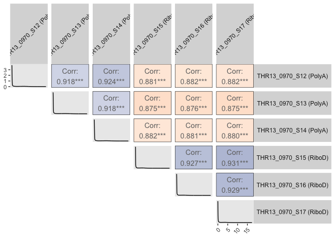
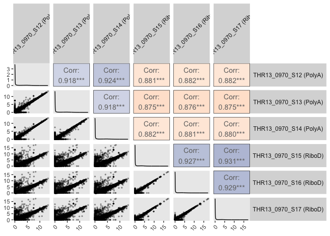

# THR13_0970_S12-S17_correlogram


## THR13_0970 matched PolyA / RiboD

Correlogram showing similarity between datasets

``` r
library(tidyverse)
```

    ── Attaching core tidyverse packages ──────────────────────── tidyverse 2.0.0 ──
    ✔ dplyr     1.1.4     ✔ readr     2.1.5
    ✔ forcats   1.0.1     ✔ stringr   1.5.2
    ✔ ggplot2   4.0.0     ✔ tibble    3.3.0
    ✔ lubridate 1.9.4     ✔ tidyr     1.3.1
    ✔ purrr     1.1.0     
    ── Conflicts ────────────────────────────────────────── tidyverse_conflicts() ──
    ✖ dplyr::filter() masks stats::filter()
    ✖ dplyr::lag()    masks stats::lag()
    ℹ Use the conflicted package (<http://conflicted.r-lib.org/>) to force all conflicts to become errors

``` r
library(corrr)
library(GGally)
library(corrplot)
```

    corrplot 0.95 loaded

``` r
rsem_log2TPM1_THR13 <- read_tsv("../input_data/matched_THR13_0970/rsem_ensembl_log2TPM1_THR13_0970_S12-S17.tsv.gz")
```

    Rows: 362988 Columns: 8
    ── Column specification ────────────────────────────────────────────────────────
    Delimiter: "\t"
    chr (5): full_sample, ensembl_gene_ID, HugoID, lib_prep, sample
    dbl (2): TPM, log2TPM1
    lgl (1): is_treehouse_druggable_gene

    ℹ Use `spec()` to retrieve the full column specification for this data.
    ℹ Specify the column types or set `show_col_types = FALSE` to quiet this message.

``` r
# pivot to wide format
rsem_wide <- rsem_log2TPM1_THR13 %>%
  select(full_sample, ensembl_gene_ID, log2TPM1) %>%
  pivot_wider(names_from = full_sample, values_from = log2TPM1)
```

``` r
# convert to matrix
rsem_matrix <- rsem_wide %>%
  column_to_rownames("ensembl_gene_ID") %>%
  as.matrix()

set.seed(123) # for reproducibility
# Compute Spearman correlation 
rsem_correlation <- cor(rsem_matrix, method = "spearman", use = "pairwise.complete.obs") #pairwise.complete.obs = the correlation between each pair of variables is computed using all complete pairs of those particular variables
# ^ I think this means NAs will not be counted in calculation
```

``` r
prep_map <- c(
  "THR13_0970_S12" = "PolyA",
  "THR13_0970_S13" = "PolyA",
  "THR13_0970_S14" = "PolyA",
  "THR13_0970_S15" = "RiboD",
  "THR13_0970_S16" = "RiboD",
  "THR13_0970_S17" = "RiboD"
)

# Rename columns to include prep method, e.g. "S12 (PolyA)"
colnames(rsem_matrix) <- paste0(
  colnames(rsem_matrix),
  " (", prep_map[colnames(rsem_matrix)], ")"
)
```

``` r
# integrate density plot with coefficient value and color by coefficient value

cor_color_fn <- function(data, mapping, ...) {
  corr <- eval_data_col(data, mapping$x) %>%
    cor(eval_data_col(data, mapping$y), method = "spearman", use = "pairwise.complete.obs")
  
  ggally_cor(data, mapping, method = "spearman") +
    theme_bw() +
    theme(panel.background = element_rect(
      fill = scales::col_numeric(c("#ec944d", "white", "#084c8b"), c(0.8,1))(corr)
    ),
    panel.grid = element_blank())
}
```

``` r
rsem_ggpairs_plot <- ggpairs(
  rsem_matrix,
  # upper = list(continuous = wrap(cor_color_fn, method = "spearman")),
  lower = list(continuous = "blank"),
  upper = list(continuous = wrap(cor_color_fn, method = "spearman")),
  diag = list(continuous = wrap("densityDiag"))
  # diag = list(continuous = "blank")
) +
  theme(axis.text.x = element_text(angle = 45, hjust = 1)) +
  theme(
    strip.text.y = element_text(angle = 0, size = 9),
    strip.text.x = element_text(angle = 45, size = 9)
  ) +
  theme(panel.grid = element_blank())
rsem_ggpairs_plot
```

    Warning in cor.test.default(x, y, method = method): Cannot compute exact
    p-value with ties
    Warning in cor.test.default(x, y, method = method): Cannot compute exact
    p-value with ties
    Warning in cor.test.default(x, y, method = method): Cannot compute exact
    p-value with ties
    Warning in cor.test.default(x, y, method = method): Cannot compute exact
    p-value with ties
    Warning in cor.test.default(x, y, method = method): Cannot compute exact
    p-value with ties
    Warning in cor.test.default(x, y, method = method): Cannot compute exact
    p-value with ties
    Warning in cor.test.default(x, y, method = method): Cannot compute exact
    p-value with ties
    Warning in cor.test.default(x, y, method = method): Cannot compute exact
    p-value with ties
    Warning in cor.test.default(x, y, method = method): Cannot compute exact
    p-value with ties
    Warning in cor.test.default(x, y, method = method): Cannot compute exact
    p-value with ties
    Warning in cor.test.default(x, y, method = method): Cannot compute exact
    p-value with ties
    Warning in cor.test.default(x, y, method = method): Cannot compute exact
    p-value with ties
    Warning in cor.test.default(x, y, method = method): Cannot compute exact
    p-value with ties
    Warning in cor.test.default(x, y, method = method): Cannot compute exact
    p-value with ties
    Warning in cor.test.default(x, y, method = method): Cannot compute exact
    p-value with ties



``` r
ggsave(
  "rsem_ggpairs_plot.png",
  rsem_ggpairs_plot,
  width = 10, height = 12, units = "in", dpi = 300
)
```

    Warning in cor.test.default(x, y, method = method): Cannot compute exact
    p-value with ties
    Warning in cor.test.default(x, y, method = method): Cannot compute exact
    p-value with ties
    Warning in cor.test.default(x, y, method = method): Cannot compute exact
    p-value with ties
    Warning in cor.test.default(x, y, method = method): Cannot compute exact
    p-value with ties
    Warning in cor.test.default(x, y, method = method): Cannot compute exact
    p-value with ties
    Warning in cor.test.default(x, y, method = method): Cannot compute exact
    p-value with ties
    Warning in cor.test.default(x, y, method = method): Cannot compute exact
    p-value with ties
    Warning in cor.test.default(x, y, method = method): Cannot compute exact
    p-value with ties
    Warning in cor.test.default(x, y, method = method): Cannot compute exact
    p-value with ties
    Warning in cor.test.default(x, y, method = method): Cannot compute exact
    p-value with ties
    Warning in cor.test.default(x, y, method = method): Cannot compute exact
    p-value with ties
    Warning in cor.test.default(x, y, method = method): Cannot compute exact
    p-value with ties
    Warning in cor.test.default(x, y, method = method): Cannot compute exact
    p-value with ties
    Warning in cor.test.default(x, y, method = method): Cannot compute exact
    p-value with ties
    Warning in cor.test.default(x, y, method = method): Cannot compute exact
    p-value with ties

``` r
# with scatterplot
rsem_ggpairs_plot_scatter <- ggpairs(
  rsem_matrix,
  lower = list(continuous = wrap("points", alpha = 0.3, size = 0.5)),
  upper = list(continuous = wrap(cor_color_fn, method = "spearman")),
  diag = list(continuous = wrap("densityDiag"))
  # diag = list(continuous = "blank")
) +
  theme(axis.text.x = element_text(angle = 45, hjust = 1)) +
  theme(
    strip.text.y = element_text(angle = 0, size = 9),
    strip.text.x = element_text(angle = 45, size = 9)
  ) +
  theme(panel.grid = element_blank())
rsem_ggpairs_plot_scatter
```

    Warning in cor.test.default(x, y, method = method): Cannot compute exact
    p-value with ties
    Warning in cor.test.default(x, y, method = method): Cannot compute exact
    p-value with ties
    Warning in cor.test.default(x, y, method = method): Cannot compute exact
    p-value with ties
    Warning in cor.test.default(x, y, method = method): Cannot compute exact
    p-value with ties
    Warning in cor.test.default(x, y, method = method): Cannot compute exact
    p-value with ties
    Warning in cor.test.default(x, y, method = method): Cannot compute exact
    p-value with ties
    Warning in cor.test.default(x, y, method = method): Cannot compute exact
    p-value with ties
    Warning in cor.test.default(x, y, method = method): Cannot compute exact
    p-value with ties
    Warning in cor.test.default(x, y, method = method): Cannot compute exact
    p-value with ties
    Warning in cor.test.default(x, y, method = method): Cannot compute exact
    p-value with ties
    Warning in cor.test.default(x, y, method = method): Cannot compute exact
    p-value with ties
    Warning in cor.test.default(x, y, method = method): Cannot compute exact
    p-value with ties
    Warning in cor.test.default(x, y, method = method): Cannot compute exact
    p-value with ties
    Warning in cor.test.default(x, y, method = method): Cannot compute exact
    p-value with ties
    Warning in cor.test.default(x, y, method = method): Cannot compute exact
    p-value with ties



``` r
ggsave(
  "rsem_ggpairs_plot_scatter.png",
  rsem_ggpairs_plot_scatter,
  width = 10, height = 12, units = "in", dpi = 300
)
```

    Warning in cor.test.default(x, y, method = method): Cannot compute exact
    p-value with ties
    Warning in cor.test.default(x, y, method = method): Cannot compute exact
    p-value with ties
    Warning in cor.test.default(x, y, method = method): Cannot compute exact
    p-value with ties
    Warning in cor.test.default(x, y, method = method): Cannot compute exact
    p-value with ties
    Warning in cor.test.default(x, y, method = method): Cannot compute exact
    p-value with ties
    Warning in cor.test.default(x, y, method = method): Cannot compute exact
    p-value with ties
    Warning in cor.test.default(x, y, method = method): Cannot compute exact
    p-value with ties
    Warning in cor.test.default(x, y, method = method): Cannot compute exact
    p-value with ties
    Warning in cor.test.default(x, y, method = method): Cannot compute exact
    p-value with ties
    Warning in cor.test.default(x, y, method = method): Cannot compute exact
    p-value with ties
    Warning in cor.test.default(x, y, method = method): Cannot compute exact
    p-value with ties
    Warning in cor.test.default(x, y, method = method): Cannot compute exact
    p-value with ties
    Warning in cor.test.default(x, y, method = method): Cannot compute exact
    p-value with ties
    Warning in cor.test.default(x, y, method = method): Cannot compute exact
    p-value with ties
    Warning in cor.test.default(x, y, method = method): Cannot compute exact
    p-value with ties

Session Info

``` r
sessioninfo::session_info()
```

    ─ Session info ───────────────────────────────────────────────────────────────
     setting  value
     version  R version 4.5.2 (2025-10-31)
     os       macOS Tahoe 26.5
     system   aarch64, darwin20
     ui       X11
     language (EN)
     collate  en_US.UTF-8
     ctype    en_US.UTF-8
     tz       America/Los_Angeles
     date     2026-09-17
     pandoc   3.8.3 @ /Applications/RStudio.app/Contents/Resources/app/quarto/bin/tools/aarch64/ (via rmarkdown)
     quarto   1.9.36 @ /Applications/RStudio.app/Contents/Resources/app/quarto/bin/quarto

    ─ Packages ───────────────────────────────────────────────────────────────────
     package      * version date (UTC) lib source
     bit            4.6.0   2025-03-06 [1] CRAN (R 4.5.0)
     bit64          4.6.0-1 2025-01-16 [1] CRAN (R 4.5.0)
     cli            3.6.5   2025-04-23 [1] CRAN (R 4.5.0)
     corrplot     * 0.95    2024-10-14 [1] CRAN (R 4.5.0)
     corrr        * 0.4.5   2025-08-18 [1] CRAN (R 4.5.0)
     crayon         1.5.3   2024-06-20 [1] CRAN (R 4.5.0)
     digest         0.6.37  2024-08-19 [1] CRAN (R 4.5.0)
     dplyr        * 1.1.4   2023-11-17 [1] CRAN (R 4.5.0)
     evaluate       1.0.5   2025-08-27 [1] CRAN (R 4.5.0)
     farver         2.1.2   2024-05-13 [1] CRAN (R 4.5.0)
     fastmap        1.2.0   2024-05-15 [1] CRAN (R 4.5.0)
     forcats      * 1.0.1   2025-09-25 [1] CRAN (R 4.5.0)
     generics       0.1.4   2025-05-09 [1] CRAN (R 4.5.0)
     GGally       * 2.4.0   2025-08-23 [1] CRAN (R 4.5.0)
     ggplot2      * 4.0.0   2025-09-11 [1] CRAN (R 4.5.0)
     ggstats        0.14.0  2026-09-02 [1] CRAN (R 4.5.2)
     glue           1.8.0   2024-09-30 [1] CRAN (R 4.5.0)
     gtable         0.3.6   2024-10-25 [1] CRAN (R 4.5.0)
     hms            1.1.4   2025-10-17 [1] CRAN (R 4.5.0)
     htmltools      0.5.8.1 2024-04-04 [1] CRAN (R 4.5.0)
     jsonlite       2.0.0   2025-03-27 [1] CRAN (R 4.5.0)
     knitr          1.50    2025-03-16 [1] CRAN (R 4.5.0)
     labeling       0.4.3   2023-08-29 [1] CRAN (R 4.5.0)
     lifecycle      1.0.4   2023-11-07 [1] CRAN (R 4.5.0)
     lubridate    * 1.9.4   2024-12-08 [1] CRAN (R 4.5.0)
     magrittr       2.0.4   2025-09-12 [1] CRAN (R 4.5.0)
     pillar         1.11.1  2025-09-17 [1] CRAN (R 4.5.0)
     pkgconfig      2.0.3   2019-09-22 [1] CRAN (R 4.5.0)
     purrr        * 1.1.0   2025-07-10 [1] CRAN (R 4.5.0)
     R6             2.6.1   2025-02-15 [1] CRAN (R 4.5.0)
     ragg           1.5.0   2025-09-02 [1] CRAN (R 4.5.0)
     RColorBrewer   1.1-3   2022-04-03 [1] CRAN (R 4.5.0)
     readr        * 2.1.5   2024-01-10 [1] CRAN (R 4.5.0)
     rlang          1.2.0   2026-04-06 [1] CRAN (R 4.5.2)
     rmarkdown      2.30    2025-09-28 [1] CRAN (R 4.5.0)
     rstudioapi     0.17.1  2024-10-22 [1] CRAN (R 4.5.0)
     S7             0.2.0   2024-11-07 [1] CRAN (R 4.5.0)
     scales         1.4.0   2025-04-24 [1] CRAN (R 4.5.0)
     sessioninfo    1.2.3   2025-02-05 [1] CRAN (R 4.5.0)
     stringi        1.8.7   2025-03-27 [1] CRAN (R 4.5.0)
     stringr      * 1.5.2   2025-09-08 [1] CRAN (R 4.5.0)
     systemfonts    1.3.1   2025-10-01 [1] CRAN (R 4.5.0)
     textshaping    1.0.4   2025-10-10 [1] CRAN (R 4.5.0)
     tibble       * 3.3.0   2025-06-08 [1] CRAN (R 4.5.0)
     tidyr        * 1.3.1   2024-01-24 [1] CRAN (R 4.5.0)
     tidyselect     1.2.1   2024-03-11 [1] CRAN (R 4.5.0)
     tidyverse    * 2.0.0   2023-02-22 [1] CRAN (R 4.5.0)
     timechange     0.3.0   2024-01-18 [1] CRAN (R 4.5.0)
     tzdb           0.5.0   2025-03-15 [1] CRAN (R 4.5.0)
     vctrs          0.6.5   2023-12-01 [1] CRAN (R 4.5.0)
     vroom          1.6.6   2025-09-19 [1] CRAN (R 4.5.0)
     withr          3.0.2   2024-10-28 [1] CRAN (R 4.5.0)
     xfun           0.55    2025-12-16 [1] CRAN (R 4.5.2)
     yaml           2.3.10  2024-07-26 [1] CRAN (R 4.5.0)

     [1] /Library/Frameworks/R.framework/Versions/4.5-arm64/Resources/library
     * ── Packages attached to the search path.

    ──────────────────────────────────────────────────────────────────────────────
