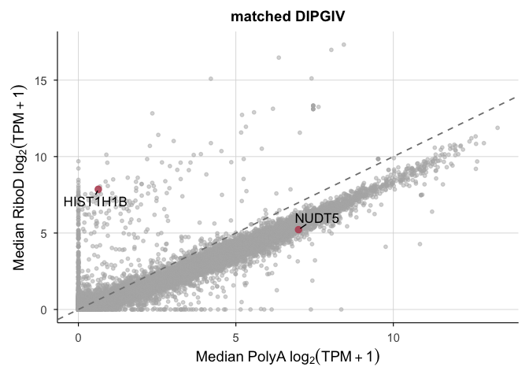

# THR13_0970_S12-S17_median_scatter


## THR13_0970 matched PolyA / RiboD

Scatterplot showing the median expression level per gene between polyA
and riboD

``` r
library(tidyverse)
```

    ── Attaching core tidyverse packages ──────────────────────── tidyverse 2.0.0 ──
    ✔ dplyr     1.1.4     ✔ readr     2.1.5
    ✔ forcats   1.0.1     ✔ stringr   1.5.2
    ✔ ggplot2   4.0.0     ✔ tibble    3.3.0
    ✔ lubridate 1.9.4     ✔ tidyr     1.3.1
    ✔ purrr     1.1.0     
    ── Conflicts ────────────────────────────────────────── tidyverse_conflicts() ──
    ✖ dplyr::filter() masks stats::filter()
    ✖ dplyr::lag()    masks stats::lag()
    ℹ Use the conflicted package (<http://conflicted.r-lib.org/>) to force all conflicts to become errors

``` r
library(ggrepel)
library(patchwork)
```

``` r
rsem_log2TPM1_THR13 <- read_tsv("../input_data/matched_THR13_0970/rsem_ensembl_log2TPM1_THR13_0970_S12-S17.tsv.gz")
```

    Rows: 362988 Columns: 8
    ── Column specification ────────────────────────────────────────────────────────
    Delimiter: "\t"
    chr (5): full_sample, ensembl_gene_ID, HugoID, lib_prep, sample
    dbl (2): TPM, log2TPM1
    lgl (1): is_treehouse_druggable_gene

    ℹ Use `spec()` to retrieve the full column specification for this data.
    ℹ Specify the column types or set `show_col_types = FALSE` to quiet this message.

Compute gene medians

``` r
# separating PolyA and RiboD
THR13_polyA <- rsem_log2TPM1_THR13 %>%
  filter(lib_prep == "polyA") %>%
  mutate(Disease = "DIPG4")

THR13_polyA_wide <- THR13_polyA %>%
  select(full_sample, ensembl_gene_ID, HugoID, log2TPM1) %>%
  pivot_wider(names_from = full_sample, values_from = log2TPM1)

THR13_riboD <- rsem_log2TPM1_THR13 %>%
  filter(lib_prep == "riboD") %>%
  mutate(Disease = "DIPG4")

THR13_riboD_wide <- THR13_riboD %>%
  select(full_sample, ensembl_gene_ID, HugoID, log2TPM1) %>%
  pivot_wider(names_from = full_sample, values_from = log2TPM1)
```

``` r
# Find gene medians in polyA
THR13_polyA_medians <- THR13_polyA_wide %>%
  rowwise() %>%
  mutate(THR13_polyA_median = median(c_across(starts_with("T")), na.rm = TRUE)) %>%
  ungroup() %>%
  select(ensembl_gene_ID, HugoID, THR13_polyA_median)

# Find gene medians in riboD
THR13_riboD_medians <- THR13_riboD_wide %>%
  rowwise() %>%
  mutate(THR13_riboD_median = median(c_across(starts_with("T")), na.rm = TRUE)) %>%
  ungroup() %>%
  select(ensembl_gene_ID, HugoID, THR13_riboD_median)
```

``` r
# combine
THR13_gene_medians <- THR13_polyA_medians %>%
  inner_join(THR13_riboD_medians, by = "ensembl_gene_ID")
```

``` r
plot_theme <- function(base_size = 14) {
  theme_minimal(base_size = base_size) +
    theme(
      legend.position = "top",
      legend.title = element_blank(),
      panel.grid.major = element_line(color = "grey85", linewidth = 0.3),
      panel.grid.minor = element_blank(),
      axis.line = element_line(color = "black", linewidth = 0.4),
      axis.ticks = element_line(color = "black", linewidth = 0.4),
      strip.text = element_text(face = "bold", size = base_size * 0.9),
      plot.title = element_text(face = "bold", size = base_size * 1, hjust = 0.5),
      plot.margin = margin(10, 10, 10, 10)
    )
}

scale_fill_compendia <- function() {
  scale_fill_manual(values = c(
    "riboD" = "#E69F00",  # yellow
    "polyA" = "#0072B2"   # blue
  ))
}
scale_color_compendia <- function() {
  scale_color_manual(values = c( 
    "riboD" = "#E69F00", 
    "polyA" = "#0072B2" ))
  }
```

Compute residual for each gene

``` r
# for each gene in each disease, taking the average riboD expression and subtracting from the average polyA expression
THR13_gene_medians_res <- THR13_gene_medians %>%
  mutate(
    residual = THR13_riboD_median - THR13_polyA_median
  )
```

Label representative polyadenylated and non-polyadenylated gene

``` r
# representative polyadenylated genes were found in THR13_0970_S12-S17/THR13_0970_S12-S17_rep_genes.md, calculated as the median expression level in PolyA samples divided by the median expression level in RiboD samples

THR13_gene_medians_res <- THR13_gene_medians_res %>%
  mutate(
    label_color = case_when(
    ensembl_gene_ID == "ENSG00000165609.12" ~ "#BB5566", #NUDT5
    ensembl_gene_ID == "ENSG00000184357.4" ~ "#BB5566", #HIST1H1B
    TRUE ~ "grey70"
    )
  ) %>%
  mutate(
    label = case_when(
      ensembl_gene_ID == "ENSG00000165609.12" ~ HugoID.x,
      ensembl_gene_ID == "ENSG00000184357.4" ~ HugoID.x, # HIST1H1B + median ratio gene
      TRUE ~ NA_character_
    )
  )
```

Plot average expression across library prep methods

``` r
med_scatterplot <- ggplot(THR13_gene_medians_res, aes(x = THR13_polyA_median, y = THR13_riboD_median)) +
  geom_point(data = THR13_gene_medians_res %>% filter(is.na(label)),
             color = "grey70", alpha = 0.5, size = 1.2) +
  geom_point(data = THR13_gene_medians_res %>% filter(!is.na(label)),
             aes(color = label_color),
             size = 2.5, alpha = 0.9) +
  geom_text_repel(
    aes(label = label),
    size = 4.5,
    max.overlaps = Inf,
    min.segment.length = 0,
    box.padding = 0.4,
    point.padding = 0.2
  ) +
  scale_color_identity() +   # use colors exactly as defined
  geom_abline(slope = 1, intercept = 0,
                linetype = "dashed", color = "gray50") +
  labs(title = "matched DIPGIV") +
    xlab(bquote(Median~PolyA~log[2](TPM+1))) +
    ylab(bquote(Median~RiboD~log[2](TPM+1))) +
    theme_minimal(base_size = 14) +
    plot_theme()
med_scatterplot
```

    Warning: Removed 60496 rows containing missing values or values outside the scale range
    (`geom_text_repel()`).



Session Info

``` r
sessioninfo::session_info()
```

    ─ Session info ───────────────────────────────────────────────────────────────
     setting  value
     version  R version 4.5.2 (2025-10-31)
     os       macOS Tahoe 26.5
     system   aarch64, darwin20
     ui       X11
     language (EN)
     collate  en_US.UTF-8
     ctype    en_US.UTF-8
     tz       America/Los_Angeles
     date     2026-09-18
     pandoc   3.8.3 @ /Applications/RStudio.app/Contents/Resources/app/quarto/bin/tools/aarch64/ (via rmarkdown)
     quarto   1.9.36 @ /Applications/RStudio.app/Contents/Resources/app/quarto/bin/quarto

    ─ Packages ───────────────────────────────────────────────────────────────────
     package      * version date (UTC) lib source
     bit            4.6.0   2025-03-06 [1] CRAN (R 4.5.0)
     bit64          4.6.0-1 2025-01-16 [1] CRAN (R 4.5.0)
     cli            3.6.5   2025-04-23 [1] CRAN (R 4.5.0)
     crayon         1.5.3   2024-06-20 [1] CRAN (R 4.5.0)
     digest         0.6.37  2024-08-19 [1] CRAN (R 4.5.0)
     dplyr        * 1.1.4   2023-11-17 [1] CRAN (R 4.5.0)
     evaluate       1.0.5   2025-08-27 [1] CRAN (R 4.5.0)
     farver         2.1.2   2024-05-13 [1] CRAN (R 4.5.0)
     fastmap        1.2.0   2024-05-15 [1] CRAN (R 4.5.0)
     forcats      * 1.0.1   2025-09-25 [1] CRAN (R 4.5.0)
     generics       0.1.4   2025-05-09 [1] CRAN (R 4.5.0)
     ggplot2      * 4.0.0   2025-09-11 [1] CRAN (R 4.5.0)
     ggrepel      * 0.9.6   2024-09-07 [1] CRAN (R 4.5.0)
     glue           1.8.0   2024-09-30 [1] CRAN (R 4.5.0)
     gtable         0.3.6   2024-10-25 [1] CRAN (R 4.5.0)
     hms            1.1.4   2025-10-17 [1] CRAN (R 4.5.0)
     htmltools      0.5.8.1 2024-04-04 [1] CRAN (R 4.5.0)
     jsonlite       2.0.0   2025-03-27 [1] CRAN (R 4.5.0)
     knitr          1.50    2025-03-16 [1] CRAN (R 4.5.0)
     labeling       0.4.3   2023-08-29 [1] CRAN (R 4.5.0)
     lifecycle      1.0.4   2023-11-07 [1] CRAN (R 4.5.0)
     lubridate    * 1.9.4   2024-12-08 [1] CRAN (R 4.5.0)
     magrittr       2.0.4   2025-09-12 [1] CRAN (R 4.5.0)
     patchwork    * 1.3.2   2025-08-25 [1] CRAN (R 4.5.0)
     pillar         1.11.1  2025-09-17 [1] CRAN (R 4.5.0)
     pkgconfig      2.0.3   2019-09-22 [1] CRAN (R 4.5.0)
     purrr        * 1.1.0   2025-07-10 [1] CRAN (R 4.5.0)
     R6             2.6.1   2025-02-15 [1] CRAN (R 4.5.0)
     RColorBrewer   1.1-3   2022-04-03 [1] CRAN (R 4.5.0)
     Rcpp           1.1.0   2025-07-02 [1] CRAN (R 4.5.0)
     readr        * 2.1.5   2024-01-10 [1] CRAN (R 4.5.0)
     rlang          1.2.0   2026-04-06 [1] CRAN (R 4.5.2)
     rmarkdown      2.30    2025-09-28 [1] CRAN (R 4.5.0)
     rstudioapi     0.17.1  2024-10-22 [1] CRAN (R 4.5.0)
     S7             0.2.0   2024-11-07 [1] CRAN (R 4.5.0)
     scales         1.4.0   2025-04-24 [1] CRAN (R 4.5.0)
     sessioninfo    1.2.3   2025-02-05 [1] CRAN (R 4.5.0)
     stringi        1.8.7   2025-03-27 [1] CRAN (R 4.5.0)
     stringr      * 1.5.2   2025-09-08 [1] CRAN (R 4.5.0)
     tibble       * 3.3.0   2025-06-08 [1] CRAN (R 4.5.0)
     tidyr        * 1.3.1   2024-01-24 [1] CRAN (R 4.5.0)
     tidyselect     1.2.1   2024-03-11 [1] CRAN (R 4.5.0)
     tidyverse    * 2.0.0   2023-02-22 [1] CRAN (R 4.5.0)
     timechange     0.3.0   2024-01-18 [1] CRAN (R 4.5.0)
     tzdb           0.5.0   2025-03-15 [1] CRAN (R 4.5.0)
     vctrs          0.6.5   2023-12-01 [1] CRAN (R 4.5.0)
     vroom          1.6.6   2025-09-19 [1] CRAN (R 4.5.0)
     withr          3.0.2   2024-10-28 [1] CRAN (R 4.5.0)
     xfun           0.55    2025-12-16 [1] CRAN (R 4.5.2)
     yaml           2.3.10  2024-07-26 [1] CRAN (R 4.5.0)

     [1] /Library/Frameworks/R.framework/Versions/4.5-arm64/Resources/library
     * ── Packages attached to the search path.

    ──────────────────────────────────────────────────────────────────────────────
