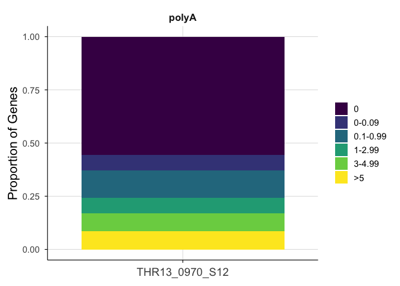
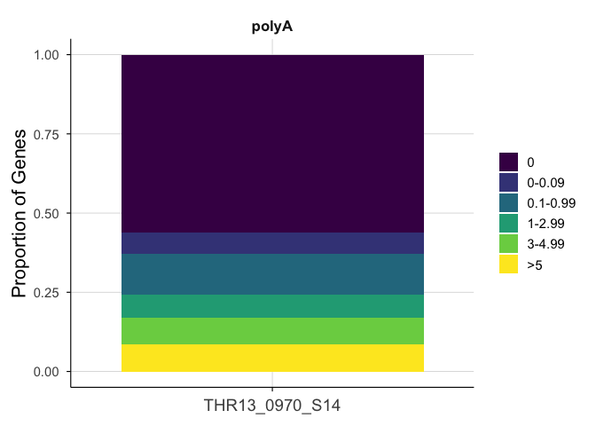
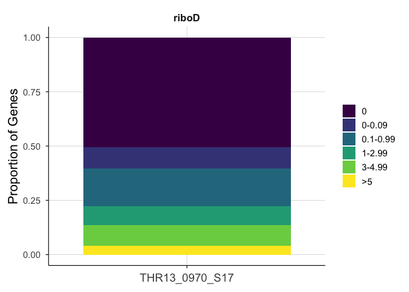
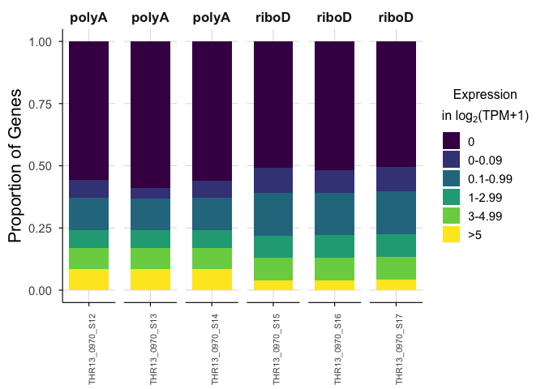

# THR13_0970_S12-S17_proportion


## THR13_0970 matched PolyA / RiboD

Stacked bar chart showing the proportion of unique genes expressed at
different log2(TPM+1) levels.

``` r
library(tidyverse)
```

    ── Attaching core tidyverse packages ──────────────────────── tidyverse 2.0.0 ──
    ✔ dplyr     1.1.4     ✔ readr     2.1.5
    ✔ forcats   1.0.1     ✔ stringr   1.5.2
    ✔ ggplot2   4.0.0     ✔ tibble    3.3.0
    ✔ lubridate 1.9.4     ✔ tidyr     1.3.1
    ✔ purrr     1.1.0     
    ── Conflicts ────────────────────────────────────────── tidyverse_conflicts() ──
    ✖ dplyr::filter() masks stats::filter()
    ✖ dplyr::lag()    masks stats::lag()
    ℹ Use the conflicted package (<http://conflicted.r-lib.org/>) to force all conflicts to become errors

``` r
library(patchwork)
library(cowplot)
```


    Attaching package: 'cowplot'

    The following object is masked from 'package:patchwork':

        align_plots

    The following object is masked from 'package:lubridate':

        stamp

``` r
rsem_log2TPM1_THR13 <- read_tsv("../input_data/matched_THR13_0970/rsem_ensembl_log2TPM1_THR13_0970_S12-S17.tsv.gz")
```

    Rows: 362988 Columns: 8
    ── Column specification ────────────────────────────────────────────────────────
    Delimiter: "\t"
    chr (5): full_sample, ensembl_gene_ID, HugoID, lib_prep, sample
    dbl (2): TPM, log2TPM1
    lgl (1): is_treehouse_druggable_gene

    ℹ Use `spec()` to retrieve the full column specification for this data.
    ℹ Specify the column types or set `show_col_types = FALSE` to quiet this message.

``` r
THR13_0970_S12 <- rsem_log2TPM1_THR13 %>%
  filter(full_sample == "THR13_0970_S12")

THR13_0970_S13 <- rsem_log2TPM1_THR13 %>%
  filter(full_sample == "THR13_0970_S13")

THR13_0970_S14 <- rsem_log2TPM1_THR13 %>%
  filter(full_sample == "THR13_0970_S14")

THR13_0970_S15 <- rsem_log2TPM1_THR13 %>%
  filter(full_sample == "THR13_0970_S15")

THR13_0970_S16 <- rsem_log2TPM1_THR13 %>%
  filter(full_sample == "THR13_0970_S16")

THR13_0970_S17 <- rsem_log2TPM1_THR13 %>%
  filter(full_sample == "THR13_0970_S17")
```

Define log2(TPM+1) bins

``` r
expr_bins <- c(0, 1e-10, 0.09, 0.99, 2.99, 4.99, Inf)

expr_labels <- c("0","0-0.09", "0.1-0.99", "1-2.99", "3-4.99", ">5")
```

define gene medians function

``` r
# compute_gene_medians <- function(df) {
#   df %>% 
#     rowwise() %>% 
#     mutate(median_expr = median(c_across(starts_with("T")), na.rm = TRUE)) %>%
#     ungroup() %>%
#     select(HugoID, median_expr, lib_prep, full_sample)
# }
```

Compute gene medians

``` r
# THR13_0970_S12_med <- compute_gene_medians(THR13_0970_S12)
# # this is the same as original value, since the median of 1 sample is just that 1 sample's value
```

Bin genes into expression levels

``` r
all_expr_bins <- rsem_log2TPM1_THR13 %>%
  mutate(
    ExprBin = cut(
      log2TPM1,
      breaks = expr_bins,
      labels = expr_labels,
      include.lowest = TRUE
    )
  )
```

Compute proportion of genes in each bin per lib prep

``` r
bin_prop <- all_expr_bins %>% 
  group_by(full_sample, ExprBin) %>%
  summarise(n = n(), .groups = "drop") %>%
  group_by(full_sample) %>%
  mutate(Proportion = n / sum(n))

bin_prop_libprep <- bin_prop %>%
  mutate(lib_prep = case_when(
    full_sample == "THR13_0970_S12" ~ "polyA",
    full_sample == "THR13_0970_S13" ~ "polyA",
    full_sample == "THR13_0970_S14" ~ "polyA",
    full_sample == "THR13_0970_S15" ~ "riboD",
    full_sample == "THR13_0970_S16" ~ "riboD",
    full_sample == "THR13_0970_S17" ~ "riboD"
  ))
```

Custom color theme

``` r
theme_1C <- function(base_size = 14) {
  theme_minimal(base_size = base_size) +
    theme(
      legend.position = "right",
      legend.title = element_blank(),
      panel.grid.major = element_line(color = "grey85", linewidth = 0.3),
      panel.grid.minor = element_blank(),
      axis.line = element_line(color = "black", linewidth = 0.4),
      axis.ticks = element_line(color = "black", linewidth = 0.4),
      strip.text = element_text(face = "bold", size = base_size * 0.9),
      plot.title = element_text(face = "bold", size = base_size * 1.1, hjust = 0.5),
      axis.title.y = element_text(angle = 90, hjust = 0.5, size = 16), 
      axis.title.x = element_text(angle = 0, hjust = 0.5, size = 17), 
      axis.text.x = element_text(angle = 0, hjust = 0.5, size = 14),
      plot.margin = margin(10, 10, 10, 10)
    )
}

scale_fill_compendia <- function() {
  scale_fill_manual(values = c(
    "polyA" = "#E69F00",  # yellow
    "riboD" = "#0072B2"   # blue
  ))
}
scale_color_compendia <- function() {
  scale_color_manual(values = c( 
    "polyA" = "#E69F00", 
    "riboD" = "#0072B2" ))
  }
```

Generate stacked bar plot

``` r
# Get unique THIDs
samplesC <- unique(bin_prop_libprep$full_sample)

# Generate one plot per sample
prop_plot <- map(samplesC, function(d) {
  
  dfC <- bin_prop_libprep %>% filter(full_sample == d)
  
  ggplot(dfC, aes(x = full_sample, y = Proportion, fill = ExprBin)) +
    geom_bar(stat = "identity", position = "stack") +
    scale_fill_viridis_d(
      option = "D", 
      name = expression(atop("Expression", "in log"[2]*"(TPM+1)"))
      ) +
    labs(
      # title = paste(d),
      x = NULL,
      y = "Proportion of Genes",
      fill = "Expression Level"
    ) +
    theme_1C() +
    facet_grid(~ lib_prep, scales = "free_x", space = "free_x")
})

# Name the plots by THIDs
names(prop_plot) <- samplesC
prop_plot
```

    $THR13_0970_S12




    $THR13_0970_S13


    $THR13_0970_S14




    $THR13_0970_S15


    $THR13_0970_S16


    $THR13_0970_S17



Plotting all together

``` r
prop_plot_names <- names(prop_plot)
n <- length(prop_plot_names)
ncols <- 6
bottom_row <- prop_plot_names[seq(from = ceiling(n / ncols) * ncols - ncols + 1, to = n)]


plots_subset <- imap(prop_plot[prop_plot_names], function(p, name) {
  if (!name %in% bottom_row) {
    # hide x-axis on all panels except the last
    p + theme(
      axis.text.x = element_blank(),
      axis.title.x = element_blank(),
      axis.ticks.x = element_blank()
    )
  } else {
    # show x-axis only on the last panel
    p + theme(
      axis.text.x = element_text(angle = 90, hjust = 1, size = 8),
      axis.title.x = element_text(size = 12)
    )
  }
})

combined_prop_plot <- wrap_plots(plots_subset, ncol = 6) +
  plot_layout(guides = "collect", axis_titles = "collect", axes = "collect") +
  plot_annotation(
    theme = theme(legend.position = "right")
  ) &
  theme(
    plot.margin = margin(t = 2, b = 2, l = 4, r = 4),
    plot.title = element_text(hjust = 0.35, face = "bold", size = 14),
    legend.title = element_text(size = 12)
  )

combined_prop_plot
```



Session Info

``` r
sessioninfo::session_info()
```

    ─ Session info ───────────────────────────────────────────────────────────────
     setting  value
     version  R version 4.5.2 (2025-10-31)
     os       macOS Tahoe 26.5
     system   aarch64, darwin20
     ui       X11
     language (EN)
     collate  en_US.UTF-8
     ctype    en_US.UTF-8
     tz       America/Los_Angeles
     date     2026-09-17
     pandoc   3.8.3 @ /Applications/RStudio.app/Contents/Resources/app/quarto/bin/tools/aarch64/ (via rmarkdown)
     quarto   1.9.36 @ /Applications/RStudio.app/Contents/Resources/app/quarto/bin/quarto

    ─ Packages ───────────────────────────────────────────────────────────────────
     package      * version date (UTC) lib source
     bit            4.6.0   2025-03-06 [1] CRAN (R 4.5.0)
     bit64          4.6.0-1 2025-01-16 [1] CRAN (R 4.5.0)
     cli            3.6.5   2025-04-23 [1] CRAN (R 4.5.0)
     cowplot      * 1.2.0   2025-07-07 [1] CRAN (R 4.5.0)
     crayon         1.5.3   2024-06-20 [1] CRAN (R 4.5.0)
     digest         0.6.37  2024-08-19 [1] CRAN (R 4.5.0)
     dplyr        * 1.1.4   2023-11-17 [1] CRAN (R 4.5.0)
     evaluate       1.0.5   2025-08-27 [1] CRAN (R 4.5.0)
     farver         2.1.2   2024-05-13 [1] CRAN (R 4.5.0)
     fastmap        1.2.0   2024-05-15 [1] CRAN (R 4.5.0)
     forcats      * 1.0.1   2025-09-25 [1] CRAN (R 4.5.0)
     generics       0.1.4   2025-05-09 [1] CRAN (R 4.5.0)
     ggplot2      * 4.0.0   2025-09-11 [1] CRAN (R 4.5.0)
     glue           1.8.0   2024-09-30 [1] CRAN (R 4.5.0)
     gtable         0.3.6   2024-10-25 [1] CRAN (R 4.5.0)
     hms            1.1.4   2025-10-17 [1] CRAN (R 4.5.0)
     htmltools      0.5.8.1 2024-04-04 [1] CRAN (R 4.5.0)
     jsonlite       2.0.0   2025-03-27 [1] CRAN (R 4.5.0)
     knitr          1.50    2025-03-16 [1] CRAN (R 4.5.0)
     labeling       0.4.3   2023-08-29 [1] CRAN (R 4.5.0)
     lifecycle      1.0.4   2023-11-07 [1] CRAN (R 4.5.0)
     lubridate    * 1.9.4   2024-12-08 [1] CRAN (R 4.5.0)
     magrittr       2.0.4   2025-09-12 [1] CRAN (R 4.5.0)
     patchwork    * 1.3.2   2025-08-25 [1] CRAN (R 4.5.0)
     pillar         1.11.1  2025-09-17 [1] CRAN (R 4.5.0)
     pkgconfig      2.0.3   2019-09-22 [1] CRAN (R 4.5.0)
     purrr        * 1.1.0   2025-07-10 [1] CRAN (R 4.5.0)
     R6             2.6.1   2025-02-15 [1] CRAN (R 4.5.0)
     RColorBrewer   1.1-3   2022-04-03 [1] CRAN (R 4.5.0)
     readr        * 2.1.5   2024-01-10 [1] CRAN (R 4.5.0)
     rlang          1.2.0   2026-04-06 [1] CRAN (R 4.5.2)
     rmarkdown      2.30    2025-09-28 [1] CRAN (R 4.5.0)
     rstudioapi     0.17.1  2024-10-22 [1] CRAN (R 4.5.0)
     S7             0.2.0   2024-11-07 [1] CRAN (R 4.5.0)
     scales         1.4.0   2025-04-24 [1] CRAN (R 4.5.0)
     sessioninfo    1.2.3   2025-02-05 [1] CRAN (R 4.5.0)
     stringi        1.8.7   2025-03-27 [1] CRAN (R 4.5.0)
     stringr      * 1.5.2   2025-09-08 [1] CRAN (R 4.5.0)
     tibble       * 3.3.0   2025-06-08 [1] CRAN (R 4.5.0)
     tidyr        * 1.3.1   2024-01-24 [1] CRAN (R 4.5.0)
     tidyselect     1.2.1   2024-03-11 [1] CRAN (R 4.5.0)
     tidyverse    * 2.0.0   2023-02-22 [1] CRAN (R 4.5.0)
     timechange     0.3.0   2024-01-18 [1] CRAN (R 4.5.0)
     tzdb           0.5.0   2025-03-15 [1] CRAN (R 4.5.0)
     vctrs          0.6.5   2023-12-01 [1] CRAN (R 4.5.0)
     viridisLite    0.4.2   2023-05-02 [1] CRAN (R 4.5.0)
     vroom          1.6.6   2025-09-19 [1] CRAN (R 4.5.0)
     withr          3.0.2   2024-10-28 [1] CRAN (R 4.5.0)
     xfun           0.55    2025-12-16 [1] CRAN (R 4.5.2)
     yaml           2.3.10  2024-07-26 [1] CRAN (R 4.5.0)

     [1] /Library/Frameworks/R.framework/Versions/4.5-arm64/Resources/library
     * ── Packages attached to the search path.

    ──────────────────────────────────────────────────────────────────────────────
