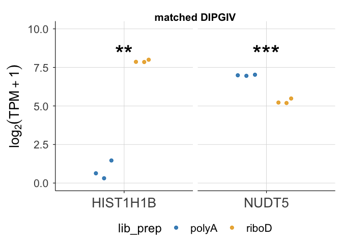
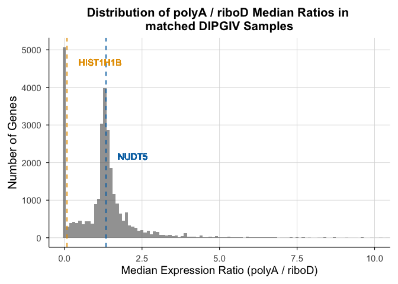

# THR13_0970_S12-S17_representative_genes


## THR13_0970 matched PolyA / RiboD

Boxplot showing expression level of HIST1H1B, a nonpolyadenylated
histone subunit gene.

``` r
library(tidyverse)
```

    ── Attaching core tidyverse packages ──────────────────────── tidyverse 2.0.0 ──
    ✔ dplyr     1.1.4     ✔ readr     2.1.5
    ✔ forcats   1.0.1     ✔ stringr   1.5.2
    ✔ ggplot2   4.0.0     ✔ tibble    3.3.0
    ✔ lubridate 1.9.4     ✔ tidyr     1.3.1
    ✔ purrr     1.1.0     
    ── Conflicts ────────────────────────────────────────── tidyverse_conflicts() ──
    ✖ dplyr::filter() masks stats::filter()
    ✖ dplyr::lag()    masks stats::lag()
    ℹ Use the conflicted package (<http://conflicted.r-lib.org/>) to force all conflicts to become errors

``` r
library(patchwork)
library(cowplot)
```


    Attaching package: 'cowplot'

    The following object is masked from 'package:patchwork':

        align_plots

    The following object is masked from 'package:lubridate':

        stamp

``` r
library(scales)
```


    Attaching package: 'scales'

    The following object is masked from 'package:purrr':

        discard

    The following object is masked from 'package:readr':

        col_factor

``` r
library(ggbeeswarm)
```

``` r
rsem_log2TPM1_THR13 <- read_tsv("../input_data/matched_THR13_0970/rsem_ensembl_log2TPM1_THR13_0970_S12-S17.tsv.gz")
```

    Rows: 362988 Columns: 8
    ── Column specification ────────────────────────────────────────────────────────
    Delimiter: "\t"
    chr (5): full_sample, ensembl_gene_ID, HugoID, lib_prep, sample
    dbl (2): TPM, log2TPM1
    lgl (1): is_treehouse_druggable_gene

    ℹ Use `spec()` to retrieve the full column specification for this data.
    ℹ Specify the column types or set `show_col_types = FALSE` to quiet this message.

``` r
# to convert EnsemblIDs to HugoIDs
gene_names <- read.table("../input_data/EnsGeneID_Hugo_Observed_Conversions.txt",
header = TRUE, sep = "\t", stringsAsFactors = FALSE )
```

``` r
# separating PolyA and RiboD
THR13_polyA <- rsem_log2TPM1_THR13 %>%
  filter(lib_prep == "polyA") %>%
  mutate(Disease = "DIPG4")

THR13_polyA_wide <- THR13_polyA %>%
  select(full_sample, ensembl_gene_ID, HugoID, log2TPM1) %>%
  pivot_wider(names_from = full_sample, values_from = log2TPM1)

THR13_riboD <- rsem_log2TPM1_THR13 %>%
  filter(lib_prep == "riboD") %>%
  mutate(Disease = "DIPG4")

THR13_riboD_wide <- THR13_riboD %>%
  select(full_sample, ensembl_gene_ID, HugoID, log2TPM1) %>%
  pivot_wider(names_from = full_sample, values_from = log2TPM1)
```

Finding median expression genes

``` r
# Find gene medians in polyA
THR13_polyA_medians <- THR13_polyA_wide %>%
  rowwise() %>%
  mutate(THR13_polyA_median = median(c_across(starts_with("T")), na.rm = TRUE)) %>%
  ungroup() %>%
  select(ensembl_gene_ID, HugoID, THR13_polyA_median)

# Find gene medians in riboD
THR13_riboD_medians <- THR13_riboD_wide %>%
  rowwise() %>%
  mutate(THR13_riboD_median = median(c_across(starts_with("T")), na.rm = TRUE)) %>%
  ungroup() %>%
  select(ensembl_gene_ID, HugoID, THR13_riboD_median)


# Join and compute ratio (polyA median/riboD median)
THR13_gene_medians <- THR13_polyA_medians %>%
  inner_join(THR13_riboD_medians, by = "ensembl_gene_ID") %>%
  mutate(THR13_median_ratio = THR13_polyA_median / THR13_riboD_median)

# Filter out genes with no expression
THR13_gene_medians_filtered <- THR13_gene_medians %>%
  filter(THR13_polyA_median > 0 & THR13_riboD_median > 0)

# Recompute median ratio value
THR13_median_ratio_val <- median(THR13_gene_medians_filtered$THR13_median_ratio, na.rm = TRUE)

# Find gene closest to that median ratio
THR13_most_average_gene <- THR13_gene_medians_filtered %>%
  mutate(dist = abs(THR13_median_ratio - THR13_median_ratio_val)) %>%
  arrange(dist) %>%
  slice(1)
```

Filtering for HIST1H1B, a non-polyadenylated gene

``` r
H1B_THR13_polyA <- THR13_polyA_wide %>%
   filter(HugoID == "HIST1H1B") 

H1B_THR13_riboD <- THR13_riboD_wide %>%
   filter(HugoID == "HIST1H1B") 
```

Filtering for most averagely expressed gene

``` r
avg_THR13_polyA <- THR13_polyA_wide %>%
   filter(ensembl_gene_ID == THR13_most_average_gene$ensembl_gene_ID) 

avg_THR13_riboD <- THR13_riboD_wide %>%
   filter(ensembl_gene_ID == THR13_most_average_gene$ensembl_gene_ID)
```

Reformatting HIST1H1B data

``` r
H1B_THR13_polyA_long <- H1B_THR13_polyA %>%
  select(-HugoID) %>%
  pivot_longer(-ensembl_gene_ID, names_to = "TH_ID", values_to = "Expression") %>%
  mutate(Disease = "DIPGIV", lib_prep = "polyA", HugoID = "HIST1H1B")

H1B_THR13_riboD_long <- H1B_THR13_riboD %>%
  select(-HugoID) %>%
  pivot_longer(-ensembl_gene_ID, names_to = "TH_ID", values_to = "Expression") %>%
  mutate(Disease = "DIPGIV", lib_prep = "riboD", HugoID = "HIST1H1B")
```

Reformatting avg gene

``` r
avg_THR13_polyA_long <- avg_THR13_polyA %>%
  select(-HugoID) %>%
  pivot_longer(-ensembl_gene_ID, names_to = "TH_ID", values_to = "Expression") %>%
  mutate(Disease = "DIPGIV", lib_prep = "polyA", Gene = ensembl_gene_ID) %>%
  select(-Gene) %>%
  left_join(gene_names, by=c("ensembl_gene_ID" = "EnsGeneID"))


avg_THR13_riboD_long <- avg_THR13_riboD %>%
  select(-HugoID) %>%
  pivot_longer(-ensembl_gene_ID, names_to = "TH_ID", values_to = "Expression") %>%
  mutate(Disease = "DIPGIV", lib_prep = "riboD", Gene = ensembl_gene_ID) %>%
  select(-Gene) %>%
  left_join(gene_names, by=c("ensembl_gene_ID" = "EnsGeneID"))
```

Combining dataframes

``` r
H1B_THR13 <- bind_rows(
  H1B_THR13_polyA_long,
  H1B_THR13_riboD_long
) %>%
  mutate(PlotType = "HIST1H1B (PolyA-)")

avg_THR13 <- bind_rows(
  avg_THR13_polyA_long,
  avg_THR13_riboD_long
) %>%
  mutate(PlotType = "Median Ratio Gene (PolyA+)")

combined_labeled <- bind_rows(H1B_THR13, avg_THR13)
```

Custom theme

``` r
color_theme <- function(base_size = 14) {
  theme_minimal(base_size = base_size) +
    theme(
      legend.position = "top",
      legend.title = element_blank(),
      panel.grid.major = element_line(color = "grey85", linewidth = 0.3),
      panel.grid.minor = element_blank(),
      axis.line = element_line(color = "black", linewidth = 0.4),
      axis.ticks = element_line(color = "black", linewidth = 0.4),
      strip.text = element_text(face = "bold", size = base_size * 0.9),
      plot.title = element_text(face = "bold", size = base_size * 1.1, hjust = 0.5),
      axis.title.y = element_text(angle = 90, hjust = 0.5, size = 16), 
      axis.title.x = element_text(angle = 0, hjust = 0.5, size = 17), 
      axis.text.x = element_text(angle = 0, hjust = 0.5, size = 14),
      plot.margin = margin(10, 10, 10, 10)
    )
}

scale_fill_compendia <- function() {
  scale_fill_manual(values = c(
    "riboD" = "#E69F00",  # yellow
    "polyA" = "#0072B2"   # blue
  ))
}
scale_color_compendia <- function() {
  scale_color_manual(values = c( 
    "riboD" = "#E69F00", 
    "polyA" = "#0072B2" ))
  }
```

``` r
# Map of median-ratio genes
median_gene_map <- list(
  DIPGIV = THR13_most_average_gene$HugoID.x
)
median_gene_map_df <- as.data.frame(median_gene_map)


diseases <- unique(combined_labeled$Disease)
```

statistical significance test

``` r
choose_test <- function(poly, ribo) {
  
  # Shapiro tests
  p_norm_poly  <- shapiro.test(poly)$p.value
  p_norm_ribo  <- shapiro.test(ribo)$p.value
  
  poly_normal <- p_norm_poly  > 0.05
  ribo_normal <- p_norm_ribo  > 0.05
  
  # Both normal → variance test
  if (poly_normal & ribo_normal) {
    
    p_var <- var.test(poly, ribo)$p.value
    equal_var <- p_var > 0.05
    
    # Normal + equal variance → Student t-test
    if (equal_var) {
      return(list(
        p_value = t.test(poly, ribo, var.equal = TRUE)$p.value,
        test_used = "student_t"
      ))
    }
    
    # Normal + unequal variance → Welch t-test
    else {
      return(list(
        p_value = t.test(poly, ribo, var.equal = FALSE)$p.value,
        test_used = "welch_t"
      ))
    }
  }
  
  # Non-normal → Mann–Whitney U test
  return(list(
    p_value = wilcox.test(poly, ribo, exact = FALSE)$p.value,
    test_used = "mann_whitney"
  ))
}
```

P-value to significance star

``` r
p_to_stars <- function(p) 
{ vapply(p, function(x) 
{ if (is.na(x)) return("NA") 
  if (x < 0.0001) return("****") 
  if (x < 0.001) return("***") 
  if (x < 0.01) return("**") 
  if (x < 0.05) return("*") 
  "ns" 
  }, FUN.VALUE = character(1)) }
```

``` r
compute_significance_table <- function(df) {
  
  # 1. Clean and deduplicate input
  df_clean <- df %>%
    select(Disease, ensembl_gene_ID, lib_prep, Expression, HugoID) %>%
    distinct()
  
  # 2. Collapse to one row per Disease × Gene × Compendia
  df_collapsed <- df_clean %>%
    group_by(Disease, ensembl_gene_ID, lib_prep) %>%
    summarise(Expression = list(Expression), .groups = "drop")
  
  # 3. Pivot to wide: polyA and riboD in separate columns
  df_wide <- df_collapsed %>%
    tidyr::pivot_wider(
      names_from = lib_prep,
      values_from = Expression
    )
  
  # 4. Apply statistical test to each row
  df_results <- df_wide %>%
    rowwise() %>%
    mutate(
      # wrap the returned list so mutate() treats it as a single object
      test = list(choose_test(unlist(polyA), unlist(riboD))),
      p_value = test$p_value,
      test_used = test$test_used,
      stars = p_to_stars(p_value)
    ) %>%
    ungroup() %>%
    select(-test)
  
    # Benjamini–Hochberg FDR correction
  df_results2 <- df_results %>%
    group_by(Disease) %>%
    mutate(padj = p.adjust(p_value, method = "BH")) %>%
    ungroup() %>%
    mutate(stars_adj = p_to_stars(padj))
  
  df_results2
}

sig_results <- compute_significance_table(combined_labeled)

sig_results_hugo <- sig_results %>%
  left_join(gene_names, by=c("ensembl_gene_ID" = "EnsGeneID")) %>%
  mutate(PlotType = case_when(
    HugoID == "HIST1H1B" ~ "HIST1H1B (PolyA-)",
    HugoID == "NUDT5" ~ "Median Ratio Gene (PolyA+)"
  ))

sig_results_hugo_long <- sig_results_hugo %>%
  pivot_longer(cols = c(polyA, riboD),
               names_to = "lib_prep",
               values_to = "log2TPM1") %>%
  semi_join(
    combined_labeled %>% distinct(PlotType, HugoID),
    by = c("PlotType", "HugoID")
  )
```

``` r
y_star <- max(combined_labeled$Expression, na.rm = TRUE) * 1.05
```

``` r
rep_genes_plot <- ggplot(combined_labeled, aes(x = HugoID, y = Expression, color = lib_prep)) +
  geom_quasirandom(
    dodge.width = 0.7,
    width = 0.15,
    alpha = .8,
    size = 2
  ) +
  geom_text(
    data = sig_results_hugo_long,
    aes(x = HugoID, y = y_star, label = stars_adj),
    inherit.aes = FALSE,
    size = 12
  ) +
  scale_color_compendia() +
  coord_cartesian(ylim = c(0, 10)) +
  facet_wrap(~ PlotType, ncol = 2, scales = "free_x") +
  labs(title = "matched DIPGIV", x = NULL) +
  ylab(bquote(log[2](TPM+1))) +
  color_theme() +
  theme(
    axis.title.y = element_text(size = 20),
    axis.text.y = element_text(size = 16),
    axis.text.x = element_text(size = 20),
    strip.text = element_blank(),
    plot.title = element_text(vjust = -2),
    legend.position = "bottom",
    legend.text = element_text(size = 16),
    legend.title = element_text(size = 18),
    legend.key.size = unit(1, "cm"),
    legend.margin = margin(t = -2)
  )
rep_genes_plot
```



Boxplot showing expression of average median ratio gene, calculated as
the median expression level in PolyA samples divided by the median
expression level in RiboD samples

``` r
THR13_ratios <- THR13_gene_medians %>%
  select(ensembl_gene_ID, THR13_median_ratio) %>%
  mutate(Disease = "DIPGIV")
```

``` r
theme_ratio <- function(base_size = 14) {
  theme_minimal(base_size = base_size) +
    theme(
      legend.position = "top",
      legend.title = element_blank(),
      panel.grid.major = element_line(color = "grey85", linewidth = 0.3),
      panel.grid.minor = element_blank(),
      axis.line = element_line(color = "black", linewidth = 0.4),
      axis.ticks = element_line(color = "black", linewidth = 0.4),
      strip.text = element_text(face = "bold", size = base_size * 0.9),
      plot.title = element_text(face = "bold", size = base_size * 1.1, hjust = 0.5),
      axis.title.y = element_text(angle = 90, hjust = 0.5, size = 15), 
      plot.margin = margin(10, 10, 10, 10)
    )
}
```

``` r
# median ratio for HIST1H1B = 0.08042886
# median ratio for NUDT5 = 1.338632

ratio_hist_plot <- ggplot(THR13_ratios, aes(x = THR13_median_ratio)) +
  geom_histogram(binwidth = 0.1, alpha = 0.6, position = "identity") +
  geom_vline(xintercept = 1.338632, color = "#0072B2", linetype = "dashed") +
  geom_text(aes(x = 2.2, y = 2000, label = "NUDT5"), angle = 0, vjust = -0.5, color = "#0072B2", size = 4) +
  geom_vline(xintercept = 0.08042886, color = "#E69F00", linetype = "dashed") +
  geom_text(aes(x = 1.15, y = 4500, label = "HIST1H1B"), angle = 0, vjust = -0.5, color = "#E69F00", size = 4) +
  coord_cartesian(xlim = c(0, 10)) +
  labs(
    title = "Distribution of polyA / riboD Median Ratios in \nmatched DIPGIV Samples",
    x = "Median Expression Ratio (polyA / riboD)",
    y = "Number of Genes"
  ) +
  theme_ratio()
ratio_hist_plot
```

    Warning in geom_text(aes(x = 2.2, y = 2000, label = "NUDT5"), angle = 0, : All aesthetics have length 1, but the data has 60498 rows.
    ℹ Please consider using `annotate()` or provide this layer with data containing
      a single row.

    Warning in geom_text(aes(x = 1.15, y = 4500, label = "HIST1H1B"), angle = 0, : All aesthetics have length 1, but the data has 60498 rows.
    ℹ Please consider using `annotate()` or provide this layer with data containing
      a single row.

    Warning: Removed 31168 rows containing non-finite outside the scale range
    (`stat_bin()`).



Session Info

``` r
sessioninfo::session_info()
```

    ─ Session info ───────────────────────────────────────────────────────────────
     setting  value
     version  R version 4.5.2 (2025-10-31)
     os       macOS Tahoe 26.5
     system   aarch64, darwin20
     ui       X11
     language (EN)
     collate  en_US.UTF-8
     ctype    en_US.UTF-8
     tz       America/Los_Angeles
     date     2026-09-18
     pandoc   3.8.3 @ /Applications/RStudio.app/Contents/Resources/app/quarto/bin/tools/aarch64/ (via rmarkdown)
     quarto   1.9.36 @ /Applications/RStudio.app/Contents/Resources/app/quarto/bin/quarto

    ─ Packages ───────────────────────────────────────────────────────────────────
     package      * version date (UTC) lib source
     beeswarm       0.4.0   2021-06-01 [1] CRAN (R 4.5.0)
     bit            4.6.0   2025-03-06 [1] CRAN (R 4.5.0)
     bit64          4.6.0-1 2025-01-16 [1] CRAN (R 4.5.0)
     cli            3.6.5   2025-04-23 [1] CRAN (R 4.5.0)
     cowplot      * 1.2.0   2025-07-07 [1] CRAN (R 4.5.0)
     crayon         1.5.3   2024-06-20 [1] CRAN (R 4.5.0)
     digest         0.6.37  2024-08-19 [1] CRAN (R 4.5.0)
     dplyr        * 1.1.4   2023-11-17 [1] CRAN (R 4.5.0)
     evaluate       1.0.5   2025-08-27 [1] CRAN (R 4.5.0)
     farver         2.1.2   2024-05-13 [1] CRAN (R 4.5.0)
     fastmap        1.2.0   2024-05-15 [1] CRAN (R 4.5.0)
     forcats      * 1.0.1   2025-09-25 [1] CRAN (R 4.5.0)
     generics       0.1.4   2025-05-09 [1] CRAN (R 4.5.0)
     ggbeeswarm   * 0.7.3   2025-11-29 [1] CRAN (R 4.5.2)
     ggplot2      * 4.0.0   2025-09-11 [1] CRAN (R 4.5.0)
     glue           1.8.0   2024-09-30 [1] CRAN (R 4.5.0)
     gtable         0.3.6   2024-10-25 [1] CRAN (R 4.5.0)
     hms            1.1.4   2025-10-17 [1] CRAN (R 4.5.0)
     htmltools      0.5.8.1 2024-04-04 [1] CRAN (R 4.5.0)
     jsonlite       2.0.0   2025-03-27 [1] CRAN (R 4.5.0)
     knitr          1.50    2025-03-16 [1] CRAN (R 4.5.0)
     labeling       0.4.3   2023-08-29 [1] CRAN (R 4.5.0)
     lifecycle      1.0.4   2023-11-07 [1] CRAN (R 4.5.0)
     lubridate    * 1.9.4   2024-12-08 [1] CRAN (R 4.5.0)
     magrittr       2.0.4   2025-09-12 [1] CRAN (R 4.5.0)
     patchwork    * 1.3.2   2025-08-25 [1] CRAN (R 4.5.0)
     pillar         1.11.1  2025-09-17 [1] CRAN (R 4.5.0)
     pkgconfig      2.0.3   2019-09-22 [1] CRAN (R 4.5.0)
     purrr        * 1.1.0   2025-07-10 [1] CRAN (R 4.5.0)
     R6             2.6.1   2025-02-15 [1] CRAN (R 4.5.0)
     RColorBrewer   1.1-3   2022-04-03 [1] CRAN (R 4.5.0)
     readr        * 2.1.5   2024-01-10 [1] CRAN (R 4.5.0)
     rlang          1.2.0   2026-04-06 [1] CRAN (R 4.5.2)
     rmarkdown      2.30    2025-09-28 [1] CRAN (R 4.5.0)
     rstudioapi     0.17.1  2024-10-22 [1] CRAN (R 4.5.0)
     S7             0.2.0   2024-11-07 [1] CRAN (R 4.5.0)
     scales       * 1.4.0   2025-04-24 [1] CRAN (R 4.5.0)
     sessioninfo    1.2.3   2025-02-05 [1] CRAN (R 4.5.0)
     stringi        1.8.7   2025-03-27 [1] CRAN (R 4.5.0)
     stringr      * 1.5.2   2025-09-08 [1] CRAN (R 4.5.0)
     tibble       * 3.3.0   2025-06-08 [1] CRAN (R 4.5.0)
     tidyr        * 1.3.1   2024-01-24 [1] CRAN (R 4.5.0)
     tidyselect     1.2.1   2024-03-11 [1] CRAN (R 4.5.0)
     tidyverse    * 2.0.0   2023-02-22 [1] CRAN (R 4.5.0)
     timechange     0.3.0   2024-01-18 [1] CRAN (R 4.5.0)
     tzdb           0.5.0   2025-03-15 [1] CRAN (R 4.5.0)
     vctrs          0.6.5   2023-12-01 [1] CRAN (R 4.5.0)
     vipor          0.4.7   2023-12-18 [1] CRAN (R 4.5.0)
     vroom          1.6.6   2025-09-19 [1] CRAN (R 4.5.0)
     withr          3.0.2   2024-10-28 [1] CRAN (R 4.5.0)
     xfun           0.55    2025-12-16 [1] CRAN (R 4.5.2)
     yaml           2.3.10  2024-07-26 [1] CRAN (R 4.5.0)

     [1] /Library/Frameworks/R.framework/Versions/4.5-arm64/Resources/library
     * ── Packages attached to the search path.

    ──────────────────────────────────────────────────────────────────────────────
