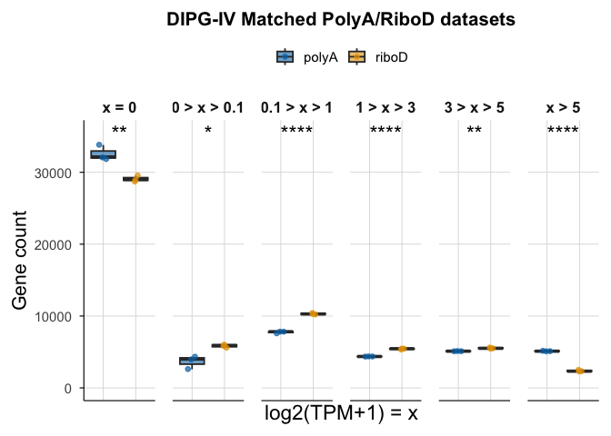

# THR13_0970_S12-S17_unique_genes


## THR13_0970 matched PolyA / RiboD

Boxplot showing the number of unique genes expressed at increasing
log2(TPM+1) levels.

``` r
library(tidyverse)
```

    ── Attaching core tidyverse packages ──────────────────────── tidyverse 2.0.0 ──
    ✔ dplyr     1.1.4     ✔ readr     2.1.5
    ✔ forcats   1.0.1     ✔ stringr   1.5.2
    ✔ ggplot2   4.0.0     ✔ tibble    3.3.0
    ✔ lubridate 1.9.4     ✔ tidyr     1.3.1
    ✔ purrr     1.1.0     
    ── Conflicts ────────────────────────────────────────── tidyverse_conflicts() ──
    ✖ dplyr::filter() masks stats::filter()
    ✖ dplyr::lag()    masks stats::lag()
    ℹ Use the conflicted package (<http://conflicted.r-lib.org/>) to force all conflicts to become errors

``` r
library(patchwork)
library(cowplot)
```


    Attaching package: 'cowplot'

    The following object is masked from 'package:patchwork':

        align_plots

    The following object is masked from 'package:lubridate':

        stamp

``` r
rsem_log2TPM1_THR13 <- read_tsv("../input_data/matched_THR13_0970/rsem_log2TPM1_THR13_0970_S12-S17.tsv.gz")
```

    Rows: 351486 Columns: 8
    ── Column specification ────────────────────────────────────────────────────────
    Delimiter: "\t"
    chr (4): full_sample, HugoID, lib_prep, sample
    dbl (3): max_length, TPM, log2TPM1
    lgl (1): is_treehouse_druggable_gene

    ℹ Use `spec()` to retrieve the full column specification for this data.
    ℹ Specify the column types or set `show_col_types = FALSE` to quiet this message.

``` r
THR13_polyA <- rsem_log2TPM1_THR13 %>%
  filter(lib_prep == "polyA")

THR13_riboD <- rsem_log2TPM1_THR13 %>%
  filter(lib_prep == "riboD")
```

Counting Genes above log2(TPM+1) Thresholds

``` r
bins <- c(0, 1e-10, 0.09, 0.99, 2.99, 4.99, Inf)

bin_labels <- c("0","0-0.09", "0.1-0.99", "1-2.99", "3-4.99", ">5")

THR13_polyA_counts <- THR13_polyA %>%
  mutate(Bin = cut(log2TPM1, breaks = bins, labels = bin_labels, include.lowest = TRUE)) %>%
  group_by(full_sample, Bin) %>%
  summarise(Count = n(), .groups = "drop") %>%
  mutate(lib_prep = case_when(
      full_sample == "THR13_0970_S12" ~ "polyA",
      full_sample == "THR13_0970_S13" ~ "polyA",
      full_sample == "THR13_0970_S14" ~ "polyA",
      full_sample == "THR13_0970_S15" ~ "riboD",
      full_sample == "THR13_0970_S16" ~ "riboD",
      full_sample == "THR13_0970_S17" ~ "riboD"    
  )) %>%
  mutate(Disease = "DIPG4")

THR13_riboD_counts <- THR13_riboD %>%
  mutate(Bin = cut(log2TPM1, breaks = bins, labels = bin_labels, include.lowest = TRUE)) %>%
  group_by(full_sample, Bin) %>%
  summarise(Count = n(), .groups = "drop") %>%
  mutate(lib_prep = case_when(
      full_sample == "THR13_0970_S12" ~ "polyA",
      full_sample == "THR13_0970_S13" ~ "polyA",
      full_sample == "THR13_0970_S14" ~ "polyA",
      full_sample == "THR13_0970_S15" ~ "riboD",
      full_sample == "THR13_0970_S16" ~ "riboD",
      full_sample == "THR13_0970_S17" ~ "riboD"    
  )) %>%
  mutate(Disease = "DIPG4")
```

``` r
combined_counts <- bind_rows(
  THR13_polyA_counts,
  THR13_riboD_counts)
```

``` r
theme_1d <- function(base_size = 14) {
  theme_minimal(base_size = base_size) +
    theme(
      legend.position = "top",
      legend.title = element_blank(),
      panel.grid.major = element_line(color = "grey85", linewidth = 0.3),
      panel.grid.minor = element_blank(),
      axis.line = element_line(color = "black", linewidth = 0.4),
      axis.ticks = element_line(color = "black", linewidth = 0.4),
      strip.text = element_text(face = "bold", size = base_size * 0.9),
      plot.title = element_text(face = "bold", size = base_size * 1.1, hjust = 0.5),
      axis.title.y = element_text(angle = 90, hjust = 0.5, size = 16),
      axis.title.x = element_text(angle = 0, hjust = 0.5, size = 17),
      axis.text.x = element_text(angle = 0, hjust = 0.5, size = 14),
      plot.margin = margin(10, 10, 10, 10)
    )
}

scale_fill_compendia <- function() {
  scale_fill_manual(values = c(
    "polyA" = "#0072B2",  # blue
    "riboD" = "#E69F00"   # yellow
  ))
}
scale_color_compendia <- function() {
  scale_color_manual(values = c(
    "polyA" = "#0072B2",
    "riboD" = "#E69F00" ))
  }
```

Statistical significance test

``` r
run_bin_stats <- function(polyA_df, riboD_df, disease_name) {
  
  # Get all bins present in either dataset
  bins <- union(unique(polyA_df$Bin), unique(riboD_df$Bin))
  
  results <- lapply(bins, function(b) {
    
    poly_counts <- polyA_df %>% filter(Bin == b) %>% pull(Count)
    ribo_counts <- riboD_df %>% filter(Bin == b) %>% pull(Count)
    
    # Skip bins with too few values
    if (length(poly_counts) < 3 | length(ribo_counts) < 3) {
      return(
        tibble(
          Disease = disease_name,
          Bin = b,
          Shapiro_polyA_p = NA,
          Shapiro_riboD_p = NA,
          VarTest_p = NA,
          TTest_p = NA
        )
      )
    }
    
    tibble(
      Disease = disease_name,
      Bin = b,
      Shapiro_polyA_p = shapiro.test(poly_counts)$p.value,
      Shapiro_riboD_p = shapiro.test(ribo_counts)$p.value,
      VarTest_p = var.test(poly_counts, ribo_counts)$p.value,
      TTest_p = t.test(poly_counts, ribo_counts, var.equal = TRUE)$p.value
    )
  })
  
  bind_rows(results)
}
```

``` r
stats_THR13 <- run_bin_stats(THR13_polyA_counts, THR13_riboD_counts, "DIPG4")
print(stats_THR13)
```

    # A tibble: 6 × 6
      Disease Bin      Shapiro_polyA_p Shapiro_riboD_p VarTest_p    TTest_p
      <chr>   <fct>              <dbl>           <dbl>     <dbl>      <dbl>
    1 DIPG4   0                 0.259            0.522    0.233  0.00565   
    2 DIPG4   0-0.09            0.329            0.677    0.146  0.0170    
    3 DIPG4   0.1-0.99          0.0866           0.677    0.800  0.0000131 
    4 DIPG4   1-2.99            0.831            0.336    0.0698 0.0000125 
    5 DIPG4   3-4.99            0.578            0.500    0.103  0.000864  
    6 DIPG4   >5                0.363            0.311    0.151  0.00000285

Selecting test

``` r
choose_test <- function(poly, ribo) {
  
  # Need at least 3 values for Shapiro
  if (length(poly) < 3 | length(ribo) < 3) {
    return(list(p_value = NA_real_, test_used = "insufficient_data"))
  }
  
  # Shapiro tests fpr Normality
  #Less than 0.05 (Not normal)
#If both groups are normally distributed = proceed to variance testing
#If either group is non‑normal = skip parametric tests and use Mann–Whitney U

  p_norm_poly  <- shapiro.test(poly)$p.value
  p_norm_ribo  <- shapiro.test(ribo)$p.value
  
  poly_normal <- p_norm_poly  > 0.05
  ribo_normal <- p_norm_ribo  > 0.05
  
  # Both normal → variance test
  #If variances are equal → use Student’s t‑test
  #If variances differ → use Welch’s t‑test
  
  if (poly_normal & ribo_normal) {
    
    p_var <- var.test(poly, ribo)$p.value
    equal_var <- p_var > 0.05
    
    # Normal + equal variance → Student t-test
    if (equal_var) {
      return(list(
        p_value = t.test(poly, ribo, var.equal = TRUE)$p.value,
        test_used = "student_t"
      ))
    }
    
    # Normal + unequal variance → Welch t-test
    else {
      return(list(
        p_value = t.test(poly, ribo, var.equal = FALSE)$p.value,
        test_used = "welch_t"
      ))
    }
  }
  
  # Non-normal → Mann–Whitney U test
  return(list(
    p_value = wilcox.test(poly, ribo, exact = FALSE)$p.value,
    test_used = "mann_whitney"
  ))
}
```

``` r
p_to_stars <- function(p) {
  sapply(p, function(x) {
    if (is.na(x)) return("NA")
    if (x < 0.0001) return("****")
    if (x < 0.001)  return("***")
    if (x < 0.01)   return("**")
    if (x < 0.05)   return("*")
    "ns"
  })
}
```

``` r
compute_bin_significance <- function(df) {
  
  # Clean and dedupe
  df_clean <- df |>
    select(Disease, Bin, lib_prep, Count) |>
    distinct()
  
  # Collapse to one row per Disease × Bin × lib_prep
  df_collapsed <- df_clean |>
    group_by(Disease, Bin, lib_prep) |>
    summarise(Count = list(Count), .groups = "drop")
  
  # Pivot to wide: polyA and riboD columns
  df_wide <- df_collapsed |>
    tidyr::pivot_wider(
      names_from = lib_prep,
      values_from = Count
    )
  
  # Apply statistical test
  df_results <- df_wide |>
    rowwise() |>
    mutate(
      test = list(choose_test(unlist(polyA), unlist(riboD))),
      p_value = test$p_value,
      test_used = test$test_used
    ) |>
    ungroup() |>
    select(-test)
  
  # ---- Benjamini–Hochberg FDR correction ----
  df_results2 <- df_results |>
    group_by(Disease) |>
    mutate(padj = p.adjust(p_value, method = "BH")) |>
    ungroup() |>
    mutate(stars_adj = p_to_stars(padj))
  
  df_results2
}
```

``` r
sig_bins_THR13   <- compute_bin_significance(THR13_polyA_counts  %>% mutate(lib_prep="polyA")  %>% bind_rows(THR13_riboD_counts  %>% mutate(lib_prep="riboD")))

sig_bins_THR13
```

| Disease | Bin | polyA | riboD | p_value | test_used | padj | stars_adj |
|:---|:---|:---|:---|---:|:---|---:|:---|
| DIPG4 | 0 | 31846, 33790, 32130 | 28989, 29522, 28783 | 0.0056468 | student_t | 0.0067762 | \*\* |
| DIPG4 | 0-0.09 | 4335, 2588, 4016 | 6076, 5562, 5895 | 0.0169543 | student_t | 0.0169543 | \* |
| DIPG4 | 0.1-0.99 | 7817, 7594, 7829 | 10286, 10211, 10424 | 0.0000131 | student_t | 0.0000262 | \*\*\*\* |
| DIPG4 | 1-2.99 | 4368, 4353, 4379 | 5476, 5452, 5347 | 0.0000125 | student_t | 0.0000262 | \*\*\*\* |
| DIPG4 | 3-4.99 | 5107, 5096, 5132 | 5467, 5508, 5620 | 0.0008636 | student_t | 0.0012954 | \*\* |
| DIPG4 | \>5 | 5108, 5160, 5095 | 2287, 2326, 2512 | 0.0000029 | student_t | 0.0000171 | \*\*\*\* |

Plot with stars

``` r
facet_labels <- c(
  "0" = "x = 0",
  "0-0.09" = "0 > x > 0.1",
  "0.1-0.99" = "0.1 > x > 1",
  "1-2.99" = "1 > x > 3",
  "3-4.99" = "3 > x > 5",
  ">5" = "x > 5"
)

max_y <- max(combined_counts$Count, na.rm = TRUE)

#significance stars
sig_df <- sig_bins_THR13 %>%
  select(Bin, stars_adj)

#y-position for stars
y_star <- max(combined_counts$Count, na.rm = TRUE) * 1.05


unique_genes_sig_plot <- ggplot(combined_counts, aes(x = lib_prep, y = Count, fill = lib_prep)) +
  geom_boxplot(
    outlier.shape = NA, 
    alpha = 0.6, 
    position = position_dodge(width = 0.8)) +
  geom_jitter(aes(color = lib_prep), 
    position = position_jitter(width = 0.15), 
    size = 1.5, 
    alpha = 0.7) +
  # adding stars above text
  geom_text(
    data = sig_df,
    aes(x = 1.5, y = y_star, label = stars_adj),
    inherit.aes = FALSE,
    size = 6
  ) +
  
  facet_grid(. ~ Bin, labeller = labeller(Bin = facet_labels)) +
  scale_fill_compendia() +
  scale_color_compendia() +
  coord_cartesian(ylim = c(0, y_star)) +
  labs(
    title = paste("DIPG-IV Matched PolyA/RiboD datasets"),
    x = "log2(TPM+1) = x",
    y = "Gene count"
  ) +
  theme_minimal() +
  theme_1d() +
  theme(
      strip.background = element_blank(),
      axis.text.x = element_blank(),
      axis.ticks.x = element_blank(),
      panel.spacing.x = unit(1, "lines")
    )

unique_genes_sig_plot
```



SessionInfo

``` r
sessioninfo::session_info()
```

    ─ Session info ───────────────────────────────────────────────────────────────
     setting  value
     version  R version 4.5.2 (2025-10-31)
     os       macOS Tahoe 26.5
     system   aarch64, darwin20
     ui       X11
     language (EN)
     collate  en_US.UTF-8
     ctype    en_US.UTF-8
     tz       America/Los_Angeles
     date     2026-09-16
     pandoc   3.8.3 @ /Applications/RStudio.app/Contents/Resources/app/quarto/bin/tools/aarch64/ (via rmarkdown)
     quarto   1.9.36 @ /Applications/RStudio.app/Contents/Resources/app/quarto/bin/quarto

    ─ Packages ───────────────────────────────────────────────────────────────────
     package      * version date (UTC) lib source
     bit            4.6.0   2025-03-06 [1] CRAN (R 4.5.0)
     bit64          4.6.0-1 2025-01-16 [1] CRAN (R 4.5.0)
     cli            3.6.5   2025-04-23 [1] CRAN (R 4.5.0)
     cowplot      * 1.2.0   2025-07-07 [1] CRAN (R 4.5.0)
     crayon         1.5.3   2024-06-20 [1] CRAN (R 4.5.0)
     digest         0.6.37  2024-08-19 [1] CRAN (R 4.5.0)
     dplyr        * 1.1.4   2023-11-17 [1] CRAN (R 4.5.0)
     evaluate       1.0.5   2025-08-27 [1] CRAN (R 4.5.0)
     farver         2.1.2   2024-05-13 [1] CRAN (R 4.5.0)
     fastmap        1.2.0   2024-05-15 [1] CRAN (R 4.5.0)
     forcats      * 1.0.1   2025-09-25 [1] CRAN (R 4.5.0)
     generics       0.1.4   2025-05-09 [1] CRAN (R 4.5.0)
     ggplot2      * 4.0.0   2025-09-11 [1] CRAN (R 4.5.0)
     glue           1.8.0   2024-09-30 [1] CRAN (R 4.5.0)
     gtable         0.3.6   2024-10-25 [1] CRAN (R 4.5.0)
     hms            1.1.4   2025-10-17 [1] CRAN (R 4.5.0)
     htmltools      0.5.8.1 2024-04-04 [1] CRAN (R 4.5.0)
     jsonlite       2.0.0   2025-03-27 [1] CRAN (R 4.5.0)
     knitr          1.50    2025-03-16 [1] CRAN (R 4.5.0)
     labeling       0.4.3   2023-08-29 [1] CRAN (R 4.5.0)
     lifecycle      1.0.4   2023-11-07 [1] CRAN (R 4.5.0)
     lubridate    * 1.9.4   2024-12-08 [1] CRAN (R 4.5.0)
     magrittr       2.0.4   2025-09-12 [1] CRAN (R 4.5.0)
     patchwork    * 1.3.2   2025-08-25 [1] CRAN (R 4.5.0)
     pillar         1.11.1  2025-09-17 [1] CRAN (R 4.5.0)
     pkgconfig      2.0.3   2019-09-22 [1] CRAN (R 4.5.0)
     purrr        * 1.1.0   2025-07-10 [1] CRAN (R 4.5.0)
     R6             2.6.1   2025-02-15 [1] CRAN (R 4.5.0)
     RColorBrewer   1.1-3   2022-04-03 [1] CRAN (R 4.5.0)
     readr        * 2.1.5   2024-01-10 [1] CRAN (R 4.5.0)
     rlang          1.2.0   2026-04-06 [1] CRAN (R 4.5.2)
     rmarkdown      2.30    2025-09-28 [1] CRAN (R 4.5.0)
     rstudioapi     0.17.1  2024-10-22 [1] CRAN (R 4.5.0)
     S7             0.2.0   2024-11-07 [1] CRAN (R 4.5.0)
     scales         1.4.0   2025-04-24 [1] CRAN (R 4.5.0)
     sessioninfo    1.2.3   2025-02-05 [1] CRAN (R 4.5.0)
     stringi        1.8.7   2025-03-27 [1] CRAN (R 4.5.0)
     stringr      * 1.5.2   2025-09-08 [1] CRAN (R 4.5.0)
     tibble       * 3.3.0   2025-06-08 [1] CRAN (R 4.5.0)
     tidyr        * 1.3.1   2024-01-24 [1] CRAN (R 4.5.0)
     tidyselect     1.2.1   2024-03-11 [1] CRAN (R 4.5.0)
     tidyverse    * 2.0.0   2023-02-22 [1] CRAN (R 4.5.0)
     timechange     0.3.0   2024-01-18 [1] CRAN (R 4.5.0)
     tzdb           0.5.0   2025-03-15 [1] CRAN (R 4.5.0)
     utf8           1.2.6   2025-06-08 [1] CRAN (R 4.5.0)
     vctrs          0.6.5   2023-12-01 [1] CRAN (R 4.5.0)
     vroom          1.6.6   2025-09-19 [1] CRAN (R 4.5.0)
     withr          3.0.2   2024-10-28 [1] CRAN (R 4.5.0)
     xfun           0.55    2025-12-16 [1] CRAN (R 4.5.2)
     yaml           2.3.10  2024-07-26 [1] CRAN (R 4.5.0)

     [1] /Library/Frameworks/R.framework/Versions/4.5-arm64/Resources/library
     * ── Packages attached to the search path.

    ──────────────────────────────────────────────────────────────────────────────
