# misc-analysis


## 

Investigating the median ratio genes from each disease cohort in all
diseases

``` r
library(tidyverse)
```

    ── Attaching core tidyverse packages ──────────────────────── tidyverse 2.0.0 ──
    ✔ dplyr     1.1.4     ✔ readr     2.1.5
    ✔ forcats   1.0.1     ✔ stringr   1.5.2
    ✔ ggplot2   4.0.0     ✔ tibble    3.3.0
    ✔ lubridate 1.9.4     ✔ tidyr     1.3.1
    ✔ purrr     1.1.0     
    ── Conflicts ────────────────────────────────────────── tidyverse_conflicts() ──
    ✖ dplyr::filter() masks stats::filter()
    ✖ dplyr::lag()    masks stats::lag()
    ℹ Use the conflicted package (<http://conflicted.r-lib.org/>) to force all conflicts to become errors

``` r
library(cowplot)
```


    Attaching package: 'cowplot'

    The following object is masked from 'package:lubridate':

        stamp

``` r
library(ggbeeswarm)
```

``` r
rsem_log2TPM1_THR13 <- read_tsv("../input_data/matched_THR13_0970/rsem_ensembl_log2TPM1_THR13_0970_S12-S17.tsv.gz", show_col_types = FALSE)

# sample ID files
# polyA
SS_polyA_list <- read_tsv("../input_data/sample_selection/SS_polyA_list.tsv", show_col_types = FALSE)
aRMS_polyA_list <- read_tsv("../input_data/sample_selection/aRMS_polyA_list.tsv", show_col_types = FALSE)
WT_polyA_list <- read_tsv("../input_data/sample_selection/WT_polyA_list.tsv", show_col_types = FALSE)
NB_polyA_list <- read_tsv("../input_data/sample_selection/NB_polyA_list.tsv", show_col_types = FALSE)
ALL_polyA_list <- read_tsv("../input_data/sample_selection/ALL_polyA_list.tsv", show_col_types = FALSE)
AML_polyA_list <- read_tsv("../input_data/sample_selection/AML_polyA_list.tsv", show_col_types = FALSE)

# riboD
SS_riboD_list <- read_tsv("../input_data/sample_selection/SS_riboD_list.tsv", show_col_types = FALSE)
aRMS_riboD_list <- read_tsv("../input_data/sample_selection/aRMS_riboD_list.tsv", show_col_types = FALSE)
WT_riboD_list <- read_tsv("../input_data/sample_selection/WT_riboD_list.tsv", show_col_types = FALSE)
NB_riboD_list <- read_tsv("../input_data/sample_selection/NB_riboD_list.tsv", show_col_types = FALSE)
ALL_riboD_list <- read_tsv("../input_data/sample_selection/ALL_riboD_list.tsv", show_col_types = FALSE)
AML_riboD_list <- read_tsv("../input_data/sample_selection/AML_riboD_list.tsv", show_col_types = FALSE)

# log2(TPM+1) expression files
SS_polyA_log2tpm1 <- read_tsv("../input_data/sample_selection/SS_polyA_log2tpm1.tsv", show_col_types = FALSE)
SS_riboD_log2tpm1 <- read_tsv("../input_data/sample_selection/SS_riboD_log2tpm1.tsv", show_col_types = FALSE)

aRMS_polyA_log2tpm1 <- read_tsv("../input_data/sample_selection/aRMS_polyA_log2tpm1.tsv", show_col_types = FALSE)
aRMS_riboD_log2tpm1 <- read_tsv("../input_data/sample_selection/aRMS_riboD_log2tpm1.tsv", show_col_types = FALSE)

WT_polyA_log2tpm1 <- read_tsv("../input_data/sample_selection/WT_polyA_log2tpm1.tsv", show_col_types = FALSE)
WT_riboD_log2tpm1 <- read_tsv("../input_data/sample_selection/WT_riboD_log2tpm1.tsv", show_col_types = FALSE)

NB_polyA_log2tpm1 <- read_tsv("../input_data/sample_selection/NB_polyA_log2tpm1.tsv", show_col_types = FALSE)
NB_riboD_log2tpm1 <- read_tsv("../input_data/sample_selection/NB_riboD_log2tpm1.tsv", show_col_types = FALSE)

ALL_polyA_log2tpm1 <- read_tsv("../input_data/sample_selection/ALL_polyA_log2tpm1.tsv", show_col_types = FALSE)
ALL_riboD_log2tpm1 <- read_tsv("../input_data/sample_selection/ALL_riboD_log2tpm1.tsv", show_col_types = FALSE)

AML_polyA_log2tpm1 <- read_tsv("../input_data/sample_selection/AML_polyA_log2tpm1.tsv", show_col_types = FALSE)
AML_riboD_log2tpm1 <- read_tsv("../input_data/sample_selection/AML_riboD_log2tpm1.tsv", show_col_types = FALSE)


# to convert EnsemblIDs to HugoIDs
gene_names <- read.table("../input_data/EnsGeneID_Hugo_Observed_Conversions.txt",
header = TRUE, sep = "\t", stringsAsFactors = FALSE )
```

``` r
rsem_log2TPM1_THR13_prepname <- rsem_log2TPM1_THR13 %>%
  mutate(
    prepname = case_when(
    full_sample == "THR13_0970_S12" ~ "PolyA_1",
    full_sample == "THR13_0970_S13" ~ "PolyA_2",
    full_sample == "THR13_0970_S14" ~ "PolyA_3",
    full_sample == "THR13_0970_S15" ~ "RiboD_1",
    full_sample == "THR13_0970_S16" ~ "RiboD_2",
    full_sample == "THR13_0970_S17" ~ "RiboD_3"
  ))

THR13_polyA_log2tpm1 <- rsem_log2TPM1_THR13_prepname %>%
  filter(lib_prep == "polyA") %>%
  rename(Gene = ensembl_gene_ID) %>%
  select(full_sample, Gene, log2TPM1) %>%
  pivot_wider(names_from = full_sample, values_from = log2TPM1)

THR13_riboD_log2tpm1 <- rsem_log2TPM1_THR13_prepname %>%
  filter(lib_prep == "riboD") %>%
  rename(Gene = ensembl_gene_ID) %>%
  select(full_sample, Gene, log2TPM1) %>%
  pivot_wider(names_from = full_sample, values_from = log2TPM1)
```

``` r
# Create a dataframe that specifies all the median ratio gene (as calculated in Fig1E)
ratio_genes <- data.frame(HugoID = c("MTMR2", "TM2D1", "SYPL1", "CCDC64", "XPO5", "EML3", "NUDT5"))
```

Function for filtering for the ratio genes

``` r
filter_ratio <- function(df, ratio_genes) {
  df %>% filter(Gene %in% ratio_genes$HugoID) }
```

Function for calculating median expression across samples

``` r
compute_gene_medians_polyA <- function(polyA_df, disease_name, Compendia) {
  polyA_medians <- polyA_df %>%
    rowwise() %>%
    mutate(polyA_medians = median(c_across(-Gene), na.rm = TRUE)) %>%
    ungroup() %>%
    select(Gene, polyA_medians)
}
compute_gene_medians_riboD <- function(riboD_df, disease_name, Compendia) {
   riboD_medians <- riboD_df %>%
    rowwise() %>%
    mutate(riboD_medians = median(c_across(-Gene), na.rm = TRUE)) %>%
    ungroup() %>%
    select(Gene, riboD_medians)
}
```

Function for converting EnsemblID to HugoID for readability

``` r
convert_to_hugo <- function(df) {
  df %>%
    left_join(gene_names, by = c("Gene" = "EnsGeneID")) %>%
    mutate(Gene = ifelse(!is.na(HugoID), HugoID, Gene)) %>%
    select(-HugoID)
}
```

Applying gene medians function

``` r
aRMS_polyA_medians <- compute_gene_medians_polyA(aRMS_polyA_log2tpm1) %>%
  pivot_longer(-Gene, values_to = "Expression") %>%
  mutate(Disease = "aRMS", lib_prep = "PolyA") %>%
  convert_to_hugo()

aRMS_riboD_medians <- compute_gene_medians_riboD(aRMS_riboD_log2tpm1) %>%
  pivot_longer(-Gene, values_to = "Expression") %>%
  mutate(Disease = "aRMS", lib_prep = "RiboD") %>%
  convert_to_hugo()

SS_polyA_medians <- compute_gene_medians_polyA(SS_polyA_log2tpm1) %>%
  pivot_longer(-Gene, values_to = "Expression") %>%
  mutate(Disease = "SS", lib_prep = "PolyA") %>%
  convert_to_hugo()

SS_riboD_medians <- compute_gene_medians_riboD(SS_riboD_log2tpm1) %>%
  pivot_longer(-Gene, values_to = "Expression") %>%
  mutate(Disease = "SS", lib_prep = "RiboD") %>%
  convert_to_hugo()

WT_polyA_medians <- compute_gene_medians_polyA(WT_polyA_log2tpm1) %>%
  pivot_longer(-Gene, values_to = "Expression") %>%
  mutate(Disease = "WT", lib_prep = "PolyA") %>%
  convert_to_hugo()

WT_riboD_medians <- compute_gene_medians_riboD(WT_riboD_log2tpm1) %>%
  pivot_longer(-Gene, values_to = "Expression") %>%
  mutate(Disease = "WT", lib_prep = "RiboD") %>%
  convert_to_hugo()

NB_polyA_medians <- compute_gene_medians_polyA(NB_polyA_log2tpm1) %>%
  pivot_longer(-Gene, values_to = "Expression") %>%
  mutate(Disease = "NB", lib_prep = "PolyA") %>%
  convert_to_hugo()

NB_riboD_medians <- compute_gene_medians_riboD(NB_riboD_log2tpm1) %>%
  pivot_longer(-Gene, values_to = "Expression") %>%
  mutate(Disease = "NB", lib_prep = "RiboD") %>%
  convert_to_hugo()

ALL_polyA_medians <- compute_gene_medians_polyA(ALL_polyA_log2tpm1) %>%
  pivot_longer(-Gene, values_to = "Expression") %>%
  mutate(Disease = "ALL", lib_prep = "PolyA") %>%
  convert_to_hugo()

ALL_riboD_medians <- compute_gene_medians_riboD(ALL_riboD_log2tpm1) %>%
  pivot_longer(-Gene, values_to = "Expression") %>%
  mutate(Disease = "ALL", lib_prep = "RiboD") %>%
  convert_to_hugo()

AML_polyA_medians <- compute_gene_medians_polyA(AML_polyA_log2tpm1) %>%
  pivot_longer(-Gene, values_to = "Expression") %>%
  mutate(Disease = "AML", lib_prep = "PolyA") %>%
  convert_to_hugo()

AML_riboD_medians <- compute_gene_medians_riboD(AML_riboD_log2tpm1) %>%
  pivot_longer(-Gene, values_to = "Expression") %>%
  mutate(Disease = "AML", lib_prep = "RiboD") %>%
  convert_to_hugo()

DIPGIV_polyA_medians <- compute_gene_medians_polyA(THR13_polyA_log2tpm1) %>%
  pivot_longer(-Gene, values_to = "Expression") %>%
  mutate(Disease = "DIPGIV", lib_prep = "PolyA") %>%
  convert_to_hugo()

DIPGIV_riboD_medians <- compute_gene_medians_riboD(THR13_riboD_log2tpm1) %>%
  pivot_longer(-Gene, values_to = "Expression") %>%
  mutate(Disease = "DIPGIV", lib_prep = "RiboD") %>%
  convert_to_hugo()
```

Filtering for median ratio genes

``` r
aRMS_polyA_medians_ratio <- filter_ratio(aRMS_polyA_medians, ratio_genes)
aRMS_riboD_medians_ratio <- filter_ratio(aRMS_riboD_medians, ratio_genes)

SS_polyA_medians_ratio <- filter_ratio(SS_polyA_medians, ratio_genes)
SS_riboD_medians_ratio <- filter_ratio(SS_riboD_medians, ratio_genes)

WT_polyA_medians_ratio <- filter_ratio(WT_polyA_medians, ratio_genes)
WT_riboD_medians_ratio <- filter_ratio(WT_riboD_medians, ratio_genes)

NB_polyA_medians_ratio <- filter_ratio(NB_polyA_medians, ratio_genes)
NB_riboD_medians_ratio <- filter_ratio(NB_riboD_medians, ratio_genes)

ALL_polyA_medians_ratio <- filter_ratio(ALL_polyA_medians, ratio_genes)
ALL_riboD_medians_ratio <- filter_ratio(ALL_riboD_medians, ratio_genes)

AML_polyA_medians_ratio <- filter_ratio(AML_polyA_medians, ratio_genes)
AML_riboD_medians_ratio <- filter_ratio(AML_riboD_medians, ratio_genes)

DIPGIV_polyA_medians_ratio <- filter_ratio(DIPGIV_polyA_medians, ratio_genes)
DIPGIV_riboD_medians_ratio <- filter_ratio(DIPGIV_riboD_medians, ratio_genes)
```

``` r
combined_medians_ratio <- bind_rows(
  aRMS_polyA_medians_ratio,
  aRMS_riboD_medians_ratio,
  SS_polyA_medians_ratio,
  SS_riboD_medians_ratio,
  WT_polyA_medians_ratio,
  WT_riboD_medians_ratio,
  NB_polyA_medians_ratio,
  NB_riboD_medians_ratio,
  ALL_polyA_medians_ratio,
  ALL_riboD_medians_ratio,
  AML_polyA_medians_ratio,
  AML_riboD_medians_ratio,
  DIPGIV_polyA_medians_ratio,
  DIPGIV_riboD_medians_ratio
)
```

``` r
# Define consistent color-blind–safe palette
scale_color_compendia <- function() {
  scale_color_manual(values = c(
    "RiboD" = "#E69F00",  # yellow
    "PolyA" = "#0072B2"   # blue
  ))
}
```

Generate plots

``` r
# Loop through diseases and generate plots
med_ratio_plot <- map(unique(combined_medians_ratio$Disease), function(d) {

 df <- combined_medians_ratio %>% 
  filter(Disease == d)

df <- combined_medians_ratio %>% 
  filter(Disease == d) %>%
  mutate(Gene = factor(Gene, levels = df %>% 
                         group_by(Gene) %>% 
                         summarize(median_expr = median(Expression), .groups = "drop") %>% 
                         arrange(median_expr) %>% 
                         pull(Gene)))

  ggplot(df, aes(x = Gene, y = Expression, color = lib_prep)) +
    geom_hline(yintercept = 1, linetype = "dashed", color = "grey40", linewidth = 0.4) +
    # 1. vertical lines for each gene 
    geom_vline(aes(xintercept = as.numeric(Gene)), color = "grey85", linewidth = 0.3) + 
    # 2. points that stay centered on those lines 
    geom_point(size = 1.4, alpha = 0.75) +
    scale_x_discrete(expand = expansion(mult = c(0.01, 0.01))) +
    scale_y_continuous(limits = c(0, 11), expand = expansion(mult = c(0, 0.05))) +
    scale_color_compendia() +
    labs(
      title = paste(d),
      x = "Median Ratio Genes",
      # y = "Expression log2(TPM+1)",
      color = "Library Prep"
    ) +
    ylab(bquote(Median~log[2](TPM+1))) +
    theme(
      # axis.text.x = element_blank(),
      # axis.title.x = element_blank(), 
      # axis.ticks.x = element_blank(),
      axis.text.x = element_text(angle = 90, hjust = 1, vjust = 0.5, size = 8),
      panel.grid.major.x = element_blank(),
      axis.text.y = element_text(angle = 0, hjust = 1, size = 12),
      axis.title.y = element_text(angle = 90, hjust = 0.5, size = 15), 
      plot.title = element_text(hjust = 0.5, face = "bold", size = 20),
      legend.position = "bottom"
    )
})

# Assign names for easy access
names(med_ratio_plot) <- unique(combined_medians_ratio$Disease)

# View plots
med_ratio_plot
```

    $aRMS

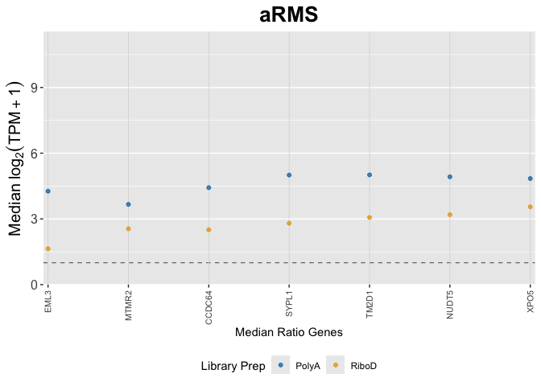


    $SS

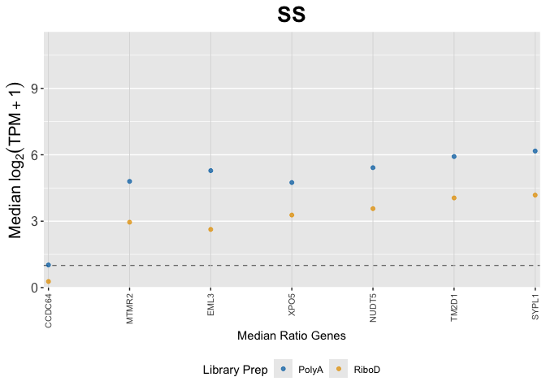


    $WT

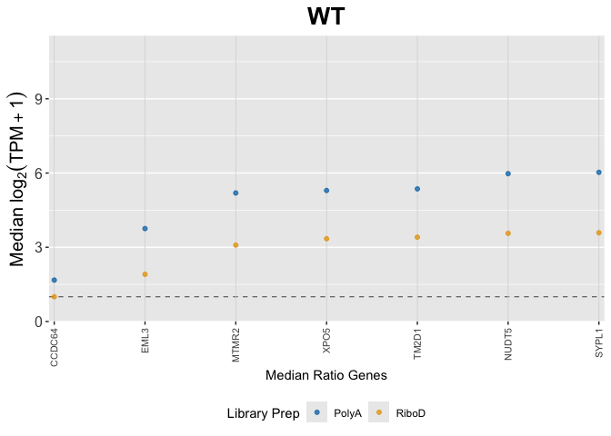


    $NB

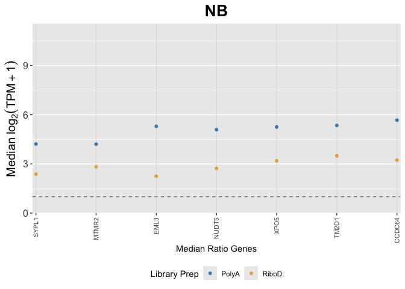


    $ALL

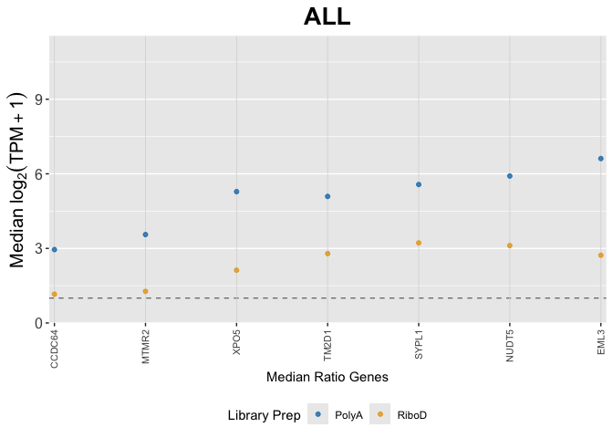


    $AML

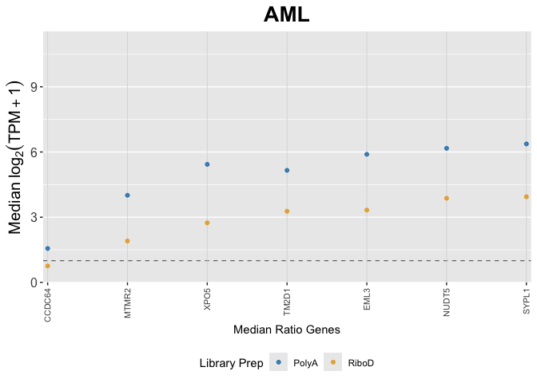


    $DIPGIV

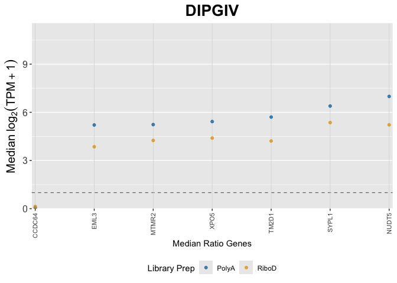

Next, I’ll try plotting each data point instead of the median expression

``` r
aRMS_polyA_log2tpm1_hugo <- convert_to_hugo(aRMS_polyA_log2tpm1)
aRMS_riboD_log2tpm1_hugo <- convert_to_hugo(aRMS_riboD_log2tpm1)

SS_polyA_log2tpm1_hugo <- convert_to_hugo(SS_polyA_log2tpm1)
SS_riboD_log2tpm1_hugo <- convert_to_hugo(SS_riboD_log2tpm1)

WT_polyA_log2tpm1_hugo <- convert_to_hugo(WT_polyA_log2tpm1)
WT_riboD_log2tpm1_hugo <- convert_to_hugo(WT_riboD_log2tpm1)

NB_polyA_log2tpm1_hugo <- convert_to_hugo(NB_polyA_log2tpm1)
NB_riboD_log2tpm1_hugo <- convert_to_hugo(NB_riboD_log2tpm1)

ALL_polyA_log2tpm1_hugo <- convert_to_hugo(ALL_polyA_log2tpm1)
ALL_riboD_log2tpm1_hugo <- convert_to_hugo(ALL_riboD_log2tpm1)

AML_polyA_log2tpm1_hugo <- convert_to_hugo(AML_polyA_log2tpm1)
AML_riboD_log2tpm1_hugo <- convert_to_hugo(AML_riboD_log2tpm1)

DIPGIV_polyA_log2tpm1_hugo <- convert_to_hugo(THR13_polyA_log2tpm1)
DIPGIV_riboD_log2tpm1_hugo <- convert_to_hugo(THR13_riboD_log2tpm1)
```

``` r
aRMS_polyA_log2tpm1_ratio <- filter_ratio(aRMS_polyA_log2tpm1_hugo, ratio_genes)
aRMS_riboD_log2tpm1_ratio <- filter_ratio(aRMS_riboD_log2tpm1_hugo, ratio_genes)

SS_polyA_log2tpm1_ratio <- filter_ratio(SS_polyA_log2tpm1_hugo, ratio_genes)
SS_riboD_log2tpm1_ratio <- filter_ratio(SS_riboD_log2tpm1_hugo, ratio_genes)

WT_polyA_log2tpm1_ratio <- filter_ratio(WT_polyA_log2tpm1_hugo, ratio_genes)
WT_riboD_log2tpm1_ratio <- filter_ratio(WT_riboD_log2tpm1_hugo, ratio_genes)

NB_polyA_log2tpm1_ratio <- filter_ratio(NB_polyA_log2tpm1_hugo, ratio_genes)
NB_riboD_log2tpm1_ratio <- filter_ratio(NB_riboD_log2tpm1_hugo, ratio_genes)

ALL_polyA_log2tpm1_ratio <- filter_ratio(ALL_polyA_log2tpm1_hugo, ratio_genes)
ALL_riboD_log2tpm1_ratio <- filter_ratio(ALL_riboD_log2tpm1_hugo, ratio_genes)

AML_polyA_log2tpm1_ratio <- filter_ratio(AML_polyA_log2tpm1_hugo, ratio_genes)
AML_riboD_log2tpm1_ratio <- filter_ratio(AML_riboD_log2tpm1_hugo, ratio_genes)

DIPGIV_polyA_log2tpm1_ratio <- filter_ratio(DIPGIV_polyA_log2tpm1_hugo, ratio_genes)
DIPGIV_riboD_log2tpm1_ratio <- filter_ratio(DIPGIV_riboD_log2tpm1_hugo, ratio_genes)
```

``` r
aRMS_polyA_log2tpm1_ratio_long <- aRMS_polyA_log2tpm1_ratio %>%
  pivot_longer(-Gene, values_to = "Expression") %>%
  mutate(Disease = "aRMS", lib_prep = "PolyA")

aRMS_riboD_log2tpm1_ratio_long <- aRMS_riboD_log2tpm1_ratio %>%
  pivot_longer(-Gene, values_to = "Expression") %>%
  mutate(Disease = "aRMS", lib_prep = "RiboD")

SS_polyA_log2tpm1_ratio_long <- SS_polyA_log2tpm1_ratio %>%
  pivot_longer(-Gene, values_to = "Expression") %>%
  mutate(Disease = "SS", lib_prep = "PolyA")

SS_riboD_log2tpm1_ratio_long <- SS_riboD_log2tpm1_ratio %>%
  pivot_longer(-Gene, values_to = "Expression") %>%
  mutate(Disease = "SS", lib_prep = "RiboD")

WT_polyA_log2tpm1_ratio_long <- WT_polyA_log2tpm1_ratio %>%
  pivot_longer(-Gene, values_to = "Expression") %>%
  mutate(Disease = "WT", lib_prep = "PolyA")

WT_riboD_log2tpm1_ratio_long <- WT_riboD_log2tpm1_ratio %>%
  pivot_longer(-Gene, values_to = "Expression") %>%
  mutate(Disease = "WT", lib_prep = "RiboD")

NB_polyA_log2tpm1_ratio_long <- NB_polyA_log2tpm1_ratio %>%
  pivot_longer(-Gene, values_to = "Expression") %>%
  mutate(Disease = "NB", lib_prep = "PolyA")

NB_riboD_log2tpm1_ratio_long <- NB_riboD_log2tpm1_ratio %>%
  pivot_longer(-Gene, values_to = "Expression") %>%
  mutate(Disease = "NB", lib_prep = "RiboD")

ALL_polyA_log2tpm1_ratio_long <- ALL_polyA_log2tpm1_ratio %>%
  pivot_longer(-Gene, values_to = "Expression") %>%
  mutate(Disease = "ALL", lib_prep = "PolyA")

ALL_riboD_log2tpm1_ratio_long <- ALL_riboD_log2tpm1_ratio %>%
  pivot_longer(-Gene, values_to = "Expression") %>%
  mutate(Disease = "ALL", lib_prep = "RiboD")

AML_polyA_log2tpm1_ratio_long <- AML_polyA_log2tpm1_ratio %>%
  pivot_longer(-Gene, values_to = "Expression") %>%
  mutate(Disease = "AML", lib_prep = "PolyA")

AML_riboD_log2tpm1_ratio_long <- AML_riboD_log2tpm1_ratio %>%
  pivot_longer(-Gene, values_to = "Expression") %>%
  mutate(Disease = "AML", lib_prep = "RiboD")

DIPGIV_polyA_log2tpm1_ratio_long <- DIPGIV_polyA_log2tpm1_ratio %>%
  pivot_longer(-Gene, values_to = "Expression") %>%
  mutate(Disease = "DIPGIV", lib_prep = "PolyA")

DIPGIV_riboD_log2tpm1_ratio_long <- DIPGIV_riboD_log2tpm1_ratio %>%
  pivot_longer(-Gene, values_to = "Expression") %>%
  mutate(Disease = "DIPGIV", lib_prep = "RiboD")
```

``` r
combined_log2tpm1_ratio <- bind_rows(
  aRMS_polyA_log2tpm1_ratio_long,
  aRMS_riboD_log2tpm1_ratio_long,
  SS_polyA_log2tpm1_ratio_long,
  SS_riboD_log2tpm1_ratio_long,
  WT_polyA_log2tpm1_ratio_long,
  WT_riboD_log2tpm1_ratio_long,
  NB_polyA_log2tpm1_ratio_long,
  NB_riboD_log2tpm1_ratio_long,
  ALL_polyA_log2tpm1_ratio_long,
  ALL_riboD_log2tpm1_ratio_long,
  AML_polyA_log2tpm1_ratio_long,
  AML_riboD_log2tpm1_ratio_long,
  DIPGIV_polyA_log2tpm1_ratio_long,
  DIPGIV_riboD_log2tpm1_ratio_long
)
```

``` r
# Loop through diseases and generate plots
log2tpm1_ratio_plot <- map(unique(combined_log2tpm1_ratio$Disease), function(d) {

 df <- combined_log2tpm1_ratio %>% 
  filter(Disease == d)

df <- combined_log2tpm1_ratio %>% 
  filter(Disease == d) %>%
  mutate(Gene = factor(Gene, levels = df %>% 
                         group_by(Gene) %>% 
                         summarize(median_expr = median(Expression), .groups = "drop") %>% 
                         arrange(median_expr) %>% 
                         pull(Gene)))

  ggplot(df, aes(x = Gene, y = Expression, color = lib_prep)) +
    geom_quasirandom(
      dodge.width = 0.7,
      width = 0.15,
      alpha = .8,
      size = 1.2
  ) +
  #   geom_quasirandom(
  #     dodge.width = 0.7,
  #     width = 0.15,
  #     alpha = .8,
  #     size = 2
  # ) +

    # geom_hline(yintercept = 1, linetype = "dashed", color = "grey40", linewidth = 0.4) +
    # 1. vertical lines for each gene 
    # geom_vline(aes(xintercept = as.numeric(Gene)), color = "grey85", linewidth = 0.3) + 
    # # 2. points that stay centered on those lines 
    # geom_point(size = 1.4, alpha = 0.75) +
    # scale_x_discrete(expand = expansion(mult = c(0.01, 0.01))) +
    scale_y_continuous(limits = c(0, 11), expand = expansion(mult = c(0, 0.05))) +
    scale_color_compendia() +
    labs(
      title = paste(d),
      x = "Expression of Median Ratio Genes",
      # y = "Expression log2(TPM+1)",
      color = "Library Prep"
    ) +
    ylab(bquote(log[2](TPM+1))) +
    theme(
      # axis.text.x = element_blank(),
      # axis.title.x = element_blank(), 
      # axis.ticks.x = element_blank(),
      axis.text.x = element_text(angle = 90, hjust = 1, vjust = 0.5, size = 8),
      panel.grid.major.x = element_blank(),
      axis.text.y = element_text(angle = 0, hjust = 1, size = 12),
      axis.title.y = element_text(angle = 90, hjust = 0.5, size = 15), 
      plot.title = element_text(hjust = 0.5, face = "bold", size = 20),
      legend.position = "bottom"
    )
})

# Assign names for easy access
names(log2tpm1_ratio_plot) <- unique(combined_log2tpm1_ratio$Disease)

# View plots
log2tpm1_ratio_plot
```

    $aRMS

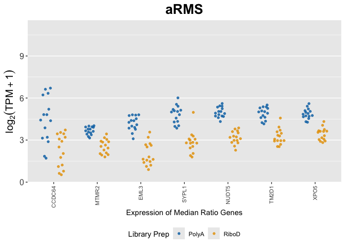


    $SS

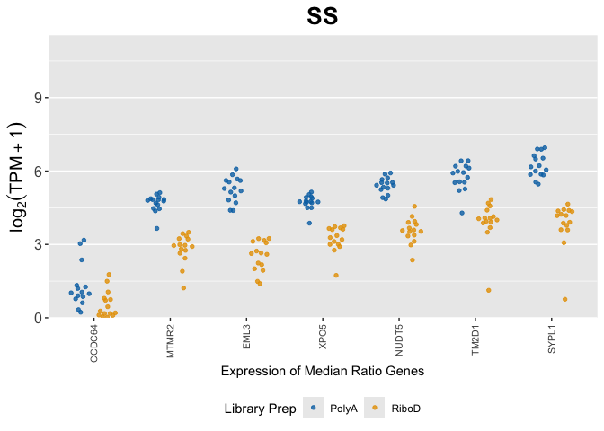


    $WT

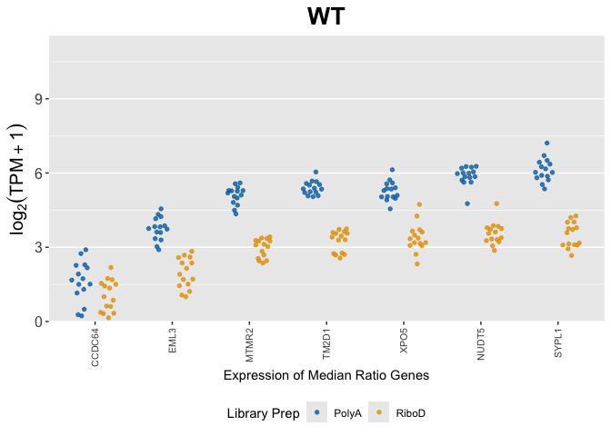


    $NB

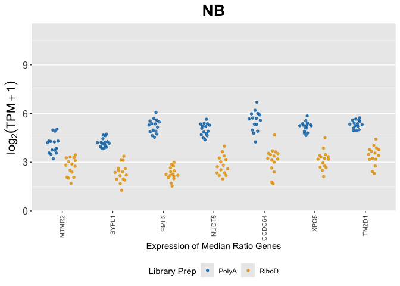


    $ALL

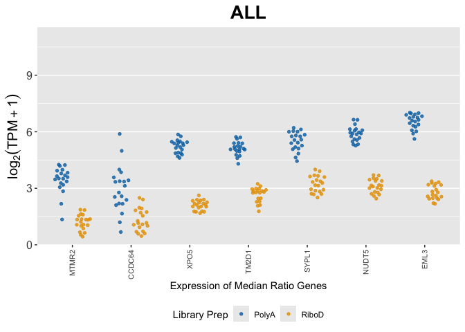


    $AML

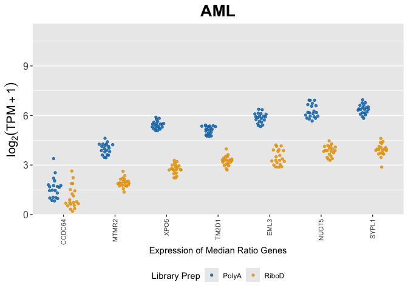


    $DIPGIV

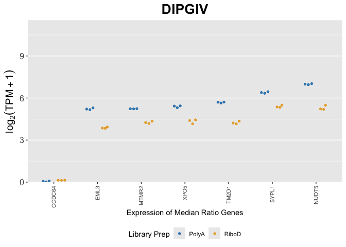

``` r
sessioninfo::session_info()
```

    ─ Session info ───────────────────────────────────────────────────────────────
     setting  value
     version  R version 4.5.2 (2025-10-31)
     os       macOS Tahoe 26.5
     system   aarch64, darwin20
     ui       X11
     language (EN)
     collate  en_US.UTF-8
     ctype    en_US.UTF-8
     tz       America/Los_Angeles
     date     2026-09-22
     pandoc   3.8.3 @ /Applications/RStudio.app/Contents/Resources/app/quarto/bin/tools/aarch64/ (via rmarkdown)
     quarto   1.9.36 @ /Applications/RStudio.app/Contents/Resources/app/quarto/bin/quarto

    ─ Packages ───────────────────────────────────────────────────────────────────
     package      * version date (UTC) lib source
     beeswarm       0.4.0   2021-06-01 [1] CRAN (R 4.5.0)
     bit            4.6.0   2025-03-06 [1] CRAN (R 4.5.0)
     bit64          4.6.0-1 2025-01-16 [1] CRAN (R 4.5.0)
     cli            3.6.5   2025-04-23 [1] CRAN (R 4.5.0)
     cowplot      * 1.2.0   2025-07-07 [1] CRAN (R 4.5.0)
     crayon         1.5.3   2024-06-20 [1] CRAN (R 4.5.0)
     digest         0.6.37  2024-08-19 [1] CRAN (R 4.5.0)
     dplyr        * 1.1.4   2023-11-17 [1] CRAN (R 4.5.0)
     evaluate       1.0.5   2025-08-27 [1] CRAN (R 4.5.0)
     farver         2.1.2   2024-05-13 [1] CRAN (R 4.5.0)
     fastmap        1.2.0   2024-05-15 [1] CRAN (R 4.5.0)
     forcats      * 1.0.1   2025-09-25 [1] CRAN (R 4.5.0)
     generics       0.1.4   2025-05-09 [1] CRAN (R 4.5.0)
     ggbeeswarm   * 0.7.3   2025-11-29 [1] CRAN (R 4.5.2)
     ggplot2      * 4.0.0   2025-09-11 [1] CRAN (R 4.5.0)
     glue           1.8.0   2024-09-30 [1] CRAN (R 4.5.0)
     gtable         0.3.6   2024-10-25 [1] CRAN (R 4.5.0)
     hms            1.1.4   2025-10-17 [1] CRAN (R 4.5.0)
     htmltools      0.5.8.1 2024-04-04 [1] CRAN (R 4.5.0)
     jsonlite       2.0.0   2025-03-27 [1] CRAN (R 4.5.0)
     knitr          1.50    2025-03-16 [1] CRAN (R 4.5.0)
     labeling       0.4.3   2023-08-29 [1] CRAN (R 4.5.0)
     lifecycle      1.0.4   2023-11-07 [1] CRAN (R 4.5.0)
     lubridate    * 1.9.4   2024-12-08 [1] CRAN (R 4.5.0)
     magrittr       2.0.4   2025-09-12 [1] CRAN (R 4.5.0)
     pillar         1.11.1  2025-09-17 [1] CRAN (R 4.5.0)
     pkgconfig      2.0.3   2019-09-22 [1] CRAN (R 4.5.0)
     purrr        * 1.1.0   2025-07-10 [1] CRAN (R 4.5.0)
     R6             2.6.1   2025-02-15 [1] CRAN (R 4.5.0)
     RColorBrewer   1.1-3   2022-04-03 [1] CRAN (R 4.5.0)
     readr        * 2.1.5   2024-01-10 [1] CRAN (R 4.5.0)
     rlang          1.2.0   2026-04-06 [1] CRAN (R 4.5.2)
     rmarkdown      2.30    2025-09-28 [1] CRAN (R 4.5.0)
     rstudioapi     0.17.1  2024-10-22 [1] CRAN (R 4.5.0)
     S7             0.2.0   2024-11-07 [1] CRAN (R 4.5.0)
     scales         1.4.0   2025-04-24 [1] CRAN (R 4.5.0)
     sessioninfo    1.2.3   2025-02-05 [1] CRAN (R 4.5.0)
     stringi        1.8.7   2025-03-27 [1] CRAN (R 4.5.0)
     stringr      * 1.5.2   2025-09-08 [1] CRAN (R 4.5.0)
     tibble       * 3.3.0   2025-06-08 [1] CRAN (R 4.5.0)
     tidyr        * 1.3.1   2024-01-24 [1] CRAN (R 4.5.0)
     tidyselect     1.2.1   2024-03-11 [1] CRAN (R 4.5.0)
     tidyverse    * 2.0.0   2023-02-22 [1] CRAN (R 4.5.0)
     timechange     0.3.0   2024-01-18 [1] CRAN (R 4.5.0)
     tzdb           0.5.0   2025-03-15 [1] CRAN (R 4.5.0)
     vctrs          0.6.5   2023-12-01 [1] CRAN (R 4.5.0)
     vipor          0.4.7   2023-12-18 [1] CRAN (R 4.5.0)
     vroom          1.6.6   2025-09-19 [1] CRAN (R 4.5.0)
     withr          3.0.2   2024-10-28 [1] CRAN (R 4.5.0)
     xfun           0.55    2025-12-16 [1] CRAN (R 4.5.2)
     yaml           2.3.10  2024-07-26 [1] CRAN (R 4.5.0)

     [1] /Library/Frameworks/R.framework/Versions/4.5-arm64/Resources/library
     * ── Packages attached to the search path.

    ──────────────────────────────────────────────────────────────────────────────
